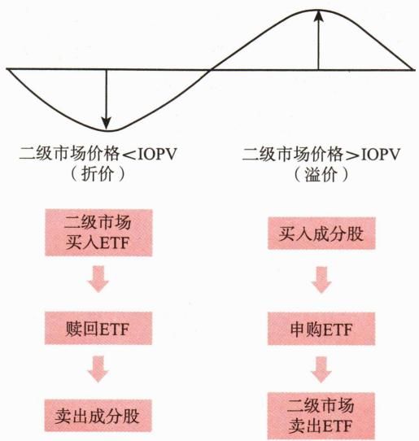

# 第七节 指数基金

<table><tr><td>学习内容</td><td>知识点</td></tr><tr><td>指数基金的概念与特点</td><td>概念与特点</td></tr><tr><td>指数基金的类型</td><td>按跟踪标的、复制方法、投资标的交易场所、投资策略、运作机制分类</td></tr><tr><td>ETF的特点</td><td>指数化,实物申赎,一、二级市场并存</td></tr><tr><td>ETF与ETF联接的区别</td><td>申购门槛、投资范围和投资比例、交易方式和渠道、交易价格、费用、资金使用效率</td></tr></table>

# 一、指数基金的概念与特点

指数基金，是以特定指数为标的，通过购买该指数的全部或部分成分券构建投资组合，以跟踪标的指数或者基准业绩表现为主要投资目标的基金产品。

相比主动型基金，指数基金主要有以下特点。

一是透明度高。指数基金因为跟踪标的指数表现，而标的指数的编制方案、成分券及其权重设置等信息都是公开透明的，所以投资者可以通过标的指数的情况了解投资组合的信息。

二是风险分散。指数基金通过投资于指数中的多个证券，实现分散投资。

三是成本低廉。指数基金采取跟踪标的指数、定期调整样本的策略，相比主动型基金管理费用通常较低。

# 二、指数基金的类型

指数基金的分类标准相对较多，常见的有以下几种。

# （一）按跟踪标的分类

按跟踪标的来分，指数基金主要分为股票指数基金、债券指数基金、商品指数基金等。其中，按照跟踪指数的不同，股票指数基金可以进一步细分为宽基、行业、主题、策略等指数基金，债券指数基金可以进一步细分为利率债、信用债等指数基金。

# （二）按复制方法分类

按指数基金复制标的指数的方法来分，指数基金可以分为完全复制型指数基金、抽样复制型指数基金。

# （三）按投资标的交易场所分类

按照跟踪标的指数交易的场所来分，指数基金可以分为单市场指数基金、跨市场指数基金和跨境指数基金。其中，跨境指数基金跟踪境外指数，交易场所主要位于中国香港、美国、日本、欧洲等地。

# （四）按投资策略分类

按投资策略分类，分为标准指数型基金、指数增强型基金。采取复制标的指数进行管理和运作的为标准指数型基金。以跟踪标的指数为主，但可以实施指数增强或指数优化的为指数增强型基金。

# （五）按运作机制分类

按运作机制来划分，指数基金主要分为交易型开放式指数基金（ETF）、上市开放式基金（LOF）、开放式指数基金。

ETF与LOF除具备开放式基金可以申购、赎回的特点外，还有场内交易的特点，但两者存在本质区别，主要表现在以下几方面。

# 三、交易型开放式指数基金

# (一) 概念和特点

交易型开放式指数基金（ETF）是一种在证券交易所上市交易的投资基金。具有下列三大特点。

# 1. 指数化

ETF以某一选定的指数所包含的成分证券（股票、债券等）或商品为投资对象，依据构成指数的证券或商品的种类和比例，采取完全复制或抽样复制，进行被动投资的指数基金。

# 2. 独特的实物申购、赎回机制

所谓实物申购、赎回机制，是指投资者可以用ETF指定的一篮子证券或商品向基金管理人申购ETF；赎回时得到的不是现金，而是相应的一篮子证券或商品；如果想变现，投资者需要再卖出这些证券或商品。实物申购、赎回机制是ETF最大的特色之一，使ETF省却了使用现金购买证券或商品和卖出变现的环节。不过，ETF有“最小申购、赎回份额”的规定，只有资金达到一定规模的投资者才能参与ETF一级市场的实物申购、赎回。

ETF 的实物申赎机制会因为某些特殊情况的出现而无法操作。为了确保市场条件受限时 ETF 仍然能够正常运作，ETF 也有现金替代机制，即并非必须完全使用实物进行申赎，在符合一定条件和规则的前提下也接受现金作为申赎的对价。

股票ETF通常有现金替代的机制。跨境ETF由于暂时无法买到境外市场的证券，所以采用全现金替代模式。部分商品和债券ETF则是实物申赎和全现金替代两种模式并行。

# 3. 实行一级、二级市场并存的交易制度

ETF除了可以在一级市场申购、赎回外，也可以像普通股票一样在交易所挂牌交易（注：ETF份额交易无印花税）。 $^{①}$ 相较一级市场的申赎，ETF二级市场交易门槛较低（交易门槛与普通股票相同，1手100份起），资金在一定规模以上的投资者和中小投资者均可按市场价格在二级市场上进行交易。

一级、二级市场的并存使二级市场交易价格通常不会长期显著偏离基金份额净值。当两个市场出现差价会引发套利交易，而套利交易会使二级市场价格恢复到基金份额净值附近，最终使得套利机会消失。因此，在市场流动性正常的情况下，ETF二级市场交易价格与基金份额净值的偏离度通常较小。

目[案例2-3]同一产品在不同市场的价格不一致时就会引发套利交易。具体而言，当ETF在二级市场的交易价格低于其在一级市场的基金份额参考净值（IOPV），即出现折价，投资者可以通过在二级市场低价买进ETF份额，然后按照基金份额净值赎回，得到一篮子股票后再于二级市场上卖出，从而实现折价套利。同理，当ETF在二级市场的交易价格高于其在一级市场的基金份额净值，即出现溢价时，投资者可以在二级市场买进一篮子股票，按基金份额净值申购得到ETF份额后，再于二级市场上高价卖出，从而实现溢价套利。

这种一级、二级市场之间套利机制的存在会使ETF二级市场交易价格与一级市场的基金份额净值趋于一致，实现更准确的价格发现，有利于反映出底层资产的真实价值。此外，套利也增加了ETF在二级市场的交易量，从而提升了流动性。

需要注意的是，折价套利通常会导致ETF总份额的减少，而溢价套利会导致ETF总份额的增加。正常情况下，套利交易会导致套利机会消失，因此套利交易通常不会引发ETF规模的显著变化（见图2-2）。

 — 图2-2 ETF套利机制

# （二）ETF的类型

与指数基金分类方式类似，根据ETF跟踪某一标的市场指数的不同，可以分为股票型ETF、债券型ETF、商品型ETF等。股票型ETF可以进一步被分为跨境ETF、宽基指数ETF、行业指数ETF、主题指数ETF、策略指数ETF等。根据复制方法的不同，可以将ETF分为完全复制型ETF与抽样复制型ETF。根据投资策略的不同，可以分为被动ETF和主动ETF。根据标的指数交易场所的不同，可以分为单市场ETF、跨市场ETF和跨境ETF。互挂ETF是跨境ETF中的一项特殊产品类别，具体包括中日互挂ETF、沪港互挂ETF、深港互挂ETF、沪新互挂ETF和深新互挂ETF等多种形式。互挂ETF通过连接不同国家和地区的资本市场，为投资者提供了多元化的投资选择和便捷的市场接入。

# （三）ETF联接基金

ETF联接基金是将绝大部分基金财产投资于跟踪同一标的指数的某一ETF（称为目标ETF）、紧密跟踪标的指数表现、可以在场外（银行渠道等）申购赎回的基金。根据中国证监会的规定 $^{①}$ ，ETF联接基金投资于目标ETF的市值不得低于联接基金资产净值的90%，并且ETF联接基金的管理人不得对ETF联接基金财产中的ETF部分计提管理费。

ETF联接基金的主要特征有以下几个方面：

1. 联接基金主要投资于目标 ETF。

2. ETF 的一级市场申赎和二级市场交易均在交易所场内进行，需要投资者开立证券账户。ETF联接基金为没有证券账户的场外投资者提供了通过银行、独立基金销售机构投资目标ETF的便捷方式，因此被看作是连接场外投资者与场内ETF的“桥梁”。投资者通过申购联接基金，可以间接投资目标ETF。

3. 联接基金作为场外基金，可以提供投资者定期定额投资（定投）、基金转换等多样化的投资方式，进一步提升投资便利性（见表2-3）。

**表 2-3 ETF 联接基金与 ETF 的比较**

<table><tr><td>项目</td><td>ETF联接基金</td><td>ETF</td></tr><tr><td>投资目标</td><td colspan="2">紧密跟踪标的指数表现</td></tr><tr><td>运作方式</td><td colspan="2">开放式</td></tr><tr><td>申购门槛</td><td>低(通常为1~1000元不等)</td><td>高(通常为30万份、50万份、100万份等)</td></tr><tr><td rowspan="2">投资范围及投资比例</td><td>1.目标ETF2.标的指数的成分股和备选成分股3.中国证监会规定的其他证券品种</td><td>1.标的指数的成分股和备选成分股2.中国证监会规定的其他证券品种</td></tr><tr><td>投资于目标ETF的比例不少于基金资产净值的90%</td><td>一般情况下,投资于标的指数成分股、备选成分股的资产比例不低于基金资产净值的90%</td></tr><tr><td>交易方式和渠道</td><td>场外基金,通过银行、证券、独立基金销售机构等进行申购和赎回</td><td>既可以像交易股票一样在二级市场进行交易,又可在一级市场进行申购和赎回,但需要在证券公司开立证券账户</td></tr><tr><td>交易价格</td><td>申请当日的基金份额净值(未知价原则),每天更新一次</td><td>一级市场申赎按照申购赎回清单规定的对价二级市场买卖按竞价交易价格</td></tr><tr><td rowspan="3">费用</td><td colspan="2">管理费:一般情况下,ETF联接基金与目标ETF管理费率相同,但ETF联接基金持有的目标ETF部分不再计提管理费</td></tr><tr><td colspan="2">托管费:一般情况下,ETF联接基金与目标ETF托管费率相同,但ETF联接基金持有的目标ETF部分不再计提托管费</td></tr><tr><td>交易费率:认购、申购、赎回的费率参照开放式基金的相关费率水平</td><td>交易费率:一级市场由申购赎回代理券商按照一定标准收取佣金;二级市场买卖收取交易佣金,且免印花税</td></tr><tr><td>资金使用效率</td><td>赎回款一般需要3~4个交易日到账</td><td>可在盘中交易,部分支持T+0交易二级市场卖出ETF份额后,资金当天即可用来买入股票或ETF,通常T+1日即可将资金从证券账户提现至银行卡</td></tr></table>
