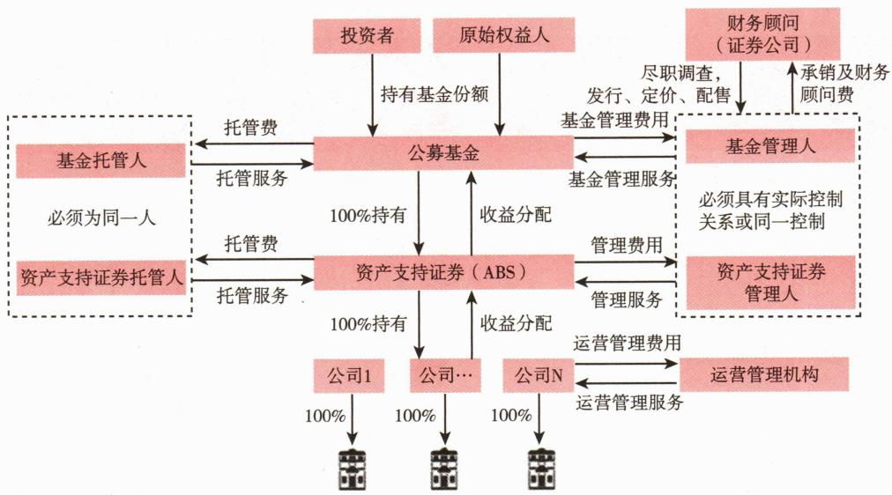

# 第九节 公开募集基础设施证券投资基金

<table><tr><td>学习内容</td><td>知识点</td></tr><tr><td>基础设施基金的概念与特点</td><td>概念与特点</td></tr><tr><td>基础设施基金的类型</td><td>产权类基础设施基金、经营权类基础设施基金</td></tr></table>

# 一、公开募集基础设施证券投资基金的概念与特点

不动产投资信托基金（Real Estate Investment Trusts，REITs）自20世纪60年代在美国推出以来，已有超过40个国家或地区发行了该类产品，其投资领域由最初的房地产拓宽到酒店商场、工业地产、基础设施等，已成为专门投资不动产的成熟金融产品。

2020年8月6日，中国证监会颁布了《公开募集基础设施证券投资基金指引（试行）》，开启了我国聚焦基础设施领域的公募REITs试点。

# （一）公开募集基础设施证券投资基金的概念

公开募集基础设施证券投资基金（简称基础设施基金），是指同时符合下列特征的基金产品：

# （二）基础设施基金的特点

基础设施基金采用“公募基金+基础设施资产支持证券”的产品结构，与股票

基金或债券基金相比，主要特点如下：

# 二、基础设施基金的类型

根据基础设施基金投资的基础设施项目权属类型的不同，可以将基础设施基金分为产权类基础设施基金、经营权类基础设施基金。

# （一）产权类基础设施基金

产权类基础设施基金，是指基础设施基金通过基础设施资产支持证券，穿透取得基础设施项目的完全所有权。此类基础设施基金投资的基础设施项目，主要为仓储物流、信息网络、产业园区、保障性租赁住房、消费基础设施等。

# （二）经营权类基础设施基金

经营权类基础设施基金，是指基础设施基金通过基础设施资产支持证券，穿透取得基础设施项目的经营权利。此类基础设施基金投资的基础设施项目，主要为交通设施、市政设施、污染治理、清洁能源等。

# [案例2-5]首批基础设施基金

2021年6月，我国首批试点的9只基础设施基金成立，包括产权类基础设施基金和经营权类基础设施基金，底层资产覆盖产业园区、仓储物流、收费公路和垃圾污水处理等领域（见表2-4）。首批基础设施基金的封闭期均超过20年，最长封闭期为99年。

**表 2-4 / 首批基础设施基金概况**

<table><tr><td>代码</td><td>名称</td><td>基础设施项目类型</td><td>准予募集份额(亿份)</td><td>发行价格(元/份)</td><td>募集规模(亿元)</td><td>封闭期(年)</td><td>基金管理人</td><td>ABS管理人</td></tr><tr><td>180101</td><td>博时招商蛇口产业园封闭式基础设施证券投资基金</td><td>产业园区</td><td>9</td><td>2.31</td><td>20.79</td><td>50</td><td>博时基金</td><td>博时资本管理</td></tr><tr><td>508001</td><td>浙商证券沪杭甬高速封闭式基础设施证券投资基金</td><td>收费公路</td><td>5</td><td>8.72</td><td>43.6</td><td>20</td><td>浙商证券资管</td><td>浙商证券资管</td></tr><tr><td>180801</td><td>中航首钢生物质封闭式基础设施证券投资基金</td><td>污染治理</td><td>1</td><td>13.38</td><td>13.38</td><td>21</td><td>中航基金</td><td>中航证券</td></tr><tr><td>508000</td><td>华安张江光大园封闭式基础设施证券投资基金</td><td>产业园区</td><td>5</td><td>2.99</td><td>14.95</td><td>20</td><td>华安基金</td><td>国君资管</td></tr><tr><td>508056</td><td>中金普洛斯仓储物流封闭式基础设施证券投资基金</td><td>仓储物流</td><td>15</td><td>3.89</td><td>58.35</td><td>50</td><td>中金基金</td><td>中金公司</td></tr><tr><td>508027</td><td>东吴-苏州工业园区产业园封闭式基础设施证券投资基金</td><td>产业园区</td><td>9</td><td>3.88</td><td>34.92</td><td>40</td><td>东吴基金</td><td>东吴证券</td></tr><tr><td>508006</td><td>富国首创水务封闭式基础设施证券投资基金</td><td>市政设施</td><td>5</td><td>3.7</td><td>18.5</td><td>26</td><td>富国基金</td><td>富国资产管理</td></tr><tr><td>180201</td><td>平安广州交投广河高速公路封闭式基础设施证券投资基金</td><td>收费公路</td><td>7</td><td>13.02</td><td>91.14</td><td>99</td><td>平安基金</td><td>平安证券</td></tr><tr><td>180301</td><td>红土创新盐田港仓储物流封闭式基础设施证券投资基金</td><td>仓储物流</td><td>8</td><td>2.3</td><td>18.4</td><td>36</td><td>红土创新基金</td><td>深创投红土资产管理</td></tr></table>

****

首批基础设施基金均采用“公募基金+资产支持证券”的模式向下穿透最终持有项目公司股权，部分基础设施基金还在资产支持专项计划与项目公司之间构建了SPV（见图2-3）。

 — 图2-3 基础设施公募REITs示例图
