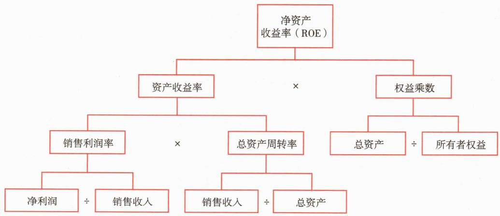
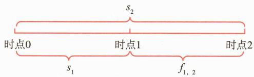

# 第二节 财务报表分析

<table><tr><td>学习内容</td><td>知识点</td></tr><tr><td>财务报表分析简介</td><td>利用财务报表分析公司的经营和财务情况</td></tr><tr><td>财务比率分析</td><td>偿债能力、营运效率、营利能力、发展能力</td></tr><tr><td>杜邦分析法</td><td>杜邦分析法内容及其局限性</td></tr><tr><td>财务舞弊和识别</td><td>财务舞弊定义、成因及识别方法</td></tr></table>

# 一、财务报表分析简介

财务报表是公司财务状况、经营成果和现金流量的系统反映。财务报表分析的目的是评价上市公司的财务质量，并识别可能存在的财务操纵行为。财务质量包括财务状况、盈利能力和现金流量三个方面。财务状况主要涉及资产负债结构和资产质量。盈利能力是指公司在常规经营期间从主营业务所取得的经常性净利润，以及这些利润的稳定性和可持续性；盈利质量分析涵盖盈利水平、盈利结构和盈利趋势等多方面内容。现金流量表的核心是经营活动产生的现金流量。通过对公司资产负债表、利润表和现金流量表的深入分析，投资者可以全面了解公司的财务质量。

财务报表分析还需要关注报表的可信度。公司管理层可能会出于某些需求，在编制财务报表的时候选择最有利的会计方法，调节应计科目，从而掩饰公司真实情况。财务操纵主要包括财务粉饰（盈余管理）和财务舞弊两类。财务粉饰一般是在会计准则允许的范围内调整财务数据，而财务舞弊则往往涉及管理层组织的系统性造假。经过操纵的财务报表无法反映公司真实的经营情况，可能误导投资者并影响其决策。因此，识别财务操纵行为是财务报表分析的重要环节，贯穿整个分析流程。

财务报表分析可以从会计方法、报表项目和财务比率三个方面进行。会计方法是指分析公司在财务报表中运用的会计政策和会计估计是否合理、是否可控，和同类公司是否可比。报表项目分析包括对报表中各项目之间的勾稽关系、项目结构和项目内容的分析。勾稽关系是指财务项目之间的逻辑关系，通过勾稽关系验证，可以找出报表中的潜在错误；项目结构分析有助于了解分析行业特征、营运模式和投融资方式；项目分析的要点是观察重点项目的金额、性质以及变化情况等。财务比率是财务报表上用两个或以上数据计算的比率。财务比率可以划分为偿债能力、营运能力、盈利能力、发展能力四大类。

财务报表分析并不仅限于单个会计期间的财务数据。分析过程中，需要将各项财务指标或比率和本公司前期情况进行纵向比较，以发现趋势或差异，并分析其背后的原因。此外，投资者还应结合宏观环境、公司所处行业情况、公司在行业中的市场地位、公司内部管理情况等，深入挖掘公司的经营信息，从而全面评估公司的财务状况、经营业绩和投资价值。通过纵向（同一公司不同期间）和横向（与同行业公司）比较，可以更全面地评估公司的财务健康状况。

财务分析是证券投资决策过程中不可或缺的重要环节。不同类型的投资者对财务分析的侧重点不同。商业银行和债券投资者通常关注公司的偿债能力、支付能力以及现金流风险，进行信用分析；股票投资者则更注重公司经营现状、发展前景、潜在风险和投资价值。

财务报表分析也存在局限性。对于无法直接通过会计计量的事项，例如公司治理、人力资源、专利技术和社会价值等，仅靠财务报表分析难以得出准确判断，还需要结合其他信息和分析方法来综合考量。

# 二、财务比率分析

投资者可以通过财务报表分析，回答以下几个关键问题：

单纯的数据汇总只能展示公司财务的规模情况，无法深入说明公司经营情况的好坏和经营成果的大小，无法体现公司财务水平在行业中的相对地位。财务比率分析是指用财务比率来描述公司财务状况、盈利能力以及流动性的分析方法。财务比率通过不同的会计数据计算得出，通常以比值的形式展现。这种计算方法消除了公司规模的影响，既可以用来比较不同行业、不同规模公司之间的财务状况，也可以用来比较同一公司在不同会计期间的变动情况。

# (一) 偿债能力

偿债能力是指公司在一定时间内清偿各种到期债务的能力。一般可分为短期偿债能力和长期偿债能力。

# 1. 短期偿债能力

短期偿债能力是指短期内公司在不致使财务状况恶化的前提下，利用手中持有的流动资产偿还短期负债的能力，其关注重点是公司的流动资产和流动负债。

公司的流动资产主要包括现金及现金等价物、应收票据、应收账款和存货等，这些资产能够在短期内快速变现，因而具有较强的流动性。流动负债是指公司需在一年或一个营业周期内偿付的各类短期债务，包括短期借款、应付票据、应付账款等。由于流动资产和流动负债的存续期较短，它们的市场价值通常与账面价值接近。

速动资产是指流动资产中扣除变现能力相对较差的项目（主要是存货，有时也包括预付账款等），主要包括货币资金、交易性金融资产、应收票据、应收账款等。与流动资产相比，速动资产更具流动性。

短期期偿债能力主要通过流动比率和速动比率来分析。

（1）流动比率，衡量公司流动资产对流动负债的覆盖率，其计算公式为：

流动比率 = 流动资产 / 流动负债

流动比率反映公司利用流动资产偿还短期负债的能力。一般认为流动比率大于2表明公司具备较强的短期偿付能力。

(2) 速动比率, 衡量公司速动资产对流动负债的覆盖率, 其计算公式为:

速动比率 = 速动资产 / 流动负债

速动比率更加保守地衡量公司短期偿债能力，因为它只考虑可以快速变现的资产，不包括存货等流动性相对较差的流动资产。通常，速动比率大于1被认为是健康的，表明公司具备良好的短期偿债能力。不同行业的公司在销售收款方式、应收账款回收效率等方面往往存在差异，因此不同行业的速动比率通常会有所不同。通常，速动比率大于1时，公司才能维持良好的短期偿债能力和财务稳定状况。值得注意的是，流动资产的内部转换不会影响流动比率，但可能会改变速动比率。例如，使用现金购买存货不会影响流动比率，但会降低速动比率，速动比率的具体计算口径可能存在不同理解（例如是否扣除预付账款），但最核心的是剔除存货。

对于公司本身而言，流动比率和速动比率并非越高越好。应收账款和存货的增加可以提高流动比率，应收账款的增加可以提高速动比率，而提早付款给供应商可以减少流动负债。但这些做法无法真正提高流动性。事实上，对于某些在供应链上占据强势地位的公司，其流动比率和速动比率可能远低于1。在实际分析中需要结合资产结构、资本结构和营运效率综合判断。

值得注意的是，流动比率、速动比率和资产负债率都是来源于资产负债表的静态比率，体现的是期末时点的静态偿债能力。作为静态指标，这些比率的高低可能受到报表日前后短期异常因素的影响，因此在分析时需要考虑更长时间段的变化趋势。此外，由于这些比率基于特定时点的数据，理论上存在被人为操纵的可能性。因此，在进行财务分析时，应结合其他财务指标、现金流量表数据以及非财务信息，以获得更全面、准确的财务状况评估。

# 2. 长期偿债能力

长期偿债能力关注公司长期债务的风险。由于公司的长期负债与其资本结构中的财务杠杆有关，因此常常用财务杠杆比率来衡量长期偿债能力。常用的财务杠杆比率有下面三种。

（1）资产负债率，是负债总额（包括短期负债和长期负债）占总资产的比例，其计算公式为：

资产负债率 $=$ 负债总额/资产总额 $\times 100\%$

资产负债率是使用频率较高的债务比率。由于债务尤其是长期负债的利息具有税盾效应 $^{①}$ ，因此很多公司会使用财务杠杆举债经营。但过大的债务负担会产生较大的利息支出和现金流压力，破产成本和财务困境成本可能会大幅增加，削弱甚至抵销税盾效应带来的价值。因此，采用多大的杠杆，即资产负债率多大最为合适，是难以精确计算决定的。资产负债率在同行业公司的比较中有较大的参考价值，在其他情况下，则需根据公司具体的资本结构与价值关系，遵循适中原则进行判断。

# （2）权益乘数和负债权益比

权益乘数和负债权益比是由资产负债率衍生出来的两个重要比率，其计算公式分别为：

权益乘数 = 资产总额 / 所有者权益总额

负债权益比 $=$ 负债总额/所有者权益总额

其中，权益乘数又称为“杠杆比率”。

由于资产=负债+所有者权益，所以：

权益乘数=1/(1-资产负债率)

负债权益比 = 资产负债率 / (1 - 资产负债率)

资产负债率、权益乘数和负债权益比这三个比率实际上表达了相同的含义，即公司的财务杠杆水平。由其中一个比率可以很容易计算出另外两个比率。这些指标的数值越大，意味着财务杠杆比率越高，公司的负债程度越重。

（3）利息保障系数（或利息保障倍数），是评估公司偿债能力的重要指标之一，特别是在分析公司长期债务风险时。几乎所有长期债务都有利息支付义务，因此，公司的长期债权人不仅要求公司有偿还本金的保证，还有要求公司有支付利息的能力。资产负债率、权益乘数和负债权益比衡量的是公司长期债务的本金保障程度，而衡量公司对于长期债务利息保障程度的指标是利息保障系数，其计算公式为：

利息保障系数 $=$ 息税前利润/利息费用

对于债权人来说，利息保障系数越高越安全。息税前利润是指扣除利息和税务支出之前的利润，从基本关系看，这个指标至少要大于1，否则公司的利润就是负数。例如，利息保障系数为2意味着公司的息税前利润是利息费用的两倍，表明公司有足够的盈利来覆盖利息支出。

利息保障系数的局限性在于它只能反映公司偿还利息的能力，无法反映债务本金的偿还能力。同时，利息保障系数的分子“息税前利润”是基于利润而非现金，而实际支付利息需要真正的现金流。在经营活动现金流与利润差距较大的情况下（如应收账款大幅增加或存货积压严重时），较高的利息保障系数也无法准确反映公司偿还利息的实际能力。

此外，不同行业的合理利息保障系数水平可能有所不同。资本密集型行业（如制造业）可能需要更高的利息保障系数，而现金流稳定的行业（如公用事业）可能可以接受相对较低的利息保障系数。

因此，在进行偿债能力分析时，需要结合公司的现金流量、融资渠道和授信额度、股东及相关方的资金支持意愿和能力等因素，对偿债能力进行综合判断。同时，还应考虑行业特性和公司的具体经营情况，以得出更准确的结论。

# （二）营运效率

营运效率是指公司在经营期间，资产从投入到产出的周转速度。它反映了公司资产的管理质量和利用效率。常见的营运效率衡量指标包括存货周转率、应收账款周转率和总资产周转率，它们从不同角度考察了公司资产使用效率。

# 1. 存货周转率

存货周转率是公司在一年或者一个经营周期内存货的周转次数，是衡量公司存货流动程度的常用指标。其计算公式为：

存货周转率 $=$ 销售成本/平均存货

其中，销售成本指的是公司销售产品的成本（即营业成本），平均存货通常是期初存货与期末存货的算术平均数。存货周转率越大，说明存货变现速度越快，存货管理效率越高。

利用存货周转率，可算出存货周转一次平均要花多长时间，这就是存货周转天数，其计算公式为：

存货周转天数 $= 360$ 天/存货周转率

例如，如果一家公司年度报告的存货周转率是4，这意味着这家公司平均每90天（360/4）存货周转一次。

存货周转率是衡量公司生产销售效率的指标，其决定因素包括业务模式、生产周期、供应链管理能力、生产组织能力和市场销售能力。

需要注意的是，对于存在多项不同性质业务的公司，使用全部销售成本作为分子计算的存货周转率缺乏明确的经济含义，难以进行有效比较。另外，存货一般包含原材料、在产品和产成品，不同类型存货的周转率可能存在较大差异，因此在实际应用中可以根据存货类型进行分类计算。

# 2. 应收账款周转率

应收账款周转率反映公司应收账款的回款速度，衡量公司在一定期间内应收账款的周转次数。其计算公式为：

应收账款周转率 $=$ 销售收入/平均应收账款

平均应收账款是指资产负债表中应收账款的期初和期末金额的算术平均数。其计算公式如下：

平均应收账款 $=$ （期初应收账款 $+$ 期末应收账款）/2

这种简单平均方法适用于应收账款余额变动较为平稳的情况，但在应收账款波动较大时，可能无法准确反映实际的资金占用水平。

在一些更加精细的分析场景下，分析师会将应收票据包含在内，并将客户预付的预收账款从中抵扣，以更准确地反映企业的真实应收款项情况。这通常适用于行业特征明确、信用管理复杂的企业。调整后的计算公式为：

应收账款周转率越高，说明应收账款变现速度越快，公司能够更快地收回销售收入。这可能反映企业拥有较强的议价能力或严格的信用政策。反之，周转率较低可能提示企业的收款效率较低或信用政策较为宽松。利用应收账款周转率可以计算应收账款周转天数，其公式为：

应收账款周转天数 $= 360$ 天/应收账款周转率

其中，360天是一个常规假设值，企业也可以根据实际经营天数（如365天）调整计算。应收账款周转天数表示企业平均需要多少天才能收回应收账款，数值越小，说明资金回笼速度越快。

例如，一家公司某年度的应收账款周转率是5，那么这家公司平均需花72天（360/5）收回一次账面上的全部应收账款。值得注意的是，使用期初和期末数值简单平均有时不能反映期间实际的资金占用情况，可能导致误判。应收账款周转率是衡量应收账款流动程度的重要指标。一般而言，公司的议价能力越强、账期管理能力越好，应收账款周转率就越高。此外，行业特点、客户结构以及企业的信用政策也会对周转率产生重要影响。

# 3. 总资产周转率

总资产周转率衡量的是一家公司利用其总资产创造销售收入的能力，其计算公式为：

总资产周转率 $=$ 销售收入/平均总资产

这里的平均总资产通常是公司财务年度内期初总资产和期末总资产的算术平均数。总资产周转率反映了公司资产的使用效率及其与市场需求的匹配程度。

举例来说，如果一家公司的年销售收入为1000万元，平均总资产为500万元，那么其总资产周转率为2，意味着每1元资产在一年内可以创造2元的销售收入。

较高的总资产周转率通常表明公司能够更有效地利用其资产生成销售收入。但需要注意的是，不同行业的总资产周转率差异较大，资本密集型行业（如制造业、能源行业等）的总资产周转率通常较低，而服务型企业或轻资产公司（如软件公司等）的总资产周转率会较高。因此，总资产周转率应结合公司所在行业的平均水平以及其他盈利能力指标（如净利润率）综合分析。

# （三）盈利能力

公司的盈利能力决定了其能否在市场上生存和发展。评价公司盈利能力的比率有很多，其中最重要的有四种：毛利率（GPM）、销售利润率（ROS）、资产收益率（ROA）、净资产收益率（ROE）。这四种比率通常使用公司的年度净利润作为计算基础。

# 1. 毛利率

毛利率是毛利和营业收入的比例，其计算公式为：

毛利率 $=$ 毛利/营业收入 $=$ （营业收入-营业成本）/营业收入 $\times 100\%$

例如，如果一家公司的营业收入是100万元，营业成本是60万元，那么其毛利率为（100-60）/100×100%=40%。

毛利率衡量的是公司对产品的定价能力和成本控制能力。在毛利率分析中，需要了解公司业务和产品结构、产品和服务售价、成本结构、原材料成本、能耗水平、人工成本等因素。毛利率通常是盈利能力分析的起点。

# 2. 销售利润率

销售利润率是指每单位营业收入所产生的利润，其计算公式为：

销售利润率 = 净利润 / 营业收入 × 100%

例如，如果一家公司的净利润是10万元，营业收入是100万元，那么其销售利润率为 $10/100 \times 100\% = 10\%$ 。

一般来说，其他条件不变时，销售利润率越高越好。然而需要注意的是，如果公司净利润中包含了大量与主营业务无关的收入（如投资收益、公允价值变动、资产处置收益等），则销售利润率的经济意义可能失真。为了更准确地反映主营业务的盈利能力，我们可以使用扣除非经常性损益后的净利润来计算调整后的销售利润率。

# 3. 总资产收益率

总资产收益率，也称资产收益率，计算的是每单位资产能带来的利润。其计算公式为：

总资产收益率 = 净利润 / 总资产 × 100%

例如，如果一家公司的净利润是10万元，总资产是200万元，那么其总资产收益率为 $10/200 \times 100\% = 5\%$ 。

总资产收益率是衡量公司盈利能力的常用指标之一。总资产收益率高，表明公司利用资产创造利润的能力强。总资产收益率的问题在于，它使用的净利润仅是股东可以获得的利润，而总资产却包括少数股东权益和债权人权益。这可能导致对公司盈利能力的低估。为了更准确地衡量公司盈利对于股东的价值，通常结合使用净资产收益率。

# 4. 净资产收益率

净资产收益率也称 “权益报酬率”，它衡量每单位所有者权益能够带来的利润。其计算公式为：

净资产收益率 = 净利润 / 所有者权益 × 100%

例如，如果一家公司的净利润是10万元，所有者权益是100万元，那么其净资产收益率为 $10/100 \times 100\% = 10\%$ 。

由于现代公司主要经营目标之一是股东利润最大化，因而净资产收益率是衡量公司最大化股东财富能力的比率。净资产收益率高，说明公司利用其自由资本盈利的能力强，投资带来的收益高；净资产收益率低则相反。

盈利能力比率应该结合使用，而不是孤立分析。例如，一家公司可能有很高的毛利率，但如果其运营成本过高，可能导致较低的销售利润率。同样，高净资产收益率可能是由于高杠杆而不是高效率造成的。因此，在使用这些指标时，需要结合公司的具体情况、行业特征以及其他财务指标进行综合分析，以得出更准确的结论。

# （四）发展能力

在考察一家公司的长期竞争力和市场地位时，发展能力是至关重要的。发展能力反映了公司在未来持续扩展市场、提高盈利水平以及增强竞争力的潜力。通过发展能力的分析，投资者可以评估公司是否具备足够的增长动力，以应对市场变化和行业竞争。评价公司发展能力的比率有多种，其中最常用的包括销售增长率、净利润增长率和每股收益增长率等。这些比率通常以公司的定期财务数据为基础，反映其在经营规模和利润水平等方面的增长情况。

# 1. 销售增长率

销售增长率是反映公司经营规模扩张速度的基础指标，其计算公式为：

销售增长率= $(本期销售收入-上期销售收入)/上期销售收入 \times 100\%$

例如，如果某公司上一年的销售收入为500万元，本年的销售收入为600万元，那么该公司的销售增长率为（600-500）/500×100%=20%。

销售增长率分析应重点关注以下方面：首先，销售收入的构成和质量。不同类型收入的增长具有不同的战略意义，应区分主营业务收入和其他业务收入的增长情况，重点分析主营业务的增长态势。同时，销售收入确认的时点和政策变化也会影响增长率的计算结果。其次，销售增长的驱动因素。收入增长可能来源于销售价格的提升、销售数量的增加、产品结构的优化等，需要结合毛利率等指标判断增长的质量。此外，市场份额的变化、行业需求的波动、竞争对手的策略等外部因素都会影响公司的销售增长。最后，销售增长的可持续性。公司处于不同发展阶段时，销售增长率会呈现不同特征。成熟公司的增长通常较为稳定，而成长期公司可能出现较高的增长率。过快的销售增长可能带来应收账款增加、存货积压等经营风险，因此需要关注营运资金压力和现金流状况。

# 2. 净利润增长率

净利润增长率反映公司净利润的变动趋势，其计算公式为：

净利润增长率= $\left(\text{本期净利润}-\text{上期净利润}\right)/\text{上期净利润}\times100\%$

例如，如果某公司上一年的净利润为50万元，本年的净利润为65万元，那么该公司的净利润增长率为（65-50）/50×100%=30%。

净利润增长率是衡量公司发展能力的重要指标之一。它不仅反映了公司销售收入增加的结果，还反映了公司在成本控制、经营效率提升等方面的表现。在分析净利润增长率时，要关注增长的质量。净利润由经常性损益和非经常性损益构成，应当重点分析主营业务利润的增长情况，考察收入增长与成本费用变动是否匹配。公司净利润的变动可能受到多重因素影响：外部环境方面包括市场需求变化、行业竞争格局以及税收政策调整等；内部因素则包括产品结构优化、成本控制效果、经营效率提升等。此外，净利润增长的可持续性评估尤为重要。应结合毛利率、费用率等指标，分析公司盈利能力的变化趋势；同时，审视经营活动现金流量状况，验证利润增长的质量。在横向比较时，还需要考察同行业可比公司的增长水平，判断公司的相对竞争地位。

# 3. 每股收益增长率

每股收益增长率衡量公司为股东创造利润的增长速度，其计算公式为：

每股收益增长率= $(本期每股收益-上期每股收益)/上期每股收益 \times 100\%$

例如，如果某公司上一年的每股收益为1.50元，本年的每股收益为1.80元，那么其每股收益增长率为（1.80-1.50）/1.50×100%=20%。

该指标反映了上市公司每股盈利水平的变动趋势，是公司股东关注的指标。配股、送股、转增股本等资本运作会导致每股收益被摊薄，因此需要结合股本变动情况进行分析。此外，若公司发生重要会计政策或会计估计变更，可能会影响每股收益的计算基础。

在实际分析中，发展能力应与公司历史数据及行业平均水平比较，以评估持续增长潜力。高增长率公司通常处于行业快速发展期，具备强大的市场开拓和技术创新能力。但过快扩张可能增加财务风险，特别是依赖外部融资扩展时。因此，发展能力分析需结合偿债能力，以判断增长是否基于稳健的财务基础。

此外，发展能力的分析应与盈利能力、营运能力和偿债能力分析综合考虑。例如，尽管一家公司的销售增长率较高，但如果其盈利能力较弱或者资本积累不足，可能表明该公司的增长缺乏可持续性。因此，发展能力分析需结合公司特定经营环境、市场条件及行业特征，进行全面深入的评估，以得出准确结论。

# 三、杜邦分析法

杜邦分析法（DuPont Analysis）因最早由美国杜邦公司使用而得名，是一种用来评价公司盈利能力和股东权益回报水平的方法，它利用主要的财务比率之间的关系来综合评价公司的财务状况。杜邦分析法的基本思想是将公司净资产收益率逐级分解为多项财务比率的乘积，从而帮助深入分析和比较公司经营业绩。

在评价公司的盈利能力时，最常用的指标是净资产收益率。根据净资产收益率的定义，可以将其分解为资产收益率与权益乘数的乘积：

净资产收益率 = 净利润 / 所有者权益 = 净利润 / 总资产 × 总资产 / 所有者权益

=资产收益率×权益乘数

接下来，我们进一步分解资产收益率为：

资产收益率 = 净利润 / 总资产 = 净利润 / 销售收入 × 销益

=销售利润率×总资产周转率

结合以上两个等式，我们就可以得到著名的杜邦恒等式：

净资产收益率 = 销售利润率 × 总资产周转率 × 权益乘数

通过杜邦恒等式可以看到，公司的盈利能力由销售利润率、资产使用效率和财务杠杆共同决定。这三个方面是相互独立的，构成了解释公司盈利能力的三个维度。当分析不同公司同一时期或同一公司不同发展阶段所存在的盈利差异时，可以利用杜邦恒等式，从净资产收益率出发，根据财务报表信息逐步分解各指标，对各指标进行公司间的横向对比分析，或对同一公司不同时期进行纵向对比分析，找到差异产生的原因（见图3-1）。

 — 图3-1 杜邦分析法分解过程

# 图 [案例3- 1] 杜邦分析法

我们以一个实例来演示对上市公司财务报表的杜邦分析。表3-4选取了我国三家制造业上市公司A、B、C的2023年度财务报告数据。

**表 3-4 / 三家上市公司财务报表的杜邦分析**

<table><tr><td>项目</td><td>A公司</td><td>B公司</td><td>C公司</td></tr><tr><td>净资产收益率(ROE)(%)</td><td>25.82</td><td>17.34</td><td>6.96</td></tr><tr><td>因素分解:</td><td></td><td></td><td></td></tr><tr><td>销售利润率(%)</td><td>11.66</td><td>20.29</td><td>3.98</td></tr><tr><td>净利润(万元)</td><td>4 676 103.45</td><td>6 959 800.00</td><td>1 374 091.65</td></tr><tr><td>营业总收入(万元)</td><td>40 091 704.49</td><td>34 307 400.00</td><td>34 486 807.33</td></tr><tr><td>资产周转率(次)(万元)</td><td>0.61</td><td>0.55</td><td>0.89</td></tr><tr><td>营业总收入(万元)</td><td>40 091 704.49</td><td>34 307 400.00</td><td>34 486 807.33</td></tr><tr><td>期末总资产(万元)</td><td>71 716 804.11</td><td>63 013 100.00</td><td>37 605 148.36</td></tr><tr><td>期初总资产(万元)</td><td>60 095 235.19</td><td>62 170 100.00</td><td>39 824 885.51</td></tr><tr><td>权益乘数</td><td>3.64</td><td>1.56</td><td>1.99</td></tr><tr><td>期末总资产(万元)</td><td>71 716 804.11</td><td>63 013 100.00</td><td>37 605 148.36</td></tr><tr><td>期初总资产(万元)</td><td>60 095 235.19</td><td>62 170 100.00</td><td>39 824 885. 51</td></tr><tr><td>期末归属母公司股东权益(万元)</td><td>19 770 805.24</td><td>40 869 200.00</td><td>20 032 531.66</td></tr><tr><td>期初归属母公司股东权益(万元)</td><td>16 448 125.16</td><td>39 385 400.00</td><td>19 462 290.98</td></tr></table>

A、B、C三家制造业公司在2023年的净资产收益率分别为 $25.82\%$ 、 $17.34\%$ 和 $6.96\%$ 。可以看到，A公司的净资产收益率最高。虽然A公司的销售利润率低于B公司，但其资产周转率更快，权益乘数更高；与C公司相比，虽然A公司的资产周转率低于C公司，但其销售利润率和权益乘数更高。

杜邦分析法有助于公司管理层和投资者清晰地看到净资产收益率的各个决定因素，为经营管理和投资决策提供依据。对公司管理者而言，只有协调好各个因素之间的关系，才能使净资产收益率最大化。

杜邦分析法也有其局限性：

（1）杜邦分析法的核心是净资产收益率，侧重分析单一报告期内公司的经营状况，是对过去业绩的评价，无法反映公司的发展前景。例如，当公司为了新业务、新产品的技术研发和市场开发而进行大量资源投入时，短期内净资产收益率指标可能会下降，但这种下降往往是阶段性的，对公司的长远发展也是有利的。此时，单纯从净资产收益率指标分析，难以准确评价公司经营管理的能力和效率。

(2) 杜邦分析法在计算过程中, 总资产收益率中的 “净利润” 和 “总资产” 不匹配。净利润是归属于股东的，而总资产归属于全部资金提供者。因此该指标不能反映实际的总资产收益率。

（3）杜邦分析法未区分经营损益和非经营损益。对制造业公司而言，判断其财务状况主要应关注经营活动的情况。如果一个制造业公司利润增长很快，但主要来源于股票或房地产交易，则不能认为该公司经营状况良好。

使用杜邦分析法时，首先应当结合行业特性进行分析，因为不同行业可能关注的重点指标有所不同。例如，制造业可能更注重资产周转率，而高科技行业则可能更关注销售利润率。其次，除了横向比较不同公司，还应进行纵向分析，观察同一公司多年的数据变化趋势，以全面评估公司的长期发展状况。此外，将杜邦分析与其他财务分析工具结合使用，如比率分析和现金流分析等，可以获得更全面的公司评估。最后，在进行杜邦分析时，不应仅局限于财务数据，还应考虑公司的市场地位、品牌价值、研发能力等非财务因素，以全面评估公司的竞争力和发展潜力。通过这些改进措施，我们可以更好地发挥杜邦分析法的优势，同时弥补其不足，为投资决策和公司管理提供更全面、准确的参考。

# 四、财务舞弊和识别

# （一）财务舞弊的定义和影响

财务舞弊是指公司内部人员以误导投资者和其他利益相关方对公司财务状况的认知为目的，蓄意操纵或歪曲财务数据的行为。财务舞弊涉及有意的不诚实行为，如伪造或篡改会计记录，对财务报告中的重要信息进行错误陈述或故意忽略，以及对会计准则的有意误用。与无意的会计错误不同，舞弊行为具有蓄意性和欺骗性，通常包括以下几种形式：

市场资源配置功能的发挥是以真实与公允的信息为前提的，财务舞弊让公司的会计信息失真，严重威胁市场的正常经营和竞争秩序，会误导市场并导致资源的错误配置。在证券市场上，财务舞弊会使投资者基于错误信息作出错误决策，蒙受经济损失，损害投资者利益。财务舞弊是公司内部的诚信问题，损害公司的信誉和投资者的信心，并可能面临严厉的法律制裁。

# （二）财务舞弊的成因

财务舞弊的产生往往源于多重内外部因素的共同作用。首先，来自市场和股东的业绩压力可能驱使管理层采取不当手段以达到短期目标。其次，管理层的道德风险和不合理的薪酬激励机制可能引发短视行为。此外，公司内部控制系统的缺陷和公司治理机制的不健全也为舞弊行为提供了可乘之机。值得注意的是，财务舞弊往往呈现出一个逐步恶化的过程：初期，参与者可能只是在准则允许的范围内利用会计政策选择操纵利润，试图美化财务状况；随着时间推移，舞弊程度不断加深，发展到虚构交易、伪造单据，直至虚构大量资产等；舞弊涉及的人员和交易越来越多，欺诈行为变得难以掩盖，参与者发现自己深陷泥潭，难以自拔；最终整个局面演变成失控的恶性循环，财务舞弊愈演愈烈。

# （三）财务舞弊的识别方法

识别财务舞弊需要综合运用多种方法和技术。通过深入分析财务报表，比较多个会计期间的数据，计算各种财务比率，可以发现异常变动。同时，仔细审查会计记录，特别是总账和日记账分录，有助于发现可疑交易。

评估内部控制系统的有效性也是关键，包括检查职责分离和授权程序。对大额、异常或关联方交易进行详细分析，并利用计算机辅助审计技术进行数据分析，可以揭示潜在的舞弊模式。

此外，通过员工访谈、文件审查和外部确认等方法，可以获取更多信息和证据。实地考察、建立举报机制、关注管理层行为等措施也能提供有价值的线索。在整个过程中，保持专业怀疑态度，运用专业判断，并结合具体情况灵活使用各种方法，是成功识别财务舞弊的关键。运用先进的舞弊风险评估模型及人工智能技术，能进一步提高识别财务舞弊的效率和准确性。

财务报表分析是识别财务舞弊的重要手段。资产负债表、利润表和现金流量表这三张报表之间存在密切的逻辑关系，因此在分析时应当结合考虑，而不是孤立地看待每一张报表。

资产负债表为分析收入来源性质及其稳定性提供了基础。资产负债表列示的公司资源与利润表中的收入和盈利存在重要关联。如果公司盈利缺乏相应的资产价值支持，其可靠性和准确性就值得怀疑。例如，当公司持续增加固定资产投资，同时在其资产负债表和利润表上呈现出固定资产原值和净利润的上升时，投资者需要关注固定资产的折旧费用是否与收入同比例增长。如果不是，可能需要进一步调查公司的折旧费用是否合理，公司通过固定资产投入所扩大的盈利规模是否合理，是否存在通过调整固定资产折旧政策来操纵当期利润的情况。

利润表反映了公司的经营成果，利润结构的合理性是公司经营是否稳健的重要体现。在分析利润结构时，可以从以下几个方面入手：

化应该与投资规模的变化和投资项目的效益相匹配。

（3）费用变化的合理性：费用的减少会直接导致利润的增加。费用通常是很难抵减的，在分析公司费用时应该对公司在年度间下降的合理性进行分析，除了在当期必须支付的费用外，应该特别关注那些不需要在本期支付货币资金的预提费用和摊销费用的变化。

现金流量表提供了公司现金流入和流出的信息，是判断公司利润质量的重要工具。现金流量分析法是将经营活动、投资活动和总体现金净流量分别与主营业务利润、投资收益和净利润进行比较分析，以判断公司的主营业务利润、投资收益和净利润的质量。一般而言，没有相应现金净流量的利润，其质量是值得怀疑的。如果公司的现金净流量长期低于净利润，意味着与已经确认为利润相对应的资产可能属于不能转化为现金流量的虚拟资产，表明公司可能存在着操纵财务报告的现象。

需要注意的是，一些复杂的财务舞弊可能同时涉及对利润表和现金流量表的操纵。在这种情况下，可以通过检验公司的货币资金来进一步判断是否存在舞弊行为。例如，如果一家上市公司的净利润可观，其经营现金流持续地高于净利润或与净利润离差不大，但货币资金却出现持续大幅下降，同时应付款项持续上升，这可能意味着其经营现金流并未真正改善公司的资金链。在这种情况下，如果公司没有大额投资行为，就应该考虑财务造假的可能性。

在进行财务舞弊识别时，还应注意以下几点：

横向比较：将公司的财务指标与同行业其他公司进行比较，发现异常差异。

纵向分析：观察公司多个会计期间的财务数据变化趋势，识别不合理的波动。

比率分析：使用各种财务比率，如毛利率、资产周转率、应收账款周转率等，全面评估公司的财务状况。

关注关键性指标：如收入增长率、净利润增长率、经营活动现金流等，这些指标通常是财务舞弊的重点领域。

结合非财务信息：将财务数据与公司的经营环境、行业特点和市场情况相结合，综合判断财务数据的合理性。

总之，识别财务舞弊需要全面、系统地分析财务报表，并保持必要的职业怀疑态度。通过对资产负债表、利润表和现金流量表的综合分析，结合定量和定性的方法，我们可以更有效地发现潜在的财务舞弊行为。

# [案例3-2]K公司财务舞弊分析

K公司作为中药材生产和销售的龙头企业，凭借其上市后的快速增长，曾被视为资本市场的明星企业。然而，2018年爆出的财务造假丑闻，以及2019年因涉嫌财务舞弊被中国证监会立案调查，使其迅速成为A股市场上一个影响深远的财务造假典型案例。本案例旨在通过深入剖析K公司的财务报表，结合财务比率分析和报表勾稽关系，探讨如何识别企业的财务舞弊行为。

# (一) 财务指标分析

表3-5和表3-6显示了K公司2014年度至2017年度货币资金、负债、营收、利润和现金流等方面的情况。

**表 3-5 K 公司货币资金、银行存款与有息负债（2014—2017 年）**

<table><tr><td>报告期</td><td>货币资金(亿元)</td><td>占总资产比例(%)</td><td>银行存款(亿元)</td><td>有息负债(亿元)</td><td>利息收入(亿元)</td><td>利息支出(亿元)</td><td>利息收入/货币资金*(%)</td><td>营业收入(亿元)</td></tr><tr><td>2014/12/31</td><td>99.85</td><td>35.82</td><td>99.55</td><td>61.21</td><td>0.89</td><td>4.91</td><td>-</td><td>159.49</td></tr><tr><td>2015/12/31</td><td>158.18</td><td>41.51</td><td>157.69</td><td>95.1</td><td>1.37</td><td>5.89</td><td>1.06</td><td>180.67</td></tr><tr><td>2016/12/31</td><td>273.25</td><td>49.84</td><td>272.28</td><td>131.41</td><td>1.81</td><td>8.71</td><td>0.84</td><td>216.42</td></tr><tr><td>2017/12/31</td><td>341.51</td><td>49.69</td><td>340.45</td><td>239.77</td><td>2.69</td><td>12.18</td><td>0.88</td><td>264.77</td></tr></table>

**表 3-6 K 公司现金流和净利润情况（2014—2017 年）**

<table><tr><td>年份</td><td>经营活动产生的现金流量净额(亿元)</td><td>投资活动产生的现金流量净额(亿元)</td><td>筹资活动产生的现金流量净额(亿元)</td><td>净利润(亿元)</td><td>经营活动现金流占净利润比例</td></tr><tr><td>2014年</td><td>113.22</td><td>-76.89</td><td>114.13</td><td>228.59</td><td>0.50</td></tr><tr><td>2015年</td><td>50.89</td><td>-144.35</td><td>675.94</td><td>275.65</td><td>0.18</td></tr><tr><td>2016年</td><td>160.32</td><td>-198.63</td><td>1 183.36</td><td>333.68</td><td>0.48</td></tr><tr><td>2017年</td><td>184.28</td><td>-152.99</td><td>650.58</td><td>409.46</td><td>0.45</td></tr></table>

1. 货币资金异常。从2014年末到2017年末，K公司报告的货币资金从99.85亿元增至341.51亿元，年复合增长率（CAGR）高达 $50.7\%$ ，而同期营业收入的CAGR仅为 $18.4\%$ 。此外，货币资金占总资产的比例从 $35.82\%$ 升至 $49.69\%$ ，远超行业平均的 $15\%$ 左右。

然而，K公司的利息收入与其庞大的货币资金规模极不匹配。尽管同期银行存款基准利率在1.5%\~3%之间，公司利息收入却显著偏低，显示其资金未获得合理的回报。这种异常现象引发了以下疑点：

2. “存贷双高”现象。公司的银行存款从99.55亿元激增至340.45亿元，同时有息负债也从61.21亿元攀升至239.77亿元，这种异常的资产负债结构严重偏离了正常的财务管理逻辑。尤其值得注意的是，2017年公司340.45亿元的银行存款仅产生2.69亿元利息收入，而239.77亿元的有息负债却产生了12.18亿元的利息支出。这一巨大的利率差异不仅凸显了公司资金使用效率极低的问题，更引发了对财务报告可信度的质疑。

如此高比例的银行存款和有息负债同时存在，暗示公司可能存在资金管理能力不足、潜在的关联方资金占用，甚至可能涉及资金套利行为。这种异常状况还可能掩盖了更深层次的问题，如经营现金流的真实性、可疑的投资活动或不当的筹资行为。

3. 经营活动产生的现金流量与净利润严重不匹配。一般而言，经营质量较高的公司，其经营活动产生的现金流量净额应接近或高于净利润。这是因为净利润中包含折旧、摊销等非现金项目，而这些项目不会影响现金流。然而，K公司的情况与此相悖。2014年至2017年间，公司经营活动产生的现金流量净额与净利润之比（通常称为“净现比”）分别为0.50、0.18、0.48和0.45。这意味着公司每产生1元净利润，实际流入的现金不到0.5元。

净现比持续低于1，表明公司的经营活动产生的现金流量不足以支撑账面利润的增长。这种情况提示公司可能存在应收账款和存货大幅增加的问题，导致账面利润无法及时转化为现金流入。除此之外，持续的低净现比还可能反映出更深层次的财务问题，如收入确认不当或成本费用核算不准确等，进一步加剧公司财务状况的风险。

除以上财务因素外，K公司还存在大股东高比例股权质押的问题。截至2018年6月30日，控股股东质押股份占其持股的 $91.91\%$ 。如此高比例的股权质押意味着控股股东有可能面临严重的资金压力，这可能成为操纵财务数据以维持股价的动机。高比例股权质押不仅增加了公司的潜在控制权风险，也可能导致管理层为维持股价而采取不当行为。

# （二）K公司的财务舞弊手段

2019年4月，K公司召开董事会并发布《关于前期会计差错更正的公告》，承认在2016年至2018年期间存在大规模财务数据差错，包括虚增货币资金、虚构收入、少计销售费用和财务费用等。随后，中国证监会通报了对K公司的调查结果，确认公司使用虚假银行单据虚增存款、通过伪造业务凭证进行收入造假，并将部分资金转入关联方账户用于买卖公司股票等。K公司的财务舞弊手段贯穿了多条财务报表线索，主要集中在以下几方面：

1. 虚增货币资金：K公司通过伪造银行对账单、定期存单和销售回款等手段，在2016年至2018年上半年期间大规模虚增货币资金。根据中国证监会调查，公司在2016年年报中虚增货币资金225亿元，占披露总资产的 $41\%$ ；2017年年报虚增299亿元，占总资产的 $44\%$ ；2018年半年报虚增362亿元，占总资产的 $46\%$ 。这些虚增的货币资金占公司净资产的比例从2016年的 $77\%$ 上升到2018年上半年的 $108\%$ ，显示出造假规模逐年扩大，最终虚增金额甚至超过公司实际净资产。

2. 虚构收入：K公司通过伪造销售凭证和增值税发票，在2016年至2018年期间大规模虚增营业收入和利润。2016年虚增营业收入90亿元，虚增营业利润6.6亿元，占当年利润总额的 $16\%$ 。2017年虚增收入100亿元，虚增利润12.5亿元，占利润总额的 $26\%$ 。2018年全年虚增收入16亿元，虚增利润1.7亿元，占利润总额的 $12\%$ 。公司还相应虚增营业成本，以使财务报表看似合理。这些行为严重夸大了公司的经营规模和盈利能力，误导了投资者和监管机构。

3. 虚增固定资产、在建工程和投资性房地产：K公司通过将不符合会计确认条件的项目纳入财务报表来夸大资产规模。在2018年年报中，公司将多个未完成或不符合确认条件的工程项目纳入报表，虚增固定资产11.89亿元、在建工程4.01亿元、投资性房地产20.15亿元，总计调增资产36.05亿元。这种做法营造出公司扩展规模的假象，进一步误导了市场对公司实际经营状况的判断。

4. 隐瞒关联交易：K公司长期向控股股东及其关联方提供资金，但未如实披露这些交易。在2016年至2018年间，公司累计向控股股东及其关联方提供116亿元的非经营性资金，这些资金被用于购买股票、偿还贷款等目的，而未在财务报表中披露。这种隐瞒行为使得公司的实际资金流向不透明，加剧了财务问题，同时也违反了信息披露的相关规定，损害了投资者的知情权和利益。

# （三）财务舞弊的动因

K公司财务舞弊的动因复杂多样，主要包括以下几点：

1. 管理层的利益驱动。K公司的实际控制人通过虚增收入和粉饰业绩，试图维持公司股价的高位，从而在资本市场上谋取私利。K公司的高管薪酬和股权激励方案与公司业绩的表现直接挂钩，这种激励机制在某种程度上促使管理层采取违规手段，美化公司财务报表。随着公司股价的提升，管理层不仅能获得高额的薪酬回报，还能通过减持股份或质押股票获得更多的个人利益，进一步加剧了舞弊行为的发生。

2. 融资需求压力。K公司通过财务舞弊，夸大公司的资产负债表，尤其是货币资金和资产规模，使得其财务状况看起来较为健康，从而能够获取更多的融资渠道和资金支持。公司通过虚增货币资金，给外界传递出现金流充裕的假象，吸引更多机构和银行为其提供贷款。根据财务数据显示，截至2018年6月30日，K公司的控股股东质押的股份占其持股比例的91.91%，如此高比例的股权质押反映了公司面临的巨大资金压力。公司通过财务造假，试图掩盖资金链紧张的事实，避免因股权质押爆仓而引发的市场恐慌。

3. 公司治理的缺失。K公司在公司治理结构上存在明显的缺陷，导致内部

控制机制失效，为财务造假提供了便利条件：

**第三节 货币的时间价值与利率**

<table><tr><td>学习内容</td><td>知识点</td></tr><tr><td>货币的时间价值</td><td>货币的时间价值、净现金流量</td></tr><tr><td>终值、现值与贴现</td><td>计算终值与现值(贴现)</td></tr><tr><td>利率、名义利率和实际利率</td><td>利率、名义利率、实际利率</td></tr><tr><td>单利与复利</td><td>复利现值系数、复利终值系数</td></tr><tr><td>即期利率与远期利率</td><td>贴现因子、即期利率、远期利率</td></tr></table>

货币的时间价值与利率是金融领域中的两个基础概念。货币的时间价值反映的是资金在不同时间点上的价值差异，而利率则衡量了资金在一定时间内的增值率。这两个概念在投资、借贷、资本预算等金融活动中密切相关。

# 一、货币的时间价值

在投资决策中，准确评估投资的现在价值和未来价值至关重要。货币的时间价值是现代金融和财务分析中的基础概念，广泛应用于金融资产定价、投资评估和资本预算等领域。

货币的时间价值（Time Value of Money，TVM）是指相同金额的货币在不同时间点上具有不同的价值。通常情况下，现在的一元比未来的一元更有价值，主要原因包括以下几点：

由于货币具有时间价值，即使两笔金额相等的资金，如果发生在不同的时间点，其实际价值也是不同的，因此，在表述资金价值时，必须明确其发生的时间，才能准确评估其真实价值。

在投资分析中，我们通常将某一投资活动视为一个独立的系统，其中资金的收支称为“现金流量”。资金的支出称为“现金流出”，资金的收入称为“现金流入”。某一段时间段的净现金流量是指该时段内现金流量的代数和，即：

净现金流量 $=$ 现金流入-现金流出

在分析资金运动、计算现金流量时，必须明确终值、现值和贴现等概念，以充分考虑货币的时间价值。

# 二、终值、现值和贴现

# (一) 终值

终值（Future Value，FV）是指货币在未来某一时点的价值。已知期初投入的现值为PV，终值FV即为第n期期末的本利和，假设每期利率为i。在资金的时间价值计算中，通常采用复利方式，每期期末的利息加入本金形成新的本金，再计算下期的利息，逐期滚利。

第n期期末终值的计算公式为：

式中： $FV$ ——终值，即第 $n$ 期期末的货币价值； $PV$ ——现值，即初始投入的本金； $i$ ——每期的利率（如果是年利率，则 $n$ 表示年数；如果是月利率，则 $n$ 表示月数）； $n$ ——期数。

需要注意的是：利率 $i$ 和期数 $n$ 必须在同一时间单位上。例如，如果 $i$ 是年利率，

那么 $n$ 就表示年数；如果 $i$ 是月利率，那么 $n$ 就表示月数。

这个公式假设利率i在整个期间内保持不变。在实际应用中，如果利率发生变化，可能需要使用更复杂的计算方法。

在某些情况下，可能需要考虑通货膨胀率来计算实际终值（即剔除通胀后的购买力）。

终值计算在许多金融决策中都很重要，如投资规划、退休计划、贷款偿还等。理解和正确应用终值概念，有助于更好地评估长期财务决策的影响。

[案例3-3] 某公司从银行取得贷款30万元，年利率为 $6\%$ ，贷款期限为3年，到第3年年末一次偿清贷款。

公司应付银行本利和 $= F V = 30 \times (1 + 6\%)^{3} = 35.73$ （万元）

# （二）现值和贴现

现值（Present Value，PV）是指未来某一时点上的货币金额在当前的价值。现值计算是将未来某一时点的终值折算为当前的价值。

现值的计算公式可通过终值公式推导得出：

其中，PV——现值；FV——未来某时点的终值；i——贴现率（即利率）；n——期数。

贴现是指将未来的资金折算为当前的价值。在现值计算中，利率i被称为贴现率，它反映了资金的时间价值和风险溢价。

[案例3-4] 某公司发行了面值为1000元的5年期零息债券，现在的市场利率为 $8\%$ ，那么该债券的现值为：

# 三、利率、名义利率和实际利率

利息率（Interest Rate），简称“利率”，是资金的增值与投入资金价值的比率，也是衡量资金增值量的基本单位。我们一般以年为计息周期，所说的年利率通常是指名义年利率。

利率可以按不同标准进行分类，其中，按债权人取得报酬的情况，可以将利率分为名义利率和实际利率。

名义利率（Nominal Interest Rate）是包含通货膨胀补偿的利率，反映了未扣除通货膨胀因素的资金增值率。

实际利率（Real Interest Rate）是指在扣除通货膨胀影响后的利率，反映了资金的实际购买力变化。换句话说，实际利率表示在剔除物价变动因素后，资金的真实增值程度。它考虑了通货膨胀对货币价值的侵蚀，体现了资金在物价不变或已考虑物价变化时的回报率。

当物价持续上涨（即存在通货膨胀）时，名义利率高于实际利率。这是因为名义利率不仅包含了资金的实际增值，还包括了对通货膨胀的补偿。

名义利率和实际利率之间的关系可以用费雪方程式（Fisher Equation）表示：

式中： $i_{n}$ ——名义利率； $i_{r}$ ——实际利率；p——通货膨胀率。

该公式适用于通货膨胀率较低的情况，是一种近似计算方法。对于更精确的计算，费雪方程式的完整形式为：

理解实际利率和名义利率的区别对于金融决策至关重要。例如，在评估投资回报时，应该关注实际利率而不仅仅是名义利率，因为它更真实地反映了投资的购买力变化，仅看名义利率可能会导致对投资效果的误判。同样，在比较不同时期或不同国家的利率时，考虑通货膨胀率的影响也是必要的。

# 四、单利与复利

# (一) 单利

单利是计算利息的一种方法。按照这种方法，利息仅根据本金计算，无论经过多长时间，所产生的利息均不会加入本金继续计算新的利息。换句话说，利息只在最初的本金上累积，而不会形成“利滚利”的效果。

单利利息的计算公式为:

式中：I——利息；PV——本金；i——利率；t——计息时间。利率通常以年计。

[案例3-5] 某公司持有一张带息期票，面额为12000元，票面利率为 $4\%$

出票日期为4月15日，6月14日到期（共60天），则到期日利息计算为：

单利终值的计算公式为： $FV = PV \cdot (1 + i \cdot t)$

单利现值的计算公式为： $PV = FV / (1 + i \cdot t) \approx FV \cdot (1 - i \cdot t)$

# （二）复利

与单利不同，复利的特点是每经过一个计息期，所产生的利息会加入本金，形成新的本金，并在下一个计息期继续计算利息。这样，利息逐期累积，使得资金增长呈现加速趋势。计息期，是指相邻两次计息的时间间隔，通常为年、月或日等，除非特别说明，计息期默认为一年。

复利终值的计算公式与货币终值的计算公式等同，即：

其中， $(1 + i)^n$ 称为“复利终值系数”或“1元的复利终值”，用符号 $(FV, i, n)$ 表示。例如， $(FV, 6\%, 3)$ 表示利率为 $6\%$ 、3期的复利终值系数。

根据复利终值公式，可以推算出复利现值的计算公式：

式中， $(1+i)^{-n}$ 称为 “复利现值系数” 或 “1元的复利现值”，用符号 $(PV, i, n)$ 表示。

复利与贴现是相反的过程，单利、复利和贴现之间的关系可以通过以下图示来说明。

图3-2展示了资金在不同利率和计息方式下的增长及贴现情况：

图中最上面的曲线表示，1 000 元在以 9% 的利率复利计息情况下的未来值，第 10 年年末为： $1\ 000 \times (1 + 0.09)^{10} = 2\ 367.36$ （元）。

中间的曲线表达的是单利计息情况下的未来值，第10年年末为： $1000 + [10 \times (1000 \times 0.09)] = 1900$ （元）。

最下面的曲线表达的是贴现率为9%的情况下1000元的贴现值，即1000/ $(1+0.09)^{10}=422.41$ （元）。

图 [案例3-6] 以等额本息法偿还本金为100万元，利率为 $7\%$ 的5年期住房贷款。假设每年年末需要偿还的本金利息总额为M元，则有：

计算可知，M=243 890.69元。该5年期贷款偿还过程如表3-7所示。

**表 3-7 按揭贷款偿还流程 / 单位：元**

<table><tr><td>年数</td><td>年初剩余贷款本金(1)=上期(5)</td><td>偿还利息额(2)=(1)×7%</td><td>偿还本金额(3)=(4)-(2)</td><td>偿还总金额(4)=M</td><td>年末剩余贷款本金(5)=(1)-(3)</td></tr><tr><td>0</td><td></td><td></td><td></td><td></td><td>1 000 000.00</td></tr><tr><td>1</td><td>1 000 000.00</td><td>70 000.00</td><td>173 890.69</td><td>243 890.69</td><td>826 109.31</td></tr><tr><td>2</td><td>826 109.31</td><td>57 827.65</td><td>186 063.04</td><td>243 890.69</td><td>640 046.27</td></tr><tr><td>3</td><td>640 046.27</td><td>44 803.24</td><td>199 087.45</td><td>243 890.69</td><td>440 958.82</td></tr><tr><td>4</td><td>440 958.82</td><td>30 867.12</td><td>213 023.57</td><td>243 890.69</td><td>227 935.25</td></tr><tr><td>5</td><td>227 935.25</td><td>15 955.47</td><td>227 935.25</td><td>243 890.69</td><td>0</td></tr></table>

# 连续复利

当计息期无限缩短时，即当利息的复利频率趋近于无穷大，我们可以用“连续复利”来描述资金的增长。这种情况下，利息在每一时刻都在累积，并形成新的本金。连续复利的终值计算公式为：

其中，e 是自然对数的底数（约为 2.71828），i 是年利率，t 是计息的年数。与普通复利相比，连续复利的增长略高，因为它假设利息可以在无限小的时间间隔内不断复利。

[案例3-7] 假设本金为1000元，年利率为 $9\%$ ，在10年后的终值为：

相比普通复利的增长，连续复利的终值略高。为了更直观地展示连续复利的效果，以下是相同条件下不同复利频率的计算结果：

按年复利： $1000 \times (1 + 0.09)^{10} = 2367.36$ （元）

按半年复利： $1000 \times \left(1 + \frac{0.09}{2}\right)^{2 \times 10} = 2411.71$ （元）

按季度复利： $1000\times \left(1 + \frac{0.09}{4}\right)^{4\times 10} = 2435.19$ （元）

连续复利： $1000 \times e^{0.09 \times 10} \approx 2459.60$ （元）

从这些结果可以看出，随着复利频率的增加，最终的资金终值逐渐接近连续复利的结果。

连续复利在金融工具定价中作为近似工具具有较强的实用性。同时，它在构建无套利定价模型和风险度量框架时非常便利。然而，在实际应用时，必须根据具体场景权衡使用连续复利还是离散复利，并充分理解两者之间的关系和差异。特别是在利息结算频率较低的市场中，离散复利往往更符合实际。

# 五、即期利率与远期利率

# (一) 即期利率

即期利率（Spot Rate），通常记作 $s_t$ （其中下标 $t$ 表示期限），是金融市场中的基础利率，指从当前时刻（ $t=0$ ）到未来某个特定时点 $t$ 的零息债券年化收益率。

即期利率反映了不同期限资金的时间价值，被用于将未来现金流贴现到现值。许多金融产品的定价都基于即期利率。

随着期限的不同，利率通常会变化。为了反映这种变化，人们使用即期利率曲线（Spot Rate Curve），它描述了随时间变化的即期利率水平。即期利率曲线展示了从短期到长期的收益率走势，能够帮助投资者理解资金的时间价值如何随期限变化。

在实际应用中，金融分析师和投资者经常使用即期利率曲线来评估不同期限投资的相对价值，预测未来利率走势，以及进行风险对冲和资产负债管理。

图3-3与表3-8给出了这样的一条曲线以及相应数据。

**表 3-8 / 即期利率**

<table><tr><td>年限</td><td>即期利率(%)</td><td>年限</td><td>即期利率(%)</td><td>年限</td><td>即期利率(%)</td></tr><tr><td>1</td><td>5.571</td><td>8</td><td>8.304</td><td>15</td><td>9.661</td></tr><tr><td>2</td><td>6.088</td><td>9</td><td>8.561</td><td>16</td><td>9.789</td></tr><tr><td>3</td><td>6.555</td><td>10</td><td>8.793</td><td>17</td><td>9.904</td></tr><tr><td>4</td><td>6.978</td><td>11</td><td>9.003</td><td>18</td><td>10.008</td></tr><tr><td>5</td><td>7.361</td><td>12</td><td>9.193</td><td>19</td><td>10.103</td></tr><tr><td>6</td><td>7.707</td><td>13</td><td>9.365</td><td>20</td><td>10.188</td></tr><tr><td>7</td><td>8.020</td><td>14</td><td>9.520</td><td></td><td></td></tr></table>

# （二）贴现因子

通过即期利率，我们可以为每个时间点定义相应的贴现因子 $d_{t}(t=1,2,\cdots,k)$ ，其计算公式为：

其中， $S_{t}$ 为即期利率。

贴现因子将未来现金流直接转化为相应的现值，可以看作是未来某个时间点上收到1单位现金的现值。随着时间t的增加，贴现因子通常会变小，反映出远期现金流的现值较低。这是因为时间越久，资金的时间价值越大，即未来的现金流在当前的价值越小。

对于任意现金流 $(x_{0}, x_{1}, x_{2}, \cdots, x_{k})$ 与相应的市场即期利率，现值计算公式为：

贴现因子 $d_{t}$ 的作用可以理解为时间k收到的单位现金的价格。通过该笔现金流的所有单笔现金用“价格乘以数量”的方法计算现值，然后将所有结果相加，可以得到整个现金流的现值。

[案例3-8] 假设我们需要计算一只10年期、票面利率为 $8\%$ 、每年付息一次的债券的现值。我们可以根据即期利率曲线计算每年的贴现因子，并将每年的现金流折现为现值。

表3-9列出了贴现因子和债券现值的计算结果。

**表 3-9 / 贴现因子和债券现值 **

<table><tr><td>年限</td><td>1</td><td>2</td><td>3</td><td>4</td><td>5</td><td>6</td><td>7</td><td>8</td><td>9</td><td>10</td><td>总值</td></tr><tr><td>贴现因子</td><td>0.9472</td><td>0.8885</td><td>0.8265</td><td>0.7635</td><td>0.7011</td><td>0.6405</td><td>0.5827</td><td>0.5283</td><td>0.4775</td><td>0.4305</td><td></td></tr><tr><td>现金流量</td><td>8</td><td>8</td><td>8</td><td>8</td><td>8</td><td>8</td><td>8</td><td>8</td><td>8</td><td>108</td><td></td></tr><tr><td>现值</td><td>7.58</td><td>7.11</td><td>6.61</td><td>6.11</td><td>5.61</td><td>5.12</td><td>4.66</td><td>4.22</td><td>3.82</td><td>46.50</td><td>97.34</td></tr></table>

从表中可以看到，通过将每一年的现金流量乘以相应的贴现因子，我们可以计算出每笔现金流的现值。所有现值相加后得到的债券总现值为97.34。

在实际应用中，投资者通常会根据市场上观察到的即期利率曲线来确定不同期限的贴现因子。这些贴现因子在金融决策中被广泛应用，包括但不限于债券定价、现金流折现、投资评价等。

# （三）远期利率

远期利率（Forward Rate）是指资金在未来某一时点到另一时点的隐含利率，也可以理解为未来指定期间的借贷成本或投资收益率。它反映了市场对未来利率水平的预期，通常通过当前的即期利率（Spot Rate）推导得出。远期利率还可用于表示投资者在未来特定日期购买零息债券的到期收益率。图3-4展示了即期利率与远期利率的关系。

 — 图3-4 即期利率与远期利率的关系

远期利率和即期利率的区别在于计息日起点不同：即期利率的起点在当前时刻，而远期利率的起点在未来某一时刻。

假设在当前时刻，1年期和2年期的即期利率分别为 $s_1 = 7\%$ 和 $s_2 = 8\%$ 。之所以2年到期与1年到期的债券收益率不一样，主要是投资者预期第2年的1年期利率相对于第1年的1年期利率会发生变化。

1. 将 1 元存入 2 年期账户，到第 2 年末货币价值将增长至 $\left(1 + s_{2}\right)^{2}$ 。

2. 将 1 元存入 1 年期账户，到第 1 年末的价值为 $1 + s_1$ ，然后以远期利率 $f_{1,2}$ 将本金和收益借出。这样，第 2 年末的价值为 $(1 + s_1)(1 + f_{1,2})$ 。

根据无套利原则，这两种方式的结果应该相等：

解得远期利率 $f$ 为：

在上文中，已知 $s_{1}=7\%$ 和 $s_{2}=8\%$ ，代入公式可得：

因此，第2年的远期利率为9.01%。

远期利率在现代金融分析中有着非常广泛的应用。

首先，远期利率反映了市场对未来利率走势的预期，因此是中央银行制定和执行货币政策的重要参考工具。通过观察远期利率的变化，政策制定者可以更好地了解市场对未来经济和通胀状况的预期，从而采取相应的政策措施。

其次，远期利率在金融衍生品定价中扮演着关键角色。例如，利率互换和远期利率协议（FRA）等产品的定价都依赖于远期利率。投资者和交易员通过远期利率来评估这些产品的价值和风险。

此外，远期利率还广泛应用于投资决策和风险管理。投资者可以利用远期利率来评估未来的投资机会和风险，而风险管理人员则可以利用它来度量和管理利率风险。在债券交易策略中，远期利率也是设计利率期限结构套利策略的重要工具。

值得注意的是，实际市场中的远期利率可能与理论计算有所差异。这种差异可能是由于市场的流动性、风险溢价等因素造成的。同时，远期利率仅是市场对未来利率的预期，并不一定能准确预测未来的实际利率。因此，在使用远期利率时，需要考虑市场的效率性和信息的完备性。

理解货币的时间价值和利率是进行金融分析的基础。通过正确计算现值和终值，并掌握名义利率和实际利率之间的关系，有利于做出更加明智的投资和融资决策。远期利率与即期利率的关系为市场预期提供了重要参考，有助于管理利率风险和制定金融产品的定价策略。
