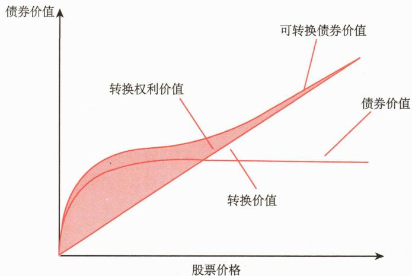
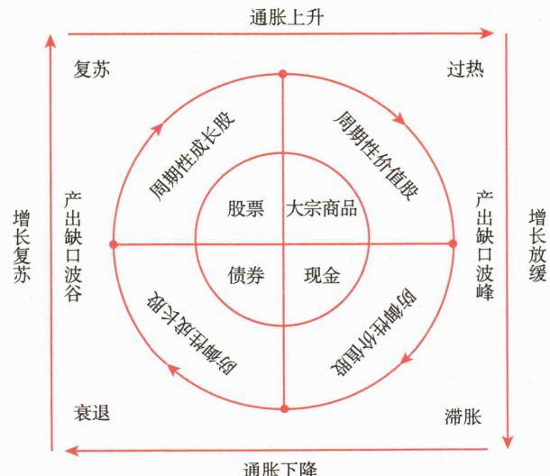
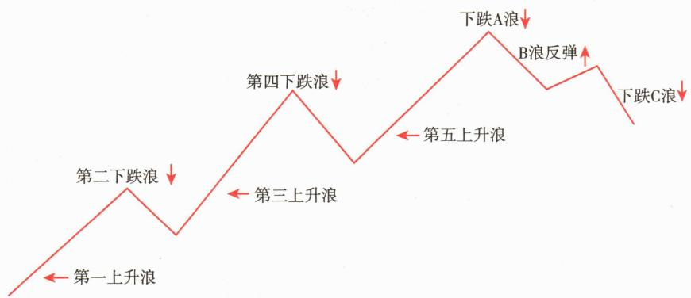
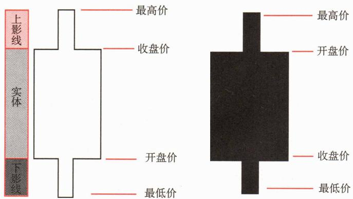

# 第一节 资本结构

<table><tr><td>学习内容</td><td>知识点</td></tr><tr><td rowspan="3">资本结构概述</td><td>资本结构的定义</td></tr><tr><td>资本的种类:债券资本与权益资本</td></tr><tr><td>不同资本现金流量权与投票权、清偿顺序及风险收益比较</td></tr><tr><td>最优资本结构</td><td>最优股权和债权比例</td></tr></table>

# 一、资本结构概述

# （一）资本结构的定义

资本结构（Capital Structure）是指企业资本总额中各种资本的特定组合，为公司整体运营和长期成长提供资金支持。例如，一家公司的总资本为1 000万元（此处指融资总额），其中300万元为债务资本，700万元为权益资本，则该公司的资本结构体现为30%的债务和70%的权益。良好的资本结构是指债务与权益之间的比例适当，不仅能够降低融资成本，还能在一定风险水平下最大化企业价值。最优资本结构的确定受到多种因素影响，包括行业特性、企业风险承受能力以及融资环境等。资本结构理论（如 Modigliani-Miller 定理）提供了关于资本结构对企业价值影响的理论框架。

# （二）资本的类型

# 1. 债务资本

债务资本是通过借债方式筹集的资本。公司向债权人（如银行、债券持有人及供应商等）借入资金，定期向其支付利息，并在到期日偿还本金。利息的高低与公司经营的风险相关。经营状况稳健的公司支付较低的利息，风险较高的公司则需要支付较高的利息。

# 2. 权益资本

权益资本是通过发行股票或置换所有权筹集的资本。与债务资本不同的是，权益资本在正常经营情况下不会偿还给投资人。公司可能发行不同类型的权益证券来筹集资本。两种最主要的权益证券是普通股和优先股。

普通股（Common Shares）是股份有限公司发行的一种基本股票，代表公司股份中的所有权份额，其持有者享有股东的基本权利和义务。大公司通常有很多普通股股东。股东凭借股票可以获得公司的分红，参加股东大会并对特定事项进行投票。

公司也会发行优先股。优先股（Preferred Shares）和普通股一样代表对公司的所有权，同属权益证券。但优先股是一种特殊股票，它的优先权主要指：持有人分得公司利润的顺序先于普通股，在公司解散或破产清偿时先于普通股股东获得剩余财产。优先股的股息率往往是事先规定好的、固定的，它不因公司经营业绩的好坏而有所变动。

# （三）各类资本的比较

# 1. 现金流量权与投票权

公司债权方，如债券持有者或银行，一般来说不参与公司经营事务。但不管公司盈利与否，公司的债权人都有权要求公司按期支付利息且到期归还本金。

普通股股东可以选出董事，组成董事会以代表他们监督公司的日常运行。董事会选聘公司的管理层，由管理团队负责公司日常的经营工作。管理层拥有对公司大部分业务的决策权，无须经过董事会的同意。但对于一些重大事务的决定，如公司合并、分立、解散等则需要股东投票表决通过。普通股股东有分配盈余及剩余财产的权利。但分配多少股利取决于公司的经营成果、再投资需求和管理者对支付股利的看法。

优先股没有到期期限，无须归还股本，每年固定的股息，相当于永久年金（没有到期期限）的债券，但其股息一般比债券利息要高一些。优先股一般情况下不享有表决权。实际上，优先股是股东以不享有表决权为代价而换取的对公司盈利和剩余财产的优先分配权。不同类型证券的现金流量权和投票权不一样，具体如表4-1所示。

**表 4-1 / 不同类型证券的现金流量权和投票权**

<table><tr><td>证券</td><td>现金流量权</td><td>投票权</td></tr><tr><td>普通股</td><td>按公司表现和董事会决议获得分红</td><td>按持股比例投票</td></tr><tr><td>优先股</td><td>获得固定股息</td><td>无</td></tr><tr><td>债券</td><td>获得承诺的现金流(本金+利息)</td><td>无</td></tr></table>

# 2. 清偿顺序

债务资本是一种借入资本，代表了公司的合约义务，因此债券持有者/债权人拥有公司资产的最高索取权，然后是优先股股东。在公司解散或破产清算时，优先股股东优先于普通股股东分配公司剩余财产。普通股股东是最后一个被偿还的，剩余资产在普通股股东中按比例分配。故公司解散或破产清算时，公司的资产在不同证券持有者中的清偿顺序如下：债权人先于优先股股东，优先股股东先于普通股股东。

权益证券投资者受到有限责任的保护，即当公司的资产不足以清偿全部债务时，公司的债权人不得要求公司的股东承担超过其出资义务的责任，更不得将其债务转换到其股东身上。公司作为法人（称为公司法人），有自己的独立财产，并且此种财产与公司股东的财产是分开的，公司应当以其全部资产承担清偿债务的责任。把公司人格和股东人格分离，股东的有限责任使股东的损失以其投资金额为限，即最大损失也不会超过股东在公司的投资金额。

# 3. 风险和收益特征

不管公司盈利与否，公司债权人均有权获得固定利息且到期收回本金，而股权投资者只有在公司盈利时才可获得股息。在面临清算时，债权投资的清偿顺序先于股权投资。当剩余价值不够偿还权益资本时，股东只能收回一部分投资，更严重的是可能损失所有投资。因此，股权投资的风险更大，要求更高的风险溢价，其收益应该高于债权投资的收益。

图4-1给出了2011—2024年我国资本市场沪深300全收益指数和中证全债指数的年度收益率。可以看到，我国股票市场投资回报率波动范围很大，债券则可以提供较为稳定的收益。

# 二、最优资本结构

# （一）最优资本结构概述

公司可以主动选择并调节自身的资本结构。公司可以通过发行债券、回购股票等方式提高债务率，从而提高财务杠杆。同理，公司也可以发行股票，用发行股票筹集的资金去偿还债务，从而降低债务权益比或财务杠杆。在企业经营过程中，如何选择恰当的财务杠杆，有效地通过发售债券和股票以及其他金融工具取得资本，就成为公司经营的重要选择。我们重点关注财务杠杆对公司价值的影响。

公司的加权平均资本成本（WACC）为公司资本结构中不同组成部分的成本的加权平均数，当WACC被最小化时，公司的价值就被最大化，这个特定的债务权益率代表了最优资本结构（Optimal Capital Structure），有时也称为公司的目标资本结构（Target Capital Structure）。

# (二) 相关理论

# 1.MM 理论

1958年美国经济学家莫迪利亚尼（Modigliani）和米勒（Miller）提出关于资本结构与企业价值之间关系的著名理论，即莫迪利亚尼—米勒定理，简称MM定理。MM定理认为，在不考虑税收、破产成本、信息不对称并且假设在有效市场里，企业价值不会因为企业融资方式改变而改变。不论公司选择发行股票还是债券，或是采用不同的红利政策，都不会影响企业价值。

但事实上，现实中考虑税收、交易成本、信息不对称等因素，公司的资本结构将影响公司的加权平均资本成本（WACC），从而影响公司价值。为了使理论更能够揭示现实经济，莫迪利亚尼和米勒放松了没有企业所得税的假设，对MM定理进行了修正，认为企业可以运用避税政策，通过改变企业的资本结构来改变企业的市场价值，即企业发行债券或获取贷款越多，企业市场价值越大。

# 2. 权衡理论

20世纪70年代，学术界提出对负债带来的收益与风险进行适当平衡来确定企业价值的权衡理论（Trade-off Theory）。权衡理论认为随着企业债务增加而提高的经营风险和可能产生的破产成本，会增加企业的额外成本，而最佳的资本结构应当是负债和所有者权益之间的一个均衡点，这一均衡点 $D^{*}$ 就是最佳负债比率（见图4-2）。图4-2中，K表示公司的负债水平，V表示公司价值， $V_{e}$ 表示在税盾效应下无破产成本的企业价值， $V_{u}$ 表示无负债时的公司价值， $V_{s}$ 表示存在税盾效应但同时存在破产成本的企业价值， $F_{A}$ 表示公司的破产成本， $T_{B}$ 表示税盾效应给企业带来的价值增值， $D^{*}$ 表示公司的最佳负债水平。

**第二节 权益类证券**

<table><tr><td>学习内容</td><td>知识点</td></tr><tr><td rowspan="2">股票</td><td>股票的五大主要特征</td></tr><tr><td>股票的类型</td></tr><tr><td rowspan="2">存托凭证</td><td>存托凭证的定义</td></tr><tr><td>存托凭证在海外与国内的发展情况</td></tr><tr><td rowspan="3">可转换债券</td><td>可转换债券的定义和特征</td></tr><tr><td>可转换债券的基本要素</td></tr><tr><td>可转换债券的价值理解</td></tr><tr><td rowspan="2">权益类证券投资的收益与风险</td><td>收益来源,对资本利得和股票收入的理解</td></tr><tr><td>风险来源,未来现金流的不确定性</td></tr><tr><td>影响公司发行在外股本的行为</td><td>首次公开发行、再融资、股票回购、股票拆分、分配股利、兼并收购、资产分拆</td></tr></table>

公司发行的权益类证券有很多种类，包括权益证券和类权益证券，常见的有股票、存托凭证、可转换债券。

# 一、股票

股票是股份有限公司发行的，用以证明投资者的股东身份，并据以获取股息和红利的凭证。股票一经发行，购买股票的投资者即成为公司的股东。股票实质上代表了股东对股份公司的所有权，股东凭借股票可以获得公司的股息和红利，参加股东大会并行使自己的权利，同时也承担相应的责任与风险。

# （一）股票的特征

# 1. 收益性

收益性是股票最基本的特征，它是指持有股票可以为持有人带来收益的特性。持有股票的目的在于获取收益。股票的收益主要有两类：一是股息和红利。认购股票后，持有者即对发行公司享有经济权益，可从公司领取股息和分享公司的红利。股息和红利的多少取决于股份公司的经营能力和盈利水平。二是资本利得。股票持有者可以持股票到市场上进行交易，当股票的市场价格高于买入价格时，卖出股票就可以赚取价差收益。这种价差收益称为资本利得。

# 2. 风险性

风险性是指持有股票可能产生经济利益损失的特性。股票风险的内涵是预期收益的不确定性。股票可能给股票持有者带来收益，但这种收益是不确定的，股东能否获得预期的股息红利收益，完全取决于公司的盈利情况。利大多分，利小少分，无利不分；公司亏损时股东要承担有限责任；公司破产时可能血本无归。股票的市场价格也会受公司盈利水平、市场利率、宏观经济状况、政治局势等各种因素的影响而变化，如果股价下跌，股票持有者会因股票贬值而蒙受损失。

# 3. 流动性

流动性是指股票可以依法自由地进行交易的特征。股票持有人虽然不能直接从股份公司退股，但可以在股票市场上很方便地卖出股票来变现，在收回投资（可能大于或小于原出资额）的同时，将股票所代表的股东身份及其各种权益让渡给受让者。所以，股票是流动性很强的证券。

# 4. 永久性

永久性是指股票所载有权利的有效性是始终不变的，因为它是一种无期限的法律凭证。股票的有效期与股份公司的存续期间相联系，两者是并存的关系。这种关系实质上反映了股东与股份公司之间稳定的经济关系。股票代表着股东的永久性投资，当然股票持有者可以出售股票而转让其股东身份，而对于股份公司而言，由于股东不会要求公司退股，所以通过发行股票筹集到的资金，在公司存续期间是一笔稳定的自有资本。

# 5. 参与性

参与性是指股票持有人有权参与公司重大决策的特性。股票持有人作为股份公司的股东，有权出席股东大会，通过选举公司董事来实现其参与权。不过，股东参与公司重大决策的权利大小取决于其持有股票数额的多少，如果某股东持有的股票数额达到决策所需的有效多数时，就能实质性地影响公司的经营方针。

# （二）股票的类型

按照股东权利分类，股票可以分为普通股和优先股。

# 1. 普通股

普通股，即公司通常发行的无特别权利的股票，是最主要的权益类证券。上市公司的股票可在股票交易所上市交易；非上市公司的股票规模通常要比上市公司小得多，其股票也一般不在交易所交易。普通股股东享有股东的基本权利，概括起来为收益权和表决权。

收益权是指普通股股东享有公司盈余和剩余财产的分配权。普通股股东有权按照实缴的出资比例分配股利，但普通股股东只有在公司支付债息和优先股股息之后才能分配股利。普通股的股利不固定，它是根据公司净利润的多少来决定的，完全随公司盈利的变化而变化。在股份公司盈利较多时，普通股股东可获得较高的股利收益；在股份公司解散或破产清算时，普通股股东在其他索赔人（如税务机构、信贷机构、债券持有人与其他债权人、职工等）都得到赔偿后，有权对公司的剩余财产请求分配。

表决权是指普通股股东享有决定公司一切重大事务的决策权。股东的表决权是通过股东大会来行使的，通常是每一股份的股东享有一份表决权，即所谓的“一股一票”。但有些公司出于不想稀释控制权的考虑会发行一些有收益权但表决权较低的股票。例如，2012年5月，巴菲特拥有控股权并担任董事长的伯克希尔·哈撒韦公司（Berkshire Hathaway）拥有两种类型的普通股——A类（NYSE：BRK.A）和B类（NYSE：BRK.B）。在收益权方面，每一股A类股票相当于1500股B类股票，但A类、B类股票的表决权并不是1500：1，而是10000：1。随着互联网企业的兴起，企业经营成功与否往往很大程度上依赖于创始人及管理团队，所以A类、B类股票的划分越来越多，从而使得管理层能以少数股权所有来行使更多表决权。

# 2. 优先股

优先股是一种相对普通股而言有某种优先权利（优先分配股利和剩余资产）的特殊股票。优先股的股息率是固定的，在优先股发行时就约定了固定的股息率，无论公司的盈利水平如何变化，该股息率不变。在公司盈利和剩余财产的分配顺序上，优先股股东先于普通股股东，但是优先股股东的权利是受限制的，一般无表决权。因此，优先股拥有股权和债权的双重属性：承诺付给持有人固定收入，但无表决权，属于一种股权投资。

优先股通常有一个规定的票面价值，并按照票面价值支付一定比例的股息。例如，一股票面价值为80元、股息率为 $10\%$ 的优先股股票，公司每年支付的股息为8元。根据公司是否要补发盈利不足时未发的优先股股息，优先股可分为累积优先股和非累积优先股。累积优先股（Cumulative Preferred Stock）通常承诺一个固定的股息，任何未支付的股息可以累积起来，在普通股持有人收到股息前，用以后财会年度的盈利一起付清。非累积优先股（Non-cumulative Preferred Stock）是指只能按当年盈利分取股息的优先股股票，如果当年公司经营不善而不能分取股息，未分的股息不能予以累积，以后也不能补付，但是任何时期的股息都应在普通股股东收到股息之前予以支付。

# 二、存托凭证

存托凭证（Depository Receipt）是指在一国证券市场上流通的代表外国公司有价证券的可转让凭证。存托凭证一般代表外国公司股票。对发行人来说，发行存托凭证可以扩大市场容量，增强筹资能力；对于投资者来说，购买存托凭证可以规避跨国投资的风险（如汇率风险）。

当一国的公司欲使其股票在国外流通时，可将一定数额的股票委托某一中间机构（通常为某一银行，称为存券银行）保管，由存券银行通知外国的托管银行在当地发行代表该股份的存托凭证，存托凭证便开始在外国证券交易所或柜台市场交易。每张存托凭证一般代表不止一股而是许多股股票。例如，一家持有100万股外国公司股票的存券机构可能会发行50 000张存托凭证，如此每张存托凭证就代表了20股股票。

存托凭证起源于20世纪20年代的美国证券市场，由J.P.摩根首创，当时是给美国投资者进行海外投资提供便利而产生的。继美国之后，各国及地区相继推出了适合本国（地区）的存托凭证，比如，全球存托凭证（Global Depository Receipt，GDR）、美国存托凭证（American Depository Receipt，ADR）、欧洲存托凭证（European Depository Receipt，EDR）、中国香港存托凭证（Hong Kong Depositary Receipt，HDR），以及新出现的中国内地存托凭证（Chinese Depositary Receipt，CDR）等。

全球存托凭证的发行地既不在美国，也不在发行公司所在国家。大多数全球存托凭证在伦敦证券交易所和卢森堡证券交易所进行交易。尽管不在美国的证券市场交易，但是它们通常以美元计价，也可以销售给美国的机构投资者。全球存托凭证不会受到部分国家对于资本流动的限制，因此可给投资者提供更多投资外国公司的机会。

美国存托凭证是以美元计价且在美国证券市场上交易的存托凭证，是最主要的存托凭证，其流通量最大。按基础证券发行人是否参与存托凭证的发行，美国存托凭证可分为无担保的存托凭证和有担保的存托凭证。

无担保的存托凭证是指存券银行不通过基础证券发行公司，直接根据市场需求和自有基础证券的数量自行向投资者发行的存托凭证。无担保的存托凭证目前已经很少应用。

有担保的存托凭证是由发行公司委托存券银行发行的。发行公司、存券银行和托管银行三方就存托凭证与基础证券的关系，存托凭证持有者的权利，存托凭证的发行规模、转让、红利的支付及协议三方的权利义务等签署存券协议。根据交易能力和对基础证券公司要求的不同，有担保的ADR可分为四种类型，分别为一级公募ADR、二级公募ADR、三级公募ADR和144A规则下的私募ADR（见表4-2）。

**表 4-2 / 有担保的 ADR 的类型**

<table><tr><td></td><td>一级公募ADR</td><td>二级公募ADR</td><td>三级公募ADR</td><td>144A私募ADR</td></tr><tr><td>美国证券交易委员会登记的要求</td><td>有</td><td>有</td><td>有</td><td>有</td></tr><tr><td>美国会计准则</td><td>无须符合</td><td>部分符合</td><td>完全符合</td><td>无须符合</td></tr><tr><td>交易地点</td><td>场外交易市场</td><td>纽约证券交易所纳斯达克交易所美国证券交易所</td><td>纽约证券交易所纳斯达克交易所美国证券交易所</td><td>私下</td></tr><tr><td>在美国募集资金的能力</td><td>没有</td><td>没有</td><td>有</td><td>有</td></tr><tr><td>公司上市的费用</td><td>低</td><td>高</td><td>高</td><td>低</td></tr></table>

总体来说，存托凭证的级别越高，对证券公司的要求就越高。想在一家美国交易所上市交易的外国公司可采用二级公募ADR，但若想在美国市场上筹集资金，需采用三级公募ADR。2004年以前，只有在中国香港上市的中华汽车发行过二级公募ADR。2004年以后，中国网络科技类公司加快海外上市步伐，二级公募ADR成为中国网络股进入纳斯达克交易所（NASDAQ）的主要形式。2014年，国内电商京东商城就是以发行存托凭证的方式在美国纳斯达克市场IPO融资。

2018年3月22日，国务院办公厅同意并转发中国证监会颁布的《关于开展创新企业境内发行股票或存托凭证试点的若干意见》。文件中中国存托凭证在我国股票市场的落地正式被监管层批准，这份文件成为我国第一份关于CDR的官方指导文件。之后，中国证监会、交易所出台了一系列相关管理办法和规则，明确了上市标准和事项安排。2020年10月29日，首只CDR——九号公司存托凭证在上海证券交易所上市，存托人是中国工商银行，托管人是工银亚洲，基础股票与CDR之间的转换比例按照1股/10份CDR的比例进行转换。

CDR 在基本不改变现行法律大框架的基础上，实现境外上市公司回归 A 股，为境外红筹上市公司扩展了境内融资渠道，有助于优化资本结构。发行 CDR 的公司为境外优质上市公司，增加了境内投资者的可投资品种。作为金融创新，CDR 可以深化我国资本市场与海外市场的交流，加快资本市场国际化进程。

# 三、可转换债券

# （一）可转换债券的定义和特征

# 1. 可转换债券的定义

可转换债券简称可转债，是指在一段时期内，持有者有权按照约定的转换价格（Conversion Price）或转换比率（Conversion Ratio）将其转换成普通股股票的公司债券。可见，可转换债券是一种集债权和股票特点于一体的混合债券。

# 2. 可转换债券的特征

其一，可转换债券是含有转股权的特殊债券。在转股前，它是一种公司债券，有规定的期限和利率，体现了公司和可转债持有者之间的债权债务关系；转股后，它变成了股票，可转债持有者变成公司股东，体现所有权关系。

其二，可转换债券有双重选择权。投资者拥有转股权，可自行选择是否转股；发行人拥有提前赎回的权利，可自行选择是否提前赎回。

# （二）可转换债券的基本要素

可转换债券的基本要素包括标的股票、票面利率、转换期限、转换价格、转换比例、赎回条款、回售条款等。

# 1. 标的股票

标的股票一般是发行公司自己的普通股股票。

# 2. 票面利率

可转换债券的票面利率是指可转换债券作为债券的票面年利率，它一般低于相同条件的普通债券的票面利率，因为可转换债券持有者有特殊的选择权。可转换债券应半年或1年付息1次，到期后5个工作日内应偿还未转股债券的本金及最后一期利息。

# 3. 转换期限

转换期限是指可转换债券开始有权履行转换权利到该权利停止的期间，在此期间内，可转换债券持有人可自由地将可转换债券按照转股价格转换成相应数量的股票。我国《上市公司证券发行管理办法》规定，可转换债券的期限最短为1年，最长为6年，自发行结束之日起6个月后才能转换为公司股票。当可转换债券到期时，持有人要么行使转换权，要么要求发行公司还本付息。

# 4. 转换价格

转换价格是指可转换债券发行时确定的将债券转换成每股股票所支付的价格。用公式表示为：

转换价格 $=$ 可转换债券面值/转换比例

可转换债券的转换价格一般高于其发行时的股票市价。

# 5. 转换比例

转换比例是指每张可转换债券能够转换成的普通股股数。用公式表示为：

转换比例 $=$ 可转换债券面值/转换价格

例如，某可转换债券面值为100元，规定其转换价格为25元，则转换比例为4，即面值100元的可转换债券按25元/股的转换价格可以转换为4股普通股票。

# 6. 赎回条款

赎回条款是指发行企业有权在约定的条件触发时按照事先约定的价格赎回所发行的可转换债券的规定。赎回价格通常高于可转换债券的面值，以对投资者因可转换债券被强制收回而遭受的损失进行一定程度的补偿。赎回条款可以保护发行企业的利益，回避利率风险和财务风险，赎回条款通常是不利于投资者的，赎回条款的制定加速了可转换债券转换为普通股票的过程。

# 7. 回售条款

回售条款是指可转债持有者有权在约定的条件触发时按照事先约定的价格将可转债回卖给发行企业的规定。一般在股票价格下跌超过转换价格一定幅度时生效。作为补偿，含回售条款的可转换债券较相同条件下不含回售条款的可转换债券的票面利率要低。

# （三）可转换债券的价值

与普通债券相比，可转换债券的价值包含两部分：纯粹债券价值和转换权利价值，用公式表示为：

可转换债券价值 $=$ 纯粹债券价值 $+$ 转换权利价值

其中，纯粹债券价值来自债券利息收入，定价方式与普通债券并无差异。转换权利价值，即转换价值（Conversion Value），是指立即转换成股票的债券价值。转换价值的大小，须视普通股的价格高低而定。股价上升，转换价值也上升；相反，若普通股的价格远低于转换价格，则转换价值就很低。

可转债的市场价值表现为其在二级市场的价格，其市场价值通常高于转换价值。若可转债不能转换成股票，则其价值会是普通债券的价值或者“债券底价”。可转债的价值必须高于普通债券的价值，因为可转债的价值实际上是一个普通债券加上一个有价值的看涨期权。可转换债券的债券价值与转换价值间的关系具体如图4-3所示。当股价很低时，普通债券价值是实际有效的底线，而与转换期权关系不大，可转换债券像普通债券一样交易，可转债的价值主要体现了固定收益类证券的属性；而当股价很高时，可转债的价格主要由其转换价值所决定，并且可转债的价值主要体现了权益证券的属性。

 — 图4-3 作为股价函数的可转换债券价值

# 四、权益类证券投资的收益与风险

# （一）权益类证券投资的收益

权益证券总回报的主要来源有两个：资本利得（即价格变化）和股息收入。处于高速成长期的公司通常不支付股息，利润和现金流被用于支持公司的增长。而商业模式较为成熟的公司由于没有很多高回报的增长机会，会将多余的现金通过发放股息或回购的方式返还给投资者。

对于跨境投资，如直接购买存托凭证或外国股票，还有第三种回报来源——汇兑损益。汇兑损益的产生是因为投资者的货币与境外股票的计价货币之间的汇率变化。如果美元相对人民币升值/贬值，对于购买美国股票的中国投资者，将会产生额外的汇兑收益/损失。

另外，股息再投资导致的复利也是重要的收益来源。投资者获得现金股息后，用于购买额外股票，这就是股息再投资。长期来看，受再投资股息的复利影响，权益证券的总收益非常可观。

如图4-4所示，2004年末投资于沪深300指数的1 000元，到2024年末，实际上将增长到5 642.60元（包含股息再投资），但如果仅考虑价格上涨或资本收益，则只有3 934.91元。这相当于将股息再投资后的实际复合年收益率为9.04%，而没有股息再投资的情况下仅为每年7.09%。

# （二）权益类证券投资的风险

证券风险的本质是其所能产生的未来现金流的不确定性：未来现金流的不确定性越大，证券的价格波动越大。如前文所述，权益证券的总收益来源于价格变动和股息两部分，这两部分的波动都会带来风险。

我们通常将权益证券的风险定义为其预期总收益的不确定性，并以预期总收益的标准差来度量风险。权益证券预期总收益和风险有多种估算方式。一种是使用历史数据作为代理，即用股票的平均历史收益率和该收益率的标准差来计算其预期未来收益率和风险。另一种是先估计指定时间段内的未来收益范围，为不同水平的收益分配概率，然后计算预期收益和收益的标准差。

权益证券的类型及其特征会影响其未来现金流量的不确定性，从而影响其风险。一般情况下，优先股的风险要低于普通股，原因在于：（1）优先股的股息是已知且固定的，占优先股总回报的很大一部分，未来现金流量的不确定性较小；（2）优先股在分配股利和清算时剩余财产的索取权优先于普通股。

因为股利的支付及清算时剩余财产的索取权都在优先股之后，普通股被认为风险较高。然而，普通股股东享有对剩余利润的要求权意味着其有较高的潜在收益率。当公司运营良好时，普通股股东可以获得丰厚的收益，而优先股股东只能取得固定的股息。因此，相比于优先股，普通股具有较高风险和较高收益的特征。

# 五、影响公司发行在外股本的行为

公司在其成长、成熟或兼并收购时会经历一些重大变化，有些变化会影响公司发行在外的普通股股数。这类公司行为包括：首次公开发行、再融资、股票回购、股票拆分和分配股票股利、兼并收购和分拆等。

# （一）首次公开发行

首次公开发行（Initial Public Offering，IPO），是指拟上市公司首次面向不特定的社会公众投资者公开发行股票筹集资金并上市的行为。通常，首次公开发行是发行人在满足必备的条件，经证券监管机构审核、核准或注册后，通过证券承销机构面向社会公众公开发行股票并在证券交易所上市的过程。

一般来说，首次公开发行完成后，公司即可申请到证券交易所或报价系统挂牌交易，成为上市公司（Listed Firms）。由于发行股票用于公开交易，公司发行在外的股票总数会增加。因而，如果公司原有股东在IPO时不再购买股票的话，其持股比例会被稀释。

公司选择上市以众多投资者为发行对象，发行的证券数量多，有利于筹集大量资金，有利于提高企业知名度，有利于增强股票的流动性等。公司上市后，原有股东可能会出售其所持有的部分股份，上市极大地增强了他们所持股票的流动性。但是，上市意味着更加严格的监管和信息披露要求，且上市的成本也较高。

# （二）再融资

再融资是指上市公司为达到增加资本和募集资金的目的而再发行股票的行为。上市公司再融资的方式有：向原有股东配售股份，向不特定对象公开募集，发行可转换债券，非公开发行股票。

通常情况下，再融资发行的股票会使流通股股份增加5%\~20%。因此，原有股东若在再融资时未增购股票的话，新增股票会稀释老股东的持股比例。

# （三）股票回购

股票回购（Stock Repurchase）是指上市公司利用现金等方式从股票市场上购回本公司发行在外股票的行为。股票回购会减少流通在外的股份，购回的股票会被注销或

以库存股的形式存在。

股票回购的方式主要有场内公开市场回购、场外协议回购、要约回购三种。

《公司法》规定，公司除减少注册资本、与持有本公司股份的其他公司合并、将股份奖励给本公司职工外，不得回购本公司股票。在进行股票回购时，公司要按相关要求披露其回购目的，回购数量也会被限制在一定范围内。

# （四）股票拆分和分配股票股利

股票拆分（Stock Split），即将一股面值较大的股票拆分成几股面值较小的股票。股票拆分对公司的资本结构和股东权益不会产生任何影响，一般只会使发行在外的股票总数增加，每股面值降低，并由此引起每股收益和每股市价下降，而股东的持股比例和权益总额及其各项权益余额都保持不变。

分配股票股利（Stock Dividend）是股票分红方式的一种，是指上市公司将留存收益以股票形式支付给股东，又称“送股”。股票股利不会导致公司现金的流出，只是将资金在不同权益账户之间转移，如从留存收益或盈余公积转到股本，因而股东的持股比例和权益总额不变。分红的另一种形式是现金股利（Cash Dividend）。

图 [案例4-1] 某公司现有股本1000万股（每股面值10元），资本公积2亿元，留存收益7亿元，股票市价为30元/股，现按10股送10股发放股票股利或按1:2进行股票拆分，对公司股东权益的影响具体如表4-3所示。

**表 4-3 / 分配股票股利与股票拆分**

<table><tr><td>项目</td><td>原普通股股东权益</td><td>分配股票股利后(10股送10股)</td><td>股票拆分后(1:2分拆)</td></tr><tr><td>股本</td><td>1亿元(1000万股,面值10元)</td><td>2亿元(2000万股,面值10元)</td><td>1亿元(2000万股,面值5元)</td></tr><tr><td>资本公积</td><td>2亿元</td><td>4亿元</td><td>2亿元</td></tr><tr><td>留存收益</td><td>7亿元</td><td>4亿元</td><td>7亿元</td></tr><tr><td>股东权益</td><td>10亿元</td><td>10亿元</td><td>10亿元</td></tr></table>

股票价格上升太高可导致一些投资者无力购买，流动性因此降低。股票拆分和分配股票股利在不改变股东权益的情况下，增加了公司发行在外的股票总数，股票价格随之按比例回落。股价较高的公司通过股票拆分或发放股票股利的方式降低股价，可以提高股份流动性，增加股东数量并提高被收购的难度，同时可以向投资者传递公司发展前景良好的信息。2022年6月，亚马逊（AMAZON）按照1:20的比例对股票进行拆分，这也是亚马逊自1997年上市以来第四次分拆股票。

# （五）兼并收购

公司可以通过现金支付、股票支付或两者混合的方式完成并购的支付。股票支付是指通过换股方式获得目标公司的控制权。

对于被收购公司的股东来说，并购交易的完成意味着其所持有目标公司的流通股转化为现金或收购方的股票。对于收购公司来说，可能发行新股筹资以完成对被收购公司的现金支付，或者以股票支付的方式直接发行新股给被收购公司股东。

当被收购公司规模较小并且收购方拥有足够的现金时，就无须发行新的股票。对于大型并购，收购公司可以发行新股作为对被收购公司股东的抵价物，发行数量取决于购买价格和两家公司股票的价格比。当并购是通过发行股票融资来完成交易或直接使用股票支付时，必然会增加收购方公司流通在外的股份数。对于收购公司原有股东来讲，新增的股票必然会稀释持股比例。因此，通常情况下收购方公司的股东和被收购方公司的股东会针对收购提案进行投票。

# （六）资产分拆

资产分拆是指上市公司将其部分资产或附属公司（子公司或分公司）分离出去，成立新公司的行为。分拆后，母公司的资产因为分拆给新公司而减少，母公司的总价值下降；但母公司原有股东持有的新公司的股票份额会弥补他们在母公司损失的价值。

公司的管理层进行分拆操作的目的在于试图通过将公司分成两家分离的公司，从而为股东们创造更多的价值。通常情况下，市场给予两家相互分离但业务更加聚焦的公司的估值要高于当它们作为母公司的组成部分时的估值。

**第三节 股票分析方法**

<table><tr><td>学习内容</td><td>知识点</td></tr><tr><td>基本面分析</td><td>“自上而下”分析,宏观——行业——公司宏观分析:经济指标、经济周期、财政和货币政策行业分析:行业分类、行业生命周期、行业景气度公司分析:信息获取、竞争分析、财务分析、企业估值</td></tr><tr><td>技术分析</td><td>技术分析的概念与三项基本假定K线入门:K线基本概念、K线结构、K线形态的一般理解常用技术分析方法:道氏理论、波浪理论、“相对强度”理论、“量价”理论体系技术分析的争议与局限性</td></tr></table>

# 一、基本面分析

要确定股票的合理价值，投资者必须对公司未来的经营业绩和盈利水平进行预测。我们把分析价值决定因素的方法称为基本面分析（Fundamental Analysis），而公司未来的经营业绩和盈利水平正是基本面分析的核心。由于公司的未来经营业绩和宏观经济因素密切相关，所以基本面分析也应考虑公司所处的经营环境。对于许多公司而言，宏观经济和行业环境对公司利润产生重要影响。因此，对于公司前景预测来说，“自上而下”的层次分析法（三步估价法，宏观——行业——个股）是比较适用的。这种分析法首先从宏观的经营环境出发，主要考察国内外的经济环境及其影响因素，确定外部经济环境对公司所处经营行业的影响；然后，分析行业运行的内在经济规律，从而预测未来行业发展趋势；最后，通过企业竞争力、财务指标、企业估值、风险评估等来确定企业的合理市场价值。

# （一）宏观经济分析

宏观经济的分析，主要是通过分析宏观经济指标，预判经济周期位置和宏观经济政策的变化。

# 1. 宏观经济指标

对一个国家或地区的宏观经济进行评估，首先要对该国家或地区的主要宏观经济指标（变量）进行分析。这些指标（变量）主要包括8个，涵盖市场关注的增长周期、信用周期、通胀周期与政策周期。其中，增长周期的代表指标包括国内生产总值和采购经理指数（Purchasing Managers' Index, PMI）；信用周期的核心指标是社会融资规模；通胀周期的核心指标是消费者物价指数（Consumer Price Index, CPI）和生产者物价指数（Producer Price Index, PPI）；政策周期的核心观测指标包括财政支出强度相关的预算赤字和货币政策宽紧情况相关的利率。

（1）国内生产总值（GDP）。衡量一个国家或地区的综合经济状况的常用指标是GDP。GDP是指某一特定时期内在本国（或本地区）领土上所生产的产品和提供的劳务的价值总和，是衡量整体经济活动的总量指标。根据支出法，国内生产总值由四部分构成——消费、投资、净出口（出口额减进口额）和政府支出。其表达式为：

式中：C——消费；I——投资；X——出口额，M——进口额，X-M——净出口；G——政府支出。GDP的增长情况（同比、环比）及边际变化处于扩张阶段，公司的经营环境较为有利。

另两个应用较广的经济产出测度指标包括工业增长率和第二产业用电量增长率，分别表示工业生产总值和制造业用电量的增长速度，与经济景气程度密切相连。

(2) 采购经理指数 (PMI)。PMI是衡量制造业在生产、新订单、商品价格、存货、雇员、订单交货、新出口订单和进口八个方面状况的指数, 是经济先行指标中一项非常重要的指标, 于当月最后一天公布, 是宏观经济指标中公布较早的数据; 同时,

PMI是环比口径数据，相比起其余同比宏观指标，市场更为关注。当PMI>50%时，说明经济较上月走强；当PMI<50%时，说明经济较上月走弱。

# 2. 经济周期

要充分理解经济指标包含的信息，不但要了解经济各领域当前的长期趋势，而且需要了解各经济领域在中期周期中的位置，从而根据经济周期发展规律进行股票配置。市场通常根据增长周期和通胀周期的状态将一个经济周期划分为复苏、过热、滞胀、衰退四个阶段，并根据历史经验和经济逻辑发现在这四个阶段分别配置周期性成长股、周期性价值股、防御性价值股和防御性成长股为较优的投资策略。

投资股票较为关心的是与金融市场牛熊周期较为相关的3\~5年维度的经济周期。如图4-5所示，我国实际产出水平在长期趋势上行的基础上，经济增长会周期性地经历复苏、过热、滞胀、衰退四个周期，其中复苏和过热期经济处于扩张期，滞胀期和

第四章

衰退期经济处于收缩期。

在自上而下的投资框架中，依据经济周期性运行的规律，市场通常使用投资时钟来判断占优的股票风格。如图4-6，横坐标为通胀水平，纵坐标为经济增长水平。根据通胀和经济增长的高低不同，可划分为四个经济状态，其中高增长低通胀为经济复苏期，高增长高通胀为经济过热期，低增长高通胀为滞胀期，低增长低通胀为衰退期。根据历史经验和经济逻辑发现，经济复苏期经济回暖预期加强且通常伴随宽松的货币环境，周期性成长股占优；经济过热期经济增长依然较高，但政策转为紧缩，周期性价值股占优；经济滞胀期经济增速下行且通胀较高，政策收紧，股市整体承压，防御性价值股占优；经济衰退期经济增速下行，货币环境宽松以辅助提振经济，流动性驱动下，防御性成长股占优。

 — 图4-6 投资时钟

# 3. 宏观经济政策

财政政策和货币政策是政府宏观经济调控的最重要的两大政策工具。政府通过运用财政政策和货币政策“熨平”经济周期波动对经济运行的负面冲击，促进国内生产总值稳定增长，从而实现充分就业和物价稳定的宏观经济目标。

财政政策是指政府的支出和税收行为。通常采用的宏观财政政策包括扩大或缩减财政支出、减税或增税等。政府希望通过这些方法控制社会的投资和消费水平，从而提高经济增长率，增加就业水平或降低通货膨胀率。政府支出的上升直接增加了对产品和劳务的需求；同样，税收的减少也会增加消费者的收入，从而导致消费水平的提高。

货币政策是另一种重要的需求管理政策，它是通过控制货币供应量和影响市场的利率水平对社会总需求进行管理。中央银行的货币政策采用的三项政策工具有：（1）公开市场操作，其主要内容是中央银行在货币市场上买卖短期国债；（2）利率水平的调节；（3）存款准备金率的调节。 $^{①}$

在经济调控过程中，政府往往将货币政策与财政政策组合搭配，进行“逆经济周期”调控。针对经济不同阶段，政府常常采取财政政策与货币政策“双紧”“双松”或“一松一紧”的政策搭配组合，对宏观经济变量进行调节。

# （二）行业分析

“自上而下”分析法的第二步是行业分析，着重对行业基本面及行业发展前景等行业因素进行分析。行业分析基于经济学原理，运用不同分析工具对行业的生意属性、商业模式、需求特征、需求驱动力、供给壁垒、竞争格局、生产要素、政策导向等要素进行深入分析，从而发现行业运行的内在经济规律，进而预测未来行业发展的趋势。行业因素，又称产业因素，影响某一特定行业或产业中所有上市公司的股票价格。这些因素包括行业生命周期、行业景气度、行业法令措施以及其他影响行业价值面的因素。投资机构的股票分析和信用分析通常按照行业划分给不同的分析师进行。每位分析师专注于一个或多个行业，在研究中可以产生协同作用，提高研究效率。

# 1.行业分类

行业分类方法中最常见的是基于产品与服务的相似性对公司进行分组。一个行业就是一组提供类似产品与服务的公司。

行业分类通常是根据公司主营业务来确定公司在行业中的地位。例如，大部分收入来自销售生产医疗保健用品和提供医疗健康服务的公司，都可以归为一类。

公司通常会在其财务报表中报告不同业务部门的收入。公司的主营业务是指公司大部分营业收入或利润的来源。

行业分类方案通常提供多个级别的分类。一般所说的“行业”通常包含一组相关子行业。例如，医药行业包括化学制药、生物制药、医疗器械和医疗服务等子行业。多个行业可以组成行业组和行业板块。

国际主流的行业分类标准，根据服务对象和目的，主要分为两种：

一种是为政府管理者服务的管理型分类标准，如国家统计局的国民经济行业分类、中国证监会的行业分类指引、联合国统计司的国际标准产业分类（ISIC）、北美产业分类（NAICS）等等。

另一种是为金融市场投资者服务的投资型分类标准。全球有MSCI和标准普尔共同构建的GICS（Global Industry Classification Standard）、富时罗素的ICB（Industry Classification Benchmark）。我国A股市场有申万宏源证券发布的申万行业分类标准、中信证券发布的中信行业分类标准、长江证券发布的长江行业分类标准、中证指数公司的中证行业分类标准、深交所国证指数的国证标准。

主流行业分类体系中，每家公司只有一个行业分类，但越来越多的公司开始从事多元化产业布局，单一的行业分类不能反映公司全貌。行业分类的更新一般是根据财报数据，存在一定的滞后。

行业研究中，常常为不同行业打上额外的标签，如周期/非周期、价值/成长等。

根据对商业周期的相对敏感性，公司可以被分为周期性公司和非周期性公司。周期性公司是利润与整体经济发展密切相关的公司。此类公司的需求波动要大于平均水平，经济扩张时期需求提高，而经济收缩时期需求降低。周期性公司提供的产品和服务通常金额相对较高，在消费者可支配收入下降时可以延迟购买，如汽车、房地产、能源、金融、材料、工业和技术等。非周期性公司是经营业绩很大程度上与商业周期无关的公司，其生产的商品或服务的需求相对稳定，如食品饮料、医疗、电信和公用事业等。

价值型行业是那些发展较为成熟、竞争格局稳定、盈利波动较小的行业。这些行业倾向于提供基本服务和生产主要消费品，或者通过合同或政府法规来确定其费率和收入。成长型行业将包括具有特定需求动态的行业，这些行业自身发展动力强，在经济衰退期间也可能实现增长。

行业标签并非泾渭分明。商业周期敏感性的强弱不是非黑即白的，周期性和非周期性都是相对的概念。严重的经济衰退通常会影响经济的各个部门。

# 2. 行业生命周期

任何一个行业都要经历一个生命周期：初创期、成长期、成熟期和衰退期（见图4-7）。同行业不同公司的业绩虽有不同，但与该行业所处的整体发展阶段有很大关联。当公司所处行业处于上升阶段时，该行业所有公司的成长性都被看好；相反，当公司所处行业开始衰退时，即使有些公司能够做到经营有方，但行业内大多数公司的整体状况并不乐观。可见，投资不同周期的行业，获得的回报是完全不一样的，证券分析师必须非常关注行业周期的信息及其变化趋势。

# 3.行业景气度

市场对行业的关注会随行业景气度变化而变化。影响行业景气度的因素包括宏观经济、科技发展、人口结构、政府和社会等诸多方面。一般来说行业景气度会由于供求格局的变化呈现出比较显著的周期性波动，如图4-8，中国出口集装箱运价在年度之间涨跌剧烈，特别是在新冠疫情期间运价短时间上涨了数倍。一个行业的预期景气状况影响了行业当前的投资价值，景气上行但估值偏低的行业往往具备更好的投资价值。因此，行业景气度是行业研究的一项重要内容。分析师可以使用财报公布的财务指标，从收入、盈利、成长、运营等多个维度来衡量行业的景气度。但由于财报公布的滞后性，行业指数经常会领先于财报呈现的基本面业绩变化。分析师需要通过对内外部因素的前瞻性分析，提前把握行业景气度的变动方向。

# （三）公司分析

长期来看，股票市场是公司基本面的“称重器”。能够持续创造自由现金流的企业往往可以给投资者带来较好的回报。因此，分析公司的基本面在证券投资活动中是最常见的评估环节之一。证券研究的一项重要目的是为企业定价。尽可能全面分析企业的经营状态，有利于投资者更准确地估计企业的长期价值和投资潜力。

由于不同地域和行业的上市公司有着不同的商业环境、法律法规和盈利模式，因此对于具体公司的分析需要结合其所处的宏观背景来综合考虑。前面已经介绍了一些宏观分析和行业分析的手段，这里介绍一些公司分析的基本内容。

的角度对公司行为动机的不同理解，识别并发现报表粉饰业绩的行为。好的财务报表分析能解释影响公司经营变化的真实原因，并且为后续开展盈利预测、股票估值、风险评估提供分析基础。

# 二、技术分析

# （一）技术分析概述

# 1. 技术分析的概念

技术分析是一种通过研究金融市场的历史信息来预测股票价格趋势的方法。与基本面分析不同，技术分析主要关注市场行为本身，通过分析价格变动、成交量、图形走势以及由历史数据衍生的技术指标来推测未来价格的变动趋势。

技术分析的历史发展可以追溯到20世纪初，代表性理论如道氏理论在此时期开始形成。然而，对价格图形的研究，例如日本的K线技术，拥有更早的渊源。技术分析的研究方法包括图形分析、指标分析和统计分析等。

# 2. 技术分析的六大前提假设

生。因此，分析过去的价格行为被视为预测未来市场走势的一种常用方法，其有效性在实践中被部分投资者认可，但也存在争议。技术分析中的图表形态、指标和其他分析工具都是基于历史数据的重复性原理构建的，目的是通过识别过去的模式来预测未来的价格变动。

第四，市场以群体心理为驱动。股票市场的价格波动很大程度上受到投资者群体心理和情绪的驱动。技术分析关注的正是这种群体心理的变化，通过分析价格图表和交易量来捕捉市场情绪的变化。技术分析师试图通过识别市场情绪的转折点来制定交易决策。

第五，价格走势并非随机。尽管价格在短期内可能表现出随机波动的特征，但技术分析假设在某些时间尺度上，价格走势是可以预测的。通过分析历史数据和市场模式，技术分析相信可以找到价格走势的规律性。

第六，供需关系决定价格。技术分析认为价格是由供需关系决定的。当需求超过供给时，价格上升；当供给超过需求时，价格下降。技术分析通过研究价格图表和交易量数据来分析市场中的供需关系。

# （二）常用技术分析方法

# 1. 道氏理论

道氏理论（Dow Theory）是技术分析的奠基理论，由道琼斯公司的创办人、《华尔街日报》出版商查理斯·道（Charles Dow）提出的，并由威廉·汉密尔顿（William Hamilton）等继承发展。他们所著的《股市晴雨表》《道氏理论》成为道氏理论的经典代表作。

道氏理论包含六大基本原则：第一，平均价格反映并消化所有影响市场供需的因素；第二，市场存在长期、中期和短期三种趋势；第三，长期趋势划分为三个阶段，依次是先行投资者买入、大众跟风买入和最后一批投资者买入；第四，各种平均价格需要相互验证，即不同市场指数或商品的走势应相互印证；第五，交易量必须验证趋势，价格变动需要成交量的配合才能确认；第六，只有发生确定无疑的反转信号，才能判断既定趋势已终结。这些原则为技术分析提供了系统框架，强调了市场信息的全面性、趋势的多层次性、市场相关性、成交量的重要性以及谨慎判断趋势反转的必要性。

道氏理论最成功的案例是：1929年纽约股市崩盘前一个月，给出了306点的一个卖出信号；直到市场出现很好的调整后，在1933年给出了84点的一个买入信号。

# 2. 波浪理论

波浪理论由美国著名技术分析大师拉尔夫·纳尔逊·艾略特（Ralph Nelson Elliott）创立。波浪理论认为股票价格的波动类似自然界的潮汐，具有一定的规律性。波浪理论将价格波动分为五个主要的推动浪和三个次要的调整浪，推动浪推动趋势发展，而调整浪则是对推动浪的修正。同时，波浪理论认为市场行为可以在不同的时间框架内重复出现，每个浪都可以进一步分解为更小的浪，形成一个层次结构。这种层次结构可以是无限循环的（见图4-9）。

 — 图4-9 波浪理论中的一个完整的波浪周期

波浪理论的核心缺陷在于其固有的主观性和难以验证性。分析者在识别和解释波浪时往往依赖个人判断，缺乏客观标准，导致不同人可能得出截然不同的结论。理论的灵活性使得几乎任何市场走势都能用波浪来解释，这降低了其可证伪性，使其难以通过严格的科学方法验证。尽管波浪理论声称能预测未来走势，但其实际预测能力和可靠性一直存在争议。

# 3. K 线分析

K线（Candlestick Charting）源自日本，用于技术分析股票、期货、外汇等金融市场中的价格走势。它通过图形化展示一段时间内的开盘价、收盘价、最高价和最低价来帮助投资者理解市场情绪和潜在的价格趋势。

K线是一种柱、线组合，由实体和影线组成，因其形状又被称为“蜡烛图”“阴阳烛”（见图4-10）。实体较影线为粗线，影线则依附于实体的上下两端。实体记录开盘价和收盘价，若收盘价高于开盘价，则实体为“阳线”；若收盘价低于开盘价，则实体为“阴线”。影线用于记录最高价和最低价。最高价到K线实体之间的距离称为“上影线”，最低价和实体之间的距离称为“下影线”。K线是反映某一时间周期内价格走势关键信息的一种图线，也是对一段时间周期内连续价格信息的简化。

 — 图4-10 手工绘制的标准形态K线（左为阳线，右为阴线）

单根K线可以解读某一个独立单位时间内价格波动的关键信息。通常，K线实体越长，表示这一段时间内市场对于标的价格走势认可度越高，长阳线或者长阴线通常表示趋势强烈。而影线的长度反映的该时间段内价格走势的分歧强弱，影线越长表示多空方博弈和分歧越大。通常单根K线反映的信息有限，所以K线理论会使用多根K线的形状和组合来研判市场。K线分析常常与其他技术分析方法（如趋势线、移动平均线等）结合使用。

K线分析主要依赖于图形模式和经验法则，而这些模式和法则大多基于历史数据的观察和经验总结，缺乏严格的理论支持。虽然许多交易者认为K线分析能够帮助预测市场走势，但其预测能力在学术研究中尚未得到一致的验证。K线分析的解读往往带有较强的主观性，不同分析师可能对同一K线形态有不同的解读。

# 4. 相对强度分析

相对强度分析是另一种常用的技术分析方法。这种方法通过比较个股与大盘或同行业其他股票的表现来判断个股的走势。相对强度分析者通常建议购买近期表现强于大盘的股票，而避免或考虑卖空表现弱于大盘的股票。

# 5. 量价分析

量价分析是结合价格变动和成交量来判断市场趋势的方法，最早见于美国股市分析家葛兰碧（Joseph E. Granville）所著的《股票市场指标》。这种方法认为，当一只股票（或大盘指数）放量上涨或者呈现价升量增的态势时，则表明买方意愿强烈，股票有望再续升势；相反，如果一只股票（或大盘指数）放量下跌，则表明卖压较为沉重，发出空头信号。

# （三）技术分析的争议

对于技术分析的有效性，市场一直存在争议。支持者认为技术分析能够帮助预测市场走势，而批评者则认为它缺乏科学基础。一些研究表明技术分析具有一定的预测能力，但也有研究显示其对某些市场的预测能力有限。此外，技术分析的广泛使用可能导致其预测成为自我实现的预言，这进一步增加了评估其有效性的难度。

随机漫步理论对技术分析提出了挑战。该理论认为短期价格变动是随机的，无法预测，这与技术分析的基本假设相矛盾。有效市场假说（EMH）也对技术分析提出了重大挑战。EMH认为，在有效市场中，所有可获得的信息都已经反映在当前价格中，因此无法通过分析历史价格和交易量来获得超额收益。特别是弱式有效市场假说（Weak-form EMH）认为历史价格信息对预测未来价格无效，直接挑战了技术分析的基础。然而，关于市场是否始终处于弱式有效状态的争论，以及行为金融学对市场非理性行为的研究，为技术分析的应用提供了一定的理论空间。

总的来说，技术分析为投资者提供了一种独特的市场分析视角。虽然它不能完全准确地预测未来价格走势，但它可以帮助投资者更好地理解市场情绪和潜在趋势。投资者在使用技术分析时应当认识到其局限性，将其作为投资研究的一部分，而不是唯一依据。
