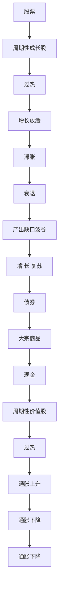
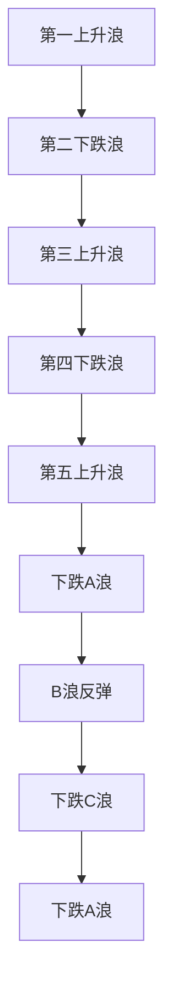

# 第三节 股票分析方法

第三节 股票分析方法

<table><tr><td>学习内容</td><td>知识点</td></tr><tr><td>基本面分析</td><td>“自上而下”分析,宏观——行业——公司宏观分析:经济指标、经济周期、财政和货币政策行业分析:行业分类、行业生命周期、行业景气度公司分析:信息获取、竞争分析、财务分析、企业估值</td></tr><tr><td>技术分析</td><td>技术分析的概念与三项基本假定K线入门:K线基本概念、K线结构、K线形态的一般理解常用技术分析方法:道氏理论、波浪理论、“相对强度”理论、“量价”理论体系技术分析的争议与局限性</td></tr></table>

# 一、基本面分析

要确定股票的合理价值，投资者必须对公司未来的经营业绩和盈利水平进行预测。我们把分析价值决定因素的方法称为基本面分析（Fundamental Analysis），而公司未来的经营业绩和盈利水平正是基本面分析的核心。由于公司的未来经营业绩和宏观经济因素密切相关，所以基本面分析也应考虑公司所处的经营环境。对于许多公司而言，宏观经济和行业环境对公司利润产生重要影响。因此，对于公司前景预测来说，“自上而下”的层次分析法（三步估价法，宏观——行业——个股）是比较适用的。这种分析法首先从宏观的经营环境出发，主要考察国内外的经济环境及其影响因素，确定外部经济环境对公司所处经营行业的影响；然后，分析行业运行的内在经济规律，从而预测未来行业发展趋势；最后，通过企业竞争力、财务指标、企业估值、风险评估等来确定企业的合理市场价值。

# （一）宏观经济分析

宏观经济的分析，主要是通过分析宏观经济指标，预判经济周期位置和宏观经济政策的变化。

# 1. 宏观经济指标

对一个国家或地区的宏观经济进行评估，首先要对该国家或地区的主要宏观经济指标（变量）进行分析。这些指标（变量）主要包括8个，涵盖市场关注的增长周期、信用周期、通胀周期与政策周期。其中，增长周期的代表指标包括国内生产总值和采购经理指数（Purchasing Managers' Index, PMI）；信用周期的核心指标是社会融资规模；通胀周期的核心指标是消费者物价指数（Consumer Price Index, CPI）和生产者物价指数（Producer Price Index, PPI）；政策周期的核心观测指标包括财政支出强度相关的预算赤字和货币政策宽紧情况相关的利率。

（1）国内生产总值（GDP）。衡量一个国家或地区的综合经济状况的常用指标是GDP。GDP是指某一特定时期内在本国（或本地区）领土上所生产的产品和提供的劳务的价值总和，是衡量整体经济活动的总量指标。根据支出法，国内生产总值由四部分构成——消费、投资、净出口（出口额减进口额）和政府支出。其表达式为：

$$
G D P = C + I + (X - M) + G
$$

式中：C——消费；I——投资；X——出口额，M——进口额，X-M——净出口；G——政府支出。GDP的增长情况（同比、环比）及边际变化处于扩张阶段，公司的经营环境较为有利。

另两个应用较广的经济产出测度指标包括工业增长率和第二产业用电量增长率，分别表示工业生产总值和制造业用电量的增长速度，与经济景气程度密切相连。

(2) 采购经理指数 (PMI)。PMI是衡量制造业在生产、新订单、商品价格、存货、雇员、订单交货、新出口订单和进口八个方面状况的指数, 是经济先行指标中一项非常重要的指标, 于当月最后一天公布, 是宏观经济指标中公布较早的数据; 同时,

PMI是环比口径数据，相比起其余同比宏观指标，市场更为关注。当PMI>50%时，说明经济较上月走强；当PMI<50%时，说明经济较上月走弱。

（3）社会融资规模。社会融资规模是全面反映金融与经济关系，以及金融对实体经济资金支持的总量指标。社会融资规模是指一定时期内（每月、每季或每年）实体经济从金融体系获得的全部资金总额，是增量概念。社会融资规模增速较快时，对投资形成拉动，往往对应经济增速进入上行期。结构上而言，权益市场投资者更为关心的是新增人民币贷款和中长期贷款占比。其中新增人民币贷款代表国内信贷的净增加量，若新增人民币贷款量较大，则说明企业和居民对未来经济前景预期乐观，进行投资活动的积极性较高，新增贷款相对到期贷款更多；中长期贷款占比较大，说明企业和居民对较长时间内的经济增长预期乐观，企业愿意承担一定的风险投资于现金回流周期较长的业务开发活动，通常有望带动行业创新和长期发展，居民愿意提升杠杆投资于大宗消费，如房产或汽车等。  
（4）通货膨胀。通货膨胀的测量主要采用物价指数，如消费者物价指数（CPI）、生产者物价指数（PPI）、商品价格指数等。不同的指数有不同的受测经济范围和不同物品的价格比重。我国作为制造业大国，国内经济增长往往与PPI同比更为相关；货币政策则需要同时关注CPI和PPI，若通胀过高，货币政策将转为紧缩抑制通胀；若通胀偏低，货币政策将宽松以提振内需。  
（5）利率。利率是资金成本的主要决定因素。高利率会减少未来现金流的现值，因而降低投资机会的吸引力。  
（6）汇率。汇率的变动直接影响本国产品在国际市场的竞争能力，从而对本国经济增长造成一定影响。一般来说，汇率贬值时有利于本国出口，汇率升值时对本国出口有制约。  
（7）预算赤字。政府的预算赤字是政府预算支出和政府预算收入之间的差额。通常经济潜在的增长压力较大的年份，预算赤字较高，以通过增加财政支持提振经济；在经济增长较高的年份，预算赤字较低，以保持合理的长期债务水平。  
（8）失业率。失业率是评价一个国家或地区失业状况的主要指标，测度了经济运行中生产能力极限的运用程度。因与社会稳定有密切关系，失业率抬升时往往对应政策加码，是市场预判政策方向的重要指标。

# 2. 经济周期

要充分理解经济指标包含的信息，不但要了解经济各领域当前的长期趋势，而且需要了解各经济领域在中期周期中的位置，从而根据经济周期发展规律进行股票配置。市场通常根据增长周期和通胀周期的状态将一个经济周期划分为复苏、过热、滞胀、衰退四个阶段，并根据历史经验和经济逻辑发现在这四个阶段分别配置周期性成长股、周期性价值股、防御性价值股和防御性成长股为较优的投资策略。

投资股票较为关心的是与金融市场牛熊周期较为相关的3\~5年维度的经济周期。如图4-5所示，我国实际产出水平在长期趋势上行的基础上，经济增长会周期性地经历复苏、过热、滞胀、衰退四个周期，其中复苏和过热期经济处于扩张期，滞胀期和

第四章

衰退期经济处于收缩期。

area

| 时间 | 实际产出水平 |
| ---- | ------------ |
| 起退 | 0            |
| 复苏 | 过热         |
| 滞胀 | 随期         |

图4-5 经济周期

在自上而下的投资框架中，依据经济周期性运行的规律，市场通常使用投资时钟来判断占优的股票风格。如图4-6，横坐标为通胀水平，纵坐标为经济增长水平。根据通胀和经济增长的高低不同，可划分为四个经济状态，其中高增长低通胀为经济复苏期，高增长高通胀为经济过热期，低增长高通胀为滞胀期，低增长低通胀为衰退期。根据历史经验和经济逻辑发现，经济复苏期经济回暖预期加强且通常伴随宽松的货币环境，周期性成长股占优；经济过热期经济增长依然较高，但政策转为紧缩，周期性价值股占优；经济滞胀期经济增速下行且通胀较高，政策收紧，股市整体承压，防御性价值股占优；经济衰退期经济增速下行，货币环境宽松以辅助提振经济，流动性驱动下，防御性成长股占优。

flowchart

图4-6 投资时钟

# 3. 宏观经济政策

财政政策和货币政策是政府宏观经济调控的最重要的两大政策工具。政府通过运用财政政策和货币政策“熨平”经济周期波动对经济运行的负面冲击，促进国内生产总值稳定增长，从而实现充分就业和物价稳定的宏观经济目标。

财政政策是指政府的支出和税收行为。通常采用的宏观财政政策包括扩大或缩减财政支出、减税或增税等。政府希望通过这些方法控制社会的投资和消费水平，从而提高经济增长率，增加就业水平或降低通货膨胀率。政府支出的上升直接增加了对产品和劳务的需求；同样，税收的减少也会增加消费者的收入，从而导致消费水平的提高。

货币政策是另一种重要的需求管理政策，它是通过控制货币供应量和影响市场的利率水平对社会总需求进行管理。中央银行的货币政策采用的三项政策工具有：（1）公开市场操作，其主要内容是中央银行在货币市场上买卖短期国债；（2）利率水平的调节；（3）存款准备金率的调节。 $^{①}$

在经济调控过程中，政府往往将货币政策与财政政策组合搭配，进行“逆经济周期”调控。针对经济不同阶段，政府常常采取财政政策与货币政策“双紧”“双松”或“一松一紧”的政策搭配组合，对宏观经济变量进行调节。

# （二）行业分析

“自上而下”分析法的第二步是行业分析，着重对行业基本面及行业发展前景等行业因素进行分析。行业分析基于经济学原理，运用不同分析工具对行业的生意属性、商业模式、需求特征、需求驱动力、供给壁垒、竞争格局、生产要素、政策导向等要素进行深入分析，从而发现行业运行的内在经济规律，进而预测未来行业发展的趋势。行业因素，又称产业因素，影响某一特定行业或产业中所有上市公司的股票价格。这些因素包括行业生命周期、行业景气度、行业法令措施以及其他影响行业价值面的因素。投资机构的股票分析和信用分析通常按照行业划分给不同的分析师进行。每位分析师专注于一个或多个行业，在研究中可以产生协同作用，提高研究效率。

# 1.行业分类

行业分类方法中最常见的是基于产品与服务的相似性对公司进行分组。一个行业就是一组提供类似产品与服务的公司。

行业分类通常是根据公司主营业务来确定公司在行业中的地位。例如，大部分收入来自销售生产医疗保健用品和提供医疗健康服务的公司，都可以归为一类。

公司通常会在其财务报表中报告不同业务部门的收入。公司的主营业务是指公司大部分营业收入或利润的来源。

行业分类方案通常提供多个级别的分类。一般所说的“行业”通常包含一组相关子行业。例如，医药行业包括化学制药、生物制药、医疗器械和医疗服务等子行业。多个行业可以组成行业组和行业板块。

国际主流的行业分类标准，根据服务对象和目的，主要分为两种：

一种是为政府管理者服务的管理型分类标准，如国家统计局的国民经济行业分类、中国证监会的行业分类指引、联合国统计司的国际标准产业分类（ISIC）、北美产业分类（NAICS）等等。

另一种是为金融市场投资者服务的投资型分类标准。全球有MSCI和标准普尔共同构建的GICS（Global Industry Classification Standard）、富时罗素的ICB（Industry Classification Benchmark）。我国A股市场有申万宏源证券发布的申万行业分类标准、中信证券发布的中信行业分类标准、长江证券发布的长江行业分类标准、中证指数公司的中证行业分类标准、深交所国证指数的国证标准。

主流行业分类体系中，每家公司只有一个行业分类，但越来越多的公司开始从事多元化产业布局，单一的行业分类不能反映公司全貌。行业分类的更新一般是根据财报数据，存在一定的滞后。

行业研究中，常常为不同行业打上额外的标签，如周期/非周期、价值/成长等。

根据对商业周期的相对敏感性，公司可以被分为周期性公司和非周期性公司。周期性公司是利润与整体经济发展密切相关的公司。此类公司的需求波动要大于平均水平，经济扩张时期需求提高，而经济收缩时期需求降低。周期性公司提供的产品和服务通常金额相对较高，在消费者可支配收入下降时可以延迟购买，如汽车、房地产、能源、金融、材料、工业和技术等。非周期性公司是经营业绩很大程度上与商业周期无关的公司，其生产的商品或服务的需求相对稳定，如食品饮料、医疗、电信和公用事业等。

价值型行业是那些发展较为成熟、竞争格局稳定、盈利波动较小的行业。这些行业倾向于提供基本服务和生产主要消费品，或者通过合同或政府法规来确定其费率和收入。成长型行业将包括具有特定需求动态的行业，这些行业自身发展动力强，在经济衰退期间也可能实现增长。

行业标签并非泾渭分明。商业周期敏感性的强弱不是非黑即白的，周期性和非周期性都是相对的概念。严重的经济衰退通常会影响经济的各个部门。

# 2. 行业生命周期

任何一个行业都要经历一个生命周期：初创期、成长期、成熟期和衰退期（见图4-7）。同行业不同公司的业绩虽有不同，但与该行业所处的整体发展阶段有很大关联。当公司所处行业处于上升阶段时，该行业所有公司的成长性都被看好；相反，当公司所处行业开始衰退时，即使有些公司能够做到经营有方，但行业内大多数公司的整体状况并不乐观。可见，投资不同周期的行业，获得的回报是完全不一样的，证券分析师必须非常关注行业周期的信息及其变化趋势。

line

| 时间 | 行业规模 |
|---|---|
| 初创期 | 0 |
| 成长期 | 高点 |
| 成熟期 | 高点 |
| 衰退期 | 高点 |

图4-7 行业的生命周期

（1）初创期。在初创期，大量的新技术被采用，新产品被研制但尚未大批量生产，销售收入波动较大。由于前期投入大，多数企业处于亏损或微利状态，少数技术领先或具有先发优势的企业可能获得短期超额利润，但整体风险较大，公司股价波动也较大。在此，有两点需要注意：一是关注行业的动态分析，例如，LED行业从初创到过剩期的迅速转化，导致产业的投资风险加大。二是关注不同区域或不同国家的分析。随着全球制造业的转移，某些产业（如新能源产业等）从发达国家向新兴市场尤其是中国转移，产生不同产业周期的地域梯度。  
（2）成长期。在成长期，各项技术逐渐成熟，产品的市场也基本形成并不断扩大。行业特征、竞争状况及用户群体已较为明确，企业进入壁垒提高，产品品种及竞争者数量增多。行业内公司利润开始逐步上升，公司股价逐步上涨。行业的领导者开始出现。  
（3）成熟期。在成熟期，产品标准化，市场基本达到饱和，市场份额趋于稳定。产品销售的收入为该行业的公司带来稳定的现金流。由于行业竞争激烈，边际利润逐渐降低，利润增长缓慢甚至停滞。  
（4）衰退期。在这个阶段，行业的增长速度低于经济增速。行业规模萎缩，主要因产品过时、新产品的竞争或低成本的供应商竞争所致。

# 3.行业景气度

市场对行业的关注会随行业景气度变化而变化。影响行业景气度的因素包括宏观经济、科技发展、人口结构、政府和社会等诸多方面。一般来说行业景气度会由于供求格局的变化呈现出比较显著的周期性波动，如图4-8，中国出口集装箱运价在年度之间涨跌剧烈，特别是在新冠疫情期间运价短时间上涨了数倍。一个行业的预期景气状况影响了行业当前的投资价值，景气上行但估值偏低的行业往往具备更好的投资价值。因此，行业景气度是行业研究的一项重要内容。分析师可以使用财报公布的财务指标，从收入、盈利、成长、运营等多个维度来衡量行业的景气度。但由于财报公布的滞后性，行业指数经常会领先于财报呈现的基本面业绩变化。分析师需要通过对内外部因素的前瞻性分析，提前把握行业景气度的变动方向。

line

| 年份 | 欧洲航线 |
| ---- | -------- |
| 1998 | 1400     |
| 1999 | 1500     |
| 2000 | 1600     |
| 2001 | 1400     |
| 2002 | 1000     |
| 2003 | 1300     |
| 2004 | 1500     |
| 2005 | 1600     |
| 2006 | 1400     |
| 2007 | 1500     |
| 2008 | 1700     |
| 2009 | 800      |
| 2010 | 1800     |
| 2011 | 1500     |
| 2012 | 1700     |
| 2013 | 1400     |
| 2014 | 1600     |
| 2015 | 1300     |
| 2016 | 800      |
| 2017 | 1100     |
| 2018 | 1000     |
| 2019 | 900      |
| 2020 | 1000     |
| 2021 | 3300     |
| 2022 | 5700     |
| 2023 | 1100     |

图4-8 中国出口集装箱运价指数  
数据来源：Clarksons。

# （三）公司分析

长期来看，股票市场是公司基本面的“称重器”。能够持续创造自由现金流的企业往往可以给投资者带来较好的回报。因此，分析公司的基本面在证券投资活动中是最常见的评估环节之一。证券研究的一项重要目的是为企业定价。尽可能全面分析企业的经营状态，有利于投资者更准确地估计企业的长期价值和投资潜力。

由于不同地域和行业的上市公司有着不同的商业环境、法律法规和盈利模式，因此对于具体公司的分析需要结合其所处的宏观背景来综合考虑。前面已经介绍了一些宏观分析和行业分析的手段，这里介绍一些公司分析的基本内容。

1. 信息获取。投资者需要初步了解公司的基本信息，如历史沿革、主营业务、产品或者服务、市场定位、财务数据等。这些基本的经营信息往往通过查阅上市公司公开的信息披露就可以获得，包括但不限于：定期披露的财务报告、融资预案、董事会公告、股东大会决议、ESG报告、投资者会议资料等。投资者也可以通过实地调研的方式，与公司以及其利益相关方进行交流，充分了解公司的经营策略、管理团队、生产流程、竞争格局、未来规划等。上市公司在进行投资者关系管理工作中，也应该坚持公平、公正、公开原则，确保信息披露的客观、真实、准确和完整。  
2. 竞争分析。确定公司所处的产业之后，需要对其竞争对手和产业竞争地位进行分析。研究竞争对手才能做到“知己知彼，百战不殆”。往往在分析竞争对手的过程中，会给被研究公司提供更丰富的佐证信息。一家公司的竞争壁垒和护城河影响了其长期价值，这些竞争优势体现在牌照垄断、技术领先、组织和文化、规模效应等方面。在产业竞争地位分析过程中，可以参考使用SWOT这一类分析工具进行分析。其中S和W分别指公司内部的优势和劣势，O和T分别指公司外部的机会和威胁。  
3. 财务分析。阅读并分析公司的财务报告，找出关键的财务指标，财务数据能直观反映一家企业的商业模型和核心竞争力。同时也要辨别虚假的会计数据，从金融学

的角度对公司行为动机的不同理解，识别并发现报表粉饰业绩的行为。好的财务报表分析能解释影响公司经营变化的真实原因，并且为后续开展盈利预测、股票估值、风险评估提供分析基础。

4. 企业估值。估值是投资者对一家企业内在价值进行评估，是投融资和证券交易的定价基础。对于处于不同成长阶段以及不同性质的企业，要因地制宜地使用不同的估值方法。建立估值模型是企业估值必不可少的一个环节，有助于全面审慎地衡量企业整体质量。企业的内在价值和市场交易的价格在大多数时候并不统一，投资者不断寻找定价错误的过程中提高了市场的定价效率。  
5. 风险评估。风险是不确定性的一种表现形式，内外部因素都可能成为影响公司业绩的风险。公司的内部风险主要涉及公司治理、战略达成，合规风控、安全生产、关联交易、信息披露等。外部风险包括宏观经济、行业周期、技术变革、法律和监管、舆论和社会责任等方面。由于估值模型并不一定能完全考虑到企业当下所面临的所有风险，因此对风险的评估应该是一个持续和动态的过程。

# 二、技术分析

# （一）技术分析概述

# 1. 技术分析的概念

技术分析是一种通过研究金融市场的历史信息来预测股票价格趋势的方法。与基本面分析不同，技术分析主要关注市场行为本身，通过分析价格变动、成交量、图形走势以及由历史数据衍生的技术指标来推测未来价格的变动趋势。

技术分析的历史发展可以追溯到20世纪初，代表性理论如道氏理论在此时期开始形成。然而，对价格图形的研究，例如日本的K线技术，拥有更早的渊源。技术分析的研究方法包括图形分析、指标分析和统计分析等。

# 2. 技术分析的六大前提假设

第一，市场行为涵盖一切信息。技术分析的核心假设是市场价格已经反映了所有相关信息，包括基本面信息、市场情绪、经济数据、政策变化等。这意味着市场价格的变动是对所有已知信息的直接反应。因此，可以通过研究价格图表和交易量数据，从中提炼出所有必要的信息，以推测市场未来的走势。  
第二，价格沿趋势移动。技术分析认为，价格趋向于沿着某种趋势运动。这些趋势可以是上升、下降或横盘整理。技术分析的目标之一是识别这些趋势，并在趋势形成的早期阶段进行交易。趋势可以在不同的时间尺度上存在，包括短期、中期和长期。为了识别和确认趋势，分析师通常依赖于各种技术指标和图表形态，如移动平均线、趋势线和价格通道等。  
第三，历史会重演。技术分析假设市场参与者的行为是有规律的，并且这些行为会随着时间的推移而重复。这意味着历史上某一特定情境下的价格走势可能会再次发

生。因此，分析过去的价格行为被视为预测未来市场走势的一种常用方法，其有效性在实践中被部分投资者认可，但也存在争议。技术分析中的图表形态、指标和其他分析工具都是基于历史数据的重复性原理构建的，目的是通过识别过去的模式来预测未来的价格变动。

第四，市场以群体心理为驱动。股票市场的价格波动很大程度上受到投资者群体心理和情绪的驱动。技术分析关注的正是这种群体心理的变化，通过分析价格图表和交易量来捕捉市场情绪的变化。技术分析师试图通过识别市场情绪的转折点来制定交易决策。

第五，价格走势并非随机。尽管价格在短期内可能表现出随机波动的特征，但技术分析假设在某些时间尺度上，价格走势是可以预测的。通过分析历史数据和市场模式，技术分析相信可以找到价格走势的规律性。

第六，供需关系决定价格。技术分析认为价格是由供需关系决定的。当需求超过供给时，价格上升；当供给超过需求时，价格下降。技术分析通过研究价格图表和交易量数据来分析市场中的供需关系。

# （二）常用技术分析方法

# 1. 道氏理论

道氏理论（Dow Theory）是技术分析的奠基理论，由道琼斯公司的创办人、《华尔街日报》出版商查理斯·道（Charles Dow）提出的，并由威廉·汉密尔顿（William Hamilton）等继承发展。他们所著的《股市晴雨表》《道氏理论》成为道氏理论的经典代表作。

道氏理论包含六大基本原则：第一，平均价格反映并消化所有影响市场供需的因素；第二，市场存在长期、中期和短期三种趋势；第三，长期趋势划分为三个阶段，依次是先行投资者买入、大众跟风买入和最后一批投资者买入；第四，各种平均价格需要相互验证，即不同市场指数或商品的走势应相互印证；第五，交易量必须验证趋势，价格变动需要成交量的配合才能确认；第六，只有发生确定无疑的反转信号，才能判断既定趋势已终结。这些原则为技术分析提供了系统框架，强调了市场信息的全面性、趋势的多层次性、市场相关性、成交量的重要性以及谨慎判断趋势反转的必要性。

道氏理论最成功的案例是：1929年纽约股市崩盘前一个月，给出了306点的一个卖出信号；直到市场出现很好的调整后，在1933年给出了84点的一个买入信号。

# 2. 波浪理论

波浪理论由美国著名技术分析大师拉尔夫·纳尔逊·艾略特（Ralph Nelson Elliott）创立。波浪理论认为股票价格的波动类似自然界的潮汐，具有一定的规律性。波浪理论将价格波动分为五个主要的推动浪和三个次要的调整浪，推动浪推动趋势发展，而调整浪则是对推动浪的修正。同时，波浪理论认为市场行为可以在不同的时间框架内重复出现，每个浪都可以进一步分解为更小的浪，形成一个层次结构。这种层次结构可以是无限循环的（见图4-9）。

flowchart

图4-9 波浪理论中的一个完整的波浪周期

波浪理论的核心缺陷在于其固有的主观性和难以验证性。分析者在识别和解释波浪时往往依赖个人判断，缺乏客观标准，导致不同人可能得出截然不同的结论。理论的灵活性使得几乎任何市场走势都能用波浪来解释，这降低了其可证伪性，使其难以通过严格的科学方法验证。尽管波浪理论声称能预测未来走势，但其实际预测能力和可靠性一直存在争议。

# 3. K 线分析

K线（Candlestick Charting）源自日本，用于技术分析股票、期货、外汇等金融市场中的价格走势。它通过图形化展示一段时间内的开盘价、收盘价、最高价和最低价来帮助投资者理解市场情绪和潜在的价格趋势。

K线是一种柱、线组合，由实体和影线组成，因其形状又被称为“蜡烛图”“阴阳烛”（见图4-10）。实体较影线为粗线，影线则依附于实体的上下两端。实体记录开盘价和收盘价，若收盘价高于开盘价，则实体为“阳线”；若收盘价低于开盘价，则实体为“阴线”。影线用于记录最高价和最低价。最高价到K线实体之间的距离称为“上影线”，最低价和实体之间的距离称为“下影线”。K线是反映某一时间周期内价格走势关键信息的一种图线，也是对一段时间周期内连续价格信息的简化。

text_image

上影线
实体
下影线
最高价
收盘价
开盘价
最低价
最高价
开盘价
收盘价
最低价

图4-10 手工绘制的标准形态K线（左为阳线，右为阴线）

单根K线可以解读某一个独立单位时间内价格波动的关键信息。通常，K线实体越长，表示这一段时间内市场对于标的价格走势认可度越高，长阳线或者长阴线通常表示趋势强烈。而影线的长度反映的该时间段内价格走势的分歧强弱，影线越长表示多空方博弈和分歧越大。通常单根K线反映的信息有限，所以K线理论会使用多根K线的形状和组合来研判市场。K线分析常常与其他技术分析方法（如趋势线、移动平均线等）结合使用。

K线分析主要依赖于图形模式和经验法则，而这些模式和法则大多基于历史数据的观察和经验总结，缺乏严格的理论支持。虽然许多交易者认为K线分析能够帮助预测市场走势，但其预测能力在学术研究中尚未得到一致的验证。K线分析的解读往往带有较强的主观性，不同分析师可能对同一K线形态有不同的解读。

# 4. 相对强度分析

相对强度分析是另一种常用的技术分析方法。这种方法通过比较个股与大盘或同行业其他股票的表现来判断个股的走势。相对强度分析者通常建议购买近期表现强于大盘的股票，而避免或考虑卖空表现弱于大盘的股票。

# 5. 量价分析

量价分析是结合价格变动和成交量来判断市场趋势的方法，最早见于美国股市分析家葛兰碧（Joseph E. Granville）所著的《股票市场指标》。这种方法认为，当一只股票（或大盘指数）放量上涨或者呈现价升量增的态势时，则表明买方意愿强烈，股票有望再续升势；相反，如果一只股票（或大盘指数）放量下跌，则表明卖压较为沉重，发出空头信号。

# （三）技术分析的争议

对于技术分析的有效性，市场一直存在争议。支持者认为技术分析能够帮助预测市场走势，而批评者则认为它缺乏科学基础。一些研究表明技术分析具有一定的预测能力，但也有研究显示其对某些市场的预测能力有限。此外，技术分析的广泛使用可能导致其预测成为自我实现的预言，这进一步增加了评估其有效性的难度。

随机漫步理论对技术分析提出了挑战。该理论认为短期价格变动是随机的，无法预测，这与技术分析的基本假设相矛盾。有效市场假说（EMH）也对技术分析提出了重大挑战。EMH认为，在有效市场中，所有可获得的信息都已经反映在当前价格中，因此无法通过分析历史价格和交易量来获得超额收益。特别是弱式有效市场假说（Weak-form EMH）认为历史价格信息对预测未来价格无效，直接挑战了技术分析的基础。然而，关于市场是否始终处于弱式有效状态的争论，以及行为金融学对市场非理性行为的研究，为技术分析的应用提供了一定的理论空间。

总的来说，技术分析为投资者提供了一种独特的市场分析视角。虽然它不能完全准确地预测未来价格走势，但它可以帮助投资者更好地理解市场情绪和潜在趋势。投资者在使用技术分析时应当认识到其局限性，将其作为投资研究的一部分，而不是唯一依据。
