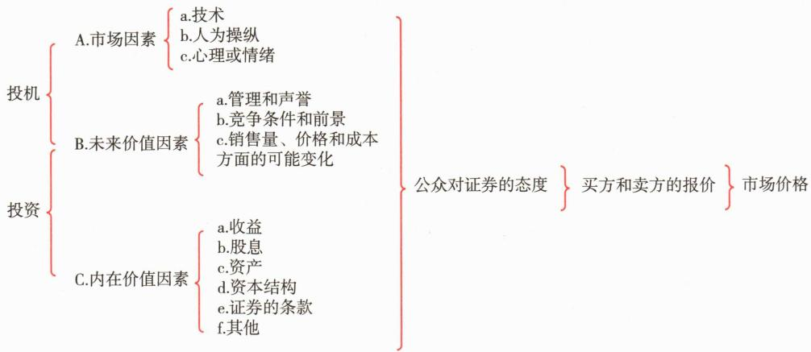
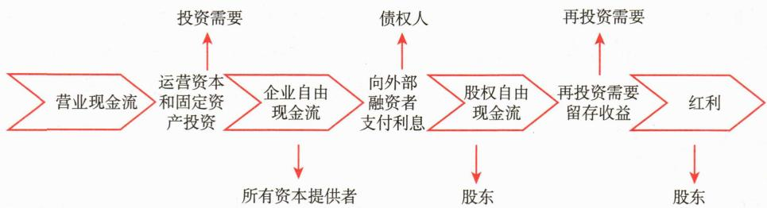

# 第四节 股票估值方法

<table><tr><td>学习内容</td><td>知识点</td></tr><tr><td>股票的价值及其与价格的关系</td><td>票面价值、账面价值、清算价值、市场价值和内在价值市场价格和内在价值的关系</td></tr><tr><td>绝对估值法</td><td>现金流量贴现的原理股利贴现模型、FCFE贴现模型、FCFF贴现模型的理解</td></tr><tr><td>相对估值法</td><td>市盈率模型、市净率模型、市现率模型、市销率模型企业价值倍数</td></tr></table>

# 一、股票的价值及其与价格的关系

# （一）股票的价值

股票代表着获取利益的权利，能够给持有者带来股息、红利收入。所以，股票的价值就是用货币来衡量的作为获利手段的价值。股票的价值包括票面价值、账面价值、清算价值、市场价值和内在价值。

# 1. 股票的票面价值

股票的票面价值（Par Value）即股票面值，它是股份有限公司在其所发行的股票上标明的票面金额，是认购者向股份有限公司投资的货币价值以及该投资在公司资本总额中所占的比例，是确认股东权利的根据。以面值发行称为“平价发行”，此时公司发行股票募集的资金等于股本的总和。发行价格高于面值称为“溢价发行”，募集的资金大于股本的总和，其中等于面值总和的部分计入股本，超额部分计入资本公积。

# 2. 股票的账面价值

股票的账面价值（Book Value）又称“股票净值”或“每股净资产”，是每股股票所代表的实际资产的价值。它是股份有限公司财务报表的计算结果，其计算方法是，公司资本额加上公司的各种公积金，再加上公司的累积盈余所得款额成为公司账面净值总额。净值总额除以发行股票的股数就是每股的净值。例如公司的账面净值总额为10亿元，发行股票的股数为5000万股，则每股净值为20元。

# 3. 股票的清算价值

股票的清算价值（Liquidation Value）是指股份有限公司进行清算时，股票的每一股份所代表的实际价值。一般是在公司解散时才需要清算。公司解散时办理清算事宜的程序为变卖财产、收回债权、清偿债务、分配剩余财产，最终每股所能分到的剩余财产就是该股票的清算价值。在公司清算时，其资产往往只能压低价格出售，再加上必要的清算费用，故大多数公司股票的清算价值低于其账面价值。

# 4. 股票的市场价值

股票的市场价值（Market Value），也称股票的市值，指股票在股票市场进行交易过程中所具有的价值。股票的市场价值由于受到市场各种因素的影响，是一种经常变动的数值，它直接反映了股票的市场行情。由于影响股票价格的因素复杂多变，所以股票的市场价格呈现出高低起伏的波动性特征。

# 5. 股票的内在价值

股票的内在价值（Intrinsic Value）通常定义为对其未来预期产生的现金流（例如股利或自由现金流）以适当的贴现率进行折现后的现值总和。股票的内在价值决定股票的市场价格，股票的市场价格总是围绕其内在价值波动。由于未来收益及市场利率的不确定性，各种价值模型计算出的“内在价值”只是股票真实内在价值的估计。经济形势的变化、宏观经济政策的调整、供求关系的变化等都会影响股票未来的收益，引起内在价值的变化。

研究和发现股票的内在价值，并将内在价值与市场价格相比较，进而决定投资策略是证券分析师的主要任务。分析师收集和处理信息以作出投资决策，包括买入和卖出建议。

# （二）市场价格和内在价值的关系

股票的市场价格是由市场供求关系所决定的，不仅受资产内在价值与未来价值因素的影响，还可能受市场情绪的影响。

图4-11刻画了影响市场价格的因素，揭示了市场价格和内在价值之间的动态联系。该图显示，驱动市场价格的力量主要源自两个方面。一方面是市场及情绪因素，这包括了基于历史价格与成交量模式的技术分析信号、短期新闻事件引发的市场反应、普遍的投资者心理预期与情绪波动，乃至潜在的市场操纵行为。这些因素往往对股价产生即时且显著的影响，是市场价格频繁波动和短期内偏离基本面的主要推手。

另一方面则是基本面因素，这是评估企业长期价值和内在价值的基石。它深入探究企业的核心状况，既包括了反映公司当前经营成果与财务实力的“公司现状与基础”（如收益、股息、资产、资本结构等），也涵盖了决定其持续发展能力的“未来前景与驱动力”（如管理层素质、行业竞争力、未来销售与成本变动预期、宏观经济背景等）。分析师正是通过对这些基本面因素的细致研究和前瞻性判断，运用如现金流折现等方法，来估算股票的内在价值。

无论是着眼于短期的市场情绪还是立足于长期的基本面分析，这两类因素最终都会共同作用于公众对该证券的整体态度。这种集体认知继而转化为市场上买方和卖方的报价行为，并在持续的交易中最终确定了该股票的市场价格。

 — 图4-11 市场价格和内在价值的关系

因此，我们所观察到的市场价格，实质上是公司基本面信息（内在价值的反映）与瞬息万变的市场信息（情绪、事件等）相互交织、博弈的复杂结果。市场价格虽内在地受到其内在价值的牵引，但又时常因为市场情绪的喧嚣、信息的噪音或对基本面解读的差异而偏离航道，呈现出围绕内在价值上下波动的特征。从投资实践看，要准确评估基本面并预测未来本就充满挑战，数据不足或不准确、未来的不确定性、加之市场本身时常存在的非理性行为，这些都是证券分析面临的主要障碍，共同导致市场价格经常性地与内在价值发生偏离。尽管市场的理性，尤其是基于对基本面的深入分析，会倾向于推动价格向价值靠拢，实现自我纠正，但是这个过程并非一蹴而就，价格向价值的回归往往相当迟缓，甚至充满波折，存在着回归迟缓的风险。

理解这种区分及其内在的复杂性对于投资实践具有重要意义。价值投资者，正如沃伦·巴菲特的投资哲学所体现的，会专注于深入分析基本面因素，力求发掘那些市场价格因暂时的市场及情绪因素影响而低于其内在价值的投资机会，并认识到需要耐心等待价值回归。他对《华盛顿邮报》的投资便是经典案例：尽管他基于对公司强大基本面的判断而认定其价值，市场价格却在数年内徘徊不前，这正是短期市场情绪压制价格以及价值回归可能迟缓的体现。然而，随着时间推移，卓越的基本面最终驱动了价格向内在价值的显著回归，证明了长期来看，价值终究是市场价格的坚实锚点，尽管认识到这一点需要市场的耐心和投资者的远见。

# 二、绝对估值法

绝对估值法，又称为贴现法，是通过对上市公司的基本面分析进行未来公司财务数据的预测，用预期从证券中获得的未来收益的现值作为股票的内在价值的估计。绝对估值法分为股利贴现模型、自由现金流量贴现模型等。

# （一）现金流贴现原理

股票绝对估值法认为，股票价值体现在其未来能够给股东带来的现金流，将所有现金流折现到当前即为股票价值。由此可见，绝对估值法是直接从公司股权价值的内在驱动因素出发对股票进行价值评估。由于不同资本提供者对现金流索取权的次序有所不同，公司未来现金流的分配也就存在差异。按照公司金融理论，企业现金流进行分配的第一个环节是进行投资，支付的这部分现金流为营运资本。接下来的企业现金流分配，是为所有资本提供者提供报酬。由于企业资本提供的属性不同，现金流的索取权顺序也存在差异。企业首先向债权人支付负债利息，然后才能向公司股东进行红利分配。但企业为了未来发展需要进行再投资，所以分配给普通股股东的红利往往是再投资和留存收益之后的现金流（见图4-12）。这样，与现金流的分配次序相匹配，不同的现金流决定了不同的现金流贴现模型。其中，股利贴现模型（Discounted Dividend Model，DDM）采用的是现金股利，股权自由现金流贴现模型（Free Cash Flow to Equity，FCFE）采用的是权益自由现金流，公司自由现金流模型（Free Cash Flow to Firm，FCFF）采用的是企业自由现金流。

 — 图4-12 现金流分配的过程

# （二）股利贴现模型（DDM）

若假定股利是投资者在正常条件下投资股票所直接获得的唯一现金流，就可以建立估值模型对普通股进行估值，这就是著名的股利贴现模型。这一模型最早由威廉姆斯（Williams）和戈登（Gordon）提出，实质是将收入资本化法运用到权益证券的价值分析中，这在概念上与债券估值方法没有本质性差别。

该模型股票现值表达为未来所有股利的贴现值：

式中：D——普通股的内在价值； $D_{t}$ ——普通股第t期支付的股息或红利；r——贴现率，又称资本化率。贴现率是预期现金流量风险的函数。风险越大，现金流的贴现率越大；风险越小，则资产贴现率越小。

根据对股利增长率的不同假定，股利贴现模型可以分为零增长模型、不变增长模型、三阶段增长模型和多元增长模型。

# （三）股权自由现金流（FCFE）贴现模型

股权自由现金流量是在公司用于投资、营运资金和债务融资成本之后可以被股东利用的现金流，它是公司支付所有固定资产与营运资产投资，以及所得税和净债务（即利息、本金支付减发行新债务的净额）后可分配给公司股东的剩余现金流量。FCFE的计算公式为：

FCFE 贴现模型的基本原理，是将预期的未来股权活动现金流用相应的股权要求回报率折现到当前价值来计算公司股票价值。其计算公式为：

式中：V——公司股权价值； $FCFE_{t}$ ——t期的股权现金流； $K_{e}$ ——根据CAPM计算的股权成本。

# （四）公司自由现金流（FCFF）贴现模型

按照公司自由现金流贴现模型，公司价值等于公司预期现金流量按公司资本成本进行折现，将预期的未来自由现金流用加权平均资本成本（WACC）折现到当前价值来计算公司价值，然后减去债券的价值进而得到股票的价值。其公式可表达为：

式中：V——公司价值； $FCFF_{t}$ ——公司t期的自由现金流；WACC——加权平均资本成本。

由于公司自由现金流是公司支付了所有营运费用，进行了必需的固定资产与营运资产投资后，可以向所有投资者分派的税后现金流量，所以该指标体现了公司所有权利要求者，包括普通股股东、优先股股东和债权人的现金流总和，其计算公式为：

式中：EBIT为税息前利润。

在实践中，FCFF估值模型实用性高于DDM贴现模型和FCFE贴现模型。DDM估值模型需要预测分红的时间和金额，其前提假设是分红之外的部分即为资本开支和应收应付的变化，但是企业的重大资本开支往往不是连续的，分红率也并不恒定。相比FCFF贴现模型，FCFE贴现模型减去了付给债权人的现金。企业在一定程度上可以自主选择债务本金的偿还量，例如，通过提前偿还债务同时减少资产和负债，而这种做法对权益部分的内在价值影响较小，但对FCFE贴现模型估值结果影响较大，其稳定性逊于FCFF贴现模型。

# 三、相对估值法

相对估值法，是指将股价与某种货币流量或价值相除得到的价格倍数，用于评估公司股票的相对价值。一些投资者将价格倍数作为一种筛选机制：如果比率低于某个特定值，则确定该股票为候选购买对象；如果比率超过某个特定值，则确定该股票为候选出售对象。投资者一般在同一行业的可比股票之间采用相对估值法进行比较，一般认为比率相对较低的股票是具有吸引力的价值证券。

# （一）市盈率模型

对于普通股而言，投资者应得到的回报是公司的净收益。因此，股票估值的一种方法就是确定投资者愿意为每一单位的预期收益（通常用1年的预期收益表示）支付的金额。例如，如果投资者愿意支付15倍的预期收益，那么他们估计每股收益为0.5元的股票价值为7.5元。这一倍数即市盈率（Price to Earnings Ratio，P/E），也称收益乘数（Earnings Multiplier）。

市盈率是股票价格和每股收益的比率，表示盈余和股价之间的关系，用公式表达为：

市盈率 $=$ 每股价格/每股收益 $=$ 股票市值/净利润

分析师在不同场景下会选择不同计算口径的每股收益。计算口径通常有三种：（1）最近一个完整会计年度的每股收益；（2）最近12个月（Trailing Twelve Months, TTM）的每股收益；（3）年度每股收益的预测值。在对比不同公司的市盈率时，必须使用相同的口径进行计算。

不同公司的利润结构存在差异。在公司之间进行可比分析时，需要考虑净利润的持续性和稳定性。分析师往往对金融资产收益、长期股权投资收益以及其他非经营活动产生的收益进行调整。

图4-13是2013—2024年沪深300和中证500指数历史市盈率水平。由于两个指数的成分股在市值和行业上有着较大区别，其市盈率水平和波动率也有较大区别。

当前市盈率的高低，表明投资者对该股票未来增长潜力有不同判断。投资者必须将市盈率与整体市场、该公司所属行业以及其他类似公司股票的市盈率进行比较，以决定他们是否认同当前的市盈率水平。也就是说，根据市盈率偏高或偏低，判断该股票价格被高估还是低估。

市盈率是将股票价格与公司盈利状况联系在一起，较为直观也便于计算，得到了广泛应用。但其也有局限性，当公司的收益或预期收益为负值时，市盈率无效。另外，对于业务和发展前景差异较大的公司采用市盈率相对估值法简单比较会得出错误结论。不同公司经营规模和范围可能有很大差异，因此在确定可比较公司（有时也称为“可比公司”）时，分析人员应根据多个维度谨慎确定最相似的公司。

使用包括市盈率模型在内的相对估值方法的一个问题是价格倍数会随着投资者情绪而变化。当投资者保持乐观态度时，收益乘数较高，市场价格也较高；当投资者持悲观态度时，收益乘数较低，市场价格也较低。

# （二）市净率模型

美国经济学家法玛（Fama）和弗伦奇（French）的研究表明，市净率（Price-to-Book Value ratio，P/B），即股价与每股账面价值的比率，是解释股票预期收益的重要因子之一。市净率的计算公式如下：

市净率=每股价格/每股净资产=股票市值/净资产

相对于市盈率，市净率在使用中有其特有优点：第一，每股净资产通常是一个累积的正值，因此市净率也适用于经营暂时陷入困难的甚至有破产风险的公司；第二，统计学证明每股净资产普遍比每股收益稳定得多；第三，市净率尤其适用于公司股本的市场价值很大程度上与其有形账面价值相关的行业，如银行、房地产公司。而对于主要依赖无形资产（如技术、品牌、人力资本）创造价值的公司（例如许多服务性或科技公司），其账面价值往往不能充分反映企业价值，因此市净率的参考意义不大。

同时，市净率在使用过程中也存在一定局限性。由于会计计量的历史成本原则和稳健性原则，一些对企业价值至关重要的无形资产，如内生商誉、品牌价值、客户关系、研发投入的未来价值以及人力资源等，并未在账面净资产中得到确认或充分反映。此外，不同公司可能采用不同的会计政策（如折旧方法、存货计价方法、资产减值测试标准、是否对某些资产进行重估等），或者资产的历史构成（如资产取得时间不同导致的历史成本差异）存在显著不同，这些都会影响账面价值的可比性，可能使得直接比较市净率比率产生误导。

图4-14是2013—2024年沪深300和中证500指数历史市净率水平。由于两个指数的成分股在市值和行业上有着较大区别，其市净率水平和波动率也有较大区别。

# （三）市现率模型

由于公司盈利水平容易被操纵而现金流价值通常不易操纵，市价/现金比率（Price to Cash Folw，P/CF）越来越多地被投资者所采用。

市现率的计算公式为:

市现率 $=$ 每股价格/每股现金流量 $=$ 股票市值/现金流量

其中，现金流量通常指经营现金流量或股权自由现金流量(FCFE)。

与市盈率（P/E）的分析思路相似，影响市现率高低的关键因素包括市场对公司未来现金流量增长的预期、现金流量本身因不确定性或波动性所带来的风险，以及公司的资本结构。例如，较高的债务融资比例会通过利息支出影响可供股东分配的现金流量水平，从而对市现率产生影响。市现率尤其适用于评估那些拥有大量非现金支出（如高额折旧与摊销，常见于资本密集型行业）的公司，或那些净利润暂时为负但经营现金流依然稳健的企业。然而，市现率也存在其局限性：经营现金流本身可能因季节性因素或一次性收支项目而出现较大波动；同时，当现金流量为负值时，市现率便失去了解释意义。在比较不同公司时，需确保所用现金流量的计算口径一致，以保证可比性。

# （四）市销率模型

市销率（Price to Sales，P/S）也称价格营收比，是股票市价与销售收入的比率，反映的是单位销售收入反映的股价水平。其计算公式为：

市销率=每股价格/每股营业收入=股票市值/营业收入

市销率指标的引入主要是为克服市盈率等指标的局限性，在评估股票价值时需要对公司的收入质量进行评价。由于主营业务收入对于公司未来发展评价起着决定性的作用，因此市销率有助于考察公司收益基础的稳定性和可靠性，有效把握其收益的质量水平。一般而言，价值导向型的基金经理选择的范围都是“每股价格/每股销售收入”。当然，对于不同行业而言，其市销率评价标准不同。例如，软件行业，由于其利润率相对较高，市销率可高达2以上，而食品零售商的市销率则仅为0.5左右。

# （五）企业价值倍数

企业价值倍数（Enterprise Multiple，EV/EBITDA）是一种被广泛使用的公司估值指标，反映了投资资本的市场价值和未来一年企业收益间的比例关系。

企业价值（Enterprise Value，EV）的计算公式为：

企业价值=市值+优先股+总负债+少数股东权益-现金及现金等价物

扣除利息、税款、折旧及摊销前的收益（EBITDA）用以计算公司经营业绩。

EBITDA=净利润+所得税+利息+折旧+摊销=EBIT+折旧+摊销

EBIT=净利润+所得税+利息

企业价值倍数 $=$ 企业价值/企业折旧及摊销前的收益

和市盈率等相对估值指标相似，企业价值倍数相对于行业平均水平或历史水平较高则可能说明高估，较低则可能说明低估，不同行业或板块有不同的估值（倍数）水平。表4-4是某研究所2024年4月对某A股上市公司的盈利预测。

**表 4-4 某 A 股上市公司的盈利预测和价值评估**

<table><tr><td>年份</td><td>营业收入(亿元)</td><td>增长率(%)</td><td>净利润(百万元)</td><td>增长率(%)</td><td>每股收益(元)</td><td>毛利率(%)</td><td>净资产收益率(%)</td><td>市盈率(倍)</td><td>EV/EBITDA(倍)</td></tr><tr><td>2023</td><td>197.9</td><td>8</td><td>694</td><td>3</td><td>1.50</td><td>19.8</td><td>11.1</td><td>11</td><td>3</td></tr><tr><td>2024E</td><td>217.7</td><td>7</td><td>763</td><td>10</td><td>1.65</td><td>19.5</td><td>11.3</td><td>10</td><td>3</td></tr><tr><td>2025E</td><td>228.6</td><td>8</td><td>840</td><td>10</td><td>1.81</td><td>19.7</td><td>11.6</td><td>9</td><td>2</td></tr></table>

P/E 和 EV/EBITDA 反映的都是市场价值和收益指标间的比例关系，只不过 P/E 是从股东的角度出发，EV/EBITDA 则是从全体投资人的角度出发。在 EV/EBITDA 方法中，要最终得到对股票市值的估计，还必须减去债权的价值。在缺乏债权市场的情况下，可以使用债务的账面价值来近似估计。同时，EV/EBITDA 较 P/E 有明显优势。首先，由于不受所得税税率不同的影响，不同国家和市场的上市公司估值更具可比性；其次，不受资本结构不同的影响，公司对资本结构的改变不会影响估值，同样有利于比较不同公司的估值水平；最后，排除了折旧、摊销这些非现金成本的影响（现金比账面利润重要），可以更准确地反映公司价值。但 EV/EBITDA 更适用于单一业务或子公司较少的公司估值，如果业务或合并子公司数量众多，需要做复杂调整，有可能会降低其准确性。

# 图 [案例4-2] 估值泡沫的案例: A公司

2010年8月，A公司作为A股“视频网站第一股”，公开发行股票2500万股，发行价格29.20元/股，募集资金7.3亿元，登陆创业板。此后A公司营收从2010年2.4亿元增长至2014年底68.2亿元，归属母公司股东的净利润从0.7亿元增长至2014年的3.6亿元。

与此同时A公司也就此开启“生态化学反应”，开始涉猎影视、手机、智能汽车等一系列主业不相关领域。彼时A公司的估值P/E（TTM）从2013初的33X上涨到2014年底的103X（见图4-15）。其后股价更是在2014年底到2015年6月收获 $300\%$ 的涨幅，PE（TTM）最高峰达到380X，可以称之为“市梦率”，PB（LF）最高峰也达到45X（见图4-16）。回过头来看，基于当时公司的利润水平和其生态链企业的资产质量，股价已经大幅高估，不能不称之为“估值泡沫”。

为发展其生态链业务，A公司融资金额在2016年超过百亿元。好景不长，当年11月，管理层主动披露公司存在资金问题后，叠加其影业注入的中止，以及股权质押爆仓风险迟迟未解除，股价一路下跌。2017年1月A公司引入外部投资者带来的150亿元投资，但公司的问题已积重难返。在经历过连续3年的巨额亏损后，2020年7月该公司从深圳证券交易所正式退市。

综上所述，普通股估值的基本模型总结具体如表4-5所示。

**表 4-5 普通股估值的基本模型**

<table><tr><td rowspan="3">绝对估值法(收益贴现模型)</td><td rowspan="3">现金流贴现模型</td><td>股利贴现模型(DDM)</td><td>可根据增长假设细分为:零增长模型不变增长模型三阶段红利贴现模型多元增长模型</td></tr><tr><td rowspan="2">自由现金流贴现模型(DCF)</td><td>公司自由现金流(FCFF)贴现模型</td></tr><tr><td>股权自由现金流(FCFE)贴现模型</td></tr><tr><td rowspan="5">相对估值法(乘数估值模型)</td><td colspan="3">市盈率(P/E)</td></tr><tr><td colspan="3">市净率(P/B)</td></tr><tr><td colspan="3">企业价值倍数(EV/EBITDA)</td></tr><tr><td colspan="3">市现率(P/CF)</td></tr><tr><td colspan="3">市销率(P/S)</td></tr></table>

# 本章参考文献
