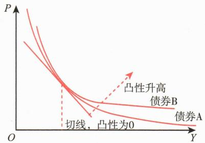
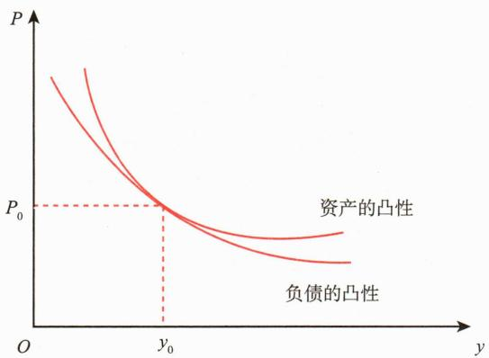

# 第三节 债券价值分析

<table><tr><td>学习内容</td><td>知识点</td></tr><tr><td>债券的估值方法</td><td>零息债券估值法、固定利率债券估值法、统一公债估值法</td></tr><tr><td>债券的收益率</td><td>当期收益率、到期收益率及其与债券价格的关系</td></tr><tr><td>债券的久期和凸性</td><td>久期、修正久期的定义及计算凸性的内涵基于久期和凸性的投资策略</td></tr><tr><td>利率的期限结构与收益率曲线策略</td><td>利率的期限结构、债券收益率曲线基本类型了解收益率曲线策略和变化</td></tr><tr><td>信用利差</td><td>信用利差的概念和特点</td></tr></table>

# 一、债券的估值方法

根据贴现现金流（Discounted Cash Flow，DCF）估值法，任何资产的内在价值等于投资者对持有该资产预期的未来现金流的现值。

# （一）零息债券估值法

零息债券是一种以低于面值的贴现方式发行，不支付利息，到期按债券面值偿还的债券。债券发行价格与面值之间的差额就是投资者的利息收入。由于面值是投资者未来唯一的现金流，所以零息债券的内在价值由以下公式决定：

式中：V——零息债券的内在价值；M——面值；r——年化市场利率；t——债券到期时间，单位是年。

由于多数零息债券期限小于1年，因此上述零息债券内在价值公式应简单调整为：

式中：V——贴现债券的内在价值；M——面值；r——年化市场利率；t——债券到期时间，单位是天。

图 [案例5-2] 某种贴现式国债面额为100元，贴现率为 $3.82\%$ ，到期时间为90天，则：

国债的内在价值=100×（1-90/360×3.82%）=99.045（元）

# （二）固定利率债券估值法

固定利率债券是一种按照票面金额计算利息，票面上通常附有（也可不附有）作为定期支付利息凭证的期票的债券。投资者不仅可以在债券期满时收回本金（面值），而且可以定期获得固定的利息收入。所以，投资者未来的现金流包括两部分——本金和利息。固定利率债券内在价值公式如下：

式中：V——固定利率债券的内在价值；C——每期支付的利息；M——面值；r——市场利率；n——债券到期时间。

图 [案例5-3] 某种附息国债面额为100元，票面利率为 $5.21\%$ ，市场利率为 $4.89\%$ ，期限为3年，每年付息1次，则该国债的内在价值为：

# （三）统一公债估值法

统一公债是一种没有到期日的特殊债券。最典型的是英格兰银行在18世纪发行的英国统一公债，英格兰银行保证对该公债的投资者永久地支付利息。直到如今，在伦敦的证券市场上仍然可以买卖这种公债。历史上美国政府为巴拿马运河融资时也发行过类似公债，但由于附有赎回条款，已退出流通领域。在现代企业中，优先股的股东可以无限期地获得固定股息，因此，也相当于一种统一公债。统一公债的内在价值的计算公式如下：

式中： $r>0,\left|\frac{1}{1+r}\right|<1,\ n\to\infty$ 。

# 二、债券的收益率

# （一）当期收益率

当期收益率（Current Yield），又称“当前收益率”，是债券的年利息收入与当前的债券市场价格的比率。其计算公式为：

式中： $I$ ——当期收益率； $C$ ——年息票利息； $P$ ——债券市场价格。

可见，当期收益率没有考虑债券投资所获得的资本利得或损失，只是债券某一期间所获得的现金收入相较于债券价格的比率。

# （二）到期收益率

到期收益率（Yield to Maturity，YTM），又称“内部收益率”，是可以使投资购买债券获得的未来现金流的现值等于债券当前市价的贴现率。它相当于投资者按照当前市场价格购买并且一直持有至到期可获得的年平均收益率。其中，到期收益率隐含两个重要假设：一是投资者持有至到期；二是利息再投资收益率不变。

到期收益率一般用 $y$ 表示，债券市场价格和到期收益率的关系式为：

式中：P——债券市场价格；C——每期支付的利息；n——时期数；M——债券面值。

[案例5-4] 票面金额为100元的2年期债券，第一年支付利息6元，第二年支付利息6元，当前市场价格为95元，则该债券的到期收益率和当前价格之间的关系可表达为： $95=\frac{6}{1+y}+\frac{106}{(1+y)^{2}}$ ，求解得 $y=8.836\%$ .

由到期收益率公式可以看出，到期收益率的影响因素主要有三个。

# （三）债券当期收益率与到期收益率之间的关系

# 三、债券的久期和凸性

利率变化是影响债券价格的主要因素之一。久期和凸性是衡量债券价格对利率变化敏感性的两个关键指标。

# (一) 久期

债券的到期期限是最后归还本金的期限，没有反映附息债券在存续期内利息偿付的期限。例如，息票率为5%的10年期债券和年利率为5%的10年期零息债券，前者在到期还本之前有多次付息，每次付息实质上就是该债券的一部分到期；后者的所有本息都是到期时才支付，其所有现金流的期限都是10年。因此，债券的到期时间并不能全面反映所有债券的期限特性。

为了全面反映债券现金流的期限特性，美国学者弗雷德里克·麦考利（Frederic Macaulay）于1938年引入久期（Duration）概念，将其定义为从现值的角度计算债券本息所有现金流的加权平均到期时间，即债券投资者收回其全部本金和利息的平均时间。

久期用来衡量债券价格对收益率的敏感性，如下述公式所示：

其中，P——债券的初始价格；y——到期收益率。

将上式调整后可得:

当收益率变化很小时，上式中的D称为麦考利久期，记为 $D_{mac}$ ， $\frac{D}{1+y}$ 一般称为修正久期，记为 $D_{mod}$ 。

知道久期，就能计算出一定的收益率变化百分比导致的价格变化百分比。

下面以半年付息一次，且无内含选择权的固定利率债券为例，介绍久期的计算。该债券的价格计算公式为：

式中：P——债券价格；C——每次付息金额；y——每个付息周期应计收益率（半年付息即为年化收益率的一半）；n——付息周期数（半年付息一次则为债券年数×2）；M——债券面值。

要确定收益率发生微小变动时债券价格变化，可在上式基础上对收益率求一阶导数：

该公式表示了当收益率发生微小变化时，债券价格的变化。两边同时除以债券价格P，可以得到价格变动百分比：

该公式中，方括号部分除以价格P，即为麦考利久期（ $D_{mac}$ ）：

由该公式可见，麦考利久期的计算过程是计算每次支付金额的现值占当前债券价格的比率，以此为权重，乘以每次支付的期限，得到加权期限，再将其加总，即得到债券的久期。麦考利久期能够体现利率弹性的大小，具有相同麦考利久期的债券其利率风险等同，这样麦考利久期就可以进一步用于债券价格利率风险管理。在应用上，麦考利是为了衡量所有现金流的加权期限，它是一个时间概念，用以衡量一只债券多长时间能收回所有现金流。对于零息债券，其久期等于到期期限；对于附息债券，在债券到期之前的每一次付息都会缩短加权平均到期时间，因此付息时间的提前或者付息金额的增加都会使债券的久期缩短。

价格变动百分比公式可改写为:

麦考利久期除以（1+y）即为修正久期（ $D_{mod}$ ）：

将前一公式代入后一公式可以得到:

该公式表示，在给定收益率变化下，债券价格的百分比变化与修正久期变化方向相反。修正久期越大，由给定收益率变化所引起的价格变化越大。修正久期是对麦考利久期的修正，表示债券价格百分比变动对收益率变动的相对值，也就是方便计算“债券价格—收益率”的敏感性。目前，中债登提供的债券估值数据都是估值修正久期。

案例5-5展示了麦考利久期和修正久期的计算过程。在这里，久期的计算是以付息周期为单位。例子中的债券每半年付息一次，即每年两次。将久期转换为以年为单位，需要除以2。如果每季度付息一次，则除以4。

# 图 [案例5-5] 麦考利久期和修正久期的计算

某3年期债券的面值为100元，票面利率为8%，每半年付息一次。现在市场收益率为10%。可以得到，每期付息4元，每期收益率 $y=10\%/2=5\%$ ，共6期，每期半年（见表5-4）。

**表 5-4 某债券各期情况表**

<table><tr><td>期数(t)</td><td>现金流(CF)(元)</td><td>贴现因子 $[1/(1+y)^t]$ </td><td>现金流现值(PVCF)(元)</td><td>t·PVCF(元)</td></tr><tr><td>1</td><td>4</td><td>0.952381</td><td>3.809524</td><td>3.809524</td></tr><tr><td>2</td><td>4</td><td>0.907029</td><td>3.628118</td><td>7.256236</td></tr><tr><td>3</td><td>4</td><td>0.863838</td><td>3.455350</td><td>10.366051</td></tr><tr><td>4</td><td>4</td><td>0.822702</td><td>3.290810</td><td>13.163240</td></tr><tr><td>5</td><td>4</td><td>0.783526</td><td>3.134105</td><td>15.670523</td></tr><tr><td>6</td><td>104</td><td>0.746215</td><td>77.606401</td><td>465.638408</td></tr><tr><td colspan="3">总计</td><td>94.924308</td><td>515.903981</td></tr></table>

在所有其他因素不变的情况下，到期期限越长，债券价格的波动性越大。对于附息债券而言，当其他因素不变时，票面利率越低，麦考利久期和修正久期就越大。其他条件不变时，久期越大，债券价格对利率敏感度越高，波动性越大。

久期可以用于估算收益率小幅度变化时债券价格的变化，当收益率变化幅度较大时，需要考虑凸性的影响。

# 图 [案例5-6] 使用久期估算债券价格变化

息票率6%的3年期债券，每半年付息一次。当前市场价格为97.3357元，到期收益率为7%，麦考利久期为2.79年。假设债券的到期收益率忽然增加至7.1%，债券价格将如何变化？

即利率上升0.1%，债券的价格大约下降0.2621元。

# （二）凸性

对于债券收益的微小变化，久期可以给出利率敏感性测度。但随着收益变化程度的增加，这种方法会产生越来越大的误差。这是因为债券价格随利率的变化关系是非线性的。

大多数债券价格与收益率的关系都可以用一条向下弯曲的曲线来表示，这条曲线的曲率就是债券的凸性。由于存在凸性，债券价格随利率变化而变化的关系就接近于一条凸函数而不是直线函数。为了更精确描述收益率变化引起的债券价格波动，凸性（Convexity）便被引入“债券价格—收益率”的敏感性分析，价格曲线弯曲的程度越大，凸性就越大。

图5-5表示的是债券价格（ $P$ ）与到期收益率（ $y$ ）之间的关系曲线。该曲线是凸向原点的。当债券的持有收益率增加或减少同样的数量，分别表示为 $y^{+}$ 、 $y^{-}$ ，债券价格会呈现不同幅度的变化特征。从图5-5可以看出，当债券收益率从 $y$ 增加到 $y^{+}$ ，债券价格相应地减少到 $P^{-}$ ；相反，当债券收益率从 $y$ 减少到 $y^{-}$ ，债券价格相应地增加到 $P^{+}$ 。在债券价格与收益率反向互动过程中，债券价格的上升幅度大于债券价格下降的幅度。

价格—收益率曲线的曲率就是债券的凸性。凸性意味着债券的价格—收益曲线的斜率随着收益率的变化而变化。如图5-6所示，对于凸性为正的债券（不含期权的债券都有正的凸性），收益率升高时，斜率绝对值是较小的负值，久期估算价格的下降幅度大于实际价格的下降幅度；收益率降低时，斜率绝对值是较大的负值，久期估算价格的上涨幅度小于实际价格的上涨幅度。图5-6中，债券B与债券A在切点位置斜率相同，但由于债券B的凸性更大，随着收益率的变化，债券B的价格将优于债券A。

久期越大的债券，价格对利率越敏感，利率下降带来的价格提升与利率提升带来的价格下降都会更大。凸性大的债券利率下降带来的价格会更大，而利率上升带来的价格会更小。凸性对投资者是有利的，在其他特性相同时，投资者应当选择凸性更高的债券进行投资。

 — 图5-6 债券的凸性

久期反映的是利率变化和价格变化的线性关系，可以看作斜率，而凸性加入了非线性因素，用来描述久期的变化率或者债券价格—收益率曲线的弯曲程度，是斜率的变化量。在数学上表示为债券价格对收益率的二阶导数除以债券的价格。凸性度量了市场利率变化对债券价格函数曲线斜率的影响。

凸性（用 C 表示）计算公式是在对附息债券价格公式求二阶导数，如下：

式中：t——现金流发生的时间； $CF_{t}$ ——第t期的现金流；y——每期的到期收益率；T——距离到期日的期数；P——债券的市场价格。

令： $W=\frac{CF_{t}}{P\times(1+y)^{t}}$

那么凸性计算公式可改写为:

可见凸性公式与久期公式的区别在于它是 $t + t^{2}$ 的加权平均，再除以 $(1 + y)^{2}$ 。零息债券的久期等于它的到期时间，其凸性为：

可以发现，凸性的计算与久期非常相似，该式计算出的是以期数为单位的凸度，为了转化为以年度为单位的凸性，还要把它除以每年付息次数的平方（久期只需要除以付息次数）。

以上的凸性计算公式适用于没有内含选择权的债券。对于普通意义上的债券（也

包括内含选择权的债券），可以用下面的公式来计算近似凸性值：

近似凸性值 $= \frac{P_1 + P_2 - 2P_0}{P_0(\Delta y)^2}$

式中： $P_{1}$ ——当收益率上升X个基点时的价格； $P_{2}$ ——当收益率下降X个基点时的价格； $P_{0}$ ——起始价格； $\Delta y$ ——假定的收益率变化。

一般来说，（1）凸性与债券的期限/久期呈正相关，久期增加时，凸性以加速度增加。若收益率、久期不变，票面利率越大，凸性越大。利率下降时，凸性增加。（2）不含权的债券凸性总是大于零，即利率下降，债券价格将以加速度上升；当利率上升时，债券价格以减速度下降。在几何图形上表现为债券价格曲线总体凸向原点（见图5-6）。（3）含有隐含期权的债券的凸性一般为负，即价格随着利率的下降以减速度上升，或债券的有效持续随利率的下降而缩短，随利率的上升而延长；因为利率下降时赎回的可能性增加。在几何图形上表现为债券价格曲线的某一段凹向原点，而不是总体凸向原点。

# （三）基点价值

基点价值（Price Value of a Basis Point，PVBP）是指收益率变化一个基点，也就是0.01个百分点时，债券价格的变化，是衡量债券价格波动性的传统方法。这种衡量方法又被称为DV01（Dollar Value of 01）。基点价值是价格变动量与利率基点变动量之比，表现为价格变化的绝对值，它是通过计算两个收益率相差 $0.01\%$ 的价格价差而得到，数学表达式如下：

基点价值是久期的一个特例，其特殊性在于收益率变化值为1个基点，而不是100个基点（1%）。期限越长也就是久期越长的债券，收益率变化一个基点时，价格变化也越大（见表5-5）。

**表 5-5 / 一个基点价值 / 单位：元**

<table><tr><td>债券期限(票面利率)</td><td>初始价格(2%收益率)</td><td>2.01%时的价格</td><td>基点价值</td></tr><tr><td>0.8年,1.49%</td><td>99.8308</td><td>99.8229</td><td>0.0079</td></tr><tr><td>2.34年,2.01%</td><td>101.1476</td><td>101.1240</td><td>0.0236</td></tr><tr><td>3.75年,2.5%</td><td>102.4082</td><td>102.3720</td><td>0.0362</td></tr><tr><td>18.72年,3.03%</td><td>116.7933</td><td>116.6240</td><td>0.1693</td></tr></table>

# （四）用久期和凸性计算债券价格变化

前文论述了债券久期和凸性的定义，在数学上价格—收益率函数的二阶泰勒展开

式给出了利率微小变动后债券价格的近似估计：

该式两边同时减去 $P$ 给出了价格变化量的近似估计：

该式两边同时除以 $P$ 给出了价格变化率的近似估计：

使用久期和凸性的定义，上式可以写成：

债券价格变动的百分比可以近似表达为收益率变动的多项式函数，其中， $-D_{mod}$ 是一次项的系数，描述的是债券价格函数的久期；C/2是二次项的系数，描述的是债券价格函数的凸性。

# （五）基于久期和凸性的投资策略

久期和凸性作为衡量债券价格对利率变化敏感性的两个重要指标，为投资者制定债券投资策略提供了关键工具。不同的策略可以利用久期和凸性的特性来应对利率变化带来的风险。其中，久期调整策略是主动管理的代表，而免疫策略则强调通过久期和凸性的匹配来锁定未来的现金流和价值。

# 1. 久期调整策略

久期调整策略是一种积极的投资方法，投资者通过调整组合的久期来追求超额收益。具体而言，投资者根据对市场利率走势的判断，灵活调整组合的久期。当预期利率上升时，投资者通常会缩短组合的久期，降低债券价格下跌带来的损失；而当预期利率下降时，投资者则会延长组合的久期，以期望获得更大的价格上涨带来的收益。

这种策略依赖于投资者对利率走势的准确预测，因此对市场研判能力要求较高，并且需要频繁调整投资组合以应对市场变化。久期调整策略的核心在于主动管理利率风险，通过精确的久期调整在不同的市场环境下获取收益。

# 2. 免疫策略

与久期调整策略的主动性不同，免疫策略是一种被动管理方法，旨在通过久期和凸性的匹配来锁定组合的未来现金流和价值，从而减少利率变动带来的负面影响。免疫策略的目标是确保债券组合能够在利率变化的情况下，仍然满足预期的负债需求。这类策略称为免疫策略（Immunization Strategies）。常用的免疫策略主要包括：所得免疫（Income Immunization）、价格免疫（Price Immunization）、或有免疫（Contingent Immunization）。以下重点介绍前两种免疫策略。

# (1) 所得免疫策略

所得免疫策略保证投资者有充足的资金可以满足预期现金支付的需要。这对于养老基金、社保基金、保险基金等机构投资者具有重要意义，因为这类投资者对资产的流动性要求很高，其投资成败的关键在于投资组合中是否有足够的流动资产可以满足目前的支付。

为此，有效的投资策略可以使投资的债券投资组合，获得的利息和收回的本金恰好满足未来现金需求。一种可选择的方法为现金流配比策略（Cash Matching Strategy）。现金流配比策略侧重于解决债券投资组合管理中的流动性问题，可按负债偿还期限从长到短的顺序，挑选一系列的债券，使债券投资组合产生的现金流与各个时期负债现金流的需求（时间和额度）正好相等，是一种完全免疫策略。最简单的方法就是购买零息债券为预期的现金支出提供相应的资金，但在实践中，零息债券的组合收益往往要低于附息债券的组合收益。现金流配比策略没有任何免疫期限的现值，也不承担任何市场利率风险，但该策略限制性强，弹性很小，但这就可能会排斥许多缺乏良好现金流量特性的债券。

图 [案例5-7] 假设王经理是某保险公司的资金管理部负责人，他所负责的一个项目建设期为3年，他预计该项目未来3年内，每年年末都有2000万元的现金流支出需要。债券市场有三种现金流模式如表5-6所示。

**表 5-6 / 现金流支出情况及现金流模式 / 单位：万元**

<table><tr><td colspan="2"></td><td>第一年</td><td>第二年</td><td>第三年</td></tr><tr><td colspan="2">现金流支出</td><td>2000</td><td>2000</td><td>2000</td></tr><tr><td rowspan="3">现金流流入</td><td>3年期附息债券A</td><td>50</td><td>50</td><td>500</td></tr><tr><td>3年期附息债券B</td><td>100</td><td>300</td><td></td></tr><tr><td>1年期零息债券</td><td>200</td><td></td><td></td></tr></table>

根据条件，第三年年底需要2000万元，而只有3年期附息债券A才在第三年年底有现金流500万元，因此应买入4张3年期附息债券A匹配第三年的现金流；第二年年底需要2000万元，除去3年期附息债券A的利息200万元（4张），还需要买入6张3年期附息债券B；第一年年底需要现金流2000万元，除去之前买入的两种债券的现金流800万元，还需要买入6张1年期零息债券。

另一种可选择的策略是久期配比策略（Duration Matching Strategy）。这种策略要求满足债券投资组合的麦考利久期和负债的久期相同，但债券到期期限可以与负债的期限不同，因而有更多的债券可供选择。相比现金流匹配法，也更节约成本。久期配比策略根据负债特点，可以分为单期负债免疫策略和多期负债免疫策略。

单期负债免疫策略就是使债券投资组合在指定的单一投资期限内，获得确定的、不受利率变化影响的收益。要实现免疫策略要求抵消利率风险和再投资风险的目标，债券投资组合的现金流初始现值需要不低于未来单笔负债的现值，所构建的债券投资组合麦考利久期需要等于单期负债的期限。在债券投资组合包括含权债时，应该使用有效久期作为适合的久期度量标准。此外，考虑利率风险结构和收益率曲线结构性变动，单期负债免疫策略并非凸性越大越好。换言之，在收益率满足平行移动时，单期负债免疫策略应选择凸性最大的债券投资组合。

多期负债免疫策略与单期负债免疫策略同样要求债券投资组合的现值不低于多期负债的现值。债券投资组合的凸性要略大于负债的凸性，考虑利率风险结构和收益率曲线结构性变动，并非越大越好。在久期管理方面，除要求债券投资组合的麦考利久期与多期负债组合的久期相等，更稳健的做法是使得债券投资组合基点价值变化与多期负债组合的基点价值变化相近，这样可以满足债券投资组合的价值与多期负债组合的价值相等或接近。此外，多期负债免疫策略还需要满足单项资产的久期分布比负债的久期分布更广。在满足上述条件的情况下，用数学规划的方法求得规避风险最小化的债券投资组合。

久期配比策略也存在一定不足，如只能在利率曲线平行移动情况下实现免疫策略目标。由于市场收益率在投资期内不断变动，债券投资组合的久期就会随市场收益率的变化而变化。即使收益率不变，随着时间的推移，久期也会变化。要使债券投资组合的久期在投资期内始终等于负债的久期，就应不断进行再平衡以调整资产组合满足免疫要求。在再平衡过程中，债券投资组合受到交易成本和实现免疫目标的双重制约，需要在二者之间寻找一个平衡点。有时为了满足负债的需要，债券管理者可能不得不在价格极低时抛出债券。为此，有必要将两种配比策略的优点结合起来，即水平配比策略（Horizon Matching Strategy）。按照这一策略要求，投资者可以设计出一种债券投资组合，在短期内运用现金配比策略，在较长的时期内运用久期配比策略。这样，既具有了现金配比策略中的流动性强的优点，又具有了久期配比策略中的弹性较大的优点。

# (2) 价格免疫

价格免疫由那些保证特定数量资产的市场价值高于特定数量负债的市场价值的策略组成。价格免疫使用凸性作为衡量标准，实现资产凸性与负债凸性相匹配。资产与负债久期相等成为资产组合针对利率风险免疫的一阶条件。由于凸性的存在，仅仅一阶条件还不足以确保实现组合的免疫要求。如果负债的凸性大于资产的凸性时，组合的价值为负，这不足以保证组合的免疫要求。所以，在久期相等的前提下，资产的凸性应该等于或大于负债的凸性，才能控制这一风险。也被称为资产组合针对利率免疫的二阶条件。这也是英国保险精算师F.M.Redington1952年在一篇提交保险精算师协会的论文中首次使用“免疫”时的核心思想。因此，购买并持有凸性大的债券，成为投资者实现价格免疫的必然要求。

图5-7展示了债券投资组合的价格免疫策略。例如，一家保险投资基金有足够的资金支持，可以使债券投资组合（资产）的市场价值等于未来的支出（负债）的现值。只要资产凸性高于债券的凸性，两者间差额的市场价值就将随着利率的变化而增加。而且凸性越大，从利率变化所获得的利得也就越大。因此，在这种情况下，就可以判断这家保险投资基金“价格免疫”了。

 — 图5-7 债券投资组合的价格免疫策略

# 四、利率期限结构与债券收益率曲线

债券的收益率与固定收益证券市场的总体情况紧密相关，但不同债券的收益率并不相同。虽然不同的信用等级可以部分解释债券收益率的差异，但并不能完全解释所有变化。另一个重要因素是债券的到期期限。由于到期期限不同，投资者对未来收益率变化的预期、流动性风险、期限风险以及市场上不同期限债券的供给和需求等因素都会影响债券的收益率。

利率期限结构（Term Structure of Interest Rate），描述了在某一时点，不同期限债券的收益率和到期期限之间的关系。将这种关系绘制在以期限为横坐标、收益率为纵坐标的坐标系上，就得到收益率曲线。中央国债登记结算有限责任公司、中证指数有限公司、上海清算所等机构会定期发布我国各类债券的收益率曲线。

收益率曲线有四种基本类型（见图5-8）。

（4）拱形收益率曲线，其期限结构特征是：期限相对较短的债券，利率与期限呈正向关系；而期限相对较长的债券，利率与期限呈反向关系。

除这四种基本类型外，收益率曲线还可能出现 “M” 形等更加复杂的形态。在不同的市场阶段可以观察到不同的收益率曲线形态。通常情况下，投资者对期限较长的债券会要求较高的风险溢价，因此长期债券的收益率高于同类短期债券的收益率。上升收益率曲线是最常见的形态。

图5-9显示了2003—2007年，美国国债收益率曲线的形态变化的四个阶段。

# 延伸阅读

# 基于收益率曲线形态和变化的策略

# 1. 骑乘策略

骑乘策略是一种利用收益率曲线形态特征获取超额收益的交易方法。其核心原理是利用债券随着剩余期限缩短而带来的收益率下降和价格上升效应。在正常的市场环境下，收益率曲线往往呈现上斜形态，即长期利率高于短期利率。当投资者购买较长期限的债券并持有一段时间后，随着该债券的剩余期限缩短，其收益率会向较低的短期收益率靠拢，从而带来价格上涨。

从收益构成来看，骑乘策略不仅包含债券正常持有期间的票息收益，还包括由期限缩短带来的骑乘收益，以及收益率曲线整体变动可能带来的资本利得或损失，如图5-10所示。举例而言，假设3年期国债收益率为3.5%，2年期国债收益率为2.3%，收益率曲线呈现较为陡峭的形态。投资者如果购买3年期国债并持有1年，在收益率曲线形态保持稳定的情况下，该债券到期后变为2年期债券，其收益率将从 $3.5\%$ 下降至 $2.3\%$ ，下降幅度达到120个基点，这种收益率的下降将带来债券价格上涨。

骑乘策略的有效性主要取决于收益率曲线的形态和稳定性。该策略在陡峭的收益率曲线环境下效果最佳，且要求曲线形态在持有期间保持相对稳定。投资者需要根据收益率曲线形态选择最优的持有期限，在实施过程中还需要特别关注利率风险、曲线形态变化风险和流动性风险。收益率曲线整体上行可能带来较大损失，且债券期限越长，承担的风险也越大。

# 2. 收益率曲线策略

收益率曲线策略基于对债券市场收益率曲线变化的预期进行投资。收益率曲线会随着宏观经济、政策环境、资金状况、机构行为和技术因素等的变化而发生变动，主要表现为三种形态变化：平行移动、斜率转动和曲率变化。投资者通过预判这些变化来调整投资组合的久期结构，以获取超额收益。

在讨论收益率曲线策略前，需理解几个市场形态的基本概念：“牛市”指利率整体下行、债券价格上涨的市场；“熊市”指利率整体上行、债券价格下跌的市场。“陡峭”表示长短期利差扩大，即长期利率相对于短期利率上升更多或下降更少；“平坦”则是长短期利差收窄，即长期利率相对于短期利率上升更少或下降更多。基于此，形成四种常见市场形态（见图5-11）。

牛陡：利率整体下行，长端利率下降幅度小于短端。

牛平：利率整体下行，长端利率下降幅度大于短端。

熊陡：利率整体上行，长端利率上升幅度大于短端。

熊平：利率整体上行，长端利率上升幅度小于短端。

在不同收益率曲线形态变化下，获得资本利得的收益率曲线策略也不同。如果是预计未来曲线是会变陡，就做多短债，同时做空长债（在价格高位时在市场借入债券立即抛售，等到价格下跌后再把债券买回还给债券出借方，高抛低吸赚取差价）。如果是熊陡，则做空长债的收益大于做多短债的亏损，净收益为正。如果是牛陡，则做多短债的收益大于做空长债的亏损，净收益依然为正。如果预计未来曲线会变平，就做空短债，同时做多长债。如果是熊平，则做空短债的收益大于做多长债的亏损，净收益为正。如果是牛平，则做多长债的收益大于做空短债的亏损，净收益依然为正。

常用的收益率曲线策略包括子弹型策略（Bullet Strategy）、哑铃型策略（Barbell Strategy）和阶梯型策略（Ladder Strategy）三种。子弹型策略是使投资组合中的债券到期期限集中于收益率曲线的一点；哑铃型策略则将组合中债券到期期限集中于两端；阶梯型策略，即平均持有短端到长端的各个期限标的。阶梯策略可以看作子弹型策略和哑铃型策略的平衡，与二者相比，阶梯型策略的风险和收益均不突出，相对更为稳健。

对收益率曲线可能变化的情景进行分析，有助于确定最优的投资策略。子弹型策略与哑铃型策略的相对表现，主要取决于收益率曲线的变化趋势。当预期收益率曲线趋于平坦（即长短期利差收窄）时，哑铃型策略通常表现更佳。这是因为在曲线平坦化过程中，长期债券的收益率下行幅度通常大于短期债券，持有长期债券能够带来较大的资本利得。而短期债券的利率变化对组合的影响相对较小，整体组合收益更为稳健。相反，当预期收益率曲线变得更加陡峭（即长短期利差扩大）时，子弹型策略则更具优势。集中投资于中等期限的债券，可以在曲线陡峭化过程中规避长期债券收益率大幅上升带来的资本损失，同时利用中期债券的相对稳定性获取收益。

# 五、信用利差

# （一）信用利差概述

信用利差（Credit Spread），是指除了信用评级不同外，其余条件全部相同（包括但不限于期限、嵌入条款等）的两种债券收益率的差额。一般而言，投资者会要求更高的收益来补偿较高的违约风险，即违约风险越高，投资收益率也应该越高。

为度量违约风险与投资收益率之间的关系，将某一风险债券的预期到期收益率与某一具有相同期限和票面利率的无风险债券的到期收益率之间的差额，称为风险溢价。

图5-12是美国债券市场上不同评级等级的公司债券的收益率和政府债券的收益率价差变化，AAA级债券风险补偿相对较低，而高收益债券的风险溢价水平要求最高。

图 [案例5-8] 2011年下半年，我国债券市场上出现了多起城投债价格剧烈波动的情况，主要原因是市场对信用风险进行了重新评估，以及受流动性冲击的影响。例如，2011年7月，“08云投债”（债券代码122994）价格出现剧烈波动，源于云南省投资控股集团公司（云投集团）当年7月25日发布公告称决定组建“云能投”，拟组建方案涉及公司部分资产划转，市场担忧此举可能引发信用违约事件，导致债券价格下降，到期收益率上升，出现风险溢价。同年9月14日，云投集团出公告表示资产重组计划暂缓实施，风险溢价消失，该债券价格回升（见图5-13）。

# （二）信用利差的特点

第一，对于给定的非政府部门的债券、给定的信用评级，信用利差随着期限增加而扩大。

第二，信用利差随着经济周期（商业周期）的扩张而缩小，随着经济周期（商业周期）的收缩而扩张。当经济处于收缩或下滑期时，公司的盈利能力下降，现金流恶化，这会影响债务人履行债务合同的能力。投资者面对收缩的经济环境，会增加在现金流更安全的政府部门债券的配置，从而抛售偿付风险更高的非政府部门债券，引起低风险的政府部门债券价格上涨、到期收益率下降，非政府部门债券价格下降、到期收益率上升，最终造成信用利差扩大。这就是所谓的安全投资转移（Flight to Quality）现象，即在系统性危机发生时，投资者倾向于将资产向安全资产转移。当经济处于扩张或活跃期时，公司的盈利能力增强，现金流得到改善，债务人的偿付能力增强。此时，投资者会增加在风险资产上的配置，从而购买收益率更高的非政府部门债券，抛售收益率较低的政府部门债券，引起非政府部门债券价格升高、到期收益率降低，政府部门债券价格降低、到期收益率上升，最终导致信用利差减少。

第三，信用利差的变化本质上是市场风险偏好的变化，受经济预期影响。从实际数据看，信用利差的变化一般发生在经济周期发生转换前，因此，信用利差可以作为预测经济周期活动的参考指标。
