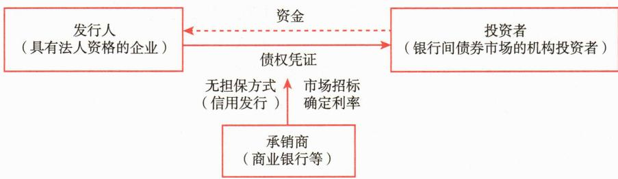
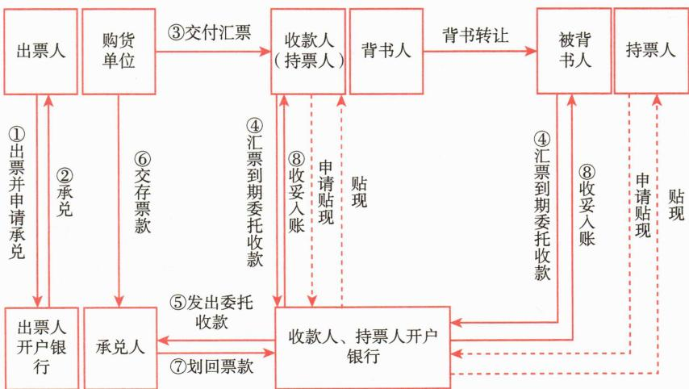

# 第四节 货币市场工具

<table><tr><td>学习内容</td><td>知识点</td></tr><tr><td>货币市场工具的特点</td><td>货币市场工具的定义及特点</td></tr><tr><td rowspan="2">常用的货币市场工具</td><td>同业拆借、银行协议存款、短期回购协议、中央银行票据、短期政府债券、短期融资券的定义及特点</td></tr><tr><td>中国证监会、中国人民银行认可的其他货币市场工具的定义及特点</td></tr></table>

# 一、货币市场工具的特点

货币市场工具（Money Market Instruments）通常指具备高流动性、低风险特征的短期金融工具，其期限一般在一年以内 $^{①}$ ，具体包括回购协议、定期存款、商业票据、银行承兑汇票、短期国债、中央银行票据等。

货币市场工具产生于信用活动，交易价格为利率，是固定收益证券的一部分。因其具有良好的流动性和对经济环境的敏感性，在金融市场中发挥着十分重要的功能：一方面，货币市场工具为商业银行管理流动性以及企业融通短期资金提供了有效的手段；另一方面，因货币市场工具交易而形成的短期利率在整个市场的利率体系中充当了基准利率，为市场上其余证券利率的确定提供了重要的参考依据，是判断市场上银根松紧程度的重要指标。

货币市场工具有以下特点：①均是债务契约；②期限在1年以内（含1年）；③流动性高；④大宗交易，主要由机构投资者参与，个人投资者很少有机会参与买卖；⑤本金安全性高，风险较低。

# 二、常用的货币市场工具

在发达国家，货币市场工具主要有银行间短期资金（同业拆借）、短期政府债券、短期金融债券、中央银行票据、商业票据、商业汇票、大额可转让存单、银行贷款等。

在我国，货币市场工具主要包括现金，期限在1年以内（含）的同业拆借、银行定期存款、大额存单、债券回购、中央银行票据、同业存单，剩余期限在397天以内（含）的债券、非金融企业债务融资工具、资产支持证券，以及中国证监会、中国人民银行认可的其他具有良好流动性的其他货币市场工具。

# （一）同业拆借

同业拆借，也叫做同业拆放，是指具有法人资格的金融机构及经法人授权的非金融机构、金融分支机构之间以货币借贷方式进行的无担保短期资金融通活动。一些国家特指吸收公众存款的金融机构之间的短期资金融通，目的在于调剂头寸和临时性资金余缺。同业拆借具有期限短、参与者广泛、信用拆借等特点，交易标的物主要是金融机构存放中央银行账户的超额准备金。

同业拆借市场属于银行间市场，交易主体为商业银行、保险公司、证券公司、基金公司等金融机构。交易过程涉及资金的拆入方（借方）和拆出方（货方）。

我国同业拆借市场于1996年成立，经中国人民银行批准进入全国银行间同业拆借市场的金融机构之间，通过全国统一的同业拆借网络进行的无担保资金融通行为。同业拆借利率指金融机构同业之间的短期资金借贷利率。银行间同业拆借利率即上海银行间同业拆放利率（Shanghai Interbank Offered Rate，简称Shibor），该利率采用报价制度，由信用等级较高的18家银行自主报出的人民币同业拆出利率，对报价进行加权平均处理后，公布各个期限的平均拆借利率即为Shibor利率，是单利、无担保、批发性利率。全国银行间同业拆借中心授权Shibor的报价计算和信息发布。每个交易日根据各报价行的报价，剔除最高、最低各4家报价，对其余报价进行算术平均计算后，得出每一期限品种的Shibor，并于11：00对外发布。对社会发布的Shibor利率包括隔夜、1周、2周、1个月、3个月、6个月、9个月及1年等8个品种。Shibor已经成长为我国认可度较高、应用较广泛的货币市场基准利率之一。

# （二）银行协议存款

协议存款指银行与存款人双方在存款时事先约定期限、利率，到期后支取本息的存款，是银行资金的重要来源。

协议存款可以提前支取本金或部分本金；双方可在协议中约定在提前支取的情况下利息的计算方式。由于利息是非标准化产品，利率一般由投资者和存款行谈判确定，一般情况下，期限越长，利率越高。对投资者来说，定期存款具有期限确定、金额选择余地大、利息收益较稳定等特点。

# （三）短期回购协议

# 1. 回购协议的概念

回购协议是指资金需求方在出售或质押证券的同时与证券的受让方约定在一定期限后按约定价格购回/解除质押的交易行为。其中，证券的出让方为资金借入方，即正回购方；证券的受让方为资金贷出方，即逆回购方。本质上，回购协议是一种证券抵押贷款，抵押品以国债、政策性银行债、企业债、中票、短融、同业存单等为主。

# 2. 回购协议的主要功能

（1）中国人民银行以此为工具进行公开市场操作，方便中央银行投放（收回）基

础货币，形成合理的短期利率；

# 3. 回购协议市场

我国金融市场上的回购协议以债券回购协议为主，分交易所市场和银行间市场。交易所债券质押式回购是在交易所连续竞价成交，和股票交易类似，属于场内回购。交易所的债券质押式协议回购和债券质押式三方回购属于场外交易，通过大宗交易和上交所固定收益平台成交，大宗交易模式类似于现券交易，上交所固定收益平台的回购交易有自己独立的交易模式。银行间市场的回购交易在外汇交易中心执行，交易方式为询价成交，与债券的现券交易类似。货币市场基金在银行间回购市场兼有资金需求方和资金供给方的角色。

货币市场基金使用回购协议作为其资金的来源有两方面原因：其一，基金的资产中存在大量的政府债券，可以作为回购协议的抵押品。其二，回购协议市场交易量大，可以方便地获得资金。同时，基金会将部分资金配置在短期回购协议，以保持基金有适当的流动性和收益。

# 4. 回购协议的主要类型

按回购期限划分，我国在交易所挂牌的债券回购可以分为1天（隔夜回购）、2天、3天、4天、7天、14天、28天、91天以及182天。债券回购作为一种短期融资工具，在各国市场中最长期限均不超过1年。

按逆回购方是否有权处置回购协议的标的债券划分，债券回购可以分为质押式回购（封闭式回购）和买断式回购（开放式回购）。在交易期间，对于质押式回购，质押的债券的所有权仍属于债券的出让方（正回购方），受让方（逆回购方）无权处置，债券被证券交易中心冻结；对于买断式回购，出售的债券的所有权转移给债券的受让方（逆回购方），受让方有权处置该债券，只需在到期日按约定价格回售先前的债券。

# 5. 影响回购协议利率的因素

# 6. 回购协议的定价

# 7. 回购协议的风险

尽管回购协议包含抵押品，但交易过程中仍然存在对手方信用风险，尤其是市场流动性紧张导致短期利率迅速飙升的情形。

(1) 回购协议中的信用风险存在以下两类:

# （四）中央银行票据

# 1. 中央银行票据的概念

中央银行票据是中国人民银行为调节基础货币向金融机构发行的票据，俗称“央行票据”或“央票”，实质上是中央银行债券。央行通过发行央票可以回笼基础货币，央票到期则体现为投放基础货币。我国央行票据前身为1993年中国人民银行发行的两期共计200亿元人民币的中央银行融资券，该融资券主要为解决当时中央银行缺少可用于公开市场操作的债券的困难。2002年9月，中国人民银行将2002年6月25日至9月24日进行的公开市场业务操作的未到期正回购品种转换为相同期限的中央银行票据，总发行量近2000亿元。央票正式作为我国常用的货币政策工具始于2003年4月，最初的目的是增加公开市场业务操作工具。历史上发行的央票期限最短的为3个月，最长的为3年。2013年后，随着我国对冲外汇占款的需求下降，央票渐渐退出历史舞台。2013年11月央行最后一次发行三年期央行票据。2016年11月，此前发行的央票全部到期。2018年11月，央行首次在香港发行中央银行票据，通过发行央票回笼离岸市场流动性，减少离岸市场的人民币供给，有助于稳定人民币汇率。

# 2. 中央银行票据产生的原因

中央银行票据产生的原因主要有两方面：其一，自2001年加入世界贸易组织后，我国经常项目与资本项目的“双顺差”呈现加速增长的势态，外汇储备爆发式增长。基于我国汇率制度和企业结售汇制度，中央银行不得不在外汇市场上购买外汇，被动投放基础货币。为了控制货币供给，中央银行通过发行中央银行票据冲销购汇带来的货币供给的扩张，一定程度上缓解了国内流动性过剩的压力。其二，我国的国债期限结构以中期为主，3\~5年的国债占比超过80%，1年期的短期国债占比不到10%。因此，中国人民银行无法通过国债市场实现短期的、大规模的公开市场业务操作。而央票弥补了我国国债期限不合理的缺点，为公开市场操作提供了有效的市场工具。

# 3. 中央银行票据的特征

中央银行票据市场的参与主体只有中央人民银行及经过特许的商业银行和金融机构。中国人民银行通过与商业银行进行票据的交易改变商业银行超额准备金的数量（商业银行一般会配合中国人民银行的行为），从而影响整个市场的货币供给水平。

# 4. 中央银行票据的分类

中央银行票据分为普通央行票据、专项央行票据和离岸央行票据。普通央行票据即中国人民银行在公开市场操作中使用的票据。专项央行票据主要用于置换商业银行和金融机构的不良资产，发行本身并不会改变市场上基础货币的供给水平。离岸央行票据是中国人民银行在离岸市场（香港）发行的人民币计价的票据。2013年11月最后一期36个月央票发行后央行暂停央票发行，目前内地市场中已经不存在未到期央票。离岸市场上央行还在香港发行央票。自2018年11月起，中国人民银行在香港常态化发行人民币央行票据，为香港离岸人民币市场提供高信用等级资产，截至2023年底，累计发行央票7250亿元。

# （五）短期政府债券

# 1. 短期政府债券的概念

短期政府债券，是由一国的政府部门发行并承担到期偿付本息责任的，期限在1年及1年以内的债务凭证。广义的短期政府证券不仅包括财政部发行的债券，还包括地方政府及政府代理机构所发行的证券。狭义的短期政府债券仅指由财政部发行的政府债券。本章的短期政府债券指狭义的短期政府债券。

短期政府债券以贴现的形式发行，为无息票债券，投资者获得的投资收益是证券的购买价和证券票面价值的差额。短期政府债券投资收益根据拍卖竞价决定，因此不存在发行过多或发行不足的问题。

# 2. 短期政府债券的特点

(1) 违约风险小, 由国家信用和财政收入作保证, 在经济衰退阶段尤其受投资者

喜爱；

# (六) 短期融资券

# 1. 短期融资券的概念

2005年5月23日，中国人民银行颁布了《短期融资券管理办法》《短期融资券承销规程》和《短期融资券信息披露规程》，允许符合相应条件的企业按相关规定向机构投资者发行短期融资券。短期融资券（CP）是企业依照中国人民银行《银行间债券市场非金融企业债务融资工具管理办法》及中国银行间市场交易商协会相关自律规则和指引、由具有法人资格的非金融企业在银行间债券市场发行的、约定在1年内还本付息的债务融资工具，募集资金主要为补充企业流动资金所用。中国建设银行提供短期融资券承销服务。短期融资券为1年及以内（通常为6个、9个、12个月）。

# 2. 短期融资券的发行

短期融资券由承销商（商业银行或证券公司）承销并采用无担保的方式发行（信用发行），通过市场招标确定发行利率（见图5-14）。发行者必须为具有法人资格的企业，投资者则为银行间债券市场的机构投资者。企业发行短期融资券的主要目的是获得短期流动性。短期融资券由于对资金用途并无明确限制，深受企业喜爱。

 — 图5-14 短期融资券的发行

# 3. 短期融资券在我国的发展状况

2010年12月21日，中国银行间市场交易商协会发布《银行间债券市场非金融企业超短期融资券业务规程（试行）》，并正式在银行间债券市场推出超短融业务，进一步丰富了短期融资券的期限结构。超短期融资券（SCP）是指具有法人资格、信用评级较高的非金融企业在银行间债券市场发行的，期限在270天以内的短期融资券。2011年，我国短期融资券的发行总量首次超过了企业债和公司债的发行规模之和；2023年，短期融资券发行总量48390.16亿元，其中一般短期融资券5290.71亿元，超短期融资券43099.45亿元。规模上仅次于国债、地方政府债、政策性金融债，在发行主体为非金融企业的债券品种中发行量遥遥领先。

# （七）中国证监会、中国人民银行认可的其他具有良好流动性的货币市场工具

随着我国金融市场的不断发展，除了上述主流的货币市场工具外，货币市场基金可以投资的货币市场工具也不断扩展。现对其他货币市场工具简要介绍如下。

# 1. 银行承兑汇票

银行承兑汇票是由在承兑银行开立存款账户的存款人出票，向开户银行申请并经银行审查同意承兑的，保证在指定日期无条件支付确定的金额给收款人或持票人的票据，是商业票据的一种（见图5-15）。对出票人签发的商业汇票进行承兑是银行基于对出票人资信的认可而给予的信用支持。银行承兑汇票的主要功能是方便商业交易活动，减少了因售货方对购货方信用不了解而产生的不信任，在对外贸易中运用较多。

银行承兑汇票的业务主要体现在银行承兑汇票的承兑和贴现业务上，在我国全部票据业务中占比超过90%。承兑业务由银行提供，其本质是由银行将其信用出借给企业，因此企业必须缴纳一定的手续费。贴现业务是持票人或收款人有资金需求时，将未到期的银行承兑汇票向银行申请贴现，银行扣除贴现息后将余额支付给持票人或收款人。贴现银行可在到期日时凭该票据向承兑行收取票款。本质上，贴现业务就是向企业提供短期贷款。一般票据的贴现期不超过6个月，贴现期从贴现日起计算至票据到期日。

银行承兑汇票可以进行转贴现和再贴现。银行A在持有贴现获得的银行承兑汇票的期间，因短期资金需要将该汇票向银行B（不包括中央银行及其分支机构）贴现的行为便是转贴现。若银行B是中央银行或其分支机构，则称为再贴现。转贴现大致存在两类。若转贴现后该汇票的所有权归银行B，银行A不再买回，则称其为买（卖）断式转贴现。若银行A转贴现后与银行B约定在某一到期日重新买回该汇票，则称其为回购式转贴现。转（再）贴现也需要向贴现行支付贴现息，计算过程与贴现过程一致。

 — 图5-15 银行承兑汇票的业务流程

# 2. 商业票据

商业票据是指发行主体为满足流动资金的需求所发行的期限通常为2天至180天的、可流通转让的债务工具，其本质是商业信用流通和信用传递的工具。广义的商业票据指在金融市场上流通的商业汇票、商业本票和商业支票，狭义的商业票据仅指商业本票。原先，商业票据依附于真实的商品赊销关系，商品的赊销方可以凭借赊购方出具的商业本票在到期日时取得货款或提前至票据市场上贴现转让。如今，商业票据已成为一种方便公司获取短期信贷的债务工具。

商业票据具有面额较大、期限较短、融资方式灵活和融资利率相对较低等特点。商业票据的一级发行包括直接发行和间接发行两种。直接发行指发行主体直接将票据出售给投资人，大多数资信好的公司采用这种发行方式。间接发行指发行主体通过票据承销商将票据间接出售给投资者。和短期政府债券一样，商业票据也采用贴现发行的方式。货币市场利率越高，贴现率越高；发行主体资信越好，贴现率越低。二级市场方面，2016年12月8日，经国务院同意设立，由中国人民银行牵头筹建的上海票据交易所成立，成为全国性报价交易、登记托管、清算结算、信息查询等综合服务的票据流通市场。随着上海票据交易所成立、电子化程度不断提高以及监管的加强，商业票据市场也进入更加规范稳健发展的阶段。

# 3. 同业存单

同业存单是指由银行业存款类金融机构法人在全国银行间市场上发行的记账式定期存款凭证，是一种货币市场工具。同业存单是同业存款的替代品，于2013年推出，是利率市场化的一次重要尝试。同业存单的投资和交易主体为全国银行间同业拆借市场成员、基金管理公司、基金类产品、境外金融机构及人民银行认可的其他机构，个人投资者无法直接投资。存款类金融机构发行同业存单，应当于每年首只同业存单发行前，向中国人民银行备案年度发行计划。同业存单发行利率、发行价格等以市场化方式确定。

为规范同业存单业务，拓展银行业存款类金融机构的融资渠道，促进货币市场发展，中国人民银行在2013年12月制定并实施《同业存单管理暂行办法》（中国人民银行公告〔2013〕第20号公布），第八条规定“固定利率存单期限原则上不超过1年，为1个月、3个月、6个月、9个月和1年，参考同期限上海银行间同业拆借利率（SHIBOR）定价。浮动利率存单以上海银行间同业拆借利率（SHIBOR）为浮动利率基准计息，期限原则上在1年以上，包括1年、2年和3年”。同时，存款类金融机构在当年发行备案额度内，自行确定每期同业存单的发行金额、期限，但单期发行金额不得低于5 000万元人民币。例如，2014年8月15日，平安银行发行两期（第010期、第011期）同业存单，期限分别为6个月、3个月，发行规模分别为15亿元、5亿元，发行价格分别为97.6855元、98.8538元，对应参考收益率分别为4.7000%、4.6002%。且平安银行表示，在年度700亿元同业存单业务发行额度内，将根据经营需求及市场状况，自行确定具体发行基数及每期发行时间、金额、价格和发行方式。2017年8月

30日，中国人民银行公告（〔2017〕第12号）对第八条进行修订，将原条款内容修改为“同业存单期限不超过1年，为1个月、3个月、6个月、9个月和1年，可按固定利率或浮动利率计息，并参考同期限上海银行间同业拆借利率定价”，公告于2017年9月1日起施行。自公告实施之日起，金融机构不得新发行期限超过1年（不含）的同业存单，此前已发行的1年期（不含）以上同业存单可继续存续至到期。

# 本章参考文献
