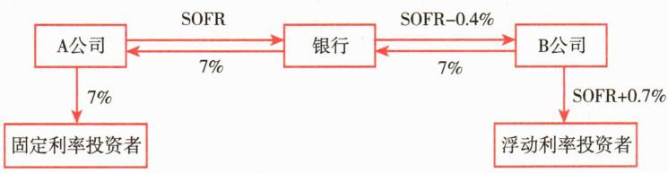
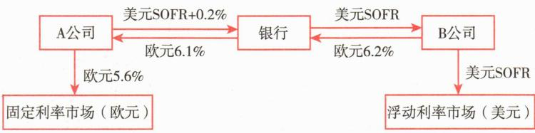
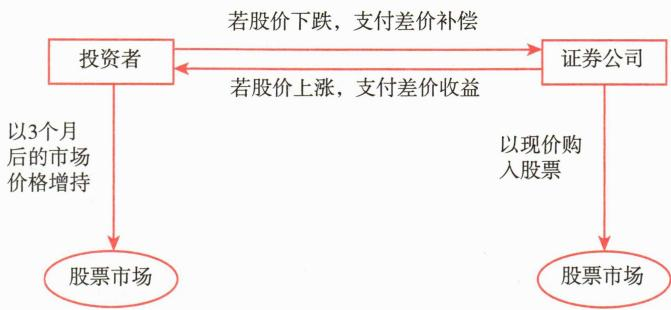
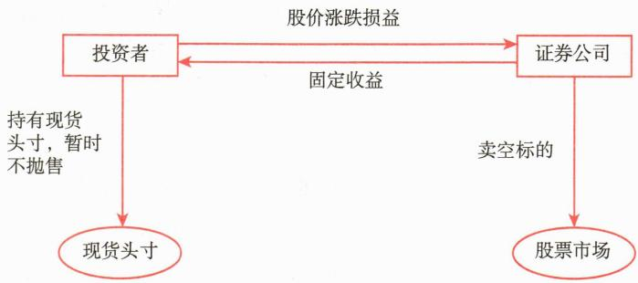
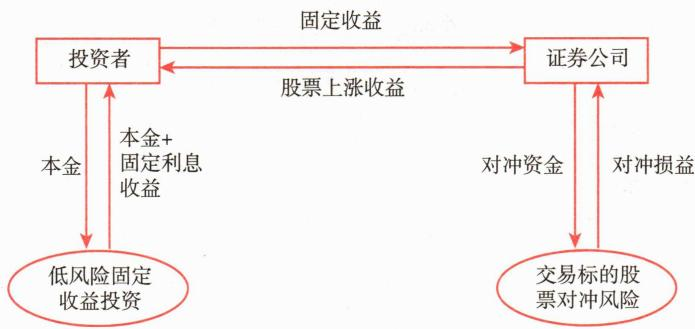

# 第五节 互换合约

<table><tr><td>学习内容</td><td>知识点</td></tr><tr><td>互换合约概述</td><td>互换合约的定义和介绍</td></tr><tr><td>互换合约的类型</td><td>利率互换、货币互换和股票收益互换的运作方式</td></tr><tr><td>远期合约、期货合约、期权合约和互换合约的区别</td><td>标准化程度、损益特性、信用风险、执行方式以及杠杆效应等方面的区别</td></tr></table>

# 一、互换合约概述

互换合约（Swap Contract）是指交易双方基于约定的条件，在未来某一时期相互交换某种标的资产的合约。更为准确地说，互换合约是指交易双方之间约定的在未来某一期间内交换他们认为具有相等经济价值的现金流的合约。互换合约主要用于风险管理、降低融资成本以及基于市场预期进行收益管理，是一种重要的场外交易（OTC）衍生品，互换广泛应用于利率、货币及信用等领域。

在现实中较为常见的两种合约是利率互换合约和货币互换合约，此外还有股权互换、信用违约互换等互换合约。

利率互换合约是指双方约定在未来的某个时期内，基于同一货币下的不同利率（如浮动利率与固定利率），进行现金流交换的一种合约。本金并不在双方之间实际交换，交换的仅是基于本金计算的利息差额。

货币互换合约则是指双方在未来的某个时期内，交换两种不同货币的本金和利息的合约。通常货币互换既包括本金的交换，也包括利息的交换。

自从1981年美国所罗门兄弟公司为IBM和世界银行办理首笔美元与德国马克和瑞士法郎之间的货币互换业务以来，互换市场的发展非常迅猛。按名义金额计算的互换合约已成为交易量最大的金融衍生工具。但是在2008年全球性金融危机当中，导致大量金融机构陷入危机的重要衍生金融工具也正是信用违约互换（Credit Default Swap, CDS）。最基本的信用违约互换涉及两个当事人，双方约定以某一信用工具为参考，一方向另一方出售信用保护，若信用工具发生违约事件，则信用保护出售方必须向购买方支付赔偿。

我国20世纪80年代就已经推出货币互换合约，之后推出利率互换合约。近年来我国互换合约市场高速成长，互换合约也成为许多投资组合的重要组成部分。目前，中国外汇交易中心人民币利率互换参考利率包括上海银行间同业拆借利率（含隔夜、1周、3个月期等品种）、国债回购利率（7天）、1年期定期存款利率，互换期限从7天到3年，交易双方可协商确定付息频率、利率重置期限、计息方式等合约条款。

# 二、互换合约的类型

# （一）利率互换

利率互换（Interest Rate Swap），是指互换合约双方同意在约定期限内按不同的利息计算方式分期向对方支付由币种相同的名义本金额所确定的利息。由于双方使用相同的货币，利率互换通常采用净额支付的方式，即互换双方不交换本金，只按期由一方向另一方支付本金所产生的利息净额。利率互换有两种形式：（1）息票互换，即固定利率对浮动利率的互换；（2）基础互换，即双方以不同参照利率互换利息支付，如美国最优惠利率（Prime Rate）对SOFR。

进行利率互换的主要原因是双方在固定利率和浮动利率市场上分别具有比较优势。

[案例6-4]假定A、B两家公司都想借入7年期的1000万美元的借款，A公司想借入与1年期相关的浮动利率借款，B公司想借入固定利率借款。但两家公司的信用等级不同，故市场向它们提供的利率也不相同，如表6-4所示。

**表 6-4 市场提供给 A、B 两家公司的借款利率**

<table><tr><td>公司</td><td>固定利率</td><td>浮动利率</td></tr><tr><td>A公司</td><td>7%</td><td>SOFR+0.4%</td></tr><tr><td>B公司</td><td>8.5%</td><td>SOFR+0.7%</td></tr></table>

根据表6-4，比较两家公司的融资成本可知，A公司的借款利率均比B公司低，即A公司在两个市场上具有绝对优势。但A公司在固定利率市场上融资成本可比B公司节省 $1.5\%$ （ $8.5\%-7\%$ ），在浮动利率市场上融资的成本比B公司节省 $0.3\%$ [SOFR+0.7%-(SOFR+0.4%)]。所以A公司在固定利率市场上有比较优势。而B公司则在浮动利率市场上具有比较优势。因为B公司在浮动利率市场上的融资成本只比A公司高出0.3%，要低于在固定利率市场上的融资成本差额1.5%，这样双方就可以利用各自的比较优势为对方借款，然后进行互换，从而达到共同降低融资成本的目的。

互换双方为降低交易成本及信用风险，通常通过中介机构来完成互换交易。在本例中，我们假设银行从中收取0.4%的利差，从而A、B两家公司通过银行中介进行的互换过程如图6-4所示。

 — 图6-4 利率互换示意图

双方的互换方案是：A公司在固定利率市场上以7%的利率融资，B公司在浮动利率市场上以SOFR+0.7%的利率融资，双方通过银行进行利率互换，A公司以固定利率与B公司的浮动利率进行互换，从而A公司获得浮动利率贷款，B公司获得固定利率贷款。

通过互换，A公司的总融资成本 $= 7\% + \mathrm{SOFR} - 7\% = \mathrm{SOFR}$ ，与直接进行浮动利率融资的成本 $\mathrm{SOFR} + 0.4\%$ 相比，节约 $0.4\%$ 。B公司的总融资成本 $= 7\% + \mathrm{SOFR} + 0.7\% - (\mathrm{SOFR} - 0.4\%) = 8.1\%$ ，与直接进行固定利率融资的成本 $8.5\%$ 相比，节约 $0.4\%$ 。银行则通过这项互换业务赚取利差 $= \mathrm{SOFR} + 7\% - (\mathrm{SOFR} - 0.4\% + 7\%) = 0.4\%$ 。从而，互换双方通过发挥各自的比较优势并进行利率互换均达到了降低融资成本的目的。双方总的筹资成本降低了 $0.8\%$ ，这就是互换利益。互换利益是双方合作的结果，由双方共同分享，但具体分享比例由双方谈判决定，未必平均分派。

# （二）货币互换

货币互换（Currency Swap），是指互换合约双方同意在约定期限内按相同或不同的利息计算方式分期向对方支付由不同币种等值本金额确定的利息，并在期初和期末交换本金。

与利率互换的不同之处在于，货币互换中双方要以不同货币支付利息及本金，所以在每一个阶段双方都要以不同货币支付现金利息给对方，而不是只有一方支付现金给另一方。根据利息支付方式不同，货币互换可分为三种形式：（1）固定对固定，即将一种货币的本金和固定利息与另一种货币的等价本金和固定利息进行交换；（2）固定对浮动，即将一种货币的本金和固定利息与另一种货币的等价本金和浮动利息进行交换；（3）浮动对浮动，即将一种货币的本金和浮动利息与另一种货币的等价本金和浮动利息进行交换。

货币互换产生的主要原因是双方在各自国家中的金融市场上具有比较优势。

[案例6-5] 假定欧元兑美元汇率为1欧元=1.5美元。A公司想借入5年期的1500万美元借款，以浮动利率支付利息；B公司想借入5年期的1000万欧元借款，以固定利率支付利息。但两公司在不同市场的信用等级不同，两国金融市场对A、B两家公司的熟悉情况不同，因此市场向它们提供的利率也不相同，具体如表6-5所示。两家公司通过银行中介进行货币互换，并且支付给银行中介一定的利差。

**表 6-5 市场提供给 A、B 两家公司的借款利率**

<table><tr><td>公司</td><td>欧元</td><td>美元</td></tr><tr><td>A公司</td><td>5.6%</td><td>SOFR+0.2%</td></tr><tr><td>B公司</td><td>6.7%</td><td>SOFR</td></tr></table>

从双方的融资成本看，双方各有优势。A公司在欧元市场上具有融资优势，B公司在美元市场上具有融资优势，双方通过银行进行货币互换，即A公司以固定利率的欧元融资与B公司的浮动利率美元融资进行互换，这样双方都能通过互换获得利益。双方进行货币互换的过程具体如图6-5所示。

 — 图6-5 货币互换示意图

双方的融资方案为：A公司在欧元固定利率市场上以 $5.6\%$ 的利率借入5年期1000万欧元借款，B公司在美元浮动利率市场上以美元SOFR利率借入5年期1500万美元借款，双方互换本金，期间双方互换不同币种利息，并在期末再次交换本金。通过互换，两家公司的融资成本结果具体如表6-6所示，其中，A公司能节约成本 $0.5\%$ ，B公司能节约成本 $0.5\%$ ，而银行中介从中赚取的利差为欧元 $0.1\%$ 和美元 $0.2\%$ 。从而两家公司通过货币互换降低了融资成本，获得互换利益。

**表 6-6 / 货币互换前后 A、B 两家公司融资成本**

<table><tr><td>公司</td><td>互换前成本</td><td>互换后成本</td><td>节约的融资成本</td></tr><tr><td>A公司</td><td>美元:SOFR+0.2%</td><td>美元:SOFR+0.2%欧元:5.6%-6.1%= -0.5%</td><td>欧元:0.5%</td></tr><tr><td>B公司</td><td>欧元:6.7%</td><td>美元:SOFR-SOFR=0欧元:6.2%</td><td>欧元:0.5%</td></tr></table>

通过对上述互换案例的分析，可总结出确定互换方案的基本过程：（1）建立成本和融资渠道矩阵；（2）确定各方比较优势；（3）划分互换利益；（4）为互换定价，即确定互换合约中各方应支付的利率。

# （三）股票收益互换

股票收益互换中，交易一方或双方支付的金额与特定股票、指数等权益类标的证券的表现挂钩。原则上，双方按照收益轧差后的净额进行支付，不发生本金交换。我国股票收益互换业务开始于2012年底，采用场外协议成交的方式。具有此项业务资格的证券公司与投资者订立股票收益互换协议。根据协议约定，交易双方在未来特定时间以名义本金为基础确定与股价挂钩的浮动收益和固定收益，以此计算各自支付义务，通过轧差计算确定承担实际支付义务的主体并进行结算。

投资者和证券公司之间的股票收益互换有三种模式：固定利率和股票收益的互换、股票收益和固定利率的互换、股票收益和股票收益的互换。前两种形式更为常见。

股票收益互换是投资者进行投资理财和风险管理的工具。投资者可以通过股票收益互换，实现策略投资、杠杆交易、股权融资、市值管理和创建结构化产品的目的。证券公司在与投资者订立股票收益互换交易的同时，会进行风险对冲，将自身风险暴露控制在较低水平。风险对冲后，证券公司最终只赚取类似佣金或利息收入的中间价差。

# 1. 对冲股价波动风险

投资者执行股票买入计划时，面临股价波动的风险。股票收益互换可以帮助投资者锁定买入成本，对冲买入期间价格波动的风险。

假设某投资者看好某只股票，计划3个月后对该股票进行增持，但希望将股票价格锁定在现价水平。为实现这一目标，客户可与证券公司订立股票收益互换协议。该互换交易名义本金额为1亿元，互换期限为3个月。到期时，若实际股价高于现价，则证券公司向投资者支付差价收益；若实际股价低于现价，则投资者向证券公司支付差价补偿。证券公司建立互换头寸的同时，可从市场购入标的股票以对冲风险。具体如图6-6所示。

 — 图6-6 对冲股价波动风险的收益互换示例

# 2. 将现有股票投资转换为固定收益投资

假设某投资者持有某只股票已经获得账面盈利，由于某些限制不能及时卖出股票兑现收益，希望锁定目前的盈利，将股票头寸转换为固定收益头寸。为了实现这一目标，该投资者可以和证券公司签订股票收益互换协议。互换交易的名义本金额为1亿元，互换期限为1年。1年后，投资者收取固定的利息收入，实际股价涨跌损益均由证券公司承担。若股价上涨，投资者向证券公司支付收益；若股价下跌，证券公司向投资者支付补偿。证券公司建立互换头寸的同时，可以通过卖空标的证券进行风险对冲。具体如图6-7所示。

 — 图6-7 股票投资转换为固定收益投资示意图

# 3. 保本投资

为了在本金安全的前提下获得股票上涨收益，投资者可以将现金或固定收益资产期末产生的利息收入支付给证券公司，用于交换证券公司向其支付的与特定股票或指数表现挂钩的上涨收益。

假设投资者与证券公司订立股票收益互换协议，互换交易的名义本金为1亿元，互换期限为3个月，挂钩某股票的上涨收益。3个月以后，投资者将1亿元本金产生的资金利息支付给证券公司，证券公司向投资者支付与该股票挂钩的上涨收益。如果该股票价格下跌，投资者损失上限是利息，本金不受影响。证券公司通过交易标的股票进行风险对冲。具体如图6-8所示。

 — 图6-8 应用收益互换进行保本投资示意图

# 三、远期合约、期货合约、期权合约和互换合约的区别

远期合约、期货合约、期权合约和互换合约是常见的衍生工具。尽管它们在交易机制和风险特性上有所不同，但常因相似性而常常被混淆。我们可以从合约的标准化程度、交易场所、损益特性、信用风险、交割方式、执行方式、杠杆效应等角度来分析它们的区别。

# （一）交易场所与合约标准化

衍生品合约既可以在交易所交易，也可以场外交易。期货合约只在交易所交易。期权合约大部分也在交易所交易，且标准化程度较高。相比之下，远期合约和互换合约通常在场外市场交易，属于非标准化合约，能够根据交易双方的需求灵活定制，但由于谈判较复杂，因此交易成本较高。

# （二）损益特性

期权合约与远期合约、期货合约及大部分互换合约的不同之处在于其损益的不对称性。远期合约、期货合约和大部分互换合约，都涉及买卖双方在未来应尽的义务，因此，它们有时被称作远期承诺（Forward Commitment）或者双边合约（Bilateral Contracts）。这些合约的损益特性是对称的，盈亏随标的资产价格变动呈线性变化。

相对而言，期权合约和某些信用违约互换合约则是单边合约（Unilateral Contracts），只有卖方在未来负有履约义务，买方享有选择性行权的权利。因此，期权买方的损失有限（支付的权利金为上限），但潜在盈利无限；而卖方的盈利固定（收到的权利金），潜在亏损则可能无限扩大。

# （三）信用风险

场外衍生品交易的主要风险之一是信用风险。由于场外交易不通过交易所进行，交易双方直接进行合约的订立和执行，存在违约风险。信用风险按照发生的时间通常可分为两类，即到期清算前风险以及到期清算风险。

以远期合约为例，由于其高实物交割属性和双边合约性质，任何一方的违约都会给对手方造成损失，且合约一经签订就需要双方共同同意才能终止。掉期等其他场外衍生品同样面临这种双向信用风险。相比之下，期权作为单边合约，仅期权买方承担卖方可能违约的风险。

期货交易通过交易所的标准化管理和中央清算机构的担保体系，建立了完善的风险防控机制。清算机构实施的保证金制度和每日盯市制度，有效地将信用风险控制在可承受范围内。这种制度设计使得期货市场的信用风险远低于场外市场。

# （四）执行方式

各类衍生品合约的执行体现出不同的市场特点。远期和互换合约倾向于以实物交割完成最终履约。期货合约虽然也具备实物交割机制，但交易者多通过对冲平仓来了结交易，实际进入交割环节的比例较低。期权则赋予买方更大的灵活性，可以根据市场行情选择是否行权。

# (五) 杠杆

衍生品合约的杠杆特征取决于其交易机制设计。期货合约因采用保证金制度，使得投资者只需缴纳合约价值的一小部分即可参与较大金额的交易，从而产生显著的杠杆效应。期权市场则呈现出买卖双方不对称的杠杆特征，买方支付固定期权费，卖方需要缴纳保证金，都能以较小资金撬动较大规模的交易。远期与互换合约的杠杆程度则较为灵活，主要取决于合约双方约定的具体交易条款，可能存在也可能不存在杠杆效应。

# 本章参考文献
