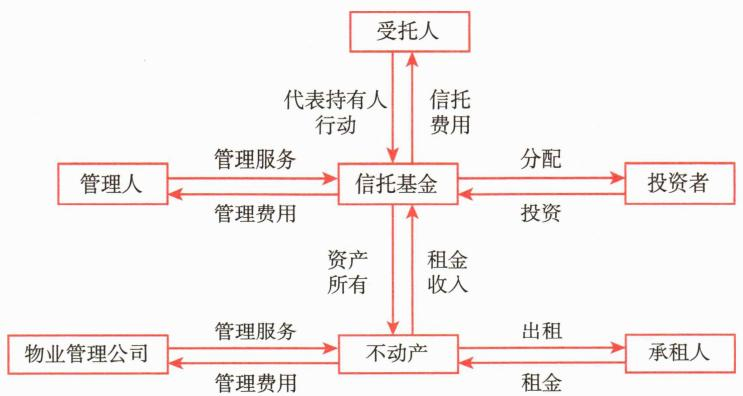

# 第三节 不动产投资

<table><tr><td>学习内容</td><td>知识点</td></tr><tr><td>不动产投资概述</td><td>不动产投资的定义及其特点</td></tr><tr><td>不动产投资的类型</td><td>房地产投资和基础设施投资</td></tr><tr><td>不动产投资工具</td><td>房地产有限合伙(RELP)的定义及其特点不动产投资信托(基金)(REITs)的定义及其特点</td></tr></table>

# 一、不动产投资概述

# （一）不动产投资的定义

不动产是指土地以及建筑物等土地定着物，相对动产而言，强调财产和权利载体在地理位置上的相对固定性。房地产和基础设施是不动产中的主要类别，也是本章讨论的主要内容。不动产投资是指人们为实现某种预定的收益或效益目标，直接或间接地对不动产进行开发、经营、管理、服务等活动并投入资本的行为。

对大多数个体投资者而言，不动产投资意味着购买自己的居住用不动产，这也是这些投资者所持有的资产净值当中的重要部分。住宅型建筑物、公寓和其他住宅型不动产都是许多个体投资者的财务计划中最基础的部分。

# （二）不动产投资的特点

# 1. 异质性

每一项不动产在地理位置、产权类型、用途和使用率等方面而言都是独特的，受法律法规、政策、宏观环境和货币环境等因素影响较多。这给不动产估值带来了困难。

# 2. 不可分性

和传统的股票、债券等不同，直接的不动产投资金额大，且不容易拆分以卖给多个投资者。这意味着一项投资就可能占据投资组合的很大比例。

# 3. 低流动性

由于前两项特性，直接的不动产投资流动性较差，产权交易时间长、费用高。若要快速转售，往往要承担较大的折价损失。

# 二、不动产投资的类型

不动产投资有多种类型，它们有各自的特征、优势和局限性。

# （一）房地产投资

# 1. 地产投资

地产，亦指土地，是指未被开发的，可作为未来开发房地产基础的商业地产之一。基于未被开发这一特征，土地本身的不确定性非常高，因此土地投资可能具有较高的投机性。土地无法给承租人或者使用者带来任何可观的现金流，可能只有包括房地产税以及管理或维持土地的费用在内的净现金流。

开发商获取建筑许可后在土地上进行建筑或建设公路、基础设施等开发过程，会增加土地的价值，因此，土地投资大部分通过利用可预测的未来现金流获取的买卖价差或者开发后进行出售或出租经营来获取投资收益。同时，土地投资由于其投资价值受到宏观环境和法律法规因素影响较大而极具风险性。

# 2. 商业房地产投资

商业房地产投资以出租而赚取收益为目的，其投资对象主要包括写字楼、零售房地产等设施。

写字楼在整个商业房地产投资中占据很大比例。写字楼的所有权通常归属于房地产投资者，这些投资者将写字楼空间出租给承租人。写字楼租金往往参照通货膨胀率和供求关系等因素逐年调整。对期望抵御通货膨胀的投资者而言，写字楼投资具有很大的吸引力。

零售房地产是指如购物中心、商业购物中心和其他用于零售目的而建设的建筑物。所有者将房地产出租给零售商进行经营。

# 3. 工业用地投资

工业用地，是指包括生产用设备、研究和开发用空地和仓库等各种工业用资产的所在地。中国目前的工业用地投资主要集中于对经济开发区进行建设，剩余工业用地一般随着工业投资而进行。

# 4. 酒店投资

酒店主要是指包含品牌的短期性居住设施，以及给职工提供的长期居住设施等房地产。

酒店行业随着旅游市场的发展而得到发展。随着中国居民收入的增长，消费正在转型升级，中国旅游业也得以飞速成长。酒店投资已经成为热点。

# 5. 养老地产等其他形式的投资

养老地产是以老年人为目标客户群体，将住宅地产、商业地产和养老服务相结合的商业模式。养老地产的主要特色是将餐饮、娱乐、家政、医疗、照料、康复等为老

年人的服务一体化。

# （二）基础设施投资

基础设施是指为社会和经济提供基本服务的长期、大型公共系统、结构和设施。基础设施提供多种基础资源，从水、能源和运输等基本需求到更先进的服务，如电信、教育和医院。基础设施是经济体系的支柱，对国家、城市、企业的经济发展至关重要。基础设施促进了竞争力和经济增长，在生产、服务、贸易和日常生活中发挥了关键作用。

并非所有的基础设施都是“可投资的”。在全球范围内，只有一小部分基础设施资产属于私人所有或在交易所上市，绝大部分由政府控制。部分基础设施资产受到政府管制，受管制的基础设施资产几乎都是垄断性的，如公用事业。

基础设施作为一种独特的资产类别，对投资者具有很强的吸引力。基础设施可投资的资产类别包括社会基础设施资产和经济基础设施资产。社会基础设施资产为社会服务提供结构，如学校和医院。经济基础设施资产一般分为四类：

# 三、不动产投资工具

由于不动产具有异质性、不可分性、流动性差等特点，许多投资者通过间接方式投资于不动产，主要形式包括房地产有限合伙和不动产投资信托，另外还有债权形式的投资工具。

# （一）房地产有限合伙

房地产有限合伙（Real Estate Limited Partnership，RELP）在功能上类似于私募股权合伙，由有限合伙人和普通合伙人组成。房地产有限合伙人将资金提供给普通合伙人，有限合伙人仅以出资份额为限对投资项目承担有限责任，并不直接参与管理和经营项目；普通合伙人通常是房地产开发公司，依赖其具备的专业能力和丰富经验将资金投资于房地产项目当中，之后管理并经营这些项目。通常，房地产普通合伙人和私募股权中的普通合伙人一样，收取固定比例的管理费。此外，由于有限合伙人不直接参与项目的管理和经营，普通合伙人在作出投资和管理决策时拥有较高的自主性。

房地产投资项目具有不同的形式，如建造住宅或者公寓大楼等。房地产有限合伙偏好资金的非流动性，一旦房地产有限合伙将资金托付给合伙企业，可能在承诺期限截止之前很难或者不可能从投资项目中退出。同时，有限合伙人可能面临长达数年的负现金流，这主要是由于普通合伙人可能在经过一定时间之后才将资金分配到项目当中的缘故。这些分配的资金通常是基于房地产资产的配置而形成的。

# （二）不动产投资信托

不动产投资信托（基金）(Real Estate Investment Trusts, REITs)，是一种通过发行股份或受益凭证汇集投资者资金购买不动产，由专门投资机构进行投资经营管理，并将投资综合收益按比例分配给投资者的证券工具。REITs是不动产证券化当中的一种金融工具，其运作形态与共同基金类似，核心功能是实现不动产证券化，即将规模大、流动性低的不动产转化成方便于广大投资者参与投资和交易的金融产品。类似于股票“IPO”，可以采取上市的方式在证券交易所挂牌交易，投资者可在公开的二级市场上交易转让其持有的REITs份额。不动产投资信托的主要收益来自稳定的股息和证券价格增值。投资者通过REITs可以不用直接拥有真实不动产而投资不动产行业。全球REITs市场最早起源于美国，1961年，首只REITs产品在美国成立；20世纪80年代，荷兰将REITs产品引入欧洲市场；2000年由日本引入亚洲市场。

根据资金投向不同，REITs可分为权益型、抵押型和混合型。其中，权益型REITs获得不动产的产权以取得经营收入，收益主要来自不动产的租金和增值，是最常见的REITs品种。抵押型REITs直接向不动产所有者或开发商提供抵押信贷或购买抵押贷款支持证券间接提供融资，收益主要来自贷款利息，资产组合价值受利率影响较大。混合型REITs兼具权益型和抵押型特点，是二者的混合。根据资金募集与流通方式不同，可以分为私募和公募两种形式。根据组织形式不同，可以分为公司型和信托型两类。公司型REITs多采用内部管理的模式，由公司聘用内部管理团队进行管理，包括资产运营、投融资和物业管理等；信托型REITs以信托或基金作为载体，通过发行信托凭证和基金份额来筹集资金用于投资不动产。一般来说，信托型比公司型更为灵活。从地域上看，公司型REITs在美国占主体地位，而信托型在亚洲市场上更为普遍，以新加坡和中国香港为代表。根据标的物业类型，例如公寓、超市、商业中心、写字楼、零售中心、工业物业和酒店等，都有相应的REITs与之对应。REITs的运作方式如图7-1所示。

 — 图7-1 不动产投资信托（REITs）运作结构图

REITs具有以下特点：

第一，相对较高的流动性。与直接投资不动产相比，REITs提供了更高的流动性。直接买卖不动产通常涉及复杂的手续和较长的周期，变现能力较差。REITs在公开交易所上市交易，允许投资者像买卖股票一样方便地买卖其份额，从而更容易在不动产投资与现金之间进行转换。这与流动性相对较低的直接不动产投资或不动产有限合伙等形式形成对比。

第二，具备对冲通胀的潜力。不动产的租金收入和资产价值，在某些经济环境下，特别是通胀时期，往往会随物价水平上涨而呈现同向变动的趋势。因此，REITs被认为具有一定的对冲通货膨胀风险、帮助投资者在通胀环境下保持资产购买力的潜力。

第三，呈现特定的风险收益特征。REITs在提供潜在的租金收入和资本增值回报的同时，也伴随着相应的投资风险。其风险水平会根据多种因素动态变化，例如底层资产的质量与组合、宏观经济环境（特别是利率走势）、自身的财务杠杆以及管理团队的运营能力等。正因为受到这些复杂因素的综合影响，REITs的市场价格可能经历显著波动，尤其是在特定的市场条件下。同时，虽然REITs旨在获取稳定的租金收益，但其收入的稳定性也并非绝对保证，会受到出租率、租金水平及资产价值变动等实际运营因素的影响。将其波动性与股票等其他资产类别相比时，历史表现各异，并非绝对更低。通过将资金投资于多样化的不动产项目组合，REITs可以为投资者提供分散单一项目风险、参与更广泛房地产市场的重要途径。

在美国，REITs必须将自身的大部分资产和收入与不动产投资项目挂钩，同时需要每年将至少90%的应纳税收入分配给股东，也就意味着REITs具有高分红的性质。一般REITs的收益比传统证券中的债券要高，比股票要低，影响其收益的因素主要包括利率水平、股市景气度和不动产市场景气度。与中国市场不同，在美国市场，REITs在公司层面免征企业所得税，因此较为盛行。
