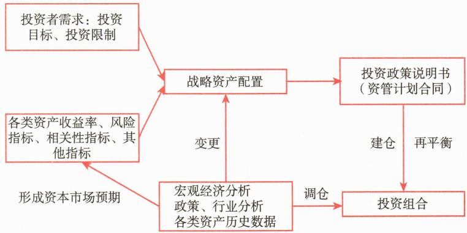

# 第二节 投资管理流程分类

<table><tr><td>学习内容</td><td>知识点</td></tr><tr><td>定制化投资管理流程</td><td>一般定制化投资管理流程的三个步骤</td></tr><tr><td>标准化投资管理流程</td><td>定制化投资流程与标准化投资流程的比较</td></tr></table>

投资管理的核心目标是在满足投资者需求的同时优化风险收益比。这意味着在给定的风险水平下追求最大化的收益，或在实现特定收益目标的同时将风险降至最低。随着金融市场的发展，基金管理人的投资管理逐渐分化为两种主要模式：定制化投资和标准化投资。

基金管理公司私募基金和资产管理计划主要服务于机构投资者或高净值客户，强调投资者需求导向。这种模式的特点是可以根据客户的具体需求定制投资策略，提供更加个性化的服务。

相比之下，公募基金投资面向的是广大不特定的投资者，其投资导向以基金管理人策略为主。在这种模式下，基金管理人设计投资策略，投资者则根据自身需求选择合适的基金产品。

基于这两种模式的特点，我们可以将投资管理流程分为两类：面向投资者需求的定制化投资管理流程和面向基金管理人策略的标准化投资管理流程。定制化流程主要适用于私募基金和资产管理计划，投资策略的制定直接基于投资者的具体需求和目标。而标准化流程主要适用于公募基金投资，基金管理人根据自身的投资理念和市场判断制定策略，投资者通过选择不同的基金产品来满足自己的投资需求。

这种分类反映了投资管理在实践中的不同应用方式，有助于更好地理解和执行不同类型的投资管理任务。无论采用哪种模式，投资管理的最终目标始终是为投资者创造价值，实现资产的有效增值。在实际操作中，投资管理人需要根据具体情况灵活运用这两种流程，以最大程度地满足不同类型投资者的需求，同时确保投资策略的有效实施。

# 一、定制化投资管理流程

一对一的私募基金和资产管理计划是典型的面向投资者需求的定制化投资管理模式。基金管理人需要充分沟通投资者需求，并据此制定投资方案、实施投资策略，对投资组合进行监控并调整。图8-1是特许金融分析师（CFA）协会定义的投资管理过程，整个流程划分为规划、执行和反馈三个步骤。

规划侧重于确定投资方案所需的各种输入信息，包括客户需求和资本市场预期数据等；执行是资产配置和证券选择等方面的投资决策和实施过程；反馈则是对投资预期、投资目标和投资组合等方面变化的适应过程。

 — 图8-1 定制化投资管理流程图

下面我们通过一个实际案例，介绍定制化投资管理流程。

# 图 [案例8-1] A保险公司一对一资产管理计划

经过多轮调研和严格筛选，A保险公司决定与B基金管理公司签订一份投资规模为20亿元、期限为5年的资产管理合同。该资产管理计划名称为C，其投资范围是银行间市场和交易所交易的利率债和信用债，由张某作为资产管理计划C的投资经理。

投资经理张某开始制定投资方案。

# (一) 规划

# 1. 确定并量化投资者的投资目标和投资限制

投资规划的首要任务是了解投资者需求，确认并量化投资者的投资目标和投资限制。投资目标是投资者对收益和风险要求的结合体，投资限制是对投资过程的进一步约束，如投资期限、流动性要求、监管规定及特殊要求等。

图 [案例8-2] 接案例8-1，经过深入沟通，A保险公司明确了对资产管理计划C的风控要求。首先，该资产管理计划不得投资次级债、永续债和可转债，并且在城投债的投资上设定了地区限制。此外，该资产管理计划可容忍的最大回撤为 $5.0\%$ ，且资金将在整个投资期限内锁定，不允许提前赎回。基于保单成本的考量以及对市场降息的预期，A保险公司希望该资产管理计划能够实现年化 $3.5\%$ 的收益目标。

张某建议将首年的业绩比较基准设定为 $3.5\%$ ，并在每年12月31日根据市场情况进行调整。根据与A保险公司的沟通结果，张某将该计划的投资需求总结如下：

# 资产管理计划C的投资目标

收益目标：年化3.5%，每年底调整

风险容忍度：最大回撤不超过5.0%

# 资产管理计划 C 的投资限制

投资期限：5年

流动性要求：不提前赎回

特殊要求：禁止投资次级债、永续债、可转债，并对城投债进行地区限制

监管要求：杠杆率不高于200%

# 2. 形成资本市场预期

资本市场预期是指市场参与者对未来经济、行业和公司表现的预测和看法。为形成这种预期，投资管理人会进行全面的分析。他们首先深入研究宏观经济形势、政策环境和行业发展趋势，同时仔细审视各类资产的历史表现，包括收益率、标准差和相关性等关键指标。通过综合这些分析结果和历史数据，投资管理人对未来经济走势、行业发展和公司业绩作出预测，进而形成对各资产类别长期风险和潜在收益的判断。

# 3. 建立战略资产配置

在战略资产配置中，投资管理人结合投资者投资目标、投资限制、资本市场预期，确定各类目标资产的配置比例，并设置各类资产权重的上限和下限，作为投资过程中风险管理的依据。如某个组合战略资产配置为：10%现金、20%国内股票、10%海外股票、60%国内债券，并确定每类资产有 $\pm5\%$ 浮动空间；同时，在大类资产内还可以做细分，如国内股票可以按照风格分为价值股5%、成长股15%。

# 4. 制定投资政策说明书

在明确了投资者的投资目标、投资限制、战略资产配置后，投资管理人的下一个任务便是制定投资政策说明书。该说明书是所有投资决策的指导性文件，包含投资目标、投资范围、业绩比较基准、投资策略以及其他相关内容。当前，国内的投资政策说明书通常以资产管理计划合同及其补充协议或会议纪要的形式体现。

[案例8-3] 接案例8-2，张某判断债券市场将受宽松的货币政策影响，收益率曲线预计会平行下移。基于这一判断，张某建议将投资组合的久期上限设置为4.5年，以在利率下行时获取更多的资本利得，同时保持适度的风险控制。

此外，他将杠杆上限设为 160%，通过合理运用杠杆，在增厚收益的同时避免过度增加风险暴露。

在资产配置上，张某计划将1\~3年期的信用债作为底仓持有至到期，以获取适当的到期收益率并降低市场波动对组合的影响。同时，5\~10年利率债的配置比例为0\~60%，用于波段操作，捕捉利率波动带来的机会。

考虑到当前市场状况，张某认为每月一次的调仓频率较为合适，这既能让他及时根据市场动态调整组合，又能有效控制交易成本和风险。

张某与A保险公司充分沟通后，正式开始执行这一投资方案。

# （二）执行

投资执行是投资规划的实现。执行可以分为建仓和调仓两个步骤。

# 1. 建仓

资产管理计划成立并完成开户后，进入建仓阶段。在此阶段，投资经理会结合投资组合的既定目标、资本市场预期以及分析师报告，制定组合构建和证券选择的策略，并由交易部门执行。

[案例8-4] 接案例8-3，在建仓阶段，张某判断煤炭和钢铁行业未来一年内的经营状况将有所改善，预计信用利差将收窄。因此，他计划主要配置信用债，仓位比例为 $100\%$ ，同时辅以 $30\%$ 的利率债。在信用债部分，张某拟将 $70\%$ 的仓位配置于煤炭和钢铁行业债券，以抓住信用利差收窄带来的收益机会； $20\%$ 将配置于城投债， $10\%$ 配置于商业银行金融债，以实现组合的分散化和信用风险管理。

在利率债方面，张某观察到国开债收益率曲线在7年期附近最为陡峭，拟采取子弹型策略，大量配置7年左右国开债，以充分利用利率曲线陡峭获取骑乘收益。

# 2. 调仓

在建仓完成后，投资经理会根据短期资本市场预期的变化，在战略资产配置框架内，对投资组合进行战术性调整。这种战术性调整通常在合同允许的范围内进行，无须投资者额外批准。

当投资者的长期投资目标或者风险偏好发生变化时，投资经理会与投资者沟通，评估是否需要调整战略资产配置。如果需要调整，且调整幅度超出合同规定，则需投资者与基金管理人签署补充协议，对战略资产配置进行相应修改。

投资经理在进行战术调整时，会在合同允许的范围内暂时偏离战略资产配置。例如，当市场预期发生重大变化，投资经理有可能会调整资产配置以适应该变化。这种战术性调整会持续到投资经理认为市场预期恢复。如果这种变化被认为是长期的，投资经理就会与投资者沟通，评估是否需要调整战略资产配置。经双方同意后，可更新投资政策说明书，将原本的战术调整转化为新的战略资产配置方案。

[案例8-5] 接案例8-4，资产管理计划成立2个月后，张某发现某城投债S信用利差大幅走阔，认为存在短期获利机会，迅速通过正回购加仓 $5\%$ 的城投债S。一个月后，城投债S信用利差显著收窄，张某将其全部卖出，获利了结。这一操作属于典型的战术性调仓，旨在捕捉短期市场波动带来的机会。

资产管理计划成立半年后，张某预期经济增速加快，判断长期限利率债收益率存在大幅上行的风险，因而决定卖出7年期利率债；同时，他认为经济快速增长将降低中小企业债券的违约风险，增加信用债仓位有望带来超额收益。张某认为这个市场变化持续时间将超过一年，在与投资者沟通后修改了战略资产配置方案，将利率债仓位降至0，将信用债仓位提升至130%。

# （三）反馈

投资管理的反馈由再平衡和业绩评估两部分构成。

# 1. 再平衡

再平衡是指在资产价格发生变化后，投资经理将组合重新调整为最初设定的资产配置比例。例如，某权益资产管理计划原定大盘股持仓比例为40%，但3个月后由于大盘股大幅上涨，持仓比例被动上升至55%。若维持原资产配置方案，投资经理应卖

出部分大盘股，将其仓位降至 $40\%$ 。

再平衡的核心目的是确保投资组合的风险收益特征始终符合投资者的预期和要求。在实际操作中，再平衡可以采取多种方式：可以定期进行，如每月或每季度；也可以在资产配置比例突破预设阈值时触发，例如达到 $\pm 5\%$ 的上下限。此外，投资经理还可以根据对市场情况的判断灵活决定再平衡的时机。

# 2. 业绩评估

投资者及管理人定期对投资业绩进行阶段性的评估，以对投资目标的实现情况和投资管理能力进行评价。

对投资管理能力的评价包括三部分：业绩度量、业绩归因和绩效评估。业绩度量是指对投资组合收益率、风险等各类业绩指标的计算；业绩归因是确定投资组合收益的来源；绩效评估则通过将投资组合的表现与业绩比较基准或同类投资组合进行对比，作出综合评价。

# 二、标准化投资管理流程

公募基金不同于私募基金和资产管理计划，其成立和策略选择并非源于特定投资者的需求，而是基于基金管理人的多方面综合考虑，包括产品线布局、市场关注点和基金经理特点等因素。在这种模式下，基金管理人承担了投资策略设计的责任，而投资者根据需求及风险承受能力选择产品，无法直接影响基金的投资策略。这种以管理人为主导的投资管理方式，我们称之为标准化投资管理流程。

当基金管理人确定了其拟发行基金的策略后，会进一步明确基金产品的各项关键要素，如投资范围、业绩比较基准、投资方法、费率结构等。随后，管理人会按照规定流程启动产品上报和发行工作。举例来说，某基金管理公司拟为某擅长价值投资的基金经理量身定制一只三年定期开放股票型基金。该基金投资范围涵盖境内发行的股票、港股通股票、债券等。其业绩比较基准为沪深300指数收益率 $\times 50\%+$ 中证港股通综合指数（人民币）收益率 $30\%+$ 上证国债指数收益率 $\times 20\%$ 。投资者如果认同该基金经理的投资策略和理念，可以选择在发行期认购或在开放期申购。

基金成立后，基金经理将严格按照基金合同执行投资管理，这一环节与面向投资者需求的定制化投资管理流程类似。有所不同的是，基金经理不会根据个别投资者的需求变化来改变投资策略，而是基于对市场的判断，在法规和基金合同框架内进行投资管理。此外，开放式基金的基金经理还需要应对资金进出不确定性的问题，这是与资产管理计划投资的一个显著差异。

虽然理论上可以通过召开基金持有人大会来修改基金合同，但实际操作中这一过程较为复杂，表8-2是定制化投资管理流程与标准化投资管理流程的比较。

**表 8-2 定制化投资管理流程与标准化投资管理流程的比较**

<table><tr><td></td><td>定制化投资管理流程</td><td>标准化投资管理流程</td></tr><tr><td>出发点</td><td>投资者需求</td><td>1.基金管理人产品线布局2.基金经理特点3.市场需求</td></tr><tr><td>业绩比较基准</td><td>投资者需求决定</td><td>投资策略决定</td></tr><tr><td>业绩比较基准决定人</td><td>投资者与管理人商定</td><td>管理人</td></tr><tr><td>投资策略制定</td><td>投资者与管理人商定</td><td>管理人</td></tr><tr><td>投资策略重大变化</td><td>投资者与管理人签署补充协议</td><td>管理人变更基金合同</td></tr><tr><td>投资策略变化难易程度</td><td>容易</td><td>较难,需召开基金持有人大会</td></tr><tr><td>业绩是否公开</td><td>否</td><td>是</td></tr><tr><td>业绩评价</td><td>无公开市场数据,无法与同类资产管理计划比较</td><td>可以与同类产品比较</td></tr></table>
