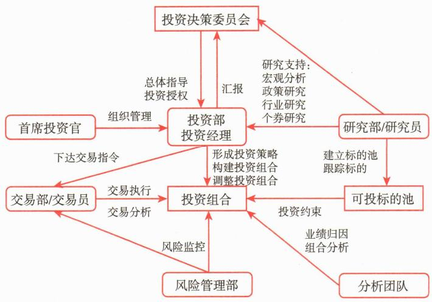

# 第三节 基金管理人投资管理框架

<table><tr><td>学习内容</td><td>知识点</td></tr><tr><td>投资管理相关部门</td><td>投资管理相关部门的主要职能和作用</td></tr><tr><td>投资交易流程</td><td>一般投资交易流程</td></tr></table>

投资管理框架是基金管理人管理体系的重要组成部分，合理的、权责明晰的投资管理框架能够有效提升基金管理人的投资决策能力和交易执行能力，促进投资目标的实现。本节介绍基金管理人投资部门的基本设置和职能，以及基本的投资管理流程。

# 一、投资管理相关部门

投资管理是基金管理人的核心业务。基金管理人的投资管理能力直接影响基金份额持有人的投资收益。

不同基金管理人的投资管理部门设置有所差别，但基本都包括以下几个委员会和部门：

# （一）投资决策委员会

投资决策委员会，简称投决会，是基金管理人投资管理的最高决策机构，由基金管理人自行设立。投决会应在遵守国家有关法律法规及公司规章制度的前提下，对基金管理人各项重大投资活动进行管理，审定公司投资管理制度和业务流程，并确定不同管理级别的操作权限。

在我国，投决会一般由基金管理公司的总经理、分管投资的副总经理、投资总监、研究总监、基金经理等组成。大型基金管理人还会根据投资标的设立细分的投决会，如权益投资决策委员会、固定收益投资决策委员会等。

权益投决会的职能包含判断市场，确定投资白名单及入池标准，确定仓位中枢等。固定收益投决会负责对投资信用等级、集中度进行管理，设置久期上限等。

投决会一般定期召开，特殊情况下，可召开临时投决会，对特殊事项进行商议和决策。

# （二）投资部门

投资部门是基金管理人的核心业务部门，其主要职责是根据投资决策委员会制订的投资原则和计划，设计并执行具体的投资组合方案。在这一过程中，投资部门负责向交易部门下达明确的投资指令。通常，投资部门由基金经理和基金经理助理组成，形成了一个紧密协作的团队。基金经理作为主要决策者，负责实施具体的投资策略，而基金经理助理则在决策过程中提供必要的支持和辅助。

在基金管理人制定的相关投资管理制度框架内，基金经理享有一定的决策权限。他们在研究部门研究员的专业支持下，秉持独立、公平、勤勉、尽责的原则管理基金资产。基金经理的工作最终体现为形成具体的交易指令，这些指令涵盖证券交易的各个方面，包括交易品种的选择、买卖方向的确定、交易价格的设定以及交易时间的安排等。

基金管理人通常会根据自身的业务特点和发展战略，设置多个专业化的投资部门。这种结构设计旨在更好地适应不同投资品种和业务种类的特殊需求。常见的投资部门包括现金投资部、固定收益投资部、混合投资部、权益投资部、指数投资部和量化投资部等。

# (三) 研究部门

研究部门是基金投资运作的基础支持部门。其主要职责是为投资决策提供全面而深入的分析基础。研究部门的工作涵盖宏观经济形势、行业状况、上市公司表现以及发债主体的详细分析和研究。通过这些深入的研究，研究部门能够提出具有前瞻性的资产配置和行业配置建议，同时也负责遴选具有投资价值的上市公司，建立高质量的股票池。在固定收益投资领域，研究部门还承担着对发债主体进行信用评级的重要任务。这些研究成果最终以研究报告和投资建议的形式，为基金投资决策部门提供决策依据。研究部门的这些工作不仅为投资决策提供了科学基础，也在很大程度上提高了基金投资的质量和效率。

研究部门主要由研究员构成，这些研究员通常在各自的研究领域具有专业知识和实践经验。根据基金公司的规模、业务重点和管理模式，研究部门的具体设置可能有所不同：一些基金公司采用单一的综合研究部，覆盖所有资产类别和投资策略；规模较大或业务较为复杂的基金公司可能会根据投资标的和策略设置不同的研究团队或子部门，如固定收益研究部、权益研究部、宏观策略研究部等。

# (四) 交易部门

交易部门是基金投资运作的具体执行部门，负责投资组合交易指令的审核、执行与反馈。基金管理人采取集中交易制度，即基金的投资决策与交易执行职能分别由基金经理与基金交易部门承担。

基金交易部门拥有独立的工作场所，在物理上与基金管理人其他部门隔离，保持严格的独立性，并执行严格的保密要求。

这种安排不仅有助于维护交易操作的公平性，还能有效防范内幕交易等违规行为的发生。交易部门通过电子交易系统执行交易并记录每日的投资交易情况。这些系统不仅提高了交易效率，还能通过技术手段有效避免违规行为的出现，为基金管理中的交易执行风险控制提供了有力支持。

实际操作中，交易部门的交易员充当着重要角色。他们的工作不仅要求以有利的价格执行证券交易，还需要及时向基金经理反馈市场信息，为投资决策提供实时的市场洞察。为确保交易操作的质量和效率，基金管理人通常会对交易员进行定期的综合评估与考核，考核内容涵盖投资指令的完成率、完成质量以及合规情况等多个方面。

根据交易品种的不同，交易员通常分为股票交易员和债券交易员。其中，债券交易员还可能进一步细分为资金交易员、一级投标交易员和二级市场交易员等。这种专业化的分工有助于交易员在各自的领域中积累深厚的经验和专业知识，从而更好地应对复杂的市场环境。

# （五）风险管理委员会

风险管理委员会是基金公司加强风险管理统筹协调的重要机构，在投资研究流程中发挥着关键作用。该委员会由公司高级管理人员、各业务部门负责人和风险管理部门负责人共同组成，构成一个跨部门的风险管理决策平台。

在投资研究过程中，委员会通过制定整体风险管理策略和政策，明确公司的风险偏好和承受能力，为投资决策提供了重要指导。委员会定期评估各类风险状况，审议重大风险事项，并决定相应的应对措施，这些工作直接影响了投资组合的风险控制。通过审议和批准风险管理制度和流程，委员会确保了投资研究过程中的风险管理规范化和系统化。

委员会还负责监督和评估公司风险管理体系的有效性，这对于持续优化投资研究流程中的风险管理至关重要。同时，委员会积极推动风险管理文化建设，有助于在整个投资研究团队中培养风险意识，从而提高投资决策的质量。

风险管理委员会定期召开会议，必要时还会召开临时会议，以便及时应对投资研究过程中出现的重大风险问题。风险管理部门作为委员会的执行机构，负责落实各项决议，并就风险管理工作的进展和成效向委员会汇报，确保了风险管理措施在投资研究流程中的有效实施。

# （六）风险管理部门

风险管理部门是基金管理人风险管理的主要职能部门，负责日常统筹、协调和实施各项风险管理工作。风险管理部门致力于系统性地识别、量化和评估各类风险，包括市场风险、信用风险、流动性风险和操作风险等。通过建立健全的风险监测指标体系，风险管理部门定期进行风险监测，并及时向管理层和风险管理委员会报告风险状况，确保公司各层级对风险情况有清晰的认识。

在日常工作中，风险管理部门负责牵头制定风险管理政策和流程，并监督其执行情况，同时制定并实施各种风险控制措施，将各类风险控制在可接受的范围内。为提升风险管理的科学性和有效性，风险管理部门还负责开发、维护和优化风险管理模型和系统。此外，风险管理部门在确保基金运作符合法律法规和内部规章制度方面发挥着重要的支持作用，并积极推动公司风险管理文化的形成和发展。

值得注意的是，根据不同基金管理人的组织结构和业务需求，风险管理部门的职能可能会进一步扩展。在一些公司中，该部门还承担着业绩归因分析和风险研究等方面的工作。这些额外职能使风险管理部门能够全面支持投资决策，并为公司的战略决策和产品创新提供有力支撑。

为保证风险评估和管理的客观性和有效性，风险管理部门在组织架构上通常独立于其他业务部门。

# （七）法律合规部门

法律合规部门是基金管理人确保合规运营的关键部门，直接向合规负责人汇报。其核心职责是全面履行合规管理职能，协助合规负责人对基金管理人及其工作人员的经营管理和执业行为合规性进行审查、监督和检查。其工作目标是确保公司包括投资管理在内的各项业务都符合法律法规和公司内部规定。

为保证法律合规部门的独立性和权威性，基金管理人应为其提供充分的资源和支持，使其能够独立履行职责。同时，法律合规部门不得承担任何与其合规管理职责相冲突的工作，以维护其客观性和公正性。

在投资管理方面，法律合规部门担负重要职责。首先，该部门协助和监督投资相关部门建立严格的制度流程、授权管理和控制方法，为合规投资奠定制度基础。其次，该部门确保投资组合严格遵守法律法规和合同规定的投资范围、限制和比例要求，防范违规操作。此外，法律合规部门还负责监督投资团队公平对待管理的不同资产，防止利益输送和不公平交易，同时有效管理关联交易，保护投资者利益。

法律合规部门在合规文化建设方面也发挥着关键作用。通过持续的合规培训、监督检查、考核和问责机制，该部门不断提升投资人员的合规意识和职业操守。该部门还致力于合规风险防控，防范利用投资交易谋取不正当利益的行为，维护市场公平和投资者权益。

此外，法律合规部门还负责公司与外部监管机构的日常沟通工作。该部门与金融监管部门、自律组织、资产托管人等外部监督主体保持密切沟通，及时传达和落实各项投资管理相关的监管要求和政策导向，确保公司的投资管理活动始终符合最新的监管标准。

# 二、投资交易流程

基金管理人投资交易流程包括形成投资策略、构建投资组合、执行交易指令、绩效评估与组合调整、风险控制等环节，见图8-2。

 — 图8-2 投资交易流程

# （一）形成投资策略

投资策略的制定是投资交易的基础环节，通常包括以下几个步骤：

第一，研究部门提供研究成果。研究部门在综合宏观经济分析、行业分析、个股、发债主体分析的基础上向投资决策委员会和其他投资部门提供研究报告，并提出投资建议，建立可投池。

第二，投资决策委员会参考研究部门提供的研究成果，根据现行法律法规和基金合同的相关规定，以及公司内部相关投资管理制度，对投资策略形成指导性决议。

第三，投资部门制定投资组合的具体投资方案。投资部门根据投资决策委员会指导性决议和研究部门研究成果，结合自身判断构建投资组合方案，并对方案进行风险收益分析。

# （二）构建投资组合

在实际操作中，基金经理根据投资决策委员会的指导性决议及研究部门的研究报告，结合对证券市场、上市公司、投资时机的分析，在公司相关投资管理制度规定的权限范围内拟定所管理基金的具体投资计划，包括资产配置、行业配置、证券选择。

# （三）执行交易指令

交易指令在基金管理人内部执行情况如下：

# （四）绩效评估与组合调整

基金管理人内部会定期和不定期对基金进行投资绩效评估，并提供相关报告。绩效评估包括业绩归因、业绩比较、风格分析等。根据绩效评估结果，基金经理可以对投资策略和投资组合进行适当调整，公司管理层或投资决策委员会根据公司内部相关制度定期或不定期对基金经理进行业绩考核与能力评定。

# (五) 风险管理

风险管理部门和法律合规部门，根据相关法律法规建立一套完整的合规风险控制体系管理制度，并在基金合同和招募说明书中予以明确说明，以保障基金投资者的合法权益。风险管理、法律合规等内控部门以及其他相关部门会对组合的投资交易进行事前授权审批、事中监控、事后报告等工作。

值得注意的是，风险管理并不是投资流程中的最后一环，而是贯穿于投资组合整个生命周期。风险管理既是风控和合规部门的职责，也是投资、市场、运营等部门的工作内容之一。

# 本章参考文献
