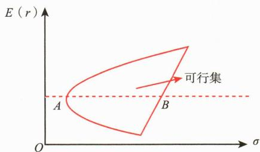
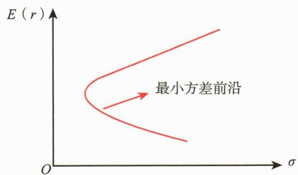
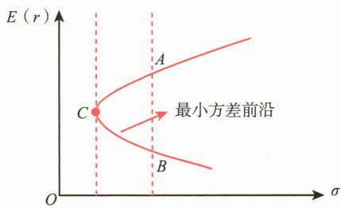
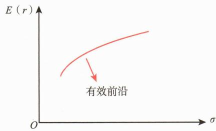
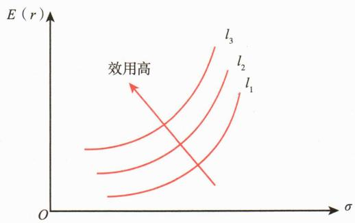
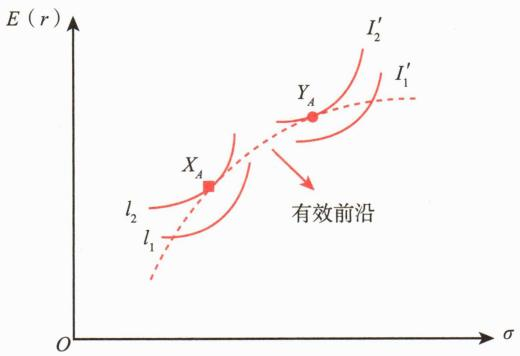

# 第一节 现代投资组合理论

<table><tr><td>学习内容</td><td>知识点</td></tr><tr><td>现代投资组合理论与资本市场理论发展概述</td><td>现代投资组合理论与资本市场理论的形成和发展</td></tr><tr><td>均值一方差模型简述</td><td>均值一方差模型简述</td></tr><tr><td>资产收益率的期望、方差和协方差</td><td>单个资产和投资组合的期望收益率、方差和标准差资产收益率的协方差和相关系数</td></tr><tr><td>资产收益的相关性</td><td>资产收益的相关性</td></tr><tr><td>最小方差前沿与有效前沿</td><td>最小方差前沿与有效前沿</td></tr><tr><td>效用、无差异曲线和最优投资组合</td><td>效用、无差异曲线和最优组合</td></tr></table>

# 一、现代投资组合理论与资本市场理论发展概述

1952年，25岁的哈里·马科维茨（Harry Markowitz）在《金融杂志》上发表了一篇题为《资产组合的选择》的文章，首次提出了均值一方差模型，奠定了投资组合理论的基础，标志着现代投资组合理论（Modern Portfolio Theory，MPT）的开端。马科维茨用收益率的期望值来度量收益，用收益率的标准差来度量风险。他的核心观点是投资者应该通过同时购买多种证券进行分散化投资，以降低整体风险。马科维茨引入了“有效前沿”（Efficient Frontier）的概念，这是一条曲线，代表了在给定风险水平下能够获得最高预期回报的投资组合集合。这一突破性的贡献使马科维茨在1990年获得

了诺贝尔经济学奖。

现代投资组合理论把多种证券的投资组合看作一个整体来进行分析和度量，然后把投资组合的风险分解为两部分——系统性风险和非系统性风险。投资者可以通过持有多种类型的证券以达到分散非系统性风险，从而进一步降低整个组合的风险。但是它也具有一定的局限性，没有进一步说明如何为证券估值和定价，也不能说明投资组合期望回报率与风险之间的关系，其理论难以付诸实际应用。

而随后威廉·夏普（William Sharpe）、约翰·林特耐（John Lintner）和简·莫辛（John Mossin）三人分别于1964年、1965年和1966年独立研究出著名的资本资产定价模型（Capital Asset Pricing Model，CAPM），从而解决了这个问题。其中，夏普1964年发表的论文《Capital Asset Prices: A Theory of Market Equilibrium under Conditions of Risk》具有里程碑意义。CAPM引入了贝塔系数（Beta）的概念，用以衡量单个资产对市场整体风险的敏感度，从而为资产定价提供了一个简洁而有力的工具。CAPM在一系列假设条件下得出结论：对于所有投资者，最优的资产组合都是市场资产组合和无风险资产的组合。这种组合的所有可能情况形成一条被称为“资本市场线”的直线。CAPM自从被夏普提出以来，已经被应用于各种投资决策，尤其是在度量各种风险证券或者风险证券组合的系统性风险方面发挥了重要作用。

鉴于CAPM是一个单因子模型，且难以通过实证完全验证，斯蒂芬·罗斯（Stephen Ross）于1976年提出了套利定价理论（Arbitrage Pricing Theory，APT）。该理论认为风险资产的收益与多个共同因素之间存在线性关系，从而将单因子CAPM发展为多因子模型。APT认为，只要任何一个投资者不能通过套利获得收益，那么期望收益率一定与风险相联系。这个理论的前提是完全竞争和有效资本市场。

在这些理论的基础上，费雪·布莱克（Fischer Black）与迈伦·斯克尔斯（Myron Scholes），于1973年发表了一篇关于期权定价的开创性论文，运用随机微分方程理论推导出期权定价模型。此后，同一时期罗伯特·默顿（Robert Merton）也发现了同样的公式及其他有关期权的有用结论，扩展了原模型的内涵，对期权定价理论进行了重要的推广并使之得到广泛应用。罗伯特·默顿和迈伦·斯克尔斯因此获得了1997年诺贝尔经济学奖，布莱克的杰出贡献也得到了学界的广泛认可。

资产组合理论产生后，Kendall（1953）与Roberts（1959）发现股票价格序列类似于随机漫步，他们对这种现象的解释是：在给足所有已知信息后，这些信息一定已经被反映于股价中了，所以股价只对新信息作出上涨或下跌的反应。由于新信息是不可预测的，那么随新信息变动的股价必然是随机且不可预测的。尤金·法玛（Eugene F.Fama）于1970年把这些理论形成和完善为有效市场假说（Efficient Market Hypothesis，EMH），并把有效市场分为三种不同类型：一是弱有效市场，认为股价已反映了全部能从市场交易数据中得到的信息；二是半强有效市场，认为股价已反映了所有公开的信息；三是强有效市场，认为股价已反映了全部与公司有关的信息，包括所有公开信息及内部信息。尤金·法玛因此贡献获得了2013年的诺贝尔经济学奖。

近年来，行为金融学对传统金融理论提出了挑战，强调了投资者的非理性行为对市场的影响。此外，多因子模型的发展，如Fama-French三因子模型，进一步丰富了资产定价理论。这些发展表明，尽管现代投资组合理论和资本市场理论已经形成了相对完备的理论框架，但仍在不断演进和发展，以更好地解释复杂的金融市场现象。

综上所述，自1952年马科维茨提出“资产组合的选择”以来，现代投资组合理论和资本市场理论已逐步发展成熟，形成了较为完备的理论框架。现代投资组合理论提供了一种理性决策的投资分析方法，革新了投资管理实践。资本市场理论的诞生标志着金融问题分析从定性向定量的转变，其核心理论得到了广泛认可。在专业投资实践中，投资组合方法和定量分析方法得到了广泛应用，定量与定性分析方法相辅相成，共同助力投资管理。

# 二、均值一方差模型简述

马科维茨投资组合理论的基本假设是投资者是厌恶风险的。该理论认为，在预期收益率相同的情况下，投资者会选择风险较小的证券；而承担更高的风险则需要更高的预期收益来补偿。

在回避风险的假定下，马科维茨建立了一个投资组合分析的模型，其要点如下：

首先，投资组合具有两个相关的特征：一是预期收益率；二是各种可能的收益率围绕其预期值的偏离程度，这种偏离程度可以用方差度量。

其次，投资者将选择并持有有效的投资组合。有效投资组合是指在给定的风险水平下使得期望收益最大化的投资组合，在给定的期望收益率上使得风险最小化的投资组合。

再次，通过对每种证券的期望收益率、收益率的方差和每一种证券与其他证券之间的相互关系（以协方差来度量）这三类信息的适当分析，可以在理论上识别出有效投资组合。

最后，对上述三类信息进行计算，得出有效投资组合的集合，并根据投资者的偏好，从有效投资组合的集合中选择出最适合的投资组合。

均值一方差模型建立在一系列严格假设之上，例如投资者是风险规避的、投资收益率服从正态分布等。在实际应用中，这些假设可能难以完全满足，因此模型的应用效果会受到一定限制，后续的理论发展（如行为金融学）也对这些假设提出了挑战和补充。

本部分将基于第三章第四节介绍的统计概念，详细讨论均值—方差模型在投资组合构建中的应用，包括资产收益率的期望、方差、协方差及其在构建有效投资组合中的具体作用。

# 三、资产收益率的期望、方差和协方差

# （一）单个资产的期望收益率、方差和标准差

在均值一方差模型中，每个资产的期望收益率、方差和标准差是基础数据。第一部分中已经详细介绍了这些统计量的定义和计算方法。

资产i的期望收益率 $E(r_{i})$ 是指其在未来各种可能收益情况下，基于概率加权获得的平均收益率。这可以通过历史数据的样本均值或其他估计方法获得。期望收益率是构建投资组合的核心指标之一。

资产i的方差 $\sigma_{i}^{2}$ 衡量其收益率波动的程度，标准差 $\sigma_{i}$ 为方差的平方根，表示收益率的平均偏差程度。方差和标准差反映了资产的风险性，是均值一方差分析的重要依据。

# （二）资产收益率的协方差和相关系数

在投资组合理论使用协方差和相关系数测度两个风险资产的收益之间的相关性。协方差表示两个变量变化趋势的一致性，对于已知资产i和j的收益率的联合分布，其协方差为：

对于s种 $\left(r_{i},r_{j}\right)$ 的状态，假定每种状态的可能性为 $p_k$ ，k状态下两种资产的收益率分别为 $r_{i,k}$ 和 $r_{j,k}$ ，那么：

若使用历史上 m 期样本计算资产 i 和 j 的收益率的协方差，公式为：

两个资产收益率的相关系数表示二者相关关系的密切程度，以希腊字母 $\rho$ 表示：

相关系数的取值范围是 $[-1, +1]$ 。当 $\rho > 0$ 时，两变量为正线性相关；当 $\rho < 0$ 时，两变量为负线性相关；当 $\rho = 0$ 时，两变量间无线性相关关系。当 $0 < |\rho| < 1$ 时，表示两变量存在一定程度的线性相关，且 $|\rho|$ 越接近 1，表示两变量间线性关系越密切； $|\rho|$ 越接近 0，表示两变量间线性关系越弱。当 $|\rho| = 1$ 时，表示两变量完全线性相关，+1 为完全正相关，-1 为完全负相关。

# （三）投资组合收益率的期望收益率、方差和标准差

对于多个资产组成的投资组合，期望收益率为其所包含各个资产的期望收益率的加权平均。设 $E(r_{p})$ 为投资组合的期望收益率， $E(r_{i})$ 为第i个资产的期望收益率， $w_{i}$ 为第i个资产的权重，n为资产数目，那么投资组合期望收益率为：

投资组合收益率的方差和标准差，取决于各资产的方差、权重以及互相之间的相关系数。对于两个资产 $i$ 、 $j$ 组成的投资组合，其收益率方差的计算公式为：

将组合中的两个资产扩展到n个资产，组合收益率方差的计算公式为：

式中， $\sigma_{p}^{2}$ 代表组合方差； $w_{i}$ 与 $w_{j}$ 代表相应资产在组合中的权重； $\mathrm{Cov}(r_{i},r_{j})$ 代表任意两个资产收益率的协方差； $\rho_{i,j}$ 代表任意两个资产收益率的相关系数； $\sigma_{i}$ 、 $\sigma_{j}$ 、 $\sigma_{p}$ 分别代表资产 i、资产 j 和投资组合收益率的标准差。

组合的标准差的计算公式为：

可见，资产组合的方差是各单一资产的方差与资产间相关系数的组合。单一资产方差不变，相关系数越小，资产组合的方差也越小。

# 四、资产收益的相关性

资产收益之间的相关性主要源于共同影响因素的存在。多数资产收益间都存在一定程度的相关性，这主要是受宏观经济状况、行业政策和技术革新等因素的共同影响。宏观经济状况会影响大多数公司的整体业绩表现，行业政策则对同一行业内的公司产生普遍影响，而新技术的开发和应用可能会影响一系列相关产业的业绩。

对于由两个资产 $i$ 和 $j$ 构成的组合，给定一个特定的投资比例，则得到一个特定的投资组合，它具有特定的预期收益率和标准差，这在图9-1的标准差一预期收益率平面中表现为一个特定的点。如果让投资比例在一个范围内连续变化，则得到的投资组合点在标准差一预期收益率平面中构成一条连续曲线。给定不同的相关系数，得到不同的曲线。图9-1中的五条曲线分别对应相关系数的五个不同取值。

当 $\rho_{i,j} = 1$ 时：

此时两个资产的投资组合呈一条直线，直线上的每一个点表示不同权重的投资组合。如果我们把100%的资金投资于资产i（0给资产j），那么投资组合就是i点。随着i的权重越来越小，j的权重越来越大，投资组合的点就沿着直线向右上方移动。直到j的权重达到100%（i的权重为0），那么投资组合就到j点。

当 $\rho_{i,j} = -1$ 时：

可见，当两个资产收益率的相关系数等于-1，一定能找到一点，使得投资组合的标准差为0。在图9-1中，两个资产的可能组合是一条转折点在y轴的折线。转折点即标准差为0的组合，等效于无风险资产。

当 $\rho_{i,j} = 0$ 时：

如果资产i和资产j的收益率和相关系数在-1和1之间，那么两个资产的投资组合将呈一条向左上方弯曲的曲线，曲线上的每一个点表示资产权重不同的投资组合。相关系数越小，组合的曲线越往左边弯曲，组合风险越小（即在相同收益率的情况下，风险更小），组合的效用越高。

资产收益之间的相关性会影响投资组合的风险，而不会影响投资组合的预期收益率。下面看一个简单的数值例子。

[案例9-1] 假定资产1和资产2的预期收益率及标准差具体如表9-1所示。

**表 9-1 / 资产预期收益率及标准差**

<table><tr><td></td><td>预期收益率(%)</td><td>标准差(%)</td></tr><tr><td>资产1</td><td>6</td><td>5</td></tr><tr><td>资产2</td><td>8</td><td>9</td></tr></table>

为比较不同相关系数对于投资组合风险的影响，我们考虑相关系数取-1、-0.5、0、0.5、1这五种情况。

无论相关系数取什么数值，图9-2中的曲线必定通过代表资产1的点（5%，6%）和代表资产2的点（8%，9%），这两点分别对应于全额投资于资产1及全额投资于资产2的情形。卖空被限制时，投资组合的收益率介于资产1与资产2的收益率之间，因此曲线在资产1与资产2之间的部分对应于卖空被限制的情形，而两端的部分代表允许卖空的情形。观察不同曲线在资产1与资产2之间的部分，可以发现相关系数值越小，则曲线越靠左，即投资组合的风险越低。而预期收益率只与两种资产的比例有关，与相关系数无关。

# 五、最小方差前沿与有效前沿

可行集（Feasible Set），又称“机会集”，代表市场上可投资产形成的所有可能的投资组合。所有这些组合都位于可行集的内部或边界上。通常，可行集的形状具体如图9-3所示。

如果做一条和横轴平行的直线，和可行集的边界交于A、B两点（见图9-3），我们可以发现两点具有相同的预期收益率，但A点风险较低。在给定收益率下，投资者追求最小风险。因此，只有可行集最左边的点是有效的。可行集最左边的点构成最小方差前沿（见图9-4）。这条曲线上的每个点代表在特定收益率水平下风险最小的组合，其中各风险资产的权重不同。

 — 图9-3 可行集

 — 图9-4 最小方差前沿

最小方差前沿的最左端点 C 称为全局最小方差组合（如图 9-5）。它是所有可能组合中风险最小的点，也是前沿上半部分和下半部分的分界点。上半部分的组合在相同风险水平下具有更高的预期收益率。例如，图 9-5 中组合 A 和 B 风险相同，但 A 的收益率更高。因此，最小方差前沿只有上半部分是有效的。

从全局最小方差组合开始，最小方差前沿的上半部分就称为“马科维茨有效前沿”，简称“有效前沿”（Efficient Frontier）。如图9-6所示，它代表风险和收益的最优权衡，位于所有单个资产和其他组合的左上方。

 — 图9-5 全局最小方差组合图

 — 图9-6 有效前沿

如果一个投资组合在所有风险相同的投资组合中具有最高的预期收益率，或者在所有预期收益率相同的投资组合中具有最低的风险，那么这个投资组合就被称为“有效组合”（Efficient Portfolio）。

有效前沿是由全部有效投资组合构成的集合。有效前沿中有无数组预期收益率和风险各不相同的投资组合。一个有效组合如果在预期收益率方面优于另一个，那么在风险方面就一定会劣于后者。

# 六、效用、无差异曲线和最优投资组合

根据投资者对风险不同的态度，可以将投资者分为风险偏好、风险中性和风险厌恶三类。风险偏好者喜欢投资结果的不确定性，在期望收益相同的投资方案中，会选择其中风险最大的。风险中性的投资者仅根据期望收益这一个指标作投资决策，不关心风险。风险厌恶的投资者不喜欢投资结果的不确定性，更喜欢确定的收益，因此在期望收益相同的投资方案中，他们会选择其中风险最小的。

马科维茨的现代投资组合理论假设投资者是风险厌恶的。对于这些投资者来说，他们不会选择无效的投资组合，因为可以通过调整投资组合，使其在相同风险下获得更高的预期收益，或者在相同预期收益下降低风险。为了吸引风险厌恶者购买风险资产，市场必须提供风险溢价。风险溢价是指投资者为了承担更高的风险而要求的超过无风险收益率的额外回报。它通常表示为资产预期收益率与无风险收益率之间的差值。

效用是投资带给人的满意程度。投资者更喜欢高收益和低风险的资产，因此不同资产给投资者的效用是不一样的。投资者总是选择效用高的资产进行投资。假定每一个投资者可以根据资产（或资产组合）的预期收益与风险情况对效用进行量化比较，则可得出其效用函数。效用函数的一个常见形式为：

式中，U为效用值；A为某投资者的风险厌恶系数； $E(r)$ 为资产的预期收益率； $\sigma^{2}$ 为资产收益的方差。

从公式可以看出，对于风险厌恶系数A一定的投资者来说，某资产的期望收益率越大，带给投资者的效用越大；资产的风险越大，效用越小。

同一资产带给风险厌恶系数不同的投资者的效用并不相同。风险厌恶系数A越大的投资者感受到的效用越低。

根据投资者的效用函数，可以绘制无差异曲线（Indifference Curve）。无差异曲线是在期望收益—标准差平面上由相同给定效用水平的所有点组成的曲线，具体如图9-7所示。

 — 图9-7 无差异曲线

无差异曲线具有以下特点：

使投资者效用最大化的是无差异曲线和有效前沿相切的点所代表的投资组合，这一组合称为最优组合。投资者按照这一组合进行投资可以获得最大的投资效用。因为这个点在有效前沿上，因此它是投资者可以实际选择的点；而它又是所有与有效前沿相交的无差异曲线中位于最上方的无差异曲线上的点，因此它又是投资者可以获得最大效用的点。风险厌恶程度不同的投资者，其切点位置也不同。如图9-8所示，X投资者比Y投资者更加厌恶风险，因此，X的最优组合在Y最优组合的左下方。

 — 图9-8 最优组合
