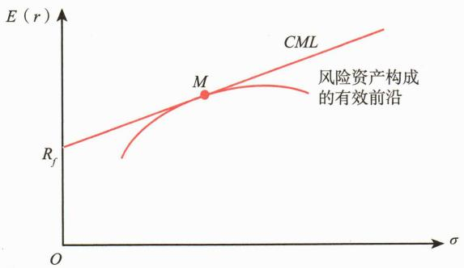

# 第二节 资本市场理论

<table><tr><td>学习内容</td><td>知识点</td></tr><tr><td>资本市场理论的假设</td><td>资本市场理论的前提假设</td></tr><tr><td>资本配置线</td><td>资本配置线</td></tr><tr><td>资本市场线</td><td>资本市场线</td></tr><tr><td>系统性风险和非系统性风险</td><td>系统性风险、非系统性风险和风险分散化</td></tr><tr><td>β系数的衡量</td><td>β系数的计算</td></tr><tr><td>资本资产定价模型</td><td>资本资产定价模型、证券市场线和CAPM的应用</td></tr><tr><td>套利定价模型与多因子模型</td><td>无套利定价思想、假设、模型应用、APT与CAPM差异</td></tr></table>

# 一、资本市场理论的假设

20世纪60年代，威廉·夏普、约翰·林特耐和简·莫辛三位学者基于马科维茨的均值方差模型，提出了资本市场理论和资本资产定价模型，研究在特定假设下均衡价格的形成。

资本市场理论和资本资产定价模型的前提假设包括：

（1）所有的投资者都是风险厌恶者，都以马科维茨均值—方差分析框架来分析证券，追求效用最大化，购买有效前沿与无差异曲线的切点的最优组合。

资本市场理论的七条前提假设可以归结为两条：一是所有投资者都是一样的；二是市场是有效的。

这七条假设是资本市场理论的前提假设，也是资本资产定价模型的前提假设。

以上假设忽略了许多现实世界的复杂性，但却提供了认识市场均衡状态本质的方法。在这些假设前提下，市场均衡状态可以总结如下，我们将在之后的部分进行详细阐述。

# 二、资本配置线

马科维茨有效前沿上的投资组合仅包含了所有风险资产，威廉·夏普对马科维茨

有效前沿进行了改进，引入了无风险资产。

对于一个由风险资产x和无风险资产组成的投资组合，其中风险资产x的权重为 $w_{x}$ ，收益率为 $R_{x}$ ，标准差为 $\sigma_{x}$ ；无风险资产的权重为 $(1-w_{x})$ ，收益率为 $R_{f}$ ，标准差为0。那么组合的期望收益率为：

组合的方差为:

由于无风险资产的标准差为0（ $\sigma_{f}=0$ ），所以右边第二项和第三项都等于0，可以得到：

两边开方求标准差，得到：

变形得到： $\omega_{x} = \frac{\sigma_{\rho}}{\sigma_{x}}$ ，代入 $E(R_{p})$ 公式，可得：

上式即为资本配置线（Capital Allocation Line，CAL）的表达式。资本配置线上的点表示无风险资产与风险资产x的线性组合，其截距是无风险收益率 $R_{f}$ ，斜率是 $\frac{E(R_{x})-R_{f}}{\sigma_{x}}$ （见图9-9）。值得注意的是，这个斜率就是风险资产x的夏普比率（Sharpe Ratio），也是这条CAL上任一点的夏普比率。

每一个投资者对于收益和风险都有不同的预期和偏好，因此，每一个投资者都有不同的最优投资组合及不同的CAL。有效前沿上的点表示所有投资者最优的风险资产组合。我们取无风险资产与有效前沿上的点相连，可以得到无数条CAL（见图9-10）。

在这无数条 CAL 中，最优的 CAL 是与有效前沿相切的那条。因为在相同的风险水平下，最优的 CAL 期望收益率最高，具体如图 9-11 所示。

# 三、资本市场线

如图9-12所示，若不考虑无风险资产，由风险资产构成的马科维茨有效前沿在标准差—预期收益率平面中的形状为双曲线上半支。当引入无风险资产后，不同的投资者有不同的最优资产组合以及不同的资本配置线。从前面分析我们已知道，对于投资者来说，最佳的资本配置线是与马科维茨有效前沿相切的一条直线，这条直线取代了马科维茨有效前沿，成为新的有效前沿，称为资本市场线（Capital Market Line, CML）。资本市场线从纵轴上无风险利率点处向上延伸，与原马科维茨有效前沿曲线相切于点M，这条直线上包含了所有风险资产投资组合M与无风险资产的组合。当市场达到均衡时，切点M即为市场投资组合（Market Portfolio）。理论上，市场投资组合包含市场上所有的风险资产，并且其包含的各资产的投资比例与整个市场上风险资产的相对市值比例一致。

 — 图9-12 资本市场线

资本市场线的表达式为：

从公式可以看出，CML的斜率，即为市场组合的夏普比率，而CML上任一个组合的夏普比率都等于市场组合的夏普比率。因为CML取代了马科维茨有效前沿成为新的有效前沿，CML上所有的组合都是有效组合，即所有的组合都是完全分散化了的资产组合。

根据前述CAPM的假定，所有投资者都具有相同的预期，都是理性的。既然如此，那么所有投资者都会得到同样的有效前沿，所有投资者的选择最终都会落在CML上。因此，每一位投资者都将以无风险资产和市场投资组合M来构造适合自己需求的最优投资组合，所不同的仅是每个投资者在M上的资金投放比例不同而已。由于每个投资者都持有相同的风险投资组合M，而市场投资组合是所有投资者持有的风险资产组合的加总，因此，风险投资组合M中各资产的比例恰好与市场投资组合一致，或者说M就是市场投资组合。市场投资组合具有三个重要的特征：其一，它是有效前沿上唯一一个不含无风险资产的投资组合；其二，有效前沿上的任何投资组合都可看作是市场投资组合M与无风险资产的再组合；其三，市场投资组合完全由市场决定，与投资者的偏好无关。因此，市场投资组合在资本资产定价理论中具有重要的地位。

资本市场线实际上指出了有效投资组合风险与预期收益率之间的关系，提供了衡量有效投资组合风险的方法。有效投资组合即是分布于资本市场线上的点，代表了有效前沿。特别是它指出了以标准差来表示的有效投资组合的风险，其与回报率之间是一种线性关系，因此以标准差来度量风险是更为合适的。对于每一个有效投资组合而言，给定其风险的大小，便可根据资本市场线计算出其预期收益率的大小。

# 四、系统性风险和非系统性风险

多元化的资产配置有助于分散风险。首先通过一个简单的例子来理解风险分散化原理。

图[案例9-2]假设有两家公司，一家是橙汁生产公司，一家是雨伞制造公司。两家公司的业绩都易受到天气的影响。橙汁生产公司的业绩在天气晴朗的情况下较好，而雨伞制造公司的业绩在天气阴雨的情况下较好。假设在未来一年天气平均较为晴朗的概率为 $50\%$ ，平均较为阴雨的概率为 $50\%$ 。两家公司在两种状态下的预期收益率具体如表9-2所示。

**表 9-2 两公司在不同天气状态下的预期收益率**

<table><tr><td></td><td>晴朗</td><td>阴雨</td></tr><tr><td>橙汁生产公司</td><td>10%</td><td>-2%</td></tr><tr><td>雨伞制造公司</td><td>-2%</td><td>10%</td></tr></table>

橙汁生产公司的预期收益率 $= 10\% \times 50\% + (-2\%) \times 50\% = 4\%$

雨伞制造公司在未来一年的预期收益率和标准差同样分别为4%和6%。

投资者如果将所有的资金都投资于其中某一家公司，那么他的预期收益率为 $4\%$ ，预期收益率的标准差为 $6\%$ 。

如果投资者将资金平均投资于两家公司，那么在天气较晴朗的状态下，投资者的收益率为 $10\% \times 50\% - 2\% \times 50\% = 4\%$ 。在天气较阴雨的状态下，投资者也将获得 $4\%$ 的收益率。此时投资者获得了确定性的收益率 $4\%$ ，投资风险为零。在上述案例中，通过分散化投资，投资者消除了风险。投资者之所以可以分散化风险，其中的关键原因是两种资产的收益波动存在相反的趋势。

我们也可以考虑另一个特别的情形，即两种资产的收益具有同样的波动规律。在这种情况下，如果不允许投资者卖空资产的话，那么投资者无法利用这样的两种资产来构建预期收益率相同而风险更低的投资组合来。这说明我们无法将各资产共同的风险分散化。我们通常无法分散化资产收益中的系统性风险。因为系统性风险通常使得所有资产的收益出现相同的变化。在不卖空资产的情形下，无论怎样搭配投资组合，系统性因素总是使得投资组合中的所有资产出现同向的收益波动，从而投资组合也出现同向的收益波动。

通过投资资产组合，可以降低风险，但不能完全消除风险。我们把可以通过构造资产组合分散掉的风险称为“非系统性风险”（Non-systematic Risk），不能通过构造资产组合分散掉的风险称为“系统性风险”（Systematic Risk）。这样资产组合的总风险可以表示为系统性风险和非系统性风险之和：

总风险=系统性风险+非系统性风险

“天下没有免费的午餐”，投资者要求在承担风险的时候得到风险补偿，即风险溢价。非系统性风险可以通过构造资产组合分散掉，是可以避免的风险，因此，承担非系统性风险不能得到风险补偿。风险补偿只能是对于不可避免的风险的补偿，即承担系统性风险的补偿。当组合中资产的数目逐渐增多的时候，非系统性风险就会被逐步分散，但是无论资产数目有多少，系统性风险都是固定不变的（见图9-13）。

上述分析的一个假设前提是，非系统性风险是可以被分散掉的，且没有分散成本，所以非系统性风险无法得到风险补偿，获得补偿的只有系统性风险。在此前提下，资产在市场均衡状态下的收益率取决于该资产或资产组合的系统性风险，而不是

由方差衡量的总风险。

资本市场线中，我们用方差/标准差来衡量总风险。但是资本市场线线上的市场组合是一个完全分散化的资产组合，其非系统性风险都被分散掉了，只有系统性风险。而资本市场线线上的任一组合都是对无风险资产和市场组合做配比得到的，因为无风险资产是没有风险的，市场组合只有系统风险，所以由这两者构成的组合也只有系统性风险，因此，资本市场线上的任一组合只有系统性风险，没有非系统性风险。

# 五、β 系数的衡量

方差和标准差能够衡量资产的收益—风险特征，但不能对风险的构成进行分析。这里我们引入 $\beta$ 系数（Beta Coefficient）来衡量资产所面临的系统性风险。 $\beta$ 系数衡量的是资产收益率和市场组合收益率之间的线性关系。

式中： $r_{i,t}$ 为 t 期资产 i 的实际收益率； $r_{m,t}$ 为 t 期市场组合的收益率； $\beta_{i}$ 为该资产的 $\beta$ 系数，是该线性方程的斜率； $\alpha_{i}$ 为线性方程的截距项； $\varepsilon_{i,t}$ 为误差项。

用最小二乘法回归可得:

式中： $\beta_{i}$ 是资产的 $\beta$ 系数； $Cov_{i,m}$ 是资产收益率和市场组合收益率之间的协方差； $\sigma_{m}^{2}$ 是市场组合收益率的方差； $\sigma_{i}$ 是资产收益率的标准差； $\rho_{i,m}$ 是资产收益率和市场组合收益率之间的相关系数。 $\beta$ 系数度量的是资产收益率相对于市场组合收益率波动的敏感性。市场组合本身的 $\beta$ 系数为1。当 $\beta_{i} = 1.5$ 时，市场组合上涨 $1\%$ ，该资产随之上涨 $1.5\%$ ；当 $\beta_{i} = 0.5$ 时，市场组合上涨 $1\%$ ，该资产随之上涨 $0.5\%$ 。

# 六、资本资产定价模型

资本资产定价模型（CAPM）以马科维茨证券组合理论为基础，研究如果投资者都按照分散化的理念去投资，最终证券市场达到均衡时，价格和收益率如何决定的问题。这种方法是描述性的，它用一般均衡模型刻画所有投资者的集体行为，揭示在均衡状态下，证券收益与风险之间的关系的经济本质。

CAPM的建立基于本节开头所述的一系列假设。这些假设虽然并不符合现实情况，但对问题的解决提出了基础理论。在此基础上，我们可以根据现实情况一步一步更改假设，修改模型，从而得到相对合理且贴近现实的模型。

# (一) CAPM 的主要思想

CAPM 假设所有的投资者都进行充分分散化的投资，没有投资者会 “关心” 非系统性风险。因此，只有证券或证券组合的系统性风险才能获得收益补偿，其非系统性风险将得不到收益补偿。按照该逻辑，投资者要想获得更高的报酬，必须承担更高的系统性风险；承担额外的非系统性风险将不会给投资者带来收益。

CAPM使用 $\beta$ 系数来描述资产或资产组合的系统风险大小。 $\beta$ 系数表示资产对市场收益变动的敏感性。在充分分散化的投资组合中，单个证券对高度分散化的组合风险的贡献取决于其用 $\beta$ 系数衡量的系统风险。因此，资产的风险溢价与其 $\beta$ 系数成正比，即：

式中： $E(r_{i})$ ——资产i的预期收益率； $E(r_{m})$ ——市场组合的预期收益率； $r_{f}$ ——无风险收益率； $\beta_{i}$ ——资产i的 $\beta$ 系数，市场组合的 $\beta$ 系数 $\beta_{m}$ 为1； $E(r_{i})-r_{f}$ ——资产风险溢价； $E(r_{m})-r_{f}$ ——市场组合风险溢价。

将上式变形可得资本资产定价模型的公式：

CAPM体现了资产的期望收益率与系统风险之间的正向关系，即任何资产的市场风险溢价（收益率超过无风险利率的差额），等于资产的系统性风险（ $\beta$ 系数）乘以市场组合的风险溢价。预期收益率与 $\beta$ 系数的关系式是CAPM的一个重要组成部分。

CAPM中的预期收益率与 $\beta$ 系数的关系式具有十分重要的经济意义。 $\beta$ 系数与证券对最优风险组合的风险的贡献成正比。如果一个证券的 $\beta$ 系数相对较低（如0.5），风险溢价是另外一个 $\beta$ 系数为1.5的证券的 $1 / 3$ 。对于可以进行充分分散化投资的投资者而言，只有系统风险才是最重要的，而系统风险用 $\beta$ 系数来衡量。投资者要求的资产风险溢价与 $\beta$ 系数成正比，风险溢价 $= \beta_{i}\left[E(r_{m}) - r_{f}\right]$ 。

# （二）证券市场线（SML）

预期收益率与 $\beta$ 系数的关系式可以表示成证券市场线（Security Market Line，SML）。如图9-14所示。证券市场线的斜率是市场组合的风险溢价。市场组合也恰好位于证券市场线上，即图中的M点，该点 $\beta$ 系数为1，相对应的预期收益率是市场组合的预期收益率。一项资产或资产组合的 $\beta$ 系数越高，则它的预期收益率越高。 $\beta$ 系数为零的资产的预期收益率等于无风险收益率。

SML是以资本市场线为基础发展起来的。资本市场线给出了所有有效投资组合风险与预期收益率之间的关系，但没有指出每一个风险资产的风险与收益之间的关系。证券市场线则给出每一个风险资产风险与预期收益率之间的关系，也就是说证券市场线能为每一个风险资产进行定价。这是CAPM的核心。

将证券市场线与资本市场线进行比较。资本市场线描述了有效组合（由最优风险组合与无风险资产所构成的整个组合）的市场溢价与组合标准差之间的函数关系。之所以可以得到资本市场线，原因在于，标准差可用于有效地衡量组合的风险，因而可以作为衡量整个组合的风险的辅助工具。资本市场线是用来进行资产配置（在无风险资产和市场组合之间进行资产配置）的一个工具。因为资本市场线上的组合都是有效组合，它构成了一个新的有效前沿。而资本市场线的斜率是市场组合的夏普比率。

证券市场线则描述了单个资产的风险溢价与市场风险之间的函数关系。用于评估单个资产（单个资产是高度分散化的投资组合中的一部分）对整个组合的风险贡献，这种贡献可以用资产的 $\beta$ 值来衡量。证券市场线既适用于资产组合，又适用于单个资产。我们可以用证券市场线来给资产确定一个最合理的预期收益率。证券市场线是基于资本资产定价模型的，斜率是市场组合的风险溢价。

表9-3总结了证券市场线和资本市场线的区别：

**表 9-3 证券市场线和资本市场线的区别**

<table><tr><td></td><td>SML</td><td>CML</td></tr><tr><td>风险的衡量</td><td>系统性风险(用 $\beta$ 值衡量)</td><td>总风险(用标准差衡量)</td></tr><tr><td>应用</td><td>决定资产最合理的预期收益率(定价)</td><td>决定最合适的资产配置点(资产配置)</td></tr><tr><td>斜率</td><td>市场组合的风险溢价</td><td>市场组合的夏普比率</td></tr><tr><td>适用范围</td><td>1单个资产或投资组合2有效投资组合和无效投资组合</td><td>有效投资组合</td></tr></table>

****

# （三）CAPM的应用

在CAPM中，证券市场线得以成立是投资者的最优选择以及市场均衡力量作用的结果。若某资产或资产组合的预期收益率高于与其 $\beta$ 值对应的预期收益率，也就是说位于证券市场线的上方，则理性投资者将更偏好于该资产或资产组合，市场对该资产或资产组合的需求超过其供给，最终抬升其价格，导致其预期收益率降低，使其向证券市场线回归；反之，若某资产或资产组合位于证券市场线的下方，则理性投资者将不愿意投资该资产或资产组合，导致市场对它供过于求，价格下降，预期收益率上升，最终该资产或资产组合收益率也会向证券市场线回归。

证券市场线可以用来判断一项资产的定价是否合理。如果一项资产的定价合理，其应当位于SML线上，如图9-15中的A点所示。如果一个资产的价格被高估（收益率被低估），其应当位于SML线下方，如图9-15中的B点所示。如果一个资产的价格被低估（收益率被高估），其应当位于SML线上方，如图9-15中的C点所示。对于价格被高估的资产我们应该卖出，价格被低估的资产我们应该买入。

在现实中，CAPM的假设条件未必能得到满足。不是所有的投资者都会完全按照分散化的理念去投资，不同投资者对于各资产的预期收益率及风险的判断也不会完全一致。这将导致现实中各资产的预期收益率未必与CAPM的预测结果一致。CAPM解释不了的收益部分习惯上用希腊字母阿尔法（α）来描述，有时称为“超额”收益。

[案例9-3]在证券投资组合的管理中，投资者可以利用CAPM评估证券的风险和期望收益率，从而作出投资决策。例如，如果市场期望收益率为 $12\%$ ，A股票的 $\beta$ 值为1.2，无风险收益率为 $6\%$ ，如果某投资者预计这只股票的收益率为 $15\%$ ，依据证券市场线可以得出：

A 股票的期望收益率 =6%+1.2 × (12%-6%) =13.2%

预期投资该股票可获得超额收益=15%-13.2%=1.8%

因此，依据CAPM，他可能作出买入的决策。

如果B股票的 $\beta$ 值为1.5，投资者预计B股票的收益率为 $16\%$ ，在他只能投资一只股票的情况下，他会选择投资哪只股票？

B 股票的超额收益 = 16% - [6% + 1.5 × (12% - 6%)] = 1% < 1.8%

因此投资者仍会选择投资A。

图9-16以图形的方式表现了资产A的 $\alpha$ 值。

CAPM为投资业绩评价提供了一个基准。不同的资产组合由于风险不同，其收益率并不能直接比较，而 $\alpha$ 值则反映了市场风险调整后的超额收益。

# 七、套利定价理论与多因子模型

资本资产定价模型（CAPM）作为一种均衡定价模型在实际中的测量系统风险、证券估价等方面得到广泛运用。但是，CAPM基于一系列严格的假设，并且将所有证券价格变化的可能解释归结为单一的系统性风险因素，因此，其在实际应用中的有效性和普遍性受到了质疑。

1976年，美国金融经济学家罗斯提出了套利定价理论（Arbitrage Pricing Theory, APT），这一理论建立在比资本资产定价模型更少且更合理的假设之上。APT导出的均衡模型与资本资产定价模型有很多相似之处，但其灵活性和适用性更强。

# （一）套利定价理论（APT）的基本原理与假设

# 1. 套利

套利（Arbitrage）是指利用一个或多个市场上同时存在的各种价格差异，在理论上不承担风险（或实际操作中承担较小风险）的情况下获取收益的金融交易行为。套利行为常常需要同时进行等量证券或等价资产的买卖，以便从其价格的差异中获取利润。套利作为一种广泛使用的投资策略，包括多种形式，如跨市场套利、跨期套利、统计套利等。

[案例9-4] 假定在一个有四类不同经济环境的市场中，只有四种股票在进行交易。表9-4和表9-5分别展示了在不同通货膨胀-利率环境下，这四种股票的预期收益率情况，以及它们的当前价格和收益率的统计数据。

**表 9-4 / 预期收益率 / (单位：%) **

<table><tr><td rowspan="2">项目</td><td colspan="2">高实际利率</td><td colspan="2">低实际利率</td></tr><tr><td>高通胀率</td><td>低通胀率</td><td>高通胀率</td><td>低通胀率</td></tr><tr><td>概率</td><td>0.25</td><td>0.25</td><td>0.25</td><td>0.25</td></tr><tr><td>A</td><td>-20</td><td>20</td><td>40</td><td>60</td></tr><tr><td>B</td><td>0</td><td>70</td><td>30</td><td>-20</td></tr><tr><td>C</td><td>90</td><td>-20</td><td>-10</td><td>70</td></tr><tr><td>D</td><td>15</td><td>23</td><td>15</td><td>36</td></tr></table>

**表 9-5 / 收益率统计**

<table><tr><td rowspan="2">股票</td><td rowspan="2">现价</td><td rowspan="2">收益率(%)</td><td rowspan="2">标准差(%)</td><td colspan="4">相关系数</td></tr><tr><td>A</td><td>B</td><td>C</td><td>D</td></tr><tr><td>A</td><td>10</td><td>25.00</td><td>29.58</td><td>1.00</td><td>-0.15</td><td>-0.29</td><td>0.68</td></tr><tr><td>B</td><td>10</td><td>20.00</td><td>33.91</td><td>-0.15</td><td>1.00</td><td>-0.87</td><td>-0.38</td></tr><tr><td>C</td><td>10</td><td>32.50</td><td>48.15</td><td>-0.29</td><td>-0.87</td><td>1.00</td><td>0.22</td></tr><tr><td>D</td><td>10</td><td>22.25</td><td>8.58</td><td>0.68</td><td>-0.38</td><td>0.22</td><td>1.00</td></tr></table>

根据表9-4和表9-5中的数据，构造一个由等权重的A、B、C三种股票组成的资产组合，将其可能的未来回报率与第四种股票D作对比，可以看到这个等权重组合在所有经济环境下的变现都优于股票D。表9-6展示了这两种选择的收益率统计情况。

**表 9-6 / 资产组合与股票 D 的收益率**

<table><tr><td>项目</td><td>收益率(%)</td><td>标准差(%)</td><td>相关系数</td></tr><tr><td>A、B、C三种股票等权重组合</td><td>25.83</td><td>6.40</td><td rowspan="2">0.94</td></tr><tr><td>D股票</td><td>22.25</td><td>8.58</td></tr></table>

根据表9-5，每只股票的现价均为10元。投资者可以通过卖空3份D股票获得现金30元，同时承担未来回购3份D股票并归还的义务（此处忽略交易成本和费用）。然后，用这30元现金分别购买1份A、1份B和1份C股票（每份10元，合计30元）。该策略在期初无需初始净投资，预期到期末的时候，期间通过持有A、B、C股票组合可获得 $25.83\%$ 的收益率，而由于预期D股票价格将上涨 $22.25\%$ ，卖空D股票头寸将产生 $22.25\%$ 的成本（或亏损），总体可获得 $3.58\%$ 的净收益差。由于A、B、C三种股票等权重组合与D股票的相关系数高达0.94，可以在很大程度上对冲系统性风险，仅承担较小的特质风险，实现套利收益。

显然，其他投资者也会使用类似策略，导致D股票被频繁卖空，其价格随之下降，未来预期收益率相应提升；而A、B、C三种股票被投资者不断买入，价格上升未来收益率下降。这意味着市场投资者迅速发现并利用这样的套利机会，推动股票价格趋于均衡，套利机会也随之消失。

套利行为是维持市场有效性的重要机制。当套利机会出现时，投资者会迅速采取行动，导致这些机会很快消失。这一过程有助于保持市场的价格一致性和效率。然而，在实际市场中，套利机会的利用可能受到诸如交易成本、卖空限制、流动性问题等因素的制约。

# 2.APT 的基本原理

套利定价理论的核心思想是：在一个有效的市场上，具有相同属性（如风险、流动性等）的资产之间不存在无风险套利机会。如果投资者能够构建出一个初始净投资为零、不承担显著风险且能获得正收益的证券组合，那么所有投资者都会竞相投资这一组合，最终导致该组合的价格调整，直至其收益降为零。当市场达到这种均衡状态时，套利机会消失。

虽然单个证券在不同市场上的价格差异可能会产生明显的套利机会，但更常见的情况是，套利机会存在于“类似”的证券或投资组合之间。具有相同风险因素敞口（Factor Exposure）的证券或投资组合，在剔除特质风险（Idiosyncratic Risk）的影响后，理论上应该呈现相同的价格表现。因此，这些具有相同风险特征的证券或组合应当要求相同的预期收益率。

如果出现预期收益率的不一致，套利机会就会产生。投资者会利用这些机会获利，最终导致价格趋同。这一过程体现了套利定价理论的核心原则——“一价定律”

(Law of One Price): 在无摩擦的市场中, 通过套利行为, 具有相同风险和收益特征的证券或投资组合的价格最终会趋于一致。

这种定价机制确保了金融市场的效率，减少了错误定价的持续存在，并促进了资产价格的合理化。然而，需要注意的是，在现实市场中，由于交易成本、信息不对称和其他市场摩擦的存在，完美的套利可能难以实现，这也为主动投资管理提供了潜在的机会。

# 3.APT 的几个关键假设

# 4.APT 的数学表达

套利定价理论（APT）的基本模型形式为：

式中： $E(r_{i})$ 是证券 $i$ 的期望收益率； $\lambda_0$ 是与证券 $i$ 和所有 $k$ 个影响因素无关的常数，一般代表无风险收益率或市场定价中与风险因子无关的基准收益率； $b_{ik}$ 是证券 $i$ 对第 $k$ 个影响因素的敏感度系数； $\lambda_{k}$ 是第 $k$ 个因素的单位风险溢价，代表投资者因承担该单位风险因素而期望获得的额外回报。

# （二）APT理论与CAPM区别

套利定价模型（APT）与资本资产定价模型（CAPM）主要有以下区别：

风险偏好作出特定假设，因此APT具有更广泛的适用性。

3. 投资策略的灵活性：根据套利定价理论，投资者可以构建多个因素组合，并根据自己的风险偏好选择性地承担或回避某些风险。这为投资者提供了更灵活的资产配置策略。

# (三) 多因子模型

套利定价理论（APT）的贡献在于从理论上证明了多个定价因子可能决定证券的收益率。然而，APT并未明确这些定价因子具体是什么，这限制了其在现实中的应用。20世纪80年代，围绕套利定价理论的有效性及定价因子的选择展开了大量实证研究。

1993年，Fama和French通过实证研究，提出股票收益的风险溢价可以更有效地用市场风险、市值风险及账面市值比风险三个因素来解释，构建出著名的Fama-French三因子模型。他们认为，股票的风险溢价可以由市场风险、市值风险、账面市值比风险来共同解释，把个股的风险溢价分解成市值因素、账面市值比因素和其他未被解释的因素，建立如下回归式：

式中： $R_{it}$ ——证券或组合i在t时期的收益率； $R_{Ft}$ ——同期无风险收益率； $R_{Mt}$ ——同期以市值加权构造的市场组合收益率； $SMB_{t}$ ——充分分散化的小市值股票组合收益减去充分分散化的大市值股票组合收益率； $HML_{t}$ ——高账面市值比股票构成的分散化组合和低账面市值比股票构成的分散化组合收益率差额； $e_{it}$ ——回归残差。

如果三因子模型中的三个因子可以完全解释各种风险带来的收益，那么任何一个股票以及任何一个投资组合的 $\alpha$ 应为0。在过去20年里，很多学者（如Novy-Marx, 2012；Titman、Wei and Xie, 2004）对三因子模型进行实证分析，发现有些股票的 $\alpha$ 显著不为0，这说明三因子模型并不能解释所有风险溢价。

2013年Fama和French发现在上述风险之外，还有盈利水平风险、投资水平风险也能带来个股的超额收益，加入这两个因子后能更好地解释个股的风险溢价，由此提出了五因子模型。

式中： $RMW_{t}$ ——分散化了的高/低盈利股票投资组合的回报之差； $CMA_{t}$ ——低/高再投资比例公司股票投资组合的回报之差。这两项分别描述了盈利水平风险、投资水平风险。与三因子模型类似，参数估计的方法仍然是用多元线性回归的方法，这里的 $\alpha$ 则是五因子模型里尚未解释的风险溢价。

需要指出的是，由于Fama-French模型缺乏严谨的经济学假设，三因子模型提出后就受到了很多学者的批评。例如，Fischer & Black（1993）批评Fama-French模型存在数据挖掘（Data Mining）嫌疑，即通过反复尝试大量可能的因子组合，从而偶然发现能够解释历史数据的因子组合，缺乏理论基础。但是，也有很多研究指出三因子模型和五因子模型在不同国家长期适用，能够解释 $90\%$ 的资产个体收益差距。随着实证研究的发展，学术界和量化投资机构已经发掘了超过300个定价因子。相比CAPM和APT，多因子模型在实际应用中更受业界推崇。
