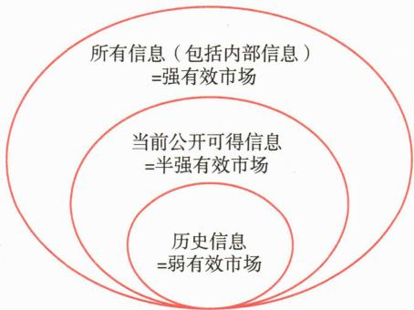

# 第三节 市场有效性与行为金融

<table><tr><td>学习内容</td><td>知识点</td></tr><tr><td>市场有效性</td><td>市场有效性的定义与信息分类,弱有效、半强有效、强有效市场特征,市场竞争与有效性的关系</td></tr><tr><td>行为金融</td><td>行为金融学的基本概念与研究方法,与有效市场假说的主要差异,前景理论,认知偏差与情感偏差,套利限制与市场行为,行为金融的作用、意义、批评与未来发展</td></tr></table>

# 一、市场有效性

在信息有效的市场中，投资工具的价格应当能够反映所有可获得的信息，包括历史价格信息、基本面信息及风险信息等。如果市场有效，证券价格已经反映了所有信息；如果市场无效，证券价格相对于公司的真实价值可能被高估或者低估，投资管理人若能发现定价的偏离，就有可能从中获得超额收益。

20世纪70年代，美国芝加哥大学的教授尤金·法马（Eugene F. Fama）提出了有效市场假说（Efficient Market Hypothesis，简称EMH），系统性地阐述了市场有效性的标准，并将信息分为历史信息、当前公开可得信息和内部信息三类。其中，“历史信息”主要包括证券交易的有关历史资料，如历史股价、成交量等；当前“公开可得信息”，即一切可公开获得的有关公司财务及其发展前景等方面的信息；“内部信息”则为还未公开的只有公司内部人员才能获得的私人信息。在此基础上，Fama界定了三种形式的有效市场：弱有效、半强有效与强有效。三种市场有效性的层次关系，具体如图9-17所示。

 — 图9-17 市场有效性的三个层次

# （一）弱有效证券市场

弱有效市场，是指证券价格能够充分反映所有历史价格与成交量信息，即价格历史序列所包含的全部信息都已经被消化吸收至当前证券价格中。因此，在一个弱有效的证券市场上，投资者无法仅凭借对历史价格、成交量等交易数据进行技术分析来预测证券未来的价格走势并持续获得超额收益。因此，如果市场达到弱有效状态，纯粹依靠历史价格走势进行预测的技术分析将不再有效。

# （二）半强有效证券市场

半强有效证券市场，是指证券价格不仅充分反映了历史价格信息，而且能迅速、充分地反映当前所有与公司证券相关的公开信息，如盈利预测、红利发放、股票分拆、公司并购等各种公告信息。

如果市场达到半强有效状态，则意味着任何投资者都无法仅凭分析当前公开信息而持续获得超额利润。换言之，市场参与者不可能通过基本面分析（例如财务报表分析、估值分析等）等公开信息分析方法，持续地获得超过市场平均水平的投资收益。

需要注意的是，半强有效市场并不意味着证券价格对新信息的反应一定是瞬间完成的。信息被市场完全吸收和反映在价格上，可能需要一个短暂的调整过程。在信息发布后的短暂时段内，证券价格可能围绕新的均衡价格出现一定程度的波动，但整体而言，这种调整应迅速而充分。如果新信息发布后市场价格在较长时间内显著偏离新的均衡价格，则意味着投资者仍可能通过分析这些公开信息获取超额收益，说明市场尚未达到半强有效状态。

# （三）强有效证券市场

强有效证券市场是一种理论上的理想状态，指证券价格能够充分、及时地反映所有信息，包括公开发布的信息和未公开发布的内部信息。换句话说，由于强有效市场价格反映了所有信息，它自然也囊括了弱有效市场（价格反映历史信息）和半强有效市场（价格反映所有公开信息）的特征，并进一步包含了那些通常只有“内部人”才能掌握的私有信息。

在证券市场上，总有一些人拥有一定的信息优势，如上市公司管理层掌握着尚未公开发布的公司信息。强有效市场则意味着即便是那些拥有“内部信息”的市场参与者也不能凭借该信息获得超额收益，因为市场价格已经完全体现了所有相关的私有信息。这意味着，在严格意义上的强有效的证券市场中，任何投资者都无法通过任何形式的信息优势，长期地、持续地获得超额收益，他们能够获得的超额收益只能归因于纯粹的运气因素。

# （四）竞争是市场效率的根源

市场有效性理论之所以成立，主要依赖两条假设：

第一，投资者总体上是理性的，能够迅速、准确地利用所有可获得的信息；

第二，即使市场上存在非理性投资者，他们的交易行为也是随机且无系统性偏差的，并且市场中存在足够数量的理性套利者，能够迅速发现并纠正非理性行为所引起的价格偏离。

归根结底，证券价格之所以能趋向于反映所有相关信息，其根本原因是市场竞争。投资者花费时间和金钱去收集、分析各类信息，其目的是提高期望收益，否则这种投入便得不偿失。由于市场上存在着大量的投资者，这些投资者都在努力寻求一切可能的获利机会，他们会将所掌握的信息运用于投资决策，这些决策行为共同推动信息反映到证券价格中。

在市场竞争的均衡状态下，证券价格趋向于充分体现那些能够影响投资者决策并已被他们运用的信息。一旦证券价格出现显著偏离基本价值的情况，就会产生套利获利机会，从而迅速吸引套利者介入。这些套利者的行动又会在极短时间内纠正价格偏差，使市场重新恢复到均衡状态。正是这种持续不断的信息竞争与套利机制，使得市场价格趋向于有效，最终促使证券价格能够持续地反映所有可获得的信息。

# 二、行为金融

在研究有效市场假说的过程中，学者们发现了一些与其相悖的现象，这些现象长时间存在或反复出现，无法用有效市场假说进行解释，被称为有效市场“异象”。典型的异象包括“1月份效应”“周历效应”“规模效应”“价值效应”“盈利公告后的价格漂移现象”等。对于产生异象的成因，存在有两种主要观点：一种观点认为这些现象可以用风险溢价解释，从而依然支持有效市场假说；另一种观点则认为这些异象是市场无效性的表现，因此引入行为金融理论来进行解释。

# （一）行为金融概述

行为金融（Behavioral Finance）是一门研究投资者和市场参与者的心理和情感因素如何影响其金融决策和市场行为的学科。该学科结合心理学和金融学，强调非理性因素在金融市场中的作用，挑战了传统金融理论中的理性假设，为理解金融市场提供了新的视角。行为金融学不仅关注个体决策的心理过程，更致力于揭示这些个体行为偏差如何汇聚并系统性地影响市场价格和整体市场特征，这些市场特征往往是传统金融理论难以解释的。

行为金融的历史发展可以追溯到20世纪70年代，当时心理学家和经济学家开始研究市场参与者的行为和决策过程。丹尼尔·卡尼曼（Daniel Kahneman）和阿莫斯·特沃斯基（Amos Tversky）在1979年发表的论文《Prospect Theory: An Analysis of Decision under Risk》被广泛认为是行为金融学的奠基性工作之一。这篇论文提出了前景理论，对传统的期望效用理论提出了挑战，为理解人们在风险和不确定性下的决策行为提供了新的框架。

罗伯特·席勒在其1984年发表的代表性论文《Stock Prices and Social Dynamics》中探讨了股票价格波动与社会心理因素之间的关系。他提出，市场价格不仅由基本面因素决定，还受到投资者情绪、社会动态等非理性因素的影响。这篇论文挑战了传统的有效市场假说，强调了市场中的非理性行为和心理因素在价格形成中的作用。

行为金融通过结合心理学、行为理论和金融分析的研究方法，探索人类心理、情绪及行为对金融决策、金融产品价格和市场趋势的影响，尤其注重理解和解释情绪与非理性行为如何影响投资者的决策结果。为实现这一目标，行为金融运用多学科交叉的方法，主要包括控制实验观察个体决策行为、收集大规模样本的行为和态度数据、利用脑成像技术的神经科学方法研究决策中的神经活动，以及通过计算机模拟构建基于行为假设的市场模型等。

随着技术的发展，新的数据来源，如大数据分析，也日益成为行为金融研究的重要工具，为洞察投资者行为提供了前所未有的深度和广度。

基于前景理论及其他行为心理学研究成果，行为金融学识别并归纳了多种在投资决策过程中常见的系统性判断偏差和行为倾向。这些个人行为偏差通常可以划分为认知偏差与情感偏差两大类别。

认知偏差主要源于个体在信息处理过程中的逻辑缺陷、错误的统计推断，或对“启发式思维”（即个体在复杂不确定环境下为简化决策、节省认知资源而依赖的经验法则或心理捷径）的不当运用。例如，投资者可能因过度依赖刻板印象而产生代表性偏差；因更容易回忆起近期或鲜明事件而出现可得性偏差；或因初始信息对后续判断造成过度影响而表现出锚定与调整效应。其他常见的认知偏差还包括保守型偏差、确认型偏差、控制错觉、后见之明偏差、心理账户以及框架依赖等。从理论上讲，认知偏差通常可以通过加强相关知识教育、提供及时准确的反馈或进行针对性的决策训练来识别和纠正。

与认知偏差不同，情感偏差则根植于个体的情绪、感受或非理性冲动，而非纯粹的逻辑分析。这类偏差即便被投资者意识到，也往往难以仅通过认知层面的训练完全消除。典型的情感偏差包括对损失的厌恶程度远超等量收益带来的喜悦感的损失厌恶、对自身能力或判断过度高估的过度自信、缺乏延迟满足与规划能力的自控力不足、倾向于维持现状的惰性偏差、对已拥有物品赋予过高价值的禀赋效应以及为了避免未来可能的后悔情绪而做出非理性决策的后悔厌恶等。

认知偏差与情感偏差并非总是独立出现，它们常常相互交织、彼此强化，共同导致投资者在复杂和不确定性环境中的判断与决策偏离理性基准，从而可能对投资绩效产生不利影响。

行为金融与有效市场假说存在三个显著差异：

3. 套利的有效性：有效市场假说认为，即使存在非理性行为，市场中的套利者会纠正价格偏差，使价格回归理性；行为金融认为，套利受到多种因素限制，常常无法完全纠正价格偏差。

# （二）前景理论

前景理论（Prospect Theory）作为行为金融学的核心基石之一，深刻揭示了人们在面对潜在收益与损失时，真实的决策模式与传统期望效用理论的理性假设存在显著差异。

该理论的核心组成部分之一是价值函数。它指出人们评估决策结果时，并非依据其最终财富的绝对水平，而是关注相对于一个主观设定的“参考点”（如初始投资额）所产生的收益或损失。该价值函数呈现出独特的“S”形曲线，并体现出几个核心特征：

第一，参考点依赖，即决策者关注的是相对于主观参考点的变化量（收益或损失），而非最终状态的绝对财富值。

第二，“损失厌恶”，即相同数量的损失给人们带来的心理痛苦远大于等量收益所带来的心理愉悦。大量实验研究表明，损失带来的负面感受强度通常是等量收益正面感受的2\~2.5倍，具体数值可能因个体特征（如风险偏好、财富水平）、文化背景以及具体决策情境而存在一定差异。

第三，边际敏感性递减，即人们对收益或损失的边际变化量的敏感程度随变化量绝对值增加而降低。具体而言，价值函数在收益区域为凹函数，体现为风险厌恶（例如，从获得100元到获得200元所带来的额外喜悦，小于从0元到获得100元所带来的额外喜悦）；而在损失区域为凸函数，体现为风险寻求（例如，从损失900元到损失1000元所带来的额外痛苦，小于从0元到损失100元所带来的额外痛苦）。

[案例9- 5] 假设有一个抛硬币的游戏，规则是：硬币正面朝上时，玩家可获得100元；反面朝上时，玩家需支付100元作为游戏成本。在这样的规则下，玩家是否应参与这个游戏？

根据经典金融学理论，对于风险中性的投资者，由于正反面出现的概率均为50%，该游戏的期望收益为0元，因此参与与否的期望效用是相同的。然而，对于风险厌恶型理性投资者，其凹性效用函数决定了损失100元的负效用通常大于获得100元的正效用，导致参与该游戏的期望效用为负，因此即使期望收益为0，他们也更倾向于不参与游戏。前景理论通过“损失厌恶”这一概念，更为直接和有力地解释了为何即使在期望收益为零的情况下，多数人也会拒绝此类赌局。

前景理论的另一重要组成部分是决策权重函数。它描述了人们对客观概率的主观感知和加权方式并非线性对应。具体而言，人们倾向于过高估计极低概率事件（例如购买彩票中奖）的权重，而对于中等或较高但非确定的概率（如60%、70%或90%）则倾向于低估。此外，卡尼曼与特沃斯基（Kahneman & Tversky，1979）首次提出并命名了“确定性效应”，即人们对确定性结果（概率100%）所赋予的主观权重远超过略低于100%的事件，这体现为人们对“确定无疑”的结果存在额外的心理偏好。

总结来说，前景理论通过价值函数和决策权重函数，揭示了个体在不确定条件下决策时并非总是追求期望效用最大化，而表现出对参考点的依赖、对损失的强烈厌恶以及对概率的主观扭曲。这些发现为理解后续将要讨论的多种投资者行为偏差提供了微观心理基础。

# （三）认知偏差与情感偏差

在复杂的金融市场中，投资者的决策往往脱离完全理性的假设，而表现出多种认知偏差与情感偏差。这些偏差不仅源于投资者在信息处理和逻辑推理中的局限性，也与情绪、心理动机等非理性因素密切相关。认知偏差和情感偏差的存在，共同构成了广义上的行为偏差，使得个体投资者的决策往往偏离理性基准，在群体层面则可能导致市场价格的异常波动。行为金融学通过深入分析这些偏差及其成因，为理解投资者行为和市场异象提供了重要的理论框架。以下将详细探讨几种在投资决策中常见的认知偏差与情感偏差，及其对投资绩效的影响。

# 1. 过度自信

过度自信是一种常见的认知偏差，是指投资者在进行金融决策时，过高地估计自身判断能力的准确性、信息优势以及成功概率。这种心理现象在金融市场中普遍存在，对投资者行为和市场效率产生重要影响。

过度自信的来源多样，其中最常见的是投资者对自我能力、知识水平和信息判断准确性的高估，这种现象称为“优于平均效应”。此外，投资活动本身也可能强化投资者的控制错觉，即认为自己能够在一定程度上控制随机事件的结果，从而进一步增强其过度自信程度。过度自信有时也与情感因素（如强烈的成功欲望或自我膨胀感）交织。虽然概率扭曲（例如前景理论中提到的高估小概率事件）虽然也可能影响投资决策，但它与过度自信是不同类型的行为偏差，尽管两者有时会相互作用。

过度自信的投资者往往高估自己对信息的判断力，倾向于进行频繁的交易。然而，只有极少数真正具有信息优势或分析能力的投资者，才可能伴随高换手率而取得超额收益；对绝大多数投资者而言，频繁交易通常并不能带来更高的收益，反而可能因交易成本的累积而降低实际投资回报。

2000年，芝加哥大学学者巴伯（Brad Barber）和奥丁（Terrance Odean）利用美国某券商3.5万户个人投资者的交易数据，系统研究了换手率与实际投资收益之间的关系。他们根据换手率将投资者分为五组，其中换手率最低的 $20\%$ 投资者（第一组）年平均周转率仅为 $2.4\%$ ，而换手率最高的 $20\%$ 投资者（第五组）则超过 $250\%$ 。研究发现，若不考虑交易费用，这五组投资者的年度收益率均在 $18.7\%$ 左右，表现差异并不明显；但当扣除交易佣金后，最高交易频率组的净收益率仅为 $11.4\%$ ，大幅低于其他组别。这一实证研究明确表明，过度自信造成的频繁交易实际会增加交易成本，降低投资者的长期净收益水平。

# 2. 锚定效应

锚定效应是一种由认知捷径导致的偏差，描述了个体在进行决策时，其判断往往会不自觉地受到最初接触到的某个信息（即“锚”）的过度影响。虽然决策者在后续判断中试图对最初的信息进行调整，但调整的幅度通常是不充分的。这种调整不足源自决策者难以精确估计所需调整幅度，或心理上难以彻底摆脱初始信息的影响，这一定程度上是因为锚定效应源于人类认知过程中的一种节约机制，个体倾向于将已有信息作为参考点，从而减少决策中的认知负担。例如，在投资实践中，投资者可能将股票的买入价格、历史最高价或某个分析师的初始目标价作为“锚”，即使市场基本面已经显著变化，也难以摆脱这些初始信息的影响。这种偏差可能导致投资者无法及时作出理性决策，从而损害投资表现。

# 3. 代表性启发

代表性启发指人们在判断某事物属于特定类别的可能性，或预测某事件发生的概率时，倾向于依据该事物与该类别典型特征或已有模式的相似程度来进行判断，而往往忽略了更具统计意义的基础概率和样本大小等重要信息。这种倾向可能导致判断上的系统性偏差。

例如，投资者可能因为一家公司展现出某些符合“明星成长股”的表面特征（如属于热门行业、近期业绩快速增长），便高估其未来持续高增长的潜力，而忽视了行业竞争加剧或均值回归的规律（即极端表现会逐渐向长期平均水平回归）。这种偏差容易使投资者忽视客观数据，作出过度乐观的投资决策。

# 4. 处置效应

处置效应是一种复杂的行为偏差，其产生机制可以从前景理论的损失厌恶、参考点依赖以及心理账户效应等概念得到解释。它描述了投资者普遍存在的一种倾向：过早地卖出已经盈利的股票（以“锁定收益”，避免未来价格回调的潜在损失），却长期持有已经发生亏损的股票（不愿意“实现损失”，期望价格能够反弹回本）。投资者倾向于孤立地评估每笔投资的盈亏（心理账户），在盈利的账户上急于兑现收益，而在亏损的账户上则表现出风险寻求，不愿轻易确认损失。这种行为模式可能导致投资者错失更大的盈利机会，并承担不必要的持续亏损风险，损害投资组合的长期表现。

# 5. 羊群效应

羊群效应是一种常见的行为偏差，指个体投资者在信息不对称或不确定性较高的市场环境下，放弃独立的分析与判断，转而观察并模仿其他投资者（尤其是被认为信息灵通或市场上多数人）的交易行为的倾向。羊群效应的产生可能源于信息获取的考虑（认为他人的行为包含了自己未知的信息），也可能源于避免后悔、寻求社会认同等心理或情绪因素。在信息传递速度快且社交媒体影响广泛的背景下，羊群效应在特定主题或概念炒作中表现得尤为明显，可能放大价格的单向波动，并可能助长资产泡沫的形成与破裂，增加金融市场的不稳定性。

# 6. 心理账户

心理账户是一种认知偏差，是指人们在进行财务决策时，并非将所有的财富视为完全可替代、统一的整体。相反，他们会在心理上将不同的资金来源（如工资收入、意外奖金）、资金用途（如日常开销、子女教育储蓄）或投资项目等划分到不同的、相对独立的“心理账户”中进行管理和评估。这种心理分类会破坏资金的可替代性原则，导致人们对不同账户内的资金赋予不同的风险偏好和消费倾向，从而可能导致整体财务决策的非最优化。

# （四）套利限制与市场行为

尽管个体投资者的行为偏差可能导致资产价格偏离其基本价值，但这些偏离往往不能被理性套利者迅速纠正。行为金融学将此归因于“套利限制”。该理论指出，即使理性套利者能识别错误定价，其纠正行为也会面临现实制约。套利限制的存在是行为金融能够长期解释市场异象的关键原因之一，因为即使理性投资者也无法在这些限制存在的情况下完全、无成本地消除由非理性行为导致的市场价格偏差。

主要的套利限制包括：

基本面风险：在套利者持有头寸期间，资产基本价值可能发生不利变动，即便最初判断正确也可能导致损失。

噪音交易者风险：非理性投资者的行为可能导致价格进一步偏离，迫使套利者提前平仓，尤其在市场情绪极端时。

实施成本：交易费、市场冲击、做空限制及信息成本等会侵蚀套利利润，使一些错误定价难以被有效纠正。

代理人风险：套利基金依赖外部资金，若短期业绩不佳，投资者可能撤资，迫使基金在价格尚未纠正时退出。

这些套利限制共同作用，使个体行为偏差的影响得以在市场层面汇聚并持续，阻碍了理性投资者迅速、有效地纠正由行为偏差引起的价格错位，使市场异象在短期内得以持续，甚至可能被非理性行为进一步放大。例如，市场情绪能独立于基本面驱动价格短期大幅波动，投资者情绪易受多方因素影响。此外，市场对新信息常表现出过度反应（如“赢家输家效应”）或反应不足（如“盈利公告后的价格漂移”），这通常与投资者的锚定效应（导致反应不足）或代表性启发、过度自信（导致过度反应）以及处置效应（影响对盈亏消息的反应模式）等偏差相关。

因此，套利限制的存在解释了个体行为偏差为何能在市场层面持续存在，并导致价格波动和定价偏离，使得市场即便有理性投资者，也难以完全有效地使价格回归基本价值。

# （五）行为金融的作用和意义

行为金融学的兴起与发展，极大地深化了我们对金融市场复杂运行机制的理解，特别是强调了心理因素在投资者决策过程中的核心作用。其理论与实证研究成果具有多方面的意义与启示。

首先，对于个人投资者而言，行为金融学最重要的贡献之一在于帮助他们更好地认识自身可能存在的行为偏差（如前文所述的过度自信、损失厌恶、锚定效应等）。通过深入理解这些潜在的认知偏差与情绪偏差，投资者能够有意识地反思和优化自己的决策流程。例如，他们可以制定明确的投资纪律，避免情绪化交易，实施有效的分散投资策略以减少单一投资错误所带来的风险，从而作出更为理性的投资选择，降低常见投资错误的发生概率。

其次，在投资实践领域，行为金融学的洞见为专业的投资管理和金融服务创新提供了重要的理论支持与实践指引。一些经典的投资策略，如反向投资策略和动量策略，其理论基础均部分来源于对投资者认知与情绪偏差的理解。近年来，基金管理人和金融机构也越来越重视将行为因素纳入风险管理框架和金融产品的设计之中，例如目标日期基金的设计考虑了投资者生命周期内风险偏好和认知情绪特征的变化，以期更好地满足不同投资者的心理需求，提升对客户的服务水平。一些研究也开始探索如何利用大数据和人工智能技术识别并应对中国市场特有的投资者行为模式，以优化投资策略。

再次，对于市场监管机构而言，行为金融学的研究成果有助于深入理解非理性投资行为如何引发市场波动加剧、资产价格泡沫形成或投资者利益受损，从而制定出更具针对性和有效性的政策措施。例如，监管部门通过加强投资者教育，普及行为偏差知识、培养风险意识与理性投资技能，来帮助投资者更好地识别和抵御非理性决策诱惑；当市场出现极端情绪波动时，监管部门也可以适时采取如熔断机制、短期交易限制等措施，以稳定市场预期，保护投资者权益，维护金融市场的健康与稳定。针对中国市场散户化程度较高、易受“炒作”风气影响等特点，监管机构在投资者保护和市场行为引导方面面临着更为复杂的挑战，行为金融学的视角为此提供了有益的参考。

总之，行为金融不仅丰富了金融学的理论体系，还为投资者和金融从业者提供了实用的决策指导。通过深入理解人类行为对金融市场的影响，行为金融有助于提高市场效率，改善投资表现，并为金融政策的制定提供新的思路。

尽管行为金融在解释金融市场现象方面取得了显著成果，但也面临一些批评和挑战。首先，行为金融理论缺乏一个统一的理论框架，不同理论之间时常存在矛盾。这可能导致在不同情境或市场特征下，不同行为理论的适用性和解释力存在差异，使其难以构建普适性的预测模型。其次，部分行为金融的实证结果在不同市场和时间段内难以重复验证，这在一定程度上削弱了研究结果的可靠性。最后，虽然行为金融能够解释许多市场现象，但其在预测未来市场行为方面的能力仍然有限。

目前，行为金融的研究正向多个方向拓展。其中包括运用神经科学、大数据和人工智能技术来深入探究金融决策的内在机制，以期构建更加统一、严谨的理论框架，并提高研究结果的可重复性和预测性。同时，研究者们也在积极探索社交媒体、文化差异和可持续发展理念等新兴因素对投资行为的影响。这些新兴领域的研究将有助于更全面地理解金融市场，为投资决策和市场发展提供新的洞察和指导。

**第四节 被动投资**

<table><tr><td>学习内容</td><td>知识点</td></tr><tr><td>被动投资和主动投资的概念</td><td>被动投资的概念,与主动投资的区别,理论基础和投资哲学</td></tr><tr><td>指数跟踪的目标和方法</td><td>指数跟踪的核心目标,主要跟踪方法</td></tr><tr><td>跟踪误差</td><td>跟踪误差和跟踪偏离度的定义与计算,指数跟踪的挑战、跟踪误差的来源,以及跟踪误差的管理考量</td></tr></table>

# 一、被动投资和主动投资的概念

有效市场假说的观点，是被动投资策略主要的理论基石，同时也构成了主动投资策略需要挑战和超越的理论背景。被动投资策略的核心理念在于：市场定价相对有效，即资产价格已充分反映所有可用信息，从而使得持续系统性地跑赢市场极为困难。秉持此种观点的投资者认为，主动寻求超越市场的行为往往伴随着不必要的交易成本（如频繁买卖产生的佣金、税费、冲击成本）和较高的管理费用。因此，他们选择构建一个能够紧密复制特定市场基准（通常是某个市场指数，如沪深300指数、标普500指数）的收益和风险特征的投资组合。其目标并非超越市场，而是获取与市场整体表现基本一致的回报。在市场定价被认为是有效的前提下，被动投资策略因其能够最大限度地降低上述成本，常被视为一种理性且高效的投资选择。被动投资理念最广泛和直接的应用便是指数基金，包括传统的开放式指数基金和在交易所交易的开放式指数基金（ETF）。

与被动投资相对，主动投资策略则体现了另一种市场观点和投资哲学。主动型投资者相信市场并非完全有效，或者至少在某些领域、某些时刻存在定价偏差和非有效性，从而提供了获利机会。他们致力于通过多种分析方法——例如深入的基本面分析（研究公司财务、行业前景、宏观经济）、敏锐的市场趋势判断（把握市场情绪、资金流向、政策导向）或复杂的量化建模（运用数学、统计和计算机技术构建投资模型）——来识别那些被低估或高估的资产类别、行业或具体证券。其核心目标是通过精准的资产选择（Picking Stocks/Assets）和有效的市场择时（Market Timing），在承担可接受风险的前提下，获取超越市场基准的超额收益（Alpha）。因此，主动型投资者的策略选择，在很大程度上取决于其对市场有效性及其程度的判断和信念，以及其获取和解读信息、分析和预测市场的能力。

在投资实践中，被动投资与主动投资并非泾渭分明。许多投资策略实际上融合了

二者的元素，或者说介于两者之间。

例如，近年来发展迅速的指数增强型基金，就是在被动跟踪某一指数的基础上，通过有限的、相对主动的调整（如基于基金经理的分析或量化模型对成分股权重进行微调，或在严格控制跟踪误差的前提下配置少量非成分股），力求获取小幅超越基准指数的收益（即“增强”效果）。

而 Smart Beta 策略指的是那些不以传统市值加权方式构建指数或投资组合，而是基于一个或多个“因子”（如价值、成长、规模、动量、低波动、质量等）进行选股和加权，或者采用其他非市值加权方法（如等权重、基本面加权等）来构建指数和相应的投资产品。Smart Beta 策略虽然通常也是规则化、透明化的，具有被动投资的某些特征，但其目标是获取特定风险溢价或改善传统市值加权指数的风险收益特征，其偏离传统指数的程度可能较指数增强型基金更大。因此，Smart Beta 常被视为一种介于纯粹被动和主动投资之间的策略，它试图系统性地捕捉特定的市场回报驱动因素。

另外，一些主动型基金经理也可能将其投资组合中的一部分资金进行指数化配置，以此作为控制整体风险、获取市场贝塔收益，或在缺乏明确投资机会时保持市场敞口的手段。

# 二、指数跟踪的目标和方法

指数跟踪，通常也被称为“指数复制”，其核心目标是构建一个投资组合，使其收益率尽可能紧密地追踪特定基准指数的收益率。这个过程是通过策略性地投资于指数成分证券来实现的；在特定情况下，为了更精确地复制或应对市场限制，也可能审慎地纳入少量与成分证券特性高度相似的非成分证券。

基金管理人会根据目标指数的特性（如成分股数量、流动性、行业分布等）、基金自身的具体情况（如规模、费率结构、投资人结构等）以及可用的工具，选择最合适的指数复制策略。当前业界主流的指数复制方法主要包括完全复制法、抽样复制法、优化复制法以及衍生品辅助复制法。这些方法在构建投资组合时所选用的证券数量、预期的跟踪误差水平、管理操作的复杂度以及成本效益之间，存在着各自不同的权衡与侧重。

# 1. 完全复制法

完全复制法是指基金管理人购入目标指数的全部成分证券，并严格按照各成分证券在指数中的权重比例来构建和维护投资组合。当指数的成分构成或其权重发生任何变动时，基金的投资组合也必须进行相应的、几乎同步的调整。这种方法的主要优点在于，理论上它能够最精确地复制指数的表现，因此其预期的跟踪误差通常是最小的，同时其运作逻辑相对简单明了，投资组合的透明度也较高。

然而，完全复制法在实践中也面临一些缺点和适用性的限制。首先，对于成分股数量非常庞大（例如中证全指、中证2000）或包含大量低流动性证券的指数，实施完全复制的交易成本（包括佣金和冲击成本）可能非常高昂，甚至操作上不切实际。其次，在债券指数复制中，流动性问题尤为突出，许多债券品种流动性有限，使得对广泛覆盖的综合类债券指数进行完全复制几乎不可能。此外，即使指数成分流动性尚可，小规模基金也可能因最小交易单位限制而难以精确匹配所有成分权重。因此，完全复制法最适用于那些成分股数量相对较少、且成分证券整体流动性充裕的指数，例如跟踪上证50、沪深300等核心大盘蓝筹股指数的ETF。

# 2. 抽样复制法

当完全复制法因成本过高、操作难度过大或流动性不足而难以有效实施时，抽样复制法便成为一种更为现实和经济的选择。其核心思想是从目标指数的全部成分证券中，通过科学的方法选取一部分具有高度代表性的证券来构建投资组合。这样做的目的是使得这个由样本证券构成的“迷你版”组合，在关键的风险收益特征上（例如，股票组合的行业分布、市值结构、盈利能力、估值水平，或债券组合的期限结构、信用等级分布、券种构成等）能够与指数的整体水平尽可能相似。这种方法通过显著减少持有证券的数量，能够有效降低交易成本和管理复杂度，并规避持有低流动性证券的操作难题。抽样复制成功的核心在于科学地选取样本，以确保样本组合能充分代表指数的整体特性。

在众多的抽样技术中，分层抽样法是最为常用且被广泛认可的一种。其操作流程通常包括：首先，将指数的全部成分证券按照一个或多个关键的特征变量（被称为“分层变量”）划分为若干个互不重叠的“层”；然后，基金管理人会根据每一个“层”在原始指数中所占的权重和该层内部的特性，从该层中审慎地选取一个或多个具有代表性的证券，最终将从所有层中选出的样本证券集合起来，构成复制指数的投资组合。以股票指数的分层抽样为例，如复制中证500这类成分股数量较多、行业覆盖广泛的指数时，分层变量可包括所属行业、市值规模（如大盘、中盘、小盘）及风格因子（如价值、成长），操作上力求确保样本组合在各行业（以及可能的市值层/风格层）的权重分布与指数高度一致。对于债券指数的分层抽样，如复制中证企业债指数，分层变量则可能包括信用等级、剩余期限/久期以及发行人行业，目标是确保样本组合在这些关键维度上的风险暴露与指数一致。

除了分层抽样，也存在其他抽样思路，例如市值优先抽样法。其核心逻辑是主要投资于指数中市值最大、权重最高的头部成分股（例如，选择那些合计占到指数总市值 $70\% \sim 80\%$ 的股票进行配置），而对于指数中剩余的尾部小市值、低流动性股票则选择不予投资或大幅度减少投资比例。这种方法操作简便，能够抓住指数的主要驱动力，但其缺点是可能忽略指数在某些规模较小的行业或特定风格因子上的细微特征，从而可能导致相对分层抽样而言更大的跟踪误差。

# 3. 优化复制法

优化复制法通常是借助数量模型和数学优化算法来选择和加权样本证券，其目标是在预设的约束条件下，构建一个比完全复制法持有证券数量更少、但可能比传统分层抽样法更为精确地拟合指数动态特性的投资组合。其核心目标通常是最小化预期的跟踪误差，或者在控制跟踪误差在一定范围内的同时，寻求优化其他特定目标，例如最大化某种期望的风险调整后收益。

该方法的实施流程从筛选样本池开始。样本池可包含目标指数的全部成分证券，或者是一个经过初步筛选（例如剔除流动性极差或存在特殊风险的证券后）的子集。为解决流动性或成本问题，基金管理人在极少数情况下可能纳入少量非成分证券，但须严格评估其对组合整体跟踪指数效果的改善作用。在确定样本池后，基金管理人会利用历史市场数据和基本面信息，并可能结合前瞻性分析，评估样本池中各只证券的过往收益率表现、价格波动特征、基本面属性、风格因子暴露以及它们之间收益变动的相关性。基于这些历史数据和分析结果，通过求解一个明确定义的数学最优化问题，来最终确定哪些证券被纳入投资组合以及它们各自应占的精确权重。优化的目标具有一定的灵活性，除了最基础的最小化跟踪误差外，也可以是多个目标的综合权衡，例如将交易成本、流动性、税务效应乃至ESG（环境、社会和治理）因素等纳入综合考量。在整个优化过程中，还需要遵守一系列约束条件，比如持股数量限制、个股权重上限，以及行业配置不能与目标指数偏离过大等。

优化复制法的主要优点体现在以下几个方面：首先，相比传统的分层抽样方法，优化模型在理论上可能用更少的证券数量就能达到相似甚至更好的指数跟踪效果，这有助于进一步降低交易成本和管理复杂度。其次，通过在优化模型中明确设定对各种风险因子的暴露限制，基金管理人能够更精细地控制投资组合对多种系统性风险因素（如市场Beta值、市值因子、估值因子、动量因子、行业因子等）的敞口，使其与目标指数的风险画像更为吻合。

然而，优化复制法也存在其固有的缺点和在实践中面临的挑战。最主要的是其高度依赖于所使用的风险模型和历史数据的质量与代表性。如果未来的市场结构、证券之间的相关性模式或者驱动市场回报的因子与模型构建时所依据的历史时期发生了显著的变化，那么基于历史数据优化出来的投资组合在未来的实际运作中可能表现不佳，导致实际的跟踪误差超出预期，这一点在风格轮动快、结构变化显著的市场尤需警惕。其次，存在“过拟合”风险，即优化模型可能过度拟合了历史数据的特定噪声和偶然模式，导致其在样本内表现极佳，但在样本外的跟踪效果却出现明显下降。最后，优化模型的构建、持续的维护、高质量数据的获取与处理，以及专业量化投研团队的建设本身也需要相当的成本投入。

在我国股票市场的实际投资中，纯粹的优化复制法作为主要的独立策略并不如完全复制或分层抽样常见，尤其对于流动性良好、成分股数量适中的主流宽基指数而言。如果基金规模允许，基金管理人通常更倾向于采用完全复制或精细化分层抽样，以实现较低的跟踪误差和更高的投资透明度。优化复制技术可以作为分层抽样的有益补充，或用于管理成分股数量众多且流动性差异显著的指数。例如，某上证综合指数ETF采用最优化抽样复制技术，以更好地跟踪包含大量小市值、低流动性股票的上证综合指数，充分发挥优化复制的独特优势。

值得一提的是，在实践中，优化模型也可用于构建“增强型”组合，其目标是在

控制跟踪误差于预算范围内的基础上，通过调整模型参数或结合管理人的判断，力争获取超额收益。这类策略带有主动管理特征，旨在实现一定程度的收益增强。

# 4. 衍生品辅助复制

除了直接投资于构成指数的现货证券之外，基金管理人在特定情况下，也可能审慎地利用金融衍生工具来辅助指数的复制过程。主要的工具包括股指期货（用于股票指数）和国债期货（用于债券指数）。此外，指数期权等其他衍生工具也可能在特定、更复杂的策略中被用于辅助复制。

衍生品辅助复制的主要应用体现在几个方面。首先是现金头寸管理：当指数基金收到大量投资者申购款项或因成分股派发股息而累积现金时，可以通过买入相应市值的股指期货合约，快速获得与指数表现基本一致的市场风险暴露，有效对冲“现金拖累”，后续基金经理可以从容地将现金逐步转换为指数成分股的现货持仓；类似地，在基金面临大额赎回压力时，可以先卖出股指期货以迅速降低整个投资组合的市场风险敞口，为后续平稳有序地卖出现货股票赢得时间和空间。其次，股指期货也可以用于投资组合调整期间的过渡管理，例如在指数进行成分股调整或权重定期更新时，利用股指期货来平滑大规模调仓操作对投资组合净值可能造成的短期波动和冲击。

然而，需要特别注意的是，股票型指数基金通常存在严格的股票仓位下限要求。例如，许多股票型指数基金的基金合同中会明确规定，其投资于标的指数成分股及备选成分股的资产不低于基金资产净值的某一较高比例（例如90%或95%）。高比例的现货持仓要求，意味着股指期货在股票指数基金的运作中，主要扮演的是辅助性的、战术性的角色，例如用于提高投资组合的运作效率、管理短期流动性或进行头寸微调以更好地拟合指数，而一般不能作为主要的复制工具来大规模替代现货股票的持仓。

此外，基金在运用金融衍生品时，还必须充分认识并有效管理由此引入的额外风险。这些风险包括基差风险、合约展期成本或收益，以及潜在的杠杆风险和对手方风险等。因此，运用衍生品辅助指数复制，对基金管理人的衍生品交易能力、风险控制体系以及合规管理水平都提出了较高的要求。

# 5. 指数复制方法的选择

指数复制方法的选择，实质上是一个在跟踪精度、成本效益、操作可行性以及基金自身特性之间进行审慎权衡和动态优化的过程。

完全复制法以追求最高的跟踪精度为首要目标，最适用于那些成分证券数量相对较少、流动性充裕，且基金管理规模较大的情况，但其潜在的交易成本和在某些市场环境下的操作难度可能较高。

抽样复制法，尤其是精细化的分层抽样，旨在跟踪精度与成本控制之间取得良好平衡，是管理那些成分股数量众多、内部流动性差异较大的股票指数以及绝大多数债券指数时的主流选择；其成功的关键在于样本选取的代表性和对指数核心风险特征的准确把握。

优化复制法则运用复杂的数量模型，试图在更少的证券持仓下实现对指数风险收益特征的更优匹配，理论上可以更精细地控制多种风险因子的暴露，但其效果高度依赖于模型的设定和历史数据的有效性，需要警惕模型风险和过拟合问题。

而衍生品辅助复制，则更多是作为一种提高运作效率、管理短期现金流或平滑组合调整的战术工具，其使用受到合规要求的严格限制，并伴随着特定的衍生品相关风险。

无论采用何种方法或组合，基金管理人的核心任务都是持续监控组合与指数的偏离，分析来源，并及时有效地再平衡和优化，力求将跟踪误差控制在目标范围内。

# 三、跟踪误差

# （一）跟踪误差的定义和度量

跟踪误差（Tracking Error，TE）是衡量被动投资组合表现与其业绩比较基准（通常是指数）之间一致性程度的关键指标。它定义为投资组合的收益率与其基准收益率之间差异（即跟踪偏离度）在一定观察期内的标准差。

对于被动投资而言，跟踪误差反映了投资组合复制或跟踪基准的紧密程度，投资者通常期望其尽可能小，因为较小的跟踪误差意味着基金的业绩表现更贴近其声称跟踪的指数。对于主动管理型基金，其目标是跑赢基准，因此它们必然会构建与基准不同的投资组合，这种主动偏离会导致较高的跟踪误差。在这种情况下，跟踪误差反映了基金经理主动承担的、相对于基准的风险水平，是其主动管理程度的一种度量。

计算跟踪误差的第一步是计算每个观察期（如每日、每周、每月）的跟踪偏离度（Tracking Difference，TD）。跟踪偏离度是投资组合在当期的实际收益率与基准组合在同期收益率之间的简单差额，其计算公式为：

其中：

$TD_{i}$ ——第i期的跟踪偏离度； $r_{pi}$ ——投资组合在第i期的真实收益率； $r_{bi}$ ——基准组合在第i期的收益率。

跟踪误差（TE）则是观察期内所有跟踪偏离度的样本标准差。具体公式为：

或者可以直接表示为:

其中：

TE——跟踪误差；n——观察期数（例如，若使用过去30周的数据，则n=30）；

$\overline{TD}$ ——跟踪偏离度的均值。

$\overline{TD}$ 计算公式为:

在某些情况下，如果可以合理假设长期的平均跟踪偏离度( $\overline{TD}$ )趋近于零（即投资组合长期来看没有系统性的向上或向下偏离基准），则上述跟踪误差的计算公式有时可以简化为：

为了方便比较，通常将基于较短时间间隔（如日度或月度）计算的跟踪误差年化：

其中T为一年内包含的该观察期的期数，取决于数据频率。如果使用日度数据，T通常取一年中的实际交易日数（例如，在中国A股市场，股票交易日通常在243天上下）。如果使用周度数据，T通常取52。如果使用月度数据，T通常取12。不同国家和地区的交易所每年的实际交易日数量可能会有所不同，进行日度数据年化时应注意采用合适的T值。

计算跟踪误差的完整步骤通常是:

5. 计算所有跟踪偏离度的样本标准差，得到该频率下的跟踪误差 $\left(TE_{\text{periodic}}\right)$ 。

6. 将该跟踪误差进行年化处理，得到年化跟踪误差 $(TE_{annualized})$ ，以便于比较和评估。

表9-7列出某投资组合过去30周中投资组合的收益率、基准组合的收益率以及跟踪偏离度，由此计算跟踪偏离度的平均值为 $0.035\%$ ，周度跟踪误差为 $0.54\%$ ，若以52周进行年化处理，则该投资组合年化跟踪误差为 $3.89\%$ 。

**表9-7 / 跟踪偏离度与跟踪误差的计算**

<table><tr><td rowspan="2">周次</td><td colspan="3">周收益率(%)</td></tr><tr><td>投资组合收益率</td><td>基准组合收益率</td><td>跟踪偏离度</td></tr><tr><td>1</td><td>3.69</td><td>3.72</td><td>-0.03</td></tr><tr><td>2</td><td>-0.56</td><td>-1.09</td><td>0.53</td></tr><tr><td>3</td><td>-1.41</td><td>-1.35</td><td>-0.06</td></tr><tr><td>4</td><td>0.96</td><td>0.34</td><td>0.62</td></tr><tr><td>5</td><td>-4.07</td><td>-4.00</td><td>-0.07</td></tr><tr><td>6</td><td>1.27</td><td>0.91</td><td>0.36</td></tr><tr><td>7</td><td>-0.39</td><td>-0.08</td><td>-0.31</td></tr><tr><td>8</td><td>-3.31</td><td>-2.76</td><td>-0.55</td></tr><tr><td>9</td><td>2.19</td><td>2.11</td><td>0.08</td></tr><tr><td>10</td><td>-0.02</td><td>-0.40</td><td>0.38</td></tr><tr><td>11</td><td>-0.46</td><td>-0.42</td><td>-0.04</td></tr><tr><td>12</td><td>0.09</td><td>0.71</td><td>-0.62</td></tr><tr><td>13</td><td>-1.93</td><td>-1.99</td><td>0.06</td></tr><tr><td>14</td><td>-1.91</td><td>-2.37</td><td>0.46</td></tr><tr><td>15</td><td>1.89</td><td>1.98</td><td>-0.09</td></tr><tr><td>16</td><td>-3.75</td><td>-4.33</td><td>0.58</td></tr><tr><td>17</td><td>-3.38</td><td>-4.22</td><td>0.84</td></tr><tr><td>18</td><td>0.60</td><td>0.62</td><td>-0.02</td></tr><tr><td>19</td><td>-10.81</td><td>-11.60</td><td>0.79</td></tr><tr><td>20</td><td>6.63</td><td>7.78</td><td>-1.15</td></tr><tr><td>21</td><td>3.52</td><td>2.92</td><td>0.6</td></tr><tr><td>22</td><td>1.24</td><td>1.89</td><td>-0.66</td></tr><tr><td>23</td><td>-0.63</td><td>-1.66</td><td>1.03</td></tr><tr><td>24</td><td>3.04</td><td>2.90</td><td>0.14</td></tr><tr><td>25</td><td>-1.73</td><td>-1.58</td><td>-0.15</td></tr><tr><td>26</td><td>2.81</td><td>3.05</td><td>-0.24</td></tr><tr><td>27</td><td>0.40</td><td>1.64</td><td>-1.24</td></tr><tr><td>28</td><td>1.03</td><td>1.03</td><td>0</td></tr><tr><td>29</td><td>-0.94</td><td>-0.95</td><td>0.01</td></tr><tr><td>30</td><td>1.45</td><td>1.66</td><td>-0.21</td></tr></table>

****

值得注意的是一个投资组合其总收益波动率可以很大，但是跟踪误差却很小。例如，一只跟踪标准普尔500指数的指数基金，总收益的波动率可能是25%，而跟踪误差只有0.5%。

# （二）跟踪误差和跟踪偏离度的区别与关系

跟踪误差和跟踪偏离度是衡量投资组合，尤其是指数基金表现的重要指标，但它们反映的是不同层面的信息。跟踪偏离度是指投资组合收益率与基准指数收益率之间的差值，可以是某一特定时点的值，也可以是一段时间内的累计值。而跟踪误差则是衡量投资组合跟踪其基准指数的稳定性，它是跟踪偏离度的标准差，反映了投资组合收益率偏离基准收益率的波动程度。

一般而言，在实际投资中，跟踪误差和跟踪偏离度总体上呈现正相关关系。如果一个投资组合的跟踪偏离度较大，意味着它与基准的收益率差异较大，这种较大的差异通常不会很稳定，因此也会导致跟踪偏离度的波动性增加，从而使得跟踪误差也随之增大。然而，这种正相关关系并非绝对，其强度受到多种因素的影响。例如，投资组合偏离基准的方式和频率会影响正相关的强度：如果偏离是随机的、不稳定的，那么正相关性会更强；如果偏离是系统性的、稳定的，那么正相关性会减弱。此外，投资策略、市场环境和基金管理等因素也会影响两者的关系。主动管理型基金由于其策略的灵活性，跟踪误差和跟踪偏离度的关系可能更加复杂；而被动型指数基金通常更紧密地跟踪基准，两者正相关性更强。在市场波动较大的时期，即使是指数基金也可能出现较大的跟踪偏离度和跟踪误差。基金经理的能力、基金的规模、费用结构等也会影响跟踪效果。

在实际应用中，跟踪误差和跟踪偏离度的表现可能受到多种因素的影响，以至于在不同的投资策略和市场环境下，可能会出现一些看似矛盾的情况。一种情况是，投资组合可能表现出高跟踪偏离度，但跟踪误差很低。这种现象通常出现在投资组合相对于基准有稳定且持续的偏离，但这种偏离的波动性很低时。例如，一只指数基金可能由于费用和现金拖累，每个月都以几乎相同的幅度落后于其跟踪的指数；或者某指数增强基金通过稳定均衡的策略，每个月稳定地超越基准。另一种情况则是，投资组合可能表现出低跟踪偏离度均值或累计值，但跟踪误差却很高。这通常发生在投资组合的偏离方向在不同时间段内频繁变化，且幅度较大，最终这些偏离在累计上相互抵消。

# （三）指数跟踪的挑战

尽管指数基金的目标是精确复制标的指数，但在实际运作中，基金管理人会面临诸多挑战，这些挑战以及其他一些因素共同构成指数基金跟踪偏离和跟踪误差的来源。

首先，成本因素是导致基金表现偏离指数的直接原因之一。指数的计算是理论上的，不涉及任何交易成本。然而，指数基金在复制指数的过程中，必然会产生各种费用和成本。这包括基金日常运作产生的管理费、托管费等运营费用，这些会直接从基金资产中扣除，降低基金的净回报。由于这些费用通常每日从基金资产中按比例计提，它们会系统性地降低基金的净回报，从而构成基金表现与指数之间一个基础的、持续的负向跟踪偏离。虽然这种稳定的偏离主要影响的是跟踪偏离的平均水平，而非其波动性（即跟踪误差），但它是构成两者回报差异的根本来源之一。同时，基金在买卖证券以调整持仓时，会产生交易成本，如交易佣金、印花税（部分市场）、过户费等显性成本，以及买卖价差和因大额交易可能引发的市场冲击成本等隐性成本。这些成本都会侵蚀基金的收益，使其表现偏离指数。

其次，指数复制策略的选择与执行本身也可能引入跟踪误差。如前所述，并非所有情况下都能采用完全复制法。当面临流动性约束，即某些指数成分股难以在合理价格或时间内足额交易时，或者当指数成分股数量过多、基金规模相对较小时，基金管理人可能不得不采用抽样复制或优化复制。这些策略通过持有指数的部分成分股或调整权重来模拟指数，其本身就可能导致投资组合的结构与指数产生偏离，从而形成结构性跟踪误差。即使采用完全复制策略，资金规模与最小交易单位的限制也可能使得基金无法完全按照指数权重精确配置每一只证券，尤其对于小规模基金而言，这种“零股”问题或最低投资额限制可能导致持仓偏离。

再次，基金的现金管理与资金流动也是重要的影响因素。指数基金通常会因应对投资者申购赎回、支付费用或等待投资机会而持有少量现金头寸。这部分未投资的现金在市场上涨时无法获得与指数同步的收益，产生所谓的“现金拖累”，导致基金表现落后于指数。反之，在市场下跌时，现金头寸可能起到一定的缓冲作用，但仍构成与指数表现的差异。此外，投资者的大规模申购或赎回会迫使基金经理进行买卖操作，这不仅会产生交易成本，还可能在短期内扰动组合的跟踪效果。

此外，指数调整的应对和特殊公司事件的处理同样对跟踪误差有显著影响。当标的指数进行成分股调整或权重更新时，基金经理需要相应调整投资组合。然而，基金可能无法完全在指数调整生效日的精确时点和价格完成所有交易，这种调整的滞后性或交易冲击会造成偏离。同时，指数成分股可能发生派发股息、配股、增发、长期停牌、触及涨跌停板等特殊公司事件。例如，价格指数对股息的处理通常是让股价自然回落，全收益指数则假设其在除息日当天以特定价格（如收盘价）再投资，而基金实际收到股息并进行再投资可能存在时间差、交易成本或不同的再投资价格，这些差异均会导致跟踪误差。A股市场特有的T+1交易制度和涨跌停板限制，也可能在特定情况下对基金应对指数调整或大额申赎时的操作效率和成本控制带来挑战，从而影响跟踪误差。

另外，还有一些其他因素可能引致跟踪误差。例如，部分指数基金可能会进行证券借贷活动以获取额外收入，这部分收入可能有助于抵消费用、缩小跟踪偏离度，但也可能引入额外的风险。

综上所述，指数基金的跟踪误差来源于多方面，既包括基金运作层面的成本和费用，也包括复制策略选择、市场流动性、资金管理、指数调整以及特殊事件处理等操作层面的挑战。被动型基金管理者的核心目标之一，就是在综合考量这些因素的基础上，通过精细化管理，尽可能地将跟踪误差控制在合理且预期的范围之内。

# （四）跟踪误差的管理考量

从时间维度看，跟踪误差可以区分为事前跟踪误差（Ex-ante Tracking Error）和事后跟踪误差（Ex-post Tracking Error）。事后跟踪误差是我们之前讨论的，通过历史数据计算得出的投资组合在过去实际发生的相对于基准的偏离波动程度。而事前跟踪误差则是在投资组合构建或调整之前，基于当前的持仓、市场数据和风险模型，对未来一定时期内投资组合表现可能偏离基准的程度进行的估计。

对于被动投资基金而言，虽然其核心目标是最小化实际发生的事后跟踪误差以紧密复制指数，但在基金设立、选择具体复制策略以及日常运作中，基金管理人会对潜在的跟踪误差水平进行事前考量与持续管理。

这种事前考量主要体现在设定一个合理的预期跟踪误差目标，并评估不同复制方法（如完全复制、不同程度的抽样或优化）在特定指数和市场环境下可能产生的预期跟踪误差。例如，基金管理人在决定是采用完全复制还是抽样复制来跟踪一个成分股众多且部分流动性欠佳的指数时，会评估完全复制可能带来的高交易成本和操作难度，与抽样复制可能带来的结构性偏差进行权衡。他们可能会运用历史数据分析和风险模型来估计不同策略下的潜在跟踪误差范围，以确保所选策略能够在成本效益和跟踪精度之间达到可接受的平衡，并符合基金合同中对跟踪误差的规定。这种基于模型的对未来跟踪误差的预测，即为事前跟踪误差的运用。

在日常管理中，基金管理人也会通过多种手段积极管理和控制跟踪误差。例如，通过建立高效的交易执行机制来降低冲击成本，通过精细的现金管理来减少现金拖累，以及通过及时的组合调整来应对指数变动和公司事件等。这些管理措施的目标都是围绕着尽可能缩小实际运作中产生的跟踪误差，使其贴近事前设定的目标。

需要注意的是，任何基于历史数据和模型的事前估计都存在局限性，实际的跟踪误差（事后跟踪误差）会受到未来市场环境和具体操作等多种不可预见因素的影响。因此，持续的事后监控、分析跟踪误差的来源，并根据实际情况调整管理策略，对于被动投资管理同样重要。
