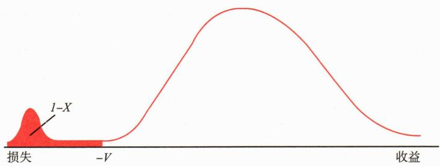

# 第一节 投资风险概述

<table><tr><td>学习内容</td><td>知识点</td></tr><tr><td rowspan="3">投资风险概述</td><td>风险和风险管理的概念</td></tr><tr><td>投资风险的主要类型和管理措施</td></tr><tr><td>不同风险之间的相互作用</td></tr></table>

风险来源于不确定性，即未来不确定事件可能带来的影响。风险管理在经济活动中是不可或缺的。风险有多种表现形式。所有的公司都面临在竞争和变化的市场环境下不能正常运转的风险，即商业风险。公司也面临来源于人力、系统、流程错误，以及其他不可控但会影响公司运营的风险，即操作风险。合规风险则与公司因未能遵守所有的法律法规而遭受处罚有关。基金管理人管理的投资组合还面临资产价格的波动带来的投资风险。

风险并非总是需要避免或消除。从投资角度来看，不存在没有风险的投资回报；从公司运营角度看，完全规避风险可能导致公司无法正常运转。

风险管理的本质并非预测未来，而是于不确定性中探寻方向。风险管理的目标也并非将风险暴露降至最低，而是在回报和可能的损失之间寻找平衡。

在风险管理中，首先需要全面了解和精确衡量各种风险因素，然后权衡是否承担这些风险，以及承担多少风险。确定可以接受风险水平的过程，我们称之为“风险预算”。之后，风险管理还需要持续监测实际风险水平，并根据需要进行调整，确保其始终在预算范围内。

因此，风险管理可被视为一门动态的平衡艺术。它不断在风险与收益间寻找最佳点，通过持续观察和及时调整来维持这种平衡。其最终目标是在可接受的风险范围内，最大化目标实现的可能性。这种方法使得组织能够在保持稳健的同时，仍然保有追求更高目标的能力。它不仅是一种防御机制，更是一种推动进步的策略，让决策者能够在充分了解潜在后果的情况下，作出明智而富有前瞻性的抉择。

作为 “受人之托，代人理财” 的专业机构，基金管理人在保障资产安全的前提下，追求投资收益的最大化。投资风险管理是基金管理人的核心业务。涵盖识别、测量、处理风险以及风险管理的评估和调整等关键步骤。投资决策的核心在于通过理解风险、选择适当的风险暴露，并且有效管理风险以创造价值。风险和收益在金融领域是相辅相成的力量。在投资管理过程中，虽然实际收益难以在事前精确控制，但所愿意承担的风险暴露则相对可控。因此，投资风险管理不仅是一种防御性手段，更是实现投资目标的主动策略。风险是投资决策的一个关键要素，完善的风险管理能够为实现优秀的长期业绩提供有力支持。

投资风险主要包括市场风险、信用风险和流动性风险等。这些风险分别关注市场价格波动、借款方信用状况，以及资产的流动性程度。深入理解并有效管理这些风险，是投资决策过程中的关键环节。

# 一、市场风险

# （一）市场风险的概念和类型

市场风险是指基金投资组合因宏观政治、经济、社会等环境因素影响而面临的风险。当基金投资于股票市场时，上市公司的股价不但受其自身业绩和所属行业的影响，还会受经济政策、经济周期、利率水平等宏观因素的影响，导致价格的不确定性；当基金投资于债券市场时，债券价格会随着利率的变动而波动：利率上升，债券价格下跌。因此，尽管基金通过分散投资来降低非系统性风险，但由于股票和债券等市场固有的系统性风险，基金仍不可避免地面临市场风险。

市场风险主要包括政策风险、经济周期性波动风险、利率风险、购买力风险、汇率风险等。

# 1. 政策风险

政策风险是指宏观政策变化对基金收益的影响。宏观政策，例如财政政策、产业政策、货币政策等，都会对金融市场产生影响，进而影响基金的收益水平。政策风险的管理主要在于对国家宏观政策的把握与预判。

# 2. 经济周期性波动风险

经济发展有周期性，在不同的经济周期，不同资产也会呈现出不同的运作规律，进而影响基金投资业绩。

# 3. 利率风险

利率风险指的是因利率变化对资产价格造成不确定性的风险。利率变动主要受通货膨胀预期、中央银行的货币政策、经济周期和国际利率水平等影响。利率变动往往是渐进的，具有复合效应，其影响可能不易立即察觉。因此，利率风险具有一定的隐蔽性。

# 4. 购买力风险

购买力风险，通常也称为通货膨胀风险，是指由于通货膨胀等因素导致货币购买力下降，从而降低基金的实际收益，影响投资者的实际回报。通货膨胀是引发此风险的主要原因，它导致商品和服务价格上升，削弱了货币的实际购买力，使投资收益的实际价值缩水。

# 5. 汇率风险

汇率风险指因汇率波动导致资产价格产生不确定性的风险。汇率的变动可能受多种因素影响，包括国际收支状况、外汇储备水平、利率、通货膨胀和政治局势等。对于投资海外市场的基金，特别是合格境内机构投资者（QDII）基金，汇率波动对其资产价格的影响尤为显著。

# （二）市场风险管理的主要措施

# 二、信用风险

信用风险源于债务人无法履行其财务义务的可能性。在基金投资中，信用风险主要涉及债券发行人以及回购交易和衍生品交易对手。例如，基金所投资债券的发行人未能或拒绝支付到期本息、债券评级下调导致价格下跌，回购交易对手方不履行回购债券义务等。

信用风险事件对持有相关债券的基金和基金管理人带来的影响有：

管理信用风险是债券基金经理的核心任务之一。基金经理通过选择并监控基金持有的债券信用等级，确保投资组合的整体信用质量。同时，进行适度的分散化投资，避免基金对单一债券、发行人或债券类别有过高的信用风险敞口。

信用风险管理的主要措施包括：

记录等信息对交易对手进行信用评级并定期更新。

（3）构建严格的信用风险监控体系，确保信用风险的及时发现、报告和处理。基金公司应对其管理的所有投资组合与同一交易对手的交易集中度进行限制和监控。

# 三、流动性风险

流动性是资产在短期内以接近公允价格快速完成市场交易的能力。流动性风险则是指在特定时间内无法以合理价格快速买卖资产的风险。当资产的流动性好时，买卖容易，价格稳定，交易成本低。反之，资产的流动性变差时，买卖价差增大，交易成本提高，甚至可能无法及时完成交易。

流动性风险的产生源于供需不平衡。在不利的市场环境下，卖方可能被迫以远低于当前市场价格或基本面的估值价格出售资产。这种现象符合经济学原理：在需求不变的情况下，供应增加会导致价格下跌。值得注意的是，买卖价差本身是一种成本而非风险，流动性风险在于买卖价差的不确定性。在市场条件变化或交易量超过正常水平时，买卖价差可能会急剧增加。

流动性风险是一种综合性风险。与市场风险、信用风险和操作风险相比，其成因更加复杂。市场、信用、操作等各个领域的风险管理缺陷都可能引发流动性问题，严重时可能导致市场局部的流动性问题演变为整个金融体系的流动性危机。

对于基金而言，其“资产、资金两头在外”的经营模式使其面临双重流动性风险：在资产端，基金管理人在建仓时或在为实现投资收益而卖出证券时，可能因市场流动性不足而无法按预期价格在预定时间内完成交易；在负债端，开放式基金面临投资者赎回时，如果所持证券流动性不足，可能被迫以不适当的价格大量抛售资产以满足投资者的赎回需求。这两种情况均可能对基金净值产生不利影响。影响基金流动性风险的主要因素有：金融市场整体的流动性、证券市场走势、基金管理人流动性管理流程和措施、基金类型以及基金持有人结构和行为特征等。

2015年6—8月，中国股市大幅下跌期间，出现了严重的流动性风险。当年6月15日至7月8日的17个交易日内，上证综指下跌幅度达32.11%，市场出现大量抛售，杠杆资金加速离场，导致千股跌停、千股停牌的局面，股市流动性几乎枯竭。同时，股票型基金遭遇巨额赎回，2015年7月该类型基金份额数量减少近千亿份。这一案例展示了在市场剧烈下行，基金净值大幅回撤时可能引发的恶性循环：基金持有人集中赎回导致基金被动抛售资产，进而加剧净值下跌，引发更多赎回，极端情况下可能导致基金清盘。

基金管理人流动性风险管理的主要措施包括：

# [案例11-1] 2013年6月中国金融市场“钱荒事件”

2013年6月，中国金融市场经历了一场严重的流动性危机，俗称“钱荒”。这场危机始于6月5日，“光大对兴业千亿同业资金违约”的传闻引发了市场的紧张情绪。尽管两家银行随后通过不同渠道对此消息进行了否认，但是市场的情绪已然发生转变。6月6日，SHIBOR隔夜利率飙升135.9个基点至5.98%。同日，中国农业发展银行发行的200亿元金融债流标。6月7日，中国人民银行（以下简称“央行”）取消了公开市场短期流动性注入操作（SLO），继续发行央票并进行了100亿元的正回购。当日，银行间市场的大额资金交易系统迎来史上最长延时，出现大范围违约。

危机在6月中旬进一步加深。美联储主席伯南克的讲话引发市场波动。19日下午，银行间市场人民币交易系统闭市时间被迫延迟了半个小时至下午5点。6月20日，央行继续发行20亿元央票，SHIBOR隔夜拆借利率飙升578.4个基点至13.444%，银行间市场质押式隔夜回购利率最高至30%，7天回购利率也一度飙升至25%。各家商业银行为了揽储，纷纷提高3个月短期理财产品的收益率。

随后，央行开始采取措施缓解市场紧张情绪。6月25日，央行发布公告称下一步将根据市场流动性的实际状况，积极运用各种工具，适时调节银行体系的流动性，平抑短期市场的异常波动，稳定市场预期，保持货币市场稳定。到7月初，市场利率逐渐回落，“钱荒”最终以央行向市场重新注入流动性而告终。

关于本次 “钱荒” 产生的原因，市场上存在多种解释。有人认为是央行的技术性操作失误，也有人将其归因于金融体系内部的资金空转。还有观点指出这是由金融系统中的期限错配引起的。一种新颖的观点认为国内实体经济杠杆过高是本次 “钱荒” 的深层次原因。

然而，值得让人深思的不仅是引起本次“钱荒”的原因，更是它暴露出的长期被忽视的流动性风险。在此之前，大多数投资者都认为货币市场工具如同银行存款一样几乎零风险，既能获得比存款更高的收益，又能灵活存取。但“钱荒”通过金融链条的传递和放大，让货币市场工具的潜在风险暴露无遗。

“钱荒”始于银行间市场的流动性紧张，随后蔓延至交易所债券市场，最后演变成整个金融系统的流动性危机。具体来看，5月初，银行间市场开始出现资金紧张，短期资金利率小幅上扬；6月，市场进入传统的资金紧张期，加之市场上各类传闻的盛行和央行“袖手旁观”的态度，市场的恐慌情绪加剧，短期资金利率进一步飙升；此后，市场上4%的货币市场基金收益率与10%的银行间同业拆借利率形成了巨额套利空间，促使大量保险机构、财务公司集中赎回货币市场基金。当时货币市场基金的投资标的集中在协议存款和短期融资券。一方面，协议存款的大量提前支取进一步加剧了银行“钱荒”的境况。另一方面，基金经理不得不大量抛售短期融资券，导致其利率飙升。以6月20日为例，公开数据显示，在当日成交的短期融资券中，剩余期限24天的两个产品收益率分别为15%和16%，另有多只剩余期限不到1个月的产品的收益率在10%以上，且都是AAA级品种。由于短期融资券的贱卖，货币市场基金的收益率快速降低，许多货币市场基金的7日年化收益率降低至2%以下，基金净值也明显下跌。

尽管 “钱荒” 事件最终在央行干预下得以平息，但这场银行体系内真实的 “压力测试” 给我们留下两点启示：其一，投资者必须重新审视货币市场的风险，尤其是在极端市场环境下的风险暴露；其二，货币市场基金的管理者必须拥有宏观视野，在不同的经济背景，合理平衡其收益性和流动性。

这场危机实际上是对中国金融系统的一次“压力测试”，揭示了金融市场的脆弱性，凸显了流动性风险管理的重要性。它不仅对完善中国金融市场的风险管理体系具有重要意义，也促使市场参与者提高风险意识，为推动金融市场的健康发展提供了宝贵经验。

资料来源：Wind、新浪财经。

# 四、风险的相互作用和传导

在投资实践中，各类风险并非孤立存在，而是呈现出复杂的相互作用和传导效应。这种风险的交织与传播可能会放大初始风险，导致更为严重的后果。以下是几个典型场景：

# （一）市场风险与信用风险的相互影响

市场价格的波动（如股价、利率、外汇和商品等市场价格的变化）可能引起违约，导致信用风险。反之，市场参与者对违约概率提升的预期也会影响市场价格，形成一个相互强化的循环。

例如，在回购交易中，如果机构 A（正回购方）因持有的资产价格下跌而无法在回购到期时筹集足够资金来回购质押或卖出的证券，造成违约。对手方 B 可能因此无法完成计划好的另一笔交易，进而波及B的交易对手C，造成连环违约。

# （二）市场风险与流动性风险的相互影响

市场急剧下跌往往会引发流动性风险。这一流程通常遵循以下模式：首先，市场下跌过程中，杠杆率较高的投资者因损失较大，最早触及止损线，被迫抛售资产；这种抛售行为进一步推动市场下跌；随后，杠杆率较低的投资者也开始抛售资产，进一步加剧市场跌势。

在这个过程中，杠杆率、市场价格、偿付能力和流动性风险形成一个负面额相互强化的循环，可能导致市场危机。2008年全球金融危机就是一个典型例子，很多基金因此遭受重创。

# （三）金融危机中的风险集聚效应

在金融危机期间，多种风险因素往往同时恶化：资产价格普遍下跌，各类资产的相关性上升，市场波动加剧，投资者风险厌恶情绪高涨。这种多重风险的叠加效应可能导致市场流动性枯竭、信用市场停滞，进而引发信贷紧缩，抑制企业和个人融资需求，最终对实体经济造成冲击。

总之，风险的相互作用和传导效应使得整体风险往往大于各个风险因素的简单叠加。这种复合风险可能造成更广泛、更持久的影响。随着金融创新的不断深化、新型投资工具的出现以及全球市场日益增强的联动，风险的扩散和转化速度正在加快。这对投资者和监管机构提出了更高的要求，需要采取更全面、动态的风险管理方法，及时识别和应对潜在的风险。

**第二节 投资风险的测度**

<table><tr><td>学习内容</td><td>知识点</td></tr><tr><td>风险指标</td><td>事前与事后风险测度的区别常用风险指标的定义、应用和局限性</td></tr><tr><td>风险价值</td><td>风险价值的定义风险价值的应用和局限性</td></tr><tr><td>预期损失</td><td>预期损失的定义预期损失的应用和局限性</td></tr><tr><td>压力测试</td><td>压力测试的作用压力测试的情景选择</td></tr></table>

风险的测度是风险管理的基础，其质量在很大程度决定了风险管理的有效性。选择合适的风险度量指标和科学的计算方法，是准确评估风险并建立有效风险管理体系

的前提。

风险测度分事前和事后两类。事前风险测度是在风险发生前，衡量投资组合未来的表现及其可能的风险。事后风险测度则是在风险发生后，分析投资组合的历史表现及其风险状况。

风险指标是对风险的抽象描述，没有任何单一的风险指标能够反映投资组合的全部风险特征。因此，在实际风险分析中，往往需要使用多个风险指标进行交叉验证，互为补充。

# 一、风险指标

常用的投资组合风险指标可分为两类，一类是基于收益率及方差的市场风险指标，如波动率、回撤、下行风险标准差等，用于描述收益的不确定性，即偏离期望收益的程度；另一类是基于投资价值对风险因子敏感程度的指标，如 $\beta$ 系数、久期、凸性等，这些指标分别从市场、利率等不同角度反映了投资组合的风险暴露，统称为“风险敏感性度量指标”。以下是几个常用的基础风险指标介绍。

# (一) $\beta$ 系数

$\beta$ 系数是评估证券或投资组合系统性风险的指标，反映的是投资对象对市场变化的敏感度。 $\beta$ 系数是一个统计指标，公式如下：

式中： $\mathrm{Cov}(r_p, r_m)$ ——投资组合 $p$ 的收益与市场收益的协方差； $\sigma_m^2$ ——市场收益的方差。投资组合 $\mathfrak{p}$ 与市场收益的相关系数为：

$\beta$ 系数也可以通过相关系数计算得到：

式中： $\sigma_{p}$ ——投资组合p收益的标准差； $\sigma_{m}$ ——市场收益的标准差。

$\beta$ 系数 $>0$ 时，该投资组合的价格变动方向与市场一致； $\beta$ 系数 $< 0$ 时，该投资组合的价格变动方向与市场相反。 $\beta$ 系数 $= 1$ 时，该投资组合的价格变动幅度与市场一致； $\beta$ 系数 $>1$ 时，该投资组合的价格变动幅度比市场更大； $1 > \beta$ 系数 $>0$ 时，该投资组合的价格变动幅度比市场小。

实际应用中，市场收益往往用投资组合的基准指数收益来代替。 $\beta$ 系数可以用来衡量投资组合相对基准的风险水平，也可用来比较两个投资组合的风险水平，或者用于观察同一个投资组合的风险特征随时间变化的情况。

$\beta$ 系数的局限性在于：

$\beta$ 系数评估的是整个投资组合的系统性风险。在实际运用中，还可以将其分解到投资组合所持有的各个证券上，即计算出各证券对 $\beta$ 系数的贡献，这也称为该证券的成分 $\beta$ 系数。所有证券的成分 $\beta$ 系数加权求和，即为整个投资组合的 $\beta$ 系数。

此外，为了更全面地评估投资组合的表现，实践中常根据不同市场状况计算 $\beta$ 系数。具体而言，我们可以选择业绩基准收益率为正的时间区间计算上涨 $\beta$ （或正 $\beta$ ）；选择业绩基准收益率为负的时间区间，计算下跌 $\beta$ （或负 $\beta$ ）。

# （二）波动率

投资组合波动率是风险管理中最常见的风险指标之一，通常定义为单位时间收益率的标准差。单位时间根据数据来源和应用场景可以取每日、每周、每月或每年等。公募基金一般都公布每日净值。

假定 $\sigma_{n}$ 是利用截至第 n-1 天的最近 m 期历史收益率数据所计算得到的波动率，该值通常作为第 n 天波动率的一个估计，相应的方差为 $\sigma_{n}^{2}$ 。假定基金净值在第 i 天末为 $S_{i}$ ， $u_{i}$ 为第 i 天的收益率，即：

利用最近 m 天的观察数据（这里的 m 一般是一个固定的历史观测窗口长度，可以选择 m=20 天、m=60 天等），可以估算投资组合波动率：

上式中， $\bar{u}$ —— $u_{i}$ 的平均值， $\bar{u}=\frac{1}{m}\sum_{1}^{m}u_{n-i}$ 。

假设每日收益率相互独立且具有同样的方差，则T个交易日总收益率的方差为T乘以每日收益率方差的积，则T日总收益率的标准差是每日收益率标准差的 $\sqrt{T}$ 倍，即：

在计算波动率时，通常只考虑交易日。以股票为例，近十年来，我国A股市场交易日数量平均为每年243天。因此，用日收益率估算股票的年化波动率时，可假定每年有243个交易日。

图 [案例11-2] 表 11-1 显示了某基金每日单位净值，根据前 20 天对回报率的观察估计第 21 天的波动率，即 n=21, m=20。

**表 11-1 某基金日单位净值情况**

<table><tr><td>天数(天)</td><td>单位净值(元)</td><td>当日回报率(%)</td><td>天数(天)</td><td>单位净值(元)</td><td>当日回报率(%)</td></tr><tr><td>0</td><td>1.0438</td><td></td><td>11</td><td>1.0883</td><td>-0.91</td></tr><tr><td>1</td><td>1.0448</td><td>0.10</td><td>12</td><td>1.0917</td><td>0.31</td></tr><tr><td>2</td><td>1.0402</td><td>-0.44</td><td>13</td><td>1.0979</td><td>0.57</td></tr><tr><td>3</td><td>1.0511</td><td>1.05</td><td>14</td><td>1.0981</td><td>0.02</td></tr><tr><td>4</td><td>1.0521</td><td>0.10</td><td>15</td><td>1.0757</td><td>-2.04</td></tr><tr><td>5</td><td>1.0616</td><td>0.90</td><td>16</td><td>1.0958</td><td>1.87</td></tr><tr><td>6</td><td>1.0548</td><td>-0.64</td><td>17</td><td>1.1331</td><td>3.40</td></tr><tr><td>7</td><td>1.0691</td><td>1.36</td><td>18</td><td>1.1268</td><td>-0.56</td></tr><tr><td>8</td><td>1.0747</td><td>0.52</td><td>19</td><td>1.1379</td><td>0.99</td></tr><tr><td>9</td><td>1.0851</td><td>0.97</td><td>20</td><td>1.1401</td><td>0.19</td></tr><tr><td>10</td><td>1.0983</td><td>1.22</td><td></td><td></td><td></td></tr></table>

估算第21日的波动率 $= \sigma_{n} = 0.01144$

年化波动率 $= \sigma_{n,annualized} = 0.01144 \times \sqrt{243} = 0.1783$

我们可以对各个历史时期各个市场不同资产类别或基金类型的波动率进行计算，以了解当前投资组合类型/资产类别的波动率水平，确定投资组合的波动率是否在正常范围内。

# （三）跟踪误差

波动率作为一种绝对风险指标，衡量投资组合收益率的总体波动程度；而跟踪误差则是一种相对风险指标，用于测算投资组合收益率相对于业绩比较基准收益率的偏离的波动情况。与波动率不同，跟踪误差专注于投资组合与基准之间的关系，因此在衡量投资组合的相对表现时具有重要意义。计算跟踪误差的前提是明确选择和确定合适的业绩比较基准。关于跟踪误差的定义与计算方法，可参考第九章被动投资部分的详细介绍，此处不再赘述。

指数基金通常呈现出较低的跟踪误差，这与其投资目标直接相关——即尽可能精确地复制基准指数的收益表现。为实现这一目标，指数基金采用完全复制法或优化复制法等方法，通过严格调整持仓权重来紧密跟踪基准指数。低跟踪误差是衡量指数基金运作效率的重要指标之一，反映了其实现投资目标的程度。

指数增强型基金介于纯指数基金和完全主动型基金之间。这类基金在追求与基准指数高度相关的同时，允许基金经理在有限的风险预算内进行主动操作以获取超额收益。指数增强型基金通常会严格控制跟踪误差在较低水平，并通过量化模型或主动配置策略，适度偏离基准权重，力求在风险可控的范围内实现超额收益。这种投资方式确保了基金在保持与基准相关性的同时，赋予基金经理一定的灵活性，使投资者在相对低风险的情况下有机会获得额外回报。

与指数基金和指数增强型基金相比，主动管理基金往往表现出较高的跟踪误差。这是因为主动管理基金的目标并非单纯复制基准，而是通过主动决策显著偏离基准配置，以寻求最大化超额收益。较高的跟踪误差反映了基金经理在资产选择、权重调整等方面的策略性偏离。需要注意的是，跟踪误差本身并非用来评价主动基金经理投资能力的直接指标。高跟踪误差仅表明基金与基准之间的差异显著，而无法直接说明这种差异是否有效转化为超额收益。因此，在评价主动基金经理的投资能力时，应结合多维度指标，例如信息比率（超额收益与跟踪误差的比值）和风险调整后收益等。只有通过这些指标，才能更全面地判断基金经理是否高效地利用了风险预算。

# (四) 主动比重

主动比重（Active Share，AS）是衡量投资组合持仓与基准指数不同部分的比例。假定全市场可投资股票有 $n$ 只， $\mathrm{w}_{p,i}$ 为第 $i$ 只股票在投资组合中的权重， $\mathrm{w}_{b,i}$ 为第 $i$ 只股票在基准中的权重，则主动比重的计算公式为：

主动比重是一个相对风险指标，用来衡量投资组合相对于基准的偏离程度。与波动率和跟踪误差不同，主动比重基于持仓结构，而非收益率。该指标反映了投资组合与基准指数的相似程度。AS=0表示投资组合完全复制了基准指数，AS=100%则表示该投资组合与基准完全不同。较高的主动比重意味着投资组合的表现可能会与基准有显著差异。

主动比重的核心作用在于帮助投资者评估基金经理的主动管理程度，确保投资者获得与费用相匹配的主动管理服务。高主动比重表明基金经理有充分的信心持有与基准不同的配置，这是产生超额收益的必要条件。同时，它也是防止“隐性指数化” $^{①}$ 的重要监控指标，避免基金经理收取主动管理费却实质上进行指数化投资的情况。

主动比重的局限性在于：

主动比重指标常用于分析股票型基金，尤其是追求相对收益的股票型基金。而对于债券投资组合，由于存在大量具有相同特性的债券，即使持仓区别很大，两个组合相关性也可能非常高。

# (五) 最大回撤

最大回撤是衡量投资组合下行风险的重要指标，它是指定区间内投资组合从最高点到最低点的跌幅。具体而言，最大回撤是在选定区间内任一历史时点往后推，产品净值达到最低点时的收益率回撤幅度的最大值。这一概念可以通过一个简单的图标来直观展示，如图11-1，其中x轴代表时间，y轴代表投资组合价值，图中最高点到最低点的垂直距离即为最大回撤，直观反映了投资者可能面临的最大损失幅度。

最大回撤可以在任何历史区间内计算，使其成为评估投资管理人控制下行风险能力的有力工具。某些投资者将控制下行风险作为主要投资目标，希望将潜在损失控制在相对于投资期间最大财富的一个固定比例之内。对这类投资者来说，最大回撤是一个特别重要的指标。

然而，最大回撤指标也有其局限性。它只能衡量损失的幅度，而不能衡量损失发生的概率、频率及持续时间。这意味着它可能无法全面反映投资组合的风险特征，尤其是在评估短期波动或频繁小幅回撤的情况下。

一般情况下，评估区间越长，最大回撤越大。然而，这并非绝对规律，因为最大回撤受市场周期、投资策略、评估时间段的选择等多种因素影响。因此，在比较不同基金时，不仅应确保使用相同的评估期间以提高比较的公平性，还应考虑多个不同长度的评估期，并结合其他风险指标进行综合分析。同时，评估期的选择可能对结果产生显著影响，因此在解释结果时应保持谨慎。

另外，最大回撤的恢复时间（也称为回复期或恢复期）也是一个重要的补充指标，它衡量投资组合从最大回撤的最低点恢复到之前的峰值所需的时间。这一指标反映了投资组合的恢复能力，对于评估长期投资策略的有效性以及投资者所需的耐心程度尤为重要。较短的恢复时间通常表明投资策略具有较强的弹性和适应能力。

# （六）超额收益最大回撤

对于主动管理型基金，尤其是那些以超越特定业绩比较基准为核心目标的基金而言，对其相对于基准的表现进行深入评估至关重要。在业绩比较基准出现大幅回撤时，若仅仅关注基金的绝对收益最大回撤（即前文所述的“最大回撤”），可能难以全面揭示基金经理在追求相对业绩过程中的风险驾驭能力。例如，在业绩比较基准回撤20%时，基金实际回撤为10%或者30%，单纯分析最大回撤显然有失公允。因此，引入并理解超额收益最大回撤这一指标，对于全面评估主动管理型基金具有显著的实践意义。

顾名思义，超额收益最大回撤是衡量基金在特定评估区间内，其累计超额收益（即基金累计收益率与业绩比较基准累计收益率之差）从前期高点回落至后续低点的最大幅度。该指标精准地捕捉了基金在历史上相对于业绩比较基准表现最差的阶段中，超额收益可能遭受的极端损失情况。举例而言，若一只基金在某段时间内其累计超额收益一度高达15%，但随后由于阶段性表现不佳、跑输基准，导致累计超额收益下降至5%，那么在此期间其超额收益的回撤便为10%。超额收益最大回撤记录的正是整个评估周期内，此类回撤中的峰值。

此项指标对于主动管理型基金的风险评估尤为关键。它不仅清晰地量化了基金在历史上相对于基准可能出现的最严重的阶段性表现不佳程度，也间接反映了基金经理在控制相对下行风险、力求获取更稳定超额收益方面的能力。特别是对于那些追求高主动比重的基金，其超额收益的波动可能更为显著，因此其超额收益最大回撤也可能相对较大。这既是此类基金争取更高超额回报潜力的自然体现，也是其在特定时期可能面临较大幅度跑输基准风险的客观反映。投资者可以借助这一指标，更好地了解基金在追求超额收益的过程中，可能需要承受的相对于基准的最大回撤幅度，从而判断该基金是否真正符合自身的风险偏好和投资预期。与其他风险指标（如跟踪误差更侧重于平均偏离程度）相比，超额收益最大回撤更侧重于极端不利情况下的尾部风险，提供了独特且重要的风险视角。

然而，需要强调的是，与绝对收益最大回撤相似，超额收益最大回撤本质上是一个历史性指标。它描述的是基金在过去特定评估期内的表现特征，并不能完全预测或保证未来的业绩走势。因此，在运用此指标进行分析时，必须审慎并结合多方面因素综合考量。首先，评估区间的选择至关重要，区间的长短会显著影响计算结果，过短的区间可能无法充分暴露风险。其次，业绩比较基准的合理性也是核心前提，一个不恰当或不能真实反映基金投资策略与风险暴露的基准，将使得超额收益及其最大回撤的分析失去意义。

# (七) 下行标准差

传统的波动率计算同时考虑了收益率高于和低于平均值的波动。然而，投资者往往更关注收益率低于目标时的波动。下行标准差（Downside Deviation，DD）正是为了解决这一问题而设计的指标。

假定 $r_i$ 表示第 $i$ 期基金收益率， $r_T$ 表示目标收益率，也称为“最低可接受收益”（Minimum Acceptable Return, MAR）， $n$ 表示收益的总期数（包括基金收益率高于或低于目标收益率的所有期数），则下行标准差 $DD$ 为：

其中， $\min (r_i - r_T, 0)$ 表示取“ $r_i - r_T$ ”和“0”中的较小值，确保只计算低于目标收益率的部分。

目标收益率 $r_{T}$ 可以是区间平均收益率，也可以是无风险收益率，或者自定义的最低可接受的收益率。

为了方便比较，下行标准差通常需要进行年化处理：在上述计算中，如果收益率采用每日收益，则乘以每年交易日数量的平方根；如果收益率采用每月收益，则乘以12的平方根，作为计算结果。

下行标准差的一个显著优势在于它专注于下行风险，这与大多数投资者的风险偏好更加一致。传统的波动率同时考虑正负收益的波动，而下行标准差只关注那些低于预期目标的收益率，从而更好地反映了投资者对损失的担忧。此外，目标收益率 $r_{T}$ 是灵活可调的，投资者可以根据自己的风险承受能力选择适合的目标收益率，如无风险收益率或自定义的最低可接受收益率。这种灵活性使得下行标准差能够适应不同类型的投资组合，尤其是在收益分布非对称的情况下，该指标能够更准确地评估潜在的下行风险。

尽管下行标准差在评估下行风险方面具有独特优势，但它也存在一些局限性。首先，该指标依赖于足够多的低于目标收益率的样本数据。如果投资组合持续表现优异，回撤较少，可能缺乏足够的数据来准确计算下行标准差。其次，下行标准差的计算结果和目标收益率 $r_{T}$ 的选择具有高度敏感性。不同的目标收益率可能会导致显著不同的下行标准差结果，这可能在比较不同投资组合时造成困扰。此外，下行标准差忽视了上行波动，这可能导致对某些具有高上行潜力但也有较大下行风险的投资策略评估不够全面。

# 二、风险价值

风险价值（Value at Risk，VaR）概念的提出源于传统风险度量指标的局限性。基于方差的风险度量指标只能描述收益的不确定性，即偏离期望收益的程度，但无法确切描述投资组合可能面临的损失大小。为了更全面地量化风险，VaR应运而生。VaR被定义为在给定的时间区间和置信水平下，投资组合可能面临的最大潜在损失。VaR也被称为“在险价值”或“风险收益”。VaR通过量化这种潜在损失，帮助投资者了解在最不利情况下，投资组合的损失不会超过某一特定数值的概率。风险价值也被称为在险价值。

如图11-2所示，某投资组合在持有期为1周、置信水平为 $95\%$ 的情况下，若所计算的风险价值为 $-0.82\%$ ，则表明该资产组合在1周内有 $95\%$ 的概率其损失不会超过 $-0.82\%$ 。

实践中，一般先计算组合1天的VaR，再推算N天的VaR，公式如下：

N天的VaR=1天的VaR· $\sqrt{N}$

这一公式中的 $\sqrt{N}$ 因子反映了风险随时间的平方根增长。该公式假设投资组合在各交易日内独立不相关，且其收益率服从均值为 0 的正态分布。

最常用的 VaR 估算方法有参数法、历史模拟法和蒙特卡洛模拟法。

历史模拟法的主要优势在于其实施相对简单，无需对风险因子的收益率或概率分布做出参数假设，直接利用历史数据进行估算。这使得该方法能够捕捉到实际市场数据中的非正态分布特征和尾部风险。然而，历史模拟法也存在局限性。最显著的是VaR估计值高度依赖于所选取的历史样本期。如果样本期不能充分代表当前市场状况，可能导致VaR估计偏差。此外，该方法假设历史会重复，这在市场剧烈变化时可能不成立。

为了提高估计的准确性和相关性，通常使用最新的、与测算期相近的历史数据作为基础。一些改进的历史模拟法，如加权历史模拟法或结合波动率调整的方法，也被开发出来用于解决传统方法的一些缺陷。

（3）蒙特卡洛模拟法。蒙特卡洛模拟法的核心在于通过构建风险因子的随机过程和概率分布模型来模拟可能的市场情景。该方法首先基于历史数据或理论假设，为相关风险因子构建概率分布模型和相关性结构。随后，利用这些模型生成大量随机的风险因子变动路径，每一路径代表一个可能的未来市场情景。对于每个生成的情景，计算投资组合的价值变化，从而得到一系列模拟的损益结果。经过足够次数的模拟（基于投资组合的复杂性，通常为数千至数万次），组合价值的模拟分布将逐渐收敛于其理论分布。最后，从这个经验分布中，在给定的置信水平下计算出VaR值。

蒙特卡洛模拟法的主要优势在于其灵活性和精确性。它可以处理非线性金融工具（如期权），考虑复杂的风险因子相关性，并能捕捉各种市场条件下的风险，包括尾部风险。因此，在理论上，它被认为是最接近真实VaR值的估算方法。然而，该方法也存在一些局限性。首先，它是计算密集型的，需要大量的计算资源和时间，特别是对于大型或复杂的投资组合。其次，结果的准确性高度依赖于所选用的概率分布模型和参数估计的准确性，存在模型风险。此外，虽然理论上可以模拟极端情况，但由于参数设定和模型假设的局限性，在实际应用中可能低估尾部风险。最后，相比其他方法，蒙特卡洛模拟法需要更专业的知识和更复杂的系统来实施。

尽管存在这些挑战，蒙特卡洛模拟法因其理论优势和灵活性，仍被广泛应用于复杂金融产品的风险管理中。随着计算能力的提升和模型技术的进步，其应用范围可能会进一步扩大。

在实践中，金融机构通常结合多种方法来估算 VaR，以平衡各种方法的优缺点，获得更全面、可靠的风险评估。

VaR的考察区间通常较短，如一天、一周或几周，这主要是基于多方面的考虑。首先，VaR值具有较强的时间变异性，短期区间能更准确反映当前的风险状况。随着时间的延长，投资组合和市场状况的稳定性降低，导致VaR估计的准确性下降。短期VaR更适合日常风险管理和决策，能够及时捕捉市场变化并迅速做出调整。此外，许多VaR模型假设风险因子的分布特性在短期内保持不变，但这一假设在长期可能失效。

VaR采用概率论和数理统计的方法对风险进行量化，具有多项优势。它提供了统一的度量标准，能够测量不同市场和资产类别的风险，并以单一数值表示，便于比较和汇总。VaR以潜在损失的货币金额表示，使其易于理解和沟通。其全面性体现在能够综合考虑多种风险因素，包括市场风险、信用风险，在某些模型中还包括流动性风险。VaR的灵活性允许根据具体需求调整置信水平和时间区间，同时其在组合层面评估风险的能力，能够考虑资产之间的相关性。

由于这些优点，VaR已成为衡量市场风险的主要指标，得到了众多国际金融监管机构的认可和采用。然而，VaR也存在局限性。它可能低估极端事件的风险，并且在很大程度上依赖历史数据和模型假设。

# 三、预期损失

预期损失（Expected Shortfall，ES），指在给定时间区间和置信水平下，投资组合损失的条件期望值。ES也称为“条件风险价值”（Conditional VaR）、“条件尾部期望”（Conditional Tail Expectation）或“尾部损失”（Tail Loss）。

图11-3展示了某投资组合在时间区间 $T$ 内收益的概率分布。该分布代表损失的左侧尾部显示出较高概率密度，这反映了潜在的极端损失风险。在置信水平 $X$ 下，VaR值位于图中 $-V$ 的位置，这意味着有 $X\%$ 的概率时间区间T内的损失不会超过 $V$ 。然而，VaR作为一个分位值，无法全面衡量超过这个阈值的极端损失情况。相比之下，ES计算的是灰色区域（即超过VaR的部分）所有可能损失的期望值，也就是在 $1 - X\%$ 的极端情况发生时损失的平均值。

 — 图11-3 时间区间T内某投资组合收益的概率分布

预期损失由于其在尾部风险度量、次可加性等方面的优势，越来越受到监管机构与金融行业的重视。

[案例11-3]假设根据历史模拟法，某投资组合次日收益率的分布如下： $-14.8\%$ 、 $-14.6\%$ 、 $-11.2\%$ 、 $-9.5\%$ 、 $-8\%$ 、 $-6.4\%$ 、 $-4.9\%$ 、 $-4.5\%$ 、 $-4.4\%$ 、 $-3\%$ 、 $-2.7\%$ 、 $-1.9\%$ 、 $-0.7\%$ 、 $-0.7\%$ 、 $-0.2\%$ 、 $1.2\%$ 、 $1.5\%$ 、 $1.8\%$ 、 $2.6\%$ 、 $3\%$ 、 $4.1\%$ 、 $5.4\%$ 、 $6.8\%$ 、 $7.1\%$ 、 $7.6\%$ 、 $8.1\%$ 、 $8.7\%$ 、 $9.8\%$ 、 $10.1\%$ 、 $10.6\%$ ，计算 $90\%$ 概率下的 VaR 值和预期损失。

模拟法给出了30个可能的收益率，90%的概率对应的VaR值即为-11.2%，即90%的概率下，投资组合在次日的损失不会超过-11.2%。

进一步计算预期损失，即在损失超过VaR（-11.2%）的极端情况（本例中对应最差的10%即2个数据点）下，投资组合损失的平均值。这些超过VaR的收益率为-14.8%和-14.6%。因此，

预期损失 $\mathrm{ES} = (-14.8\% - 14.6\%) / 2 = -14.7\%$

# 四、压力测试

压力测试（Stress Test）是风险管理中一项关键工具，旨在评估那些可能发生但未在历史数据中体现的极端情景对投资组合的潜在影响。与风险价值（VaR）和预期损失（ES）等度量方法不同，压力测试能够模拟和分析那些罕见但无法排除的重大损失事件，从而提供更全面的风险评估。

压力测试的核心在于选择合适的压力情景。最基础的方法是敏感性分析，即假设单一市场变量发生显著变化而其他变量保持不变，然后评估这种变化对投资组合价值或风险指标的影响。例如，可以模拟收益率曲线平移200个基点、股票指数上下变动10%、公募基金被集中赎回60%或股市交易量骤降50%等情况，并分析每种情况下投资组合的表现。敏感性分析简单直观，有助于识别投资组合对特定风险因素的敏感度，但不能全面反映市场变量之间复杂的相互作用，因此通常需要与其他更复杂的压力测试方法结合使用。

更复杂的压力测试会模拟多个市场变量同时变化的情景。一种常用方法是采用历史极端情景，如重现2008年全球金融危机期间的市场条件。历史情景法的局限性在于，历史不会一成不变地重复自身，新的危机可能以不同的方式出现。因此，金融机构通常会结合其对政治经济环境和市场状况的理解，设计合理且可能造成重大损失的假设情景。

压力测试促使基金管理人考虑那些被风险指标所忽略的极端场景，并据此采取相应措施，如调整产品持仓结构、变更投资标的、在必要时暂停申购赎回，或启动应急预案。此外，基金管理人还需维持充足的风险准备金，以应对潜在的压力情景。

压力测试不仅是金融机构内部风险管理的重要工具，也是监管机构评估行业整体风险的关键手段。监管或行业自律机构可设计统一的压力场景，要求所有受监管机构进行测试。这有助于识别资本金不足的机构、发现潜在的系统性风险，并评估整个行业的风险抵御能力。为了加强公募基金行业的风险管理水平，中国证券投资基金业协会于2016年11月发布了《公募基金管理公司压力测试指引（试行）》，要求基金管理人建立压力测试制度和流程，定期评估极端不利情况下基金的净值变动和流动性变化等关键风险指标。

# [案例11-4] 中国证券投资基金业协会2017年上半年公募基金管理人压力测试情景

（1）除货币、理财外压力测试情景（以2017年2月28日为基点，考虑未来6个月）：

债券组合久期=债券i久期×债券i市值/债券总资产

久期使用修正久期（以估值价格计算）。评级均使用最新评级。

**表 11-2**

<table><tr><td>情景假设类别</td><td>轻度</td><td>中度</td><td>重度</td></tr><tr><td>上证综合指数(深圳主板同)</td><td>-10.00%</td><td>-20.00%</td><td>-30.00%</td></tr><tr><td>中小板综合指数</td><td>-10.00%</td><td>-20.00%</td><td>-35.00%</td></tr><tr><td>创业板综合指数</td><td>-10.00%</td><td>-25.00%</td><td>-40.00%</td></tr><tr><td>日均成交金额</td><td>-15.00%</td><td>-30.00%</td><td>-40.00%</td></tr><tr><td>机构投资者赎回比例</td><td>30%</td><td>50%</td><td>70%</td></tr></table>

**表 11-3**

<table><tr><td>信用债违约率</td><td>轻度假设</td><td>中度假设</td><td>重度假设</td></tr><tr><td>AAA</td><td>1.00%</td><td>2.50%</td><td>3.50%</td></tr><tr><td>AA+</td><td>1.50%</td><td>3.00%</td><td>4.00%</td></tr><tr><td>AA及其他</td><td>2.00%</td><td>3.50%</td><td>4.50%</td></tr></table>

**表 11-4**

<table><tr><td>债券收益率曲线上移幅度(信用债)(BP)</td><td>轻度假设</td><td>中度假设</td><td>重度假设</td></tr><tr><td>AAA</td><td>83</td><td>132</td><td>234</td></tr><tr><td>AA+</td><td>107</td><td>169</td><td>223</td></tr><tr><td>AA及其他</td><td>127</td><td>193</td><td>276</td></tr></table>

**表 11-5**

<table><tr><td>债券收益率曲线上移幅度(利率债)(BP)</td><td>轻度假设</td><td>中度假设</td><td>重度假设</td></tr><tr><td>1Y(含)以内</td><td>126</td><td>161</td><td>262</td></tr><tr><td>1Y(不含)~3Y(含)</td><td>90</td><td>134</td><td>218</td></tr><tr><td>3Y(不含)~10Y(含)</td><td>71</td><td>134</td><td>186</td></tr><tr><td>10Y(不含)以上</td><td>77</td><td>142</td><td>185</td></tr></table>

# (2) 货币与理财基金压力测试情景:

**表 11-6**

<table><tr><td colspan="2">其他参数设置</td></tr><tr><td>股票单日可变现金额占平均市场成交金额的比例</td><td>5%</td></tr><tr><td>无风险收益率(保本基金)</td><td>同期限利率债收益率</td></tr></table>

**表 11-7**

<table><tr><td>债券收益率曲线上移幅度</td><td>轻度假设</td><td>中度假设</td><td>重度假设</td></tr><tr><td>无风险利率上升(BP)</td><td>126</td><td>161</td><td>262</td></tr><tr><td>AAA级利率上升(BP)</td><td>89</td><td>136</td><td>294</td></tr><tr><td>AA+级利率上升(BP)</td><td>91</td><td>135</td><td>281</td></tr><tr><td>AA级及其他利率上升(BP)</td><td>109</td><td>159</td><td>287</td></tr><tr><td>净赎回率</td><td>40%</td><td>60%</td><td>80%</td></tr><tr><td>前十大持有人赎回比例</td><td>50%</td><td>75%</td><td>100%</td></tr></table>
