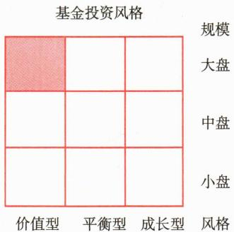

# 第四节 基金风格分析

<table><tr><td>学习内容</td><td>知识点</td></tr><tr><td rowspan="2">基金投资风格分析</td><td>基金投资风格的形成,基于组合构成的风格分析</td></tr><tr><td>基于收益特征的风格分析,基金风格漂移</td></tr></table>

基金投资风格分析是现代投资理论和实践中的重要组成部分。它不仅帮助投资者更好地理解和选择适合自己风险偏好的基金产品，也为基金管理公司提供了重要的产品设计和风险管理工具。随着金融市场的不断发展和投资者需求的日益多元化，准确把握和分析基金投资风格变得越来越重要。本节将从基金投资风格的形成、分析方法、风格漂移等方面，全面探讨基金投资风格分析这一主题。

# 一、基金投资风格的形成

基金公司在设计产品时，会确定投资目标、投资范围、业绩比较基准等产品要素。这些要素基本决定了该基金的资产配置范围、比例和基本投资风格。基金产品发行和运作后，基金经理需要在产品契约规定范围内根据既定的产品要素进行资产配置和投资。

主动型基金经理在实际投资运作中，会根据市场和资金情况，在合同允许范围内相对于基准做出适当的主动偏离，以获得超额收益。基金的实际投资风格是由产品契约约定和基金经理的投资决策共同决定的。

基金投资风格分析是基金业绩评价的一个重要方面，甚至是一些重要的基金业绩评价方法和指标的基础。确定基金的投资风格主要有事前分析和事后分析两种方法，前者依据基金招募说明书中关于投资目标和投资策略的说明来确定其投资风格，后者则根据基金的实际证券组合构成或对基金业绩的特征分析来判别其投资风格，即基于组合构成的风格分析和基于收益特征的风格分析。

# 二、基于组合构成的风格分析

基于组合构成的风格分析方法是目前评估基金投资风格的常用方法。该方法是在某个时点上先将市场上的证券（如股票）按某些特征值（如市值、市盈率、账面值、账面市值比率等）进行风格分类（如大盘价值、小盘成长等），然后根据基金实际所持证券的各项特征值计算出该基金在每一项特征上的加权平均值（权重为各证券在投资组合中的市值比重），再对基金各项特征值进行综合以确定每只基金在该时点上的投资风格。

此方法已被基金公司和基金评价机构广泛采用。例如，美国晨星（Morning Star）公司的基金投资风格箱从规模和成长性两个维度来划分股票风格，每个维度分为三类。股票按照规模风格分为大盘、中盘和小盘三类；按照价值—成长特性分为价值型、平衡型和成长型三类。如图12-1所示，晨星投资风格箱是一个 $3 \times 3$ 的矩阵，共有9种投资风格。图中左上角单元格显示的基金投资风格即为“大盘价值型”。

 — 图12-1 晨星投资风格箱 

投资风格箱简单直观地展现了基金实际投资组合的资产配置风格。使用这种方法需要及时掌握基金投资组合持仓信息。对于外部评价机构，依据当前证券投资基金在季报中披露的前十大重仓股，在半年报和年报中披露全部持仓信息，且有一定延迟。

# 三、基于收益特征的风格分析

基于收益特征的风格分析是运用多因子模型来确定基金投资风格的一种方法。该方法通过分析基金收益率对各种风格资产（通常由相应的风格指数代表）收益率的敏感性，来识别基金的实际投资风格。这种方法假定基金的收益可以分解为多个风格因子的线性组合，每个因子代表某种系统性风险。

这一方法最早由夏普基于多因子模型提出，他认为基金投资风格可以通过其收益率与预先设定的一组风格指数收益率之间的关系来确定，其核心思想可以通过以下回归方程来表示：

其中： $R_{pt}$ ——基金组合 P 在第 t 期的收益率； $F_{jt}$ ——第 j 种风格因子在第 t 期的收益率； $\beta_{pj}$ ——基金收益率对第 j 种风格因子的敏感性，即基金在该风格因子上的暴露程度，且 $\sum_{j=1}^{n}\beta_{pj}=1$ ；残差 $\varepsilon_{t}$ 表示基金收益中无法被这些风格因子解释的部分，通常反映了基金经理的主动管理能力。

通过回归分析基金的历史收益率与这些风格因子的收益率，可以估计出每个因子的敏感系数 $\beta_{pj}$ ，从而确定基金的风格特征。这些敏感系数反映了基金在不同风格上的暴露程度，帮助我们了解基金在评价区间内的实际投资风格。

基于收益率的分析方法对数据要求较低，只需要基金投资组合与风格指数的历史收益率数据，不需要持仓数据，且可以区分来自风格的收益贡献和基金经理积极管理的收益贡献，模型残差 $\varepsilon_{t}$ 代表了基金经理的主动投资能力。另外，为保证回归分析的准确性和有效性，通常要求20\~36个月的业绩数据，所以不适用于新成立的基金，也无法用来检验基金短期的风格变化，并且高度依赖于风格指数的选择。

# 四、基金风格漂移

基金风格漂移是指基金的实际投资风格偏离其明确宣称的投资策略或长期形成的稳定风格特征。这种偏离不同于主动管理基金为追求超额收益而进行的策略性配置差异，而是指那些导致基金风险收益特征发生根本性变化的投资行为转变。风格漂移可能表现为超出基金合同约定范围的调整，或者虽在合同范围内但与基金长期形成的市场定位和投资者合理预期产生显著不符的变化。这种变化会导致基金的风险收益特征与其原本设定或投资者认知的风格不一致，进而影响投资者的资产配置决策和风险管理。

需要强调的是，主动管理型基金本身就是通过与基准的适度差异化来创造超额收益，这种有目的、可控的策略性偏离并不构成风格漂移。真正的风格漂移是指那些改变基金基本投资哲学和风险特征的重大转变，如从价值投资转向成长追逐、从大盘蓝筹转向小盘投机、或从一个行业主题大幅转向另一个不相关领域等。

风格漂移可以从两个维度理解：一是法律合规维度，即是否违反基金合同约定；二是市场感知维度，即是否违背了基于长期投资行为形成的投资者合理预期。即使基金经理的操作在合同允许范围内，如果突然改变长期稳定的投资风格而未充分沟通，也可能被视为“实质性风格漂移”。

风格漂移通常发生在基金经理显著改变投资策略时。最典型的情况是基金经理为了追求短期业绩或应对市场变化，显著偏离原有的投资风格。风格漂移主要表现为两种形式：一是基本面风格漂移，如原本侧重大盘价值的基金转向小盘成长投资；二是主题风格漂移，如消费主题基金大幅配置新能源概念股，或健康主题基金显著超配食品饮料板块。此外，基金经理更换也可能导致基金投资风格的改变。

投资者需要通过持仓分析和收益特征分析来判断基金的实际风格，及时发现可能的风格漂移，以规避由此带来的潜在风险。

[案例12-13] 某基金最初定位为“大盘价值型”基金，主要投资于具有稳定收益和低估值的大型蓝筹股，业绩比较基准为沪深300指数。该基金在成立后的三年内，基金经理一直遵循价值投资理念，投资组合以金融、能源、消费等大型低估值蓝筹股为主，行业配置与权重相对稳定，风险收益特征与基金定位高度一致，基金业绩表现稳健且波动性较低，赢得了追求稳健回报的投资者认可。

随着市场行情的变化，中小盘成长股开始表现强劲。面对业绩排名下滑的压力，该基金经理在未充分披露投资策略调整的情况下，逐渐将高达40%的资产配置到中小市值科技成长股，持仓结构与基金最初定位和历史投资风格产生了显著差异。这一调整虽然在基金合同允许的投资范围内，但与该基金长期形成的“大盘价值”市场定位有明显不符。在短期内，基金的收益排名确实有所提升。

之后，市场出现风格切换，成长股剧烈调整，基金净值在两个月内回撤25%，远超过同期沪深300指数的跌幅。投资者李女士一直认为自己投资的是一只稳健的“大盘价值型”基金，面对基金净值的大幅波动和与沪深300指数不同的走势，她感到十分意外。

经过调查，她发现基金的投资风格已经发生了漂移。尽管该基金仍有可能在成长行情中获得较高收益，但其风险特征已经超出她的预期和接受范围。最终，李女士选择赎回了该基金，转而投资到风格更为稳定的真正“大盘价值型”基金产品。

导致基金风格漂移的原因多种多样，既有外部压力也有内部因素。外部因素包括：追求短期业绩排名、应对市场风格剧烈转换时的绩效压力、被动接受大规模申购后的仓位调整困难等；内部因素则包括：基金经理投资理念的变化、投资团队或决策机制的调整、基金契约规定过于宽泛导致约束不足、投资决策监控机制不完善等。值得注意的是，从全市场角度看，当大量基金同时发生类似方向的风格漂移时，可能意味着投资行为趋同，形成“羊群效应”，进而加剧特定板块估值泡沫和市场波动。

对投资者而言，风格稳定的基金是资产配置的可靠工具。尤其是养老金、保险资金等长期机构投资者，通常按照严格的资产配置策略分配资金至不同风格的基金产品，以构建风险分散、收益互补的投资组合。如果底层基金发生风格漂移，会使整体资产配置策略失效，导致风险暴露超出预期范围。这也是《养老目标证券投资基金指引（试行）》第六条要求养老基金在选择子基金时“重点考察风格特征稳定性”的原因。

基金公司可以通过完善的风格监控和业绩归因体系来防范风格漂移。具体措施包括：定期分析基金的持仓结构风格（如大小盘暴露、价值/成长特征）、交易行为风格（如换手率、持股集中度）和业绩来源特征（如风格因子贡献、行业贡献），设定风格一致性的量化指标和预警阈值，对有可能导致风格漂移的投资行为进行及时提示。同时，将风格稳定性纳入基金经理的考核体系，避免过度强调短期收益而忽视风格一致性的考核导向。

从行业发展趋势看，随着市场的成熟和投资者教育的深入，基金投资风格的清晰界定和一致性维护正成为重要的竞争维度。近年来，我国新发基金产品越来越注重明确的风格或主题定位，如“红利”“科技创新”“消费升级”等，通过差异化定位吸引特定风险偏好的投资者。保持投资风格的稳定性不仅有利于基金公司在竞争中建立专业声誉和塑造品牌特色，也是其实现长期战略规划和客户信任的重要基础。基金经理在考虑策略调整时，应在基金合同允许的合理范围内进行，对于可能影响风险收益特征的重大风格调整，应提前通过公告、投资策略会议等方式充分披露和沟通，确保投资者的知情权并给予其调整配置的时间和机会，从而真正践行受托责任，维护投资者长期利益。
