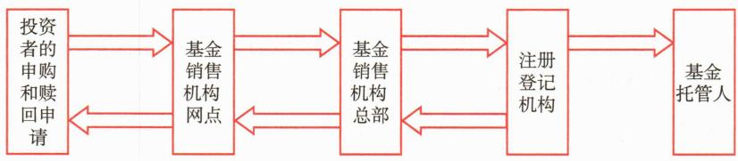
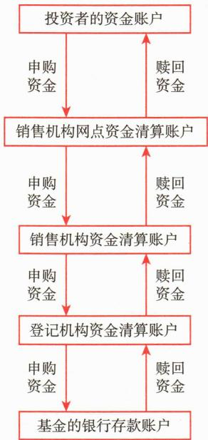

# 第五节 基金的份额登记与资金结算

<table><tr><td>学习内容</td><td>知识点</td></tr><tr><td>基金份额登记的概念</td><td>基金份额登记的概念</td></tr><tr><td rowspan="4">现行登记模式、登记机构职责、份额登记业务流程和申购、赎回的资金结算</td><td>现行登记模式</td></tr><tr><td>登记机构职责</td></tr><tr><td>份额登记业务流程</td></tr><tr><td>申购、赎回的资金结算</td></tr></table>

# 一、基金份额登记的概念

基金份额的登记，是指基金注册登记机构通过设立和维护基金份额持有人名册，确认基金份额持有人持有基金份额的事实的行为。基金份额登记具有确定和变更基金份额持有人及其权利的法律效力，是保障基金份额持有人合法权益的重要环节。

# 二、基金注册登记机构及其职责

《证券投资基金法》规定，基金的登记业务可以由基金管理人办理，也可以委托中国证监会认定的其他机构办理。

# （一）我国基金份额注册登记体系的模式

基金管理人委托外包机构提供基金份额注册登记外包服务的，基金管理人应依法承担的责任不因外包而免除，可视为基金管理人自建注册登记系统的“内置”模式。

# （二）基金注册登记机构的主要职责

# 三、基金份额登记流程

基金份额登记过程实际上是基金注册登记机构通过基金注册登记系统对基金投资者所投资基金份额及其变动进行确认、记账的过程。这个过程与基金的申购和赎回过程是一致的，具体流程如下：

T 日，投资者的申购和赎回申请信息通过销售机构网点传送至销售机构总部，由销售机构总部将本销售机构的申购和赎回申请信息汇总后统一传送至注册登记机构。

T+1日，注册登记机构根据T日各销售机构的申购和赎回申请数据及T日的基金份额净值统一进行确认处理，并将确认的基金份额登记至投资者的账户，然后将确认后的申购和赎回数据信息下发至各销售机构，各销售机构再下发至各所属网点。同时，注册登记机构也将登记数据发送至基金托管人。如注册登记机构为非基金管理人，还应将登记数据发至基金管理人。至此，注册登记机构完成对基金份额持有人的基金份额登记。如果投资者提交的信息不符合注册登记的有关规定，最后的确认信息将是投资者申购和赎回失败。

对于部分特殊品种的基金，份额登记时间略有不同，比如：QDII 基金和一般基金中基金份额登记时间通常是 T+2 日，如果基金中基金的投资范围包含 QDII 基金，份额登记时间通常是 T+3 日。

基金份额登记流程如图 13-1 所示。

 — 图13-1 基金份额登记流程图

# 四、申购和赎回的资金结算

资金结算分清算和交收两个环节。清算是按照确定的规则计算出基金当事各方应收应付资金数额的行为。交收是基金当事各方根据确定的清算结果进行资金的收付，从而完成整个交易过程。

基金份额申购和赎回的资金清算是注册登记机构根据确认的投资者申购和赎回数据信息进行的。按照清算结果，投资者的申购和赎回资金将会从投资者的资金账户转移至基金在托管银行开立的银行存款账户或从基金的银行存款账户转移至投资者的资金账户。资金交收流程如图13-2所示。

 — 图13-2 资金交收流程

由于基金申购和赎回的资金清算依据注册登记机构的确认数据进行，为保护基金投资人的利益，有关法规明确规定，基金管理人应当自收到投资者的申购、赎回申请之日起3个工作日内，对该申购、赎回申请的有效性进行确认，基金管理人应当自接受投资者有效赎回申请之日起7个工作日内支付赎回款项，但中国证监会规定的特殊基金品种除外。

目前，我国境内普通公募开放式基金申购款一般在T+2日内到达基金的银行存款账户，赎回款一般于T+3日内从基金的银行存款账户划出。货币市场基金的赎回款划付时效通常更短，一般T+1日即可从基金的银行存款账户划出，最快可在划出当天到达投资者资金账户。基金中基金和QDII基金的赎回款划付时效相对较长，基金中基金的赎回款一般T+5日内从基金的银行存款账户划出，QDII基金的赎回款一般T+7日内从基金的银行存款账户划出。

# 本章参考文献
