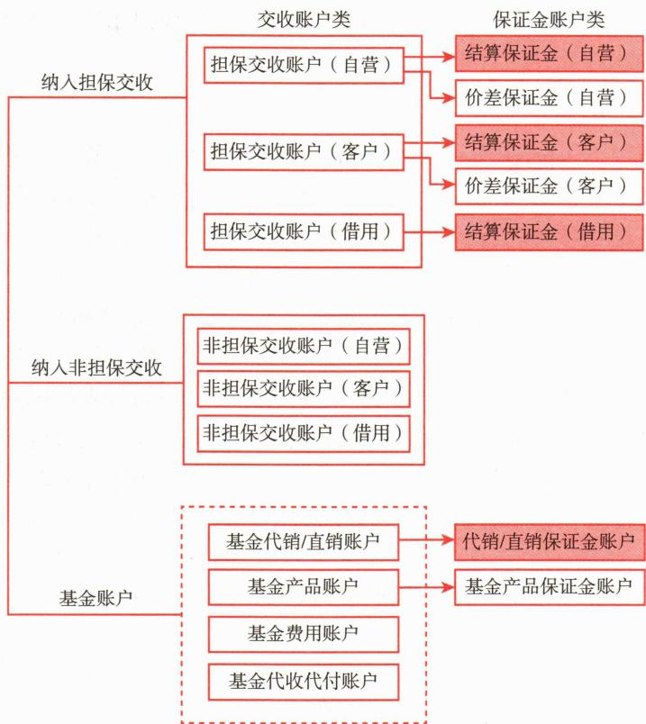
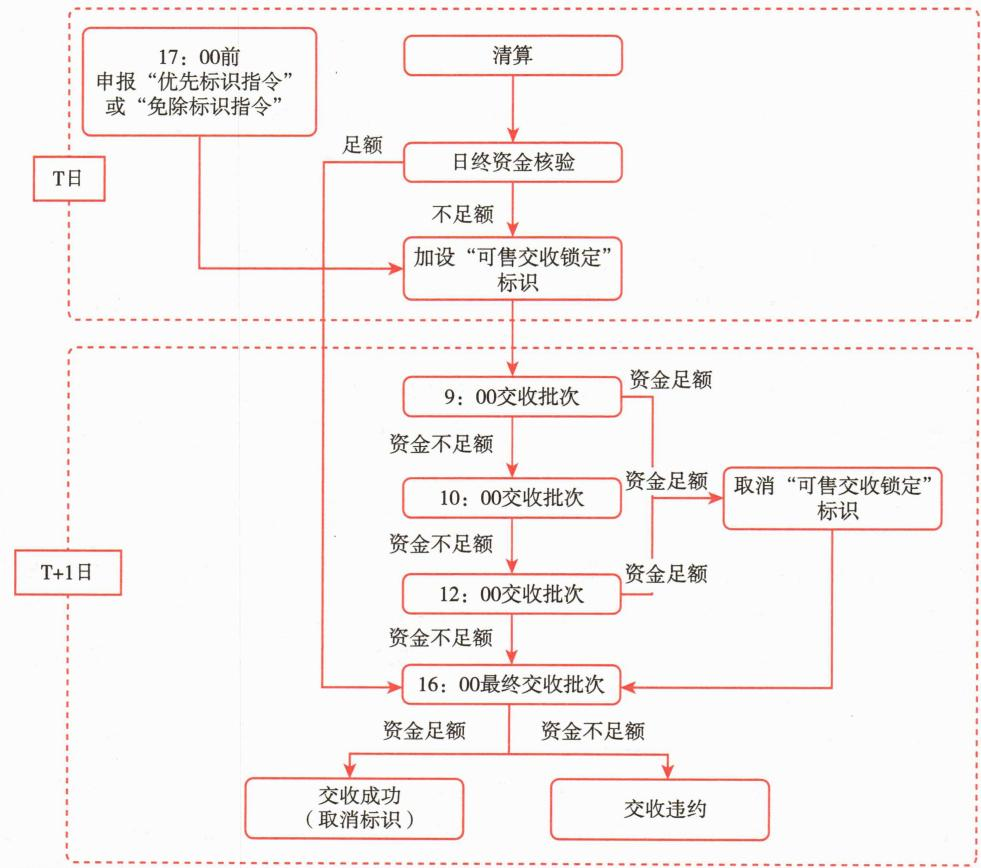
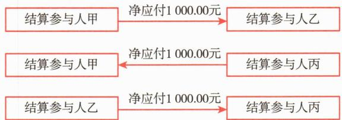
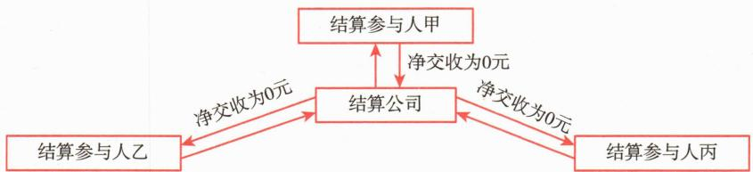
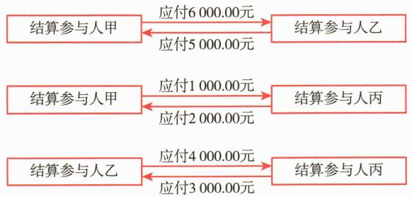
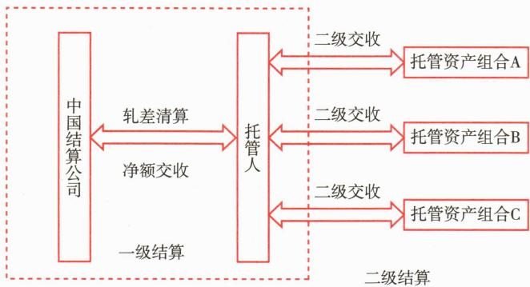
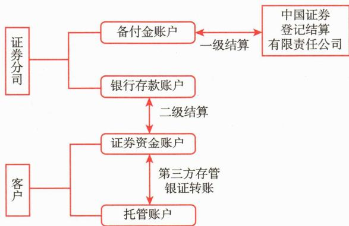

# 第一节 基金参与证券交易所二级市场的交易与结算

<table><tr><td>学习内容</td><td>知识点</td></tr><tr><td>基金参与证券交易所二级市场的交易与结算</td><td>证券投资基金场内证券交易场所与结算机构场内证券交易结算的原则、方式与主要内容场内证券交易与结算涉及的费用场内证券交易特别规定及事项</td></tr></table>

# 一、场内证券交易场所与结算机构

# （一）场内证券交易场所

场内证券交易的场所即证券交易所，是指在证券交易所内按一定的时间、一定的规则集中交易已发行证券而形成的市场。在我国，根据《证券法》的规定，证券交易所是为证券集中交易提供场所和设施、组织和监督证券交易、实行自律管理的法人。

证券交易所的设立和解散，由国务院决定。证券交易所作为进行证券交易的场所，其本身不持有证券，也不进行证券的买卖，当然更不能决定证券交易的价格。证券交易所应当创造公开、公平、公正的市场环境，保证证券交易所的职能正常发挥。

证券交易所的组织形式有会员制和公司制两种，根据现行的《证券交易所管理办法》，上海证券交易所和深圳证券交易所采用会员制，北京证券交易所采用公司制。

上海证券交易所和深圳证券交易所设会员大会、理事会、总经理和监事会。会员大会是证券交易所的最高权力机构，理事会是会员制证券交易所的决策机构，监事会是证券交易所的监督机构，理事会和监事会下面可以设立其他专门委员会。证券交易所设总经理，负责日常事务，总经理由国务院证券监督管理机构任免。

北京证券交易所设股东会、董事会、总经理和监事会。董事会是公司制证券交易所的决策机构，董事长的任免由中国证监会提名，董事会通过，董事长是证券交易所的法定代表人，不得兼任证券交易所总经理；证券交易所总经理主持交易所日常工作。

# （二）场内证券登记结算机构

《证券法》规定，证券登记结算机构是为证券交易提供集中登记、存管与结算服务，不以营利为目的的法人。设立证券登记结算机构必须经国务院证券监督管理机构批准。

证券登记结算机构为证券市场提供安全、高效的证券登记结算服务。根据自律管理的要求，它需采取以下措施保证业务的正常运行：一是要制定完善的风险防范机制和内部控制制度；二是要建立完善的技术系统，制定由结算参与人共同遵守的技术标准和规范；三是要建立完善的结算参与人准入标准和风险评估体系；四是要对结算数据和技术系统进行备份，制定业务应急程序和操作流程。同时，为防范证券结算风险，我国还设立了证券结算风险基金，用于垫付或弥补因违约交收、技术故障、操作失误、不可抗力等造成的证券登记结算机构的损失。

中国证券登记结算有限责任公司（以下简称“中国结算公司”）是我国的场内证券登记结算机构，该公司在上海、深圳和北京各设一家分公司，其中上海分公司主要针对上海证券交易所的上市证券，为投资者提供证券登记结算服务；深圳分公司主要针对深圳证券交易所的上市证券，为投资者提供证券登记结算服务；北京分公司主要针对北京证券交易所上市公司股票、全国中小企业股份转让系统挂牌公司股份、两网和退市公司A股、全国中小企业股份转让系统优先股、股东人数超过200人的终止挂牌公司股份的转让提供证券登记结算服务。

# 二、场内证券交易结算原则、方式与内容

# (一) 结算原则

# 1. 法人结算原则

证券登记结算机构以结算参与机构为单位办理证券资金的结算，即清算与交收。结算参与机构应以法人名义直接在证券登记结算机构开立结算账户，用于办理相关的结算业务。

根据中国结算公司深圳分公司、北京分公司的规定，结算参与机构可以选择仅开立综合结算备付金账户用于资金交收，也可以选择同时开立综合结算备付金账户和非担保结算备付金账户用于资金交收。同时，开立非担保结算备付金账户的结算参与机构，其担保交收业务及交易所场内证券发行资金通过综合结算备付金账户完成交收，非担保交收及代收代付业务将通过非担保结算备付金账户完成交收。

根据中国结算公司上海分公司的规定，结算参与人在中国结算公司上海分公司开立的结算资金账户包括五大类：担保交收账户、非担保交收账户、基金账户、结算保证金账户和价差保证金账户。中国结算公司上海分公司目前的结算账户体系如图14-1所示。

 — 图14-1 中国结算公司上海分公司结算账户体系

# 2. 共同对手方制度

针对不同的证券交易品种，证券登记结算机构可以作为共同对手方，提供净额结算服务，在交收过程中为守约方提供交收担保。共同对手方（Central Counter Party, CCP）是指在结算过程中，同时作为所有买方和卖方的交收对手并保证交收顺利完成的主体，一般由结算机构充当。如果买卖双方中的一方不能按约定条件履约交收，结算机构也要依照结算规则向守约一方先行垫付其应收的证券或资金。对于资金交收违约的结算参与人，中国结算公司作为中央对手方，按顺序动用下列资金完成与对手方结算参与人的资金交收：（1）违约结算参与人交收担保物中的自有资金；（2）证券结算保证金中违约结算参与人缴纳的部分；（3）证券结算保证金中中国结算公司划拨的部分；（4）证券结算保证金中其他结算参与人缴纳的部分。前款仍不能满足对手方结算参与人资金交收需求的，中国结算公司还可以动用证券结算风险基金、商业银行等机构的授信支持以及其他资金。

共同对手方的引入，使得交易双方无须担心交易对手的信用风险，有利于增强投资信心和活跃市场交易。事实上，由于结算机构充当共同对手方，卖出证券的投资者相当于将证券卖给了结算机构，买入证券的投资者相当于从结算机构买入证券，买卖双方可以获得的证券或款项得到了保证。对于我国证券交易所市场实行多边净额清算的证券交易，证券登记结算机构（即中国结算公司）是承担相应交易交收责任的所有结算参与人的共同对手方。

# 3. 货银对付原则

货银对付原则（Delivery Versus Payment，DVP）又称“款券两讫”或“钱货两清”。货银对付是指证券登记结算机构与结算参与人在交收过程中，证券和资金的交收互为条件，当且仅当结算参与人履行资金交收义务的，相应证券完成交收，结算参与人履行证券交收义务的，相应资金完成交收。通俗地说，就是“一手交钱，一手交货”。根据货银对付原则，一旦结算参与人未能履行对证券登记结算机构的资金交收义务，证券登记结算机构就可以暂不向其交付其买入的证券；反之亦然。货银对付通过实现资金和证券的同时划转，可以有效规避结算参与人交收违约带来的风险，大大提高证券交易的安全性。目前，货银对付已经成为各国（地区）证券市场普遍遵循的原则。《证券法》和《证券登记结算管理办法》明确要求在实行多边净额结算品种中贯彻货银对付的原则，证券登记结算机构作为共同对手方，以结算参与人为结算单位办理清算交收。

中国结算公司按照货银对付原则进行交收的流程如图 14-2 所示。

 — 图14-2 中国结算公司货银对付原则交收流程

# 4. 分级结算原则

证券和资金结算实行分级结算原则。证券登记结算机构作为共同对手方提供多边净额结算服务时，证券登记结算机构负责与结算参与人之间的集中清算交收，结算参与人负责与客户之间的证券和资金的清算交收；不作为对手方提供结算服务时，由证券登记结算机构根据结算参与机构委托，代为完成与结算参与机构之间的证券和资金的清算交收；结算参与机构负责办理结算参与机构与客户之间的资金的清算交收。

实行分级结算，意味着对结算参与人接受投资者委托达成的证券交易，结算参与人需承担相应的证券或资金的交收责任。实行分级结算原则主要是出于防范结算风险的考虑。证券登记结算机构与客户没有直接业务联系，很难衡量客户的资质和风险；同时，由于客户数量较多、地区分布较散，在出现交收违约时，证券登记结算机构也很难处理。而对数量相对较少、实力相对较强、取得结算参与人资格的证券机构或其他机构而言，证券登记结算机构则可以有效采取风险管理措施。场内证券交易所市场，我国普遍采用证券一级结算、资金分级结算原则，境外普遍采用证券、资金分级结算原则。在境外证券交易所市场，分级结算是普遍的做法。

# （二）结算方式

# 1. 净额结算方式

一般情况下，通过证券交易所达成的交易需采取净额结算方式。净额结算又称“差额清算”，指在一个清算期中，对每个结算参与人价款的清算只计其各笔应收、应付款项相抵后的净额，对证券的清算只计每一种证券应收、应付相抵后的净额。

净额结算又分为双边净额结算和多边净额结算。

双边净额结算指结算公司对买卖双方的交易进行轧差清算，形成应收资金（证券）净额和应付资金（证券）净额。结算公司不作为双方的中央对手方，不提供交收担保。

多边净额结算是指将结算参与人所有达成交易的应收、应付证券或资金予以充抵轧差，计算出该结算参与人相对于所有交收对手方累计的应收、应付证券或资金净额。将结算参与人对应的所有双边净额结算结果加以累计，可以得出该结算参与人的多边净额结算结果；在引入共同对手方的情况下，计算该结算参与人相对于共同对手方的双边净额结算结果也相当于实现了多边净额结算。

[案例14-1] $20 \times 4$ 年7月1日，某国结算参与人甲、乙、丙在同一证券交易所进行证券交易，三位结算参与人之前间的交易信息如下表所示。

<table><tr><td>买方</td><td>卖方</td><td>交易证券</td><td>成交金额(元)</td><td>成交数量(股)</td></tr><tr><td>甲</td><td>乙</td><td>股票A</td><td>6000.00</td><td>600.00</td></tr><tr><td>乙</td><td>甲</td><td>股票B</td><td>5000.00</td><td>500.00</td></tr><tr><td>乙</td><td>丙</td><td>股票C</td><td>4000.00</td><td>400.00</td></tr><tr><td>丙</td><td>乙</td><td>股票D</td><td>3000.00</td><td>300.00</td></tr><tr><td>丙</td><td>甲</td><td>股票E</td><td>2000.00</td><td>200.00</td></tr><tr><td>甲</td><td>丙</td><td>股票F</td><td>1000.00</td><td>100.00</td></tr></table>

****

假设本次交易过程中未产生任何费用，在资金交收日分别采用双边净额结算与多边净额结算两种不同模式时，三位结算人的资金交收路径和金额如下：

（1）双边净额结算模式下，甲、乙、丙各方两两之间的交易资金轧差后，彼此间的交收结果为：甲应付乙1000.00元，乙应付丙1000.00元，丙应付甲1000.00元，三位结算参与人的资金交收情况如图14-3所示。

 — 图14-3 双边净额结算模式资金交收图

（2）当引入共同对手方并采用多边净额模式时，甲、乙、丙三方与共同对手方资金经过多边净额轧差后，净交收资金均为0元，甲、乙、丙三方资金交收情况如图14-4所示。

 — 图14-4 多边净额结算模式资金交收图

# 2. 全额结算方式

逐笔全额结算是指证券登记结算机构对每笔证券交易均独立结算，同一结算参与人应收资金（证券）和应付资金（证券）不轧差处理。在交收时点，买卖双方应付资金和证券都符合要求的，完成交收；任何一方或双方结算参与人应付资金或应付证券不足的，交收失败。证券登记结算机构不作为双方的共同对手方，不提供交收担保。

逐笔全额结算的主要特点是:

(1) 资金（证券）的足额以单笔交易为最小单位，资金（证券）足额则全部交

收，不足则全不交收，不分拆交收。

目前中国结算公司沪、深、京三地采用全额结算的品种如表14-1所示。

**表 14-1 / 中国结算公司的全额结算品种**

<table><tr><td>市场</td><td>品种</td></tr><tr><td>中国结算公司上海分公司</td><td>私募债券、资产支持证券、不符合净额结算标准的债券和特定债券转让;大宗专场、专项资产管理计划转让、非公开发行的优先股转让;信用保护凭证转让;可交换公司债换股;债券质押式协议回购、债券质押式三方回购、股票质押式回购、约定购回;纳入逐笔全额结算的ETF申购赎回;老股东配售的增发、公司债场内分销;股权激励计划行权;信用保护工具业务符合净额结算标准且选择逐笔全额结算模式的债券(除可转债)</td></tr><tr><td>中国结算公司深圳分公司</td><td>优先股协议交易;私募债券,私募可交换债券,资产支持证券,不符合净额结算标准的公司债、企业债、政府支持债券、分离债、公募可交换债交易;特定债券转让;约定购回;股票质押式回购;债券质押式协议回购;债券质押式三方回购;可转债、可交换债券换股;跨境ETF、以全额现金申赎的单市场债券ETF、跨市场债券ETF和商品期货ETF申赎的份额和现金替代;黄金ETF现金申赎的份额和现金替代;跨市场股票ETF场外组合证券申赎的份额和组合证券;国债、地方政府债、政策性金融债之外的债券网上分销;现金选择权和股权激励自主行权;信用保护合约提前终止结算;信用事件现金或实物结算符合净额结算标准且选择逐笔全额结算模式的债券(除可转债)</td></tr><tr><td>中国结算公司北京分公司</td><td>全国中小企业股份转让系统优先股交易、股东人数超200人的终止挂牌公司股份转让、定向发行可转换公司债券、退市公司可转换公司债券转让</td></tr></table>

图 [案例14-2] 20×4年7月1日，某国结算参与人甲、乙、丙三方交易情况同案例14-1，假设本次交易过程中未产生任何费用，在资金交收日，本次所有交易均采用全额结算模式，即甲、乙、丙三方的所有交易资金不得轧差交收，需根据每一笔明细交易成交情况全额交收，三位结算参与人的资金交收情况如图14-5所示。

 — 图14-5 全额结算模式资金交收图

# （三）结算内容

场内证券交易的结算包括证券交收与资金结算。资金结算可分为资金清算与资金交收两个过程。通过清算，确认交收日各交易参与方的债权、债务关系；通过交收，完成资金实际收付。

# 1. 证券交收

证券交收包含两个层面的含义：

# 2. 资金结算

目前，托管资产的场内资金结算主要采用两种模式，即托管人结算模式和券商结算模式。托管人结算模式，是指托管资产场内交易形成的交收资金由托管人作为结算参与人与中国结算公司进行净额交收，然后由托管人负责与托管资产组合进行二级清算。券商结算模式也称为“第三方存管模式”，是指托管资产场内交易形成的交收资金由证券公司（即经纪人）作为结算参与人与中国结算公司进行交收，然后由证券公司负责与其客户进行二级清算，客户的交易资金完全独立保管于存管银行，而不存放在证券公司。

（1）托管人结算模式。可采用托管人结算模式的托管资产类型包括公开募集证券投资基金、保险资产、企业年金基金、基金管理公司特定客户资产管理计划、证券公司单一客户资产管理计划、证券公司集合资产管理计划和QFII基金等。托管人结算模式下，基金管理人向证券公司租用场内交易单元、使用租用的交易单元参与交易，基金管理人的交易指令直接发送至证券交易所。中国结算公司按交易单元将托管资产的交易和清算数据发送给托管人，并按交易单元合并清算与托管人进行净额交收。

托管人结算模式分为两级结算：一级结算由托管人作为结算参与人代表托管资产与中国结算公司完成净额交收；二级结算由托管人根据交易和清算数据拆分计算后与

托管资产组合完成二级交收（见图14-6）。

托管人以自身名义在中国结算公司上海分公司、深圳分公司和北京分公司分别开立结算备付金账户，用于与中国结算公司之间完成最终不可撤销的证券与资金交收，净额交收资金通过PROP和D-COM系统划转。托管人通过托管业务系统完成与托管资产组合之间的二级交收资金划转。

 — 图14-6 托管人结算模式

（2）券商结算模式。2024年4月19日，中国证监会发布《公开募集证券投资基金证券交易费用管理规定》，指出基金管理人应当合理选择证券交易模式，降低交易成本。各类公募基金管理人可根据自身业务发展需要自主选择交易模式，并进行优化和完善。券商结算模式下，基金参与证券交易所交易的，其交易指令自基金管理公司系统首先传至证券公司系统，证券公司对基金的交易行为实时验资验券，并承担起异常交易行为等的监控职责，随后交易指令才会自证券公司端到达交易所。证券公司作为托管资产的经纪人，代理进行场内交易，提供证券经纪服务。托管资产通过证券公司的交易单元进行场内交易，证券公司与中国结算公司进行其自有交易单元上所发生交易的资金结算，然后由证券公司依托其自身的柜台系统与托管资产组合之间进行场内证券交易资金的结算（如图14-7所示）。

 — 图14-7 券商结算模式

券商结算模式中，证券公司为客户交易结算资金建立二级明细簿记账户（即证券资金账户），实现为每个客户单独立户管理；客户资金进出通过封闭式银证转账完成。

证券公司在存管银行开立客户交易结算资金汇总账户，用于集中存管客户交易结算资金。交易结算资金账户只得用于客户取款、证券交易资金交收和支付佣金手续费等用途。客户的证券资金账户与托管账户一一对应。

客户交易结算资金进出只能通过银证转账方式完成，证券公司不再提供客户资金存取服务，客户取出的交易结算资金只能回到其指定的银行账户，从而实现客户交易结算资金的封闭运行。

# 三、场内证券交易与结算涉及的费用

基金通过与券商签订交易单元租用合同，获得投资交易的路径。基金需要向券商支付交易佣金，还需要向证券交易所、中国结算公司等机构支付过户费、经手费、证管费、印花税等交易税费。

# (一) 佣金

佣金是投资者在委托买卖证券成交后按成交金额一定比例支付的费用，是证券经纪商为客户提供证券代理买卖服务收取的费用。实际佣金费用的构成以管理人与证券公司签署的证券交易单元租用服务协议内容为准。

佣金的收费标准因交易品种、交易场所的不同而有所差异。根据中国证监会、原国家发展计划委员会（现为国家发展和改革委员会）、国家税务总局联合发布的《关于调整证券交易佣金收取标准的通知》，从2002年5月1日开始，A股、B股、证券投资基金的交易佣金实行最高上限和向下浮动制度。证券经纪商向客户收取的佣金（包括代收的证券交易监管费和证券交易所手续费等）不得高于证券交易金额的3‰，也不得低于代收的证券交易监管费和证券交易所手续费等。A股、证券投资基金每笔交易佣金不足5元的，按5元收取；B股每笔交易佣金不足1美元或5港元的，按1美元或5港元收取。国债现券、企业债（含可转换债券）、国债回购以及以后出现的新的交易品种，其交易佣金标准由证券交易所制定并报中国证监会和原国家发展计划委员会（现为国家发展和改革委员会）备案，备案15天内无异议实施。

2024年4月，中国证监会发布《公开募集证券投资基金证券交易费用管理规定》，规定基金管理人管理的被动股票型基金的股票交易佣金费率原则上不得超过市场平均股票交易佣金费率，且不得通过交易佣金支付研究服务、流动性服务等其他费用；其他类型基金可以通过交易佣金支付研究服务费用，但股票交易佣金费率原则上不得超过市场平均股票交易佣金费率的两倍，不得通过交易佣金支付研究服务之外的其他费用。

# （二）过户费

过户费是委托买卖的股票、基金成交后，买卖双方为变更证券登记所支付的费用。这笔收入属于中国结算公司的收入，由结算参与人在同投资者清算交收时代为扣收。

目前，上海证券交易所、深圳证券交易所和北京证券交易所A股过户费均按照成交金额乘以所征收费率计算，并向买卖双方投资者分别收取。对于优先股交易的登记过户费，上海市场和深圳市场均按照普通股下调20%向买卖双方投资者分别收取。对于B股，虽然没有过户费，但中国结算公司要收取结算费。

在上海证券交易所，可交换债券换股时，过户费按换股成交金额乘以过户费率计算，向买卖双方投资者分别收取过户费，在深圳证券交易所，可交换债券换股时，按股票过户面值计算，并向投资者单边收取。

普通基金交易目前不收过户费。

对于ETF申购/赎回的过户费，上海证券交易所和深圳证券交易所存在一定的差异。在上海市场，ETF申购/赎回时，过户费按照相应组合证券过户面额乘以过户费率计算，在ETF成立后投资者使用股票或存托凭证申购、赎回ETF份额发生的组合证券过户费率暂按正常标准减半收取。目前仅对所含沪市成分股票、存托凭证收取。而深圳市场，股票ETF申购/赎回的过户费按证券过户面值乘以过户费率计算，债券ETF暂不收申购/赎回的过户费。目前，在ETF发售阶段投资者使用股票认购ETF份额发生的股票过户费予以免收，而在ETF成立后过户费率按照征收标准暂减半收取。

# （三）经手费

证券交易经手费是指投资者在进行证券交易时，由交易所收取的一种费用，经手费是按照成交金额乘以所征收费率进行计算，交易经手费现向买卖双方收取，交易所会对部分品种的大宗交易设置一定的费率优惠。

# （四）证管费

证券交易证管费是指在进行证券交易时，按照成交金额的一定比例计算的，由中国结算公司代收并上交给中国证监会的费用。

# (五) 印花税

印花税是根据《印花税法》规定，在A股和B股成交后对证券交易的出让方按照规定的税率分别征收的税金。为保证税源，简化缴款手续，现行的做法是由结算参与人在同投资者办理交收的过程中代为扣收；然后，在证券经纪商同中国结算公司的清算/交收中集中结算；最后，由中国结算公司统一向征税机关缴纳。

<table><tr><td>费用类型</td><td>费/税率</td></tr><tr><td>佣金</td><td>0.5‰</td></tr><tr><td>过户费</td><td>0.01‰</td></tr><tr><td>经手费</td><td>0.03‰</td></tr><tr><td>证管费</td><td>0.02‰</td></tr><tr><td>印花税</td><td>0.5‰</td></tr></table>

在本次交易过程中，甲的各项交易成本如下：

佣金=成交金额×佣金费率=1 000 000.00×0.5‰=500.00（元）

过户费 = 成交金额 × 过户费率 = 1000000.00 × 0.01‰ = 10.00（元）

经手费 = 成交金额 × 经手费率 = 1000000.00 × 0.03‰ = 30.00（元）

证管费 = 成交金额 × 证管费率 = 1000000.00 × 0.02‰ = 20.00（元）

印花税 $=$ 成交金额 $\times$ 印花税率 $= 1000000.00\times 0.5\% = 500.00$ （元）

关于各项费用的收取，上交所、深交所和北交所有所不同，具体的费率标准参见中国结算公司官网“服务支持——收费标准”下“上海市场证券登记结算业务收费及代收税费一览表”、“深圳市场证券登记结算业务收费及代收税费一览表”和“北京市场证券登记结算业务收费及代收税费一览表”。

# 四、场内证券交易特别规定及事项

# (一) 大宗交易

大宗交易是指单笔数额较大的证券买卖。我国现行有关交易制度规定，如果证券单笔买卖申报达到一定数额的，证券交易所可以采用大宗交易方式进行。按照规定，证券交易所可以根据市场实际情况调整大宗交易的最低限额。

上海证券交易所接受大宗交易的方式包括意向申报、成交申报和固定价格申报。

接受申报的时间分别为: (1) 9:30\~11:30、13:00\~15:30 接受意向申报; (2) 9:30\~11:30、13:00\~15:30、16:00\~17:00 接受成交申报; (3) 15:00\~15:30 接受固定价格申报。交易日的 15:00 仍处于停牌状态的证券, 当日不再接受其大宗交易的申报。

每个交易日9:30\~15:30时段确认的成交，于当日进行清算交收；每个交易日16:00\~17:00时段确认的成交，于次一交易日进行清算交收。

深圳证券交易所大宗交易采用协议大宗交易和盘后定价大宗交易方式。

协议大宗交易，是指大宗交易双方互为指定交易对手方协商确定交易价格及数量的方式。协议大宗交易申报的类型包括意向申报、成交申报、定价申报和其他申报，时间为每个交易日9：15\~11：30、13：00\~15：30。当天全天停牌、处于临时停牌期间或停牌至收市的证券，不接受协议大宗交易申报。协议大宗交易确认成交的时间规定为：

盘后定价大宗交易，是指证券交易收盘后按照时间优先的原则，以证券当日收盘价或证券当日成交量加权平均价格对大宗交易买卖申报逐笔连续撮合的方式。采用盘后定价大宗交易方式接受交易申报的时间为每个交易日15：05\~15：30。申报当日有效。当天全停牌或停牌至收市的证券，不接受其盘后定价大宗交易申报。

# （二）固定收益证券综合电子平台

上海证券交易所固定收益平台交易的固定收益证券包括国债、公司债券、企业债券、分离交易的可转换公司债券中的公司债券。交易商参加固定收益平台交易前，应通过固定收益平台注册可用于交易的证券账户。交易商在固定收益平台申报卖出固定收益证券的数量，不得超过其证券账户内可交易余额。交易商当日买入的固定收益证券，当日可以卖出。当日被待交收处理的固定收益证券，下一交易日可以卖出。

在固定收益平台进行的固定收益证券现券交易实行净价申报，申报价格变动单位为0.001元，申报数量单位为1手（1手为1 000元面值）。自2019年11月15日起，固定收益平台的交易时间调整为9：30\~11：30、13：00\~15：30，现券交易不再实行价格涨跌幅限制，固定收益平台债券现券（特定债券除外）交易价格（净价）偏离交易当日日终相关比较基准超过2%（含）的，交易商应不晚于收盘后次一交易日向上海证券交易所报告该笔交易。

# （三）回转交易

证券的回转交易是指投资者买入的证券，经确认成交后，在交收完成前全部或部分卖出。

根据我国现行的有关交易制度规定，债券交易型开放式指数基金、交易型货币市场基金、黄金交易型开放式证券投资基金、商品期货交易型开放式指数基金、跨境交易型开放式指数基金、跨境上市开放式基金和权证均实行当日回转交易，其中上述跨境交易型开放式指数基金和跨境上市开放式基金仅限于所跟踪指数成分证券或投资标的实施当日回转交易的开放式基金。实行当日回转交易的品种，即投资者可以在交易日的任何营业时间内反向卖出已买入但未完成交收的相关投资标的；B股实行次交易日起回转交易。

# （四）开盘价和收盘价

按照一般的意义，开盘价和收盘价分别是交易日证券的首、尾买卖价格。而在证券交易所，往往还要通过制度予以规范。

根据我国现行的交易规则，证券交易所证券交易的开盘价为当日证券的第一笔成交价。证券的开盘价格一般通过集合竞价方式产生。不能产生开盘价的，以连续竞价方式产生。按集合竞价产生开盘价后，未成交的买卖申报仍然有效，并按原申报顺序

自动进入连续竞价。

收盘价一般通过集合竞价的方式产生。收盘集合竞价不能产生收盘价或未进行收盘集合竞价的，以当日该证券最后一笔交易前一分钟所有交易的成交量加权平均价（含最后一笔交易）为收盘价。当日无成交的，以前收盘价为当日收盘价。

根据目前上海和深圳证券交易所的规定，每个交易日的9：15\~9：25为开盘集合竞价时间，9：30\~11：30、13：00\~14：57为连续竞价时间，14：57\~15：00为收盘集合竞价时间。债券现券交易、债券质押式回购的收盘价为当日15：30（含）前最后一笔交易（含）前一小时所有交易的成交量加权平均价，15：30之后的成交数据不纳入收盘价计算。收盘价计算所采用的成交数据为各类交易方式达成的成交数据。但比较特殊的是，上海证券交易所基金交易的连续竞价时间为13：00\~15：00，因此基金收盘价为当日该证券最后一笔交易前一分钟所有交易的成交量加权平均价（含最后一笔交易）。

# (五) 除权与除息

当上市公司实施送股、配股或派息时，每股股票所代表的企业实际价值就可能减少，因此需要在发生该事实之后从股票市场价格中剔除这部分因素。因送股或配股而形成的剔除行为称为“除权”，因派息而引起的剔除行为称为“除息”。

我国证券交易所是在权益登记日（B股为最后交易日）的次一交易日对该证券作除权、除息处理。除权（息）日该证券的前收盘价改为除权（息）日除权（息）参考价。除权（息）参考价的计算公式为：

除权（息）参考价格= $\left[\left(\text{前收盘价格}-\text{现金红利}\right)+\text{配股价格} \times \text{配股比例}\right]/(1+\text{股份变动比例}^{①})$

[案例14- 4] $20 \times 4$ 年7月1日, A公司公告了年度利润分配方案, $20 \times 4$ 年7月19日为分红登记日, $20 \times 4$ 年7月20日为除权日, 具体分配方案为: 派发现金红利2元/股, 并采用配股方式进行再融资, 每10股配3股, 配股价格为30元/股, 同时A公司7月19日的日终收盘价为110元/股, 请问A公司在7月20日开盘前, 经除权后的参考开盘价为多少元/股?

配股比例 $= 3 / 10 = 0.3$ ，配股价为30元/股，每股现金红利为2元/股，根据除权公式：

A公司在 $20 \times 4$ 年7月20日日初的参考开盘价 $= (110 - 2 + 30 \times 0.3) / (1 + 0.3) = 90$ （元/股）

在权证业务中，标的证券除权、除息，对权证行权价格会有影响，因此需要调整。

根据有关规定，标的证券除权、除息的，权证的发行人或保荐人应对权证的行权价格、行权比例作相应调整并及时提交证券交易所。

标的证券除权的，权证的行权价格和行权比例分别按下列公式进行调整：

新行权价格= $\frac{原行权价格\times标的证券除权日参考价}{除权前一日标的证券收盘价}$

新行权比例= $\frac{原行权比例\times除权前一日标的证券收盘价}{标的证券除权日参考价}$

标的证券除息的，行权比例不变，行权价格按下列公式调整：

新行权价格= $\frac{原行权价格\times标的证券除息日参考价}{除权前一日标的证券收盘价}$

# (六) PROP 和 D-COM 系统

# 1. 参与人远程操作平台系统

参与人远程操作平台（Participant Remote Operating Platform，PROP）系统是中国结算公司上海分公司为完善市场运作功能，规范清算交收、登记和存管业务，提高对市场服务的效率而开发的建立在中国结算公司上海分公司通信系统上的电子数据交换系统。结算参与人可通过PROP系统中的公用模块接收中国结算公司上海分公司发送的有关资金结算文件。

结算参与人可通过PROP系统中的交收模块进行备付金账户的总账查询和明细账查询。总账查询可实时查询备付金账户的账户余额、可用余额、透支金额及存款积数。明细账查询可按任何指定的时间段和金额范围查询明细往来账目，并随时打印查询结果。

结算参与人交收头寸及最低备付不足时，应及时向备付金账户补入资金。

结算参与人在中国结算公司上海分公司的备付金账户中有超额备付时，可根据需要将资金划到经授权的预留银行收款账户。同时，结算参与人可根据需要完成在京、沪、深之间直接划拨其存放的备付金。

# 2. 深圳证券综合结算平台系统

深圳证券综合结算平台（D-COM）系统是中国结算公司深圳分公司为完善市场运作功能，规范清算交收、登记和存管业务，提高对市场服务的效率而开发的建立在深圳证券市场综合结算通信系统的、用于实现结算参与人与中国结算公司深圳分公司之间数据交换的系统。

结算参与人可通过D-COM系统实时查询各资金结算账户余额、结算备付金账户可提款金额、尚未支付金额等信息。

中国结算公司深圳分公司通过D-COM系统向结算参与人实时揭示其尚未支付金额或其可提款金额，结算参与机构可根据需要，划出多余结算资金至预留的指定收款银行账户。
