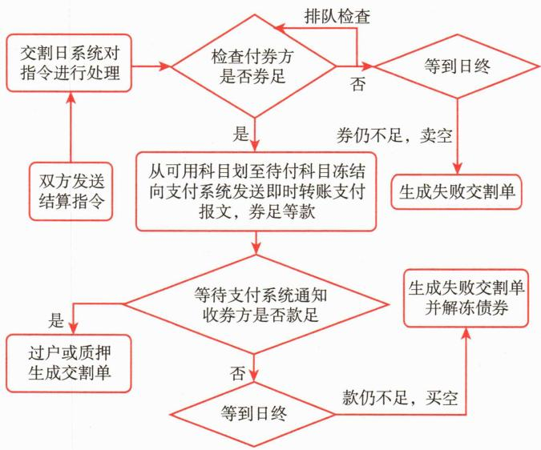

# 第二节 基金参与银行间债券市场的交易与结算

<table><tr><td>学习内容</td><td>知识点</td></tr><tr><td>银行间债券市场的构成与交易制度</td><td>全国银行间债券市场、全国银行间同业拆借中心、上海清算所发行主体、投资主体、基础设施公开市场一级交易商制度、结算代理制度、做市商制度</td></tr><tr><td>银行间债券市场的交易与结算</td><td>交易品种:债券、回购、远期交易、债券借贷、人民币利率互换、信用风险缓释工具债券交易结算方式:纯券过户(FOP)、见券付款(PAD)、见款付券(DAP)、券款对付(DVP)债券结算业务类型</td></tr></table>

# 一、银行间债券市场概述

全国银行间债券市场是以现代远程计算机系统联网技术为基础建立起来的场外债券市场，自1997年6月创立发展至今，已成为我国债券市场非常重要的组成部分，是货币政策和财政政策实施的最重要的金融市场。

我国自1981年恢复发行国债以来，债券市场已经过了30多年的发展历程。从起初单一的国债市场，发展到以政策性金融债、中央银行票据、商业银行次级债、短期融资券、超短期融资券、中期票据、国际开发机构债券等多品种的市场；从行政性摊派的发行市场，发展到基本市场化的发行、交易市场；从银行柜台凭证式国债市场、交易所债券市场，发展到目前以银行间债券市场为主体，包括交易所债券市场和银行柜台债券市场（凭证式、记账式国债）的多元化、分层次的债券市场体系，并且已成为中国金融市场的重要组成部分，为进一步完善我国金融市场体系和宏观调控体系发挥着非常重要的作用。特别是1997年建立的银行间债券市场，经过20多年的发展，交易工具日益丰富，投资主体迅速扩大，交易结算量成倍递增，已发展成为具有资本市场和货币市场双重功能的场外债券市场，成为中国债券市场的主体。

# （一）银行间债券市场的组织体系

# 1. 市场主管部门

《中国人民银行法》第四条规定，中国人民银行履行监督管理银行间债券市场职能，包括：拟订债券市场发展规划；研究开发债券市场新业务品种；制定市场管理规定，对市场进行全面监督和管理；审核、批准金融机构在银行间债券市场的有关资格；就债券市场有关业务进行指导，授权中介机构发布市场有关信息。

中国人民银行分支机构对辖区内债券交易活动进行日常监督和管理；对债券市场运行情况进行监测、研究和分析，防范跨市场风险，维护辖区内金融市场的平稳运行；支持和引导辖区内结算代理业务的开展，对结算代理业务实施动态监督，防范业务风险；组织辖区内的市场参与者进行业务培训和问题探讨；定期向总行报告辖区内债券市场情况，以及市场发展建议；充分发挥服务职能，为债券交易提供资金支付服务；中国人民银行分行可向债券登记托管结算机构和全国银行间同业拆借中心了解辖区内市场参与者的债券交易、结算等情况。

# 2. 发行主体

目前，银行间债券市场的发行主体主要有财政部、中国人民银行、政策性银行、商业银行，以及被批准可以发债的金融类公司、工商企业等。

# 3. 投资主体

1997年银行间债券市场创立之初，只有16家商业银行总行参与。目前市场成员已涵盖境内商业银行、城信社、农信社、保险公司、证券公司、信托公司、基金公司、财务公司、金融租赁公司和境外金融机构以及社保基金、住房公积金、工商企业等各类企事业单位。另外，还有信托计划、保险产品、基金等非法人机构参与投资。特别是2010年8月颁布的《中国人民银行关于境外人民币清算行等三类机构运用人民币投资银行间债券市场试点有关事宜的通知》规定，香港和澳门地区人民币业务清算行、跨境贸易人民币结算境外参加银行和境外中央银行或货币当局，均可申请进入银行间债券市场进行投资，这标志着银行间债券市场全面对外开放。

2011年12月，中国人民银行、中国证监会和国家外汇管理局联合发文，允许基金公司、证券公司香港子公司运用在香港募集的人民币资金投资境内证券市场。2013年3月，QFII、RQFII获准投资于银行间债券市场。2015年7月，中国人民银行发布了《中国人民银行关于境外央行、国际金融组织、主权财富基金运用人民币投资银行间市场有关事宜的通知》，将相关申请程序简化为备案制，取消了对上述机构的额度限制，将其投资范围从现券扩展至债券回购、债券借贷、债券远期、利率互换、远期利率协议等交易，并允许其自主选择中国人民银行或银行间市场结算代理人为其代理交易和结算。为进一步推动银行间债券市场对外开放，便利符合条件的境外机构投资者依法合规投资银行间债券市场，2016年2月，中国人民银行发布了2016年第3号公告，引入更多符合条件的境外机构投资者，取消额度限制，简化管理流程。根据该公告，在中华人民共和国境外依法注册成立的商业银行、保险公司、证券公司、基金管理公司及其他资产管理机构等各类金融机构，上述金融机构依法合规面向客户发行的投资产品，以及养老基金、慈善基金、捐赠基金等中国人民银行认可的其他中长期机构投资者，均可投资银行间债券市场。

2016年4月，中国人民银行发布了2016年第8号公告，进一步明确可以进入银行间债券市场的合格机构投资者，并将境内合格机构投资者区分为法人类和非法人类合格机构投资者。其中：法人类合格机构投资者指符合要求的金融机构法人，包括但不限于商业银行、信托公司、企业集团财务公司、证券公司、基金管理公司、期货公司、保险公司等；非法人类合格机构投资者指金融机构等作为资产管理人设立的各类投资产品，包括但不限于证券投资基金、银行理财产品、信托计划等。保险产品、经基金业协会备案的私募投资基金、住房公积金、社会保障基金、企业年金、养老基金、慈善基金等，参照非法人类合格机构投资者管理。

2017年6月，中国人民银行发布《内地与香港债券市场互联互通合作管理暂行办法》，内地与香港债券市场互联互通合作是指境内外投资者通过香港与内地债券市场基础设施机构连接，买卖香港与内地债券市场交易流通债券的机制安排，即“债券通”，包括“北向通”及“南向通”。“债券通”中涉及的金融基础设施包括中国外汇交易中心（全国银行间同业拆借中心）、中央国债登记结算有限责任公司、银行间市场清算所股份有限公司、跨境银行间支付清算有限责任公司、香港交易及结算有限公司、香港金融管理局债务工具中央结算系统。

“北向通”是指香港及其他国家与地区的境外投资者（以下简称境外投资者）经由香港与内地基础设施机构之间在交易、托管、结算等方面互联互通的机制安排，投资于内地银行间债券市场。境外投资者可通过“北向通”参与内地银行间债券市场发行认购和交易。境外投资者通过“北向通”买入的债券应当登记在境外托管机构名下，并依法享有证券权益。

2021年9月15日，中国人民银行、香港金融管理局发布联合公告，正式推出“南向通”。“南向通”是指内地机构投资者通过内地与香港基础服务机构连接，投资于香港债券市场的机制安排，是扩大金融双向开放的重要举措。为“南向通”提供债券登记、存管、托管、交易、结算、清算等基础性服务的机构包括两地相关金融基础设施和托管清算银行，首批境内托管清算银行为中国工商银行、中国银行和中信银行。“南向通”的可投资范围是在境外发行，并在香港市场交易流通的债券。“南向通”采用国际通用的名义持有人制度安排，内地债券登记结算机构、托管清算银行通过在香港开立持有人名义账户的方式，为内地投资者提供债券认购、托管结算服务。“南向通”的开通意味着“债券通”机制的完全建立，也标志着中国内地资本项目对境外开放进入了一个更高的层次。

综上，目前可以投资于银行间债券市场的投资主体包括金融机构和非法人产品，其中：金融机构包括商业银行、农村信用联社、非银行金融机构、香港和澳门地区人民币清算行、境外央行、境外其他金融机构；非法人产品包括证券投资基金、企业年金基金、全国社保基金组合、保险产品、信托产品、基金公司特定客户资产管理计划、证券公司资产管理计划、商业银行理财产品、保险资产管理公司资管产品、QFII产品等。

# 4. 基础设施

银行间债券市场的基础设施主要包括全国银行间同业拆借中心、中央国债登记结算有限责任公司（以下简称“中央结算公司”）和银行间市场清算所股份有限公司（以下简称“上海清算所”）。

全国银行间同业拆借中心主要为市场的投资者提供报价平台，为其交易提供电子成交登记服务，并按照中国人民银行的有关规定，对通过交易系统开展的债券交易活动进行监测。

中央结算公司主要为市场的发行人、投资人等各类参与主体提供国债、金融债券、企业债券和其他固定收益证券的发行、登记、托管、交易结算、信息发布等服务，并负责维护中债综合业务平台的正常运行。

上海清算所是中国三大债券发行登记托管机构之一，一方面为金融债、非金融企业债券、货币市场工具、凭证类信用衍生品提供招标发行、登记托管、清算结算的一站式服务；另一方面也为债券、利率、外汇、信用和大宗商品五大类产品提供统一、专业的集中清算服务。

# （二）银行间债券市场的交易制度

# 1. 公开市场一级交易商制度

公开市场一级交易商制度，是指中国人民银行根据规定遴选符合条件的债券二级市场参与者作为中国人民银行的对手方，与之进行债券交易，从而配合中国人民银行货币政策目标的实现。

# 2. 做市商制度

做市商制度，是指在债券市场上，由具有一定实力和信誉的市场参与者作为特许交易商，不断向投资者报出某些特定债券的买卖价格，并在该价位上接受投资者的买卖要求，以其自有资金和债券与投资者进行交易的制度。

# 3. 结算代理制度

结算代理制度，是指经中国人民银行批准可以开展结算代理业务的金融机构法人，受市场其他参与者的委托，为其办理债券结算业务的制度。

# 二、银行间债券市场的交易品种与交易方式

# （一）银行间债券市场的交易品种

# 1. 债券

债券的交易品种主要有：国债、央行票据、地方政府债、政策性银行债、企业债、短期融资券、中期票据、商业银行债、资产支持证券、非银行金融债、中小企业集合票据、国际机构债券、政府支持机构债券、超短期融资券、同业存单等。

# 2. 回购

回购分为质押式回购、买断式回购和三方回购三种。

质押式回购，是指一方（正回购方）在将回购债券出质给另一方（逆回购方），逆回购方在首期结算日向正回购方支付首期资金结算额的同时，交易双方约定在将来某一日期（即到期结算日）由正回购方向逆回购方支付到期资金结算额，同时逆回购

方解除在回购债券上设定的质权的交易。

买断式回购，是指一方（正回购方）在将回购债券出售给另一方（逆回购方），逆回购方在首期结算日向正回购方支付首期资金结算额的同时，交易双方约定在将来某一日期（即到期结算日）由正回购方以约定价格（即到期资金结算额）从逆回购方购回回购债券的交易。

三方回购，是指银行间债券市场投资者自愿委托中国人民银行认可的债券登记托管结算机构作为第三方，对担保品进行选取、估值、替换、调整等集中管理的回购交易。其中，通用质押券回购业务是采用集中清算的三方回购交易业务。银行间债券市场业务参与者将符合上海清算所要求的债券提交担保券库，上海清算所对担保券库的债券按照折扣率进行计算，业务参与者在额度范围内通过全国银行间同业拆借中心开展回购交易。开展通用回购交易时，业务参与者需自行确定回购金额、利率和期限等要素，对应的担保券由上海清算所自动选取、结算并进行存续期管理，包括估值盯市和担保券替换等。

（1）首期、到期成交金额的计算。首期资金结算额为一笔交易中交易双方约定的逆回购方在首期结算日向正回购方支付的金额。

在质押式回购和三方回购中：

首期资金结算额=正回购方融入资金数额

在买断式回购中：

其中：首期结算日应计利息为上一付息日（或起息日）至首次结算日之间累计的按百元面值计算的债券发行人应付给债券持有人的利息，单位为“元/百元面值”。

到期资金结算额为在一笔交易中交易双方约定的正回购方在到期结算日向逆回购方支付的金额。

在质押式回购和三方回购中：

在买断式回购中：

（2）应计利息的计算。首期结算日应计利息，是指买断式回购中，回购债券自上次付息日（或起息日）至首期结算日为止（不含首期结算日）累计的按百元面值计算的债券发行人应付给债券持有人的利息，单位为“元/百元面值”。

到期结算日应计利息，是指买断式回购中，回购债券自上次付息日（或起息日）至到期结算日为止（不含到期结算日）累计的按百元面值计算的债券发行人应付给债券持有人的利息，单位为“元/百元面值”。

图 [案例14-5] 20×4年7月1日，甲乙双方在银行间市场开展质押式回购交易，甲作为正回购方，向乙融入资金200 000 000.00元，期限1天，回购利率为1.85%，在不考虑费用的情况下，请计算首期与到期的结算金额分别是多少？

20×4年7月1日，首期资金结算额=正回购方融入资金数额=200 000 000.00（元）

20×4年7月2日，到期资金结算额=首期资金结算额×（1+回购利率×实际占款天数/365）=200 000 000.00×（1+1.85%×1/365）=200 010 136.99（元）

图[案例14-6] $20 \times 4$ 年7月2日，甲乙双方在银行间市场开展买断式回购交易，甲转让债券A给乙方，净价为100元，债券面值总额为20000000.00元，约定2天后进行债券回购，到期交易净价为100元。债券A每张面值为100元，起息日为 $20 \times 4$ 年6月30日，期限5年，票面利率 $5\%$ ，每年6月30日付息一次。在不考虑费用的情况下，请计算首期与到期的结算金额分别是多少？

20×4年7月2日，首期资金结算额=(首期交易净价+首期结算日应计利息)×回购债券面值总额/100= $\left[100+\left(100\times5\%/365\right)\times2\right]\times20\ 000\ 000.00/100=20\ 005\ 479.45$ （元）

$20 \times 4$ 年7月4日，到期结算额 $=$ （到期交易净价 $+$ 到期结算按日应计利息） $\times$ 回购债券面值总额/100= $[100 + (100 \times 5\% / 365) \times 4] \times 20000000.00 / 100 = 20010958.90$ （元）

# 3. 远期交易

债券远期交易（以下简称“远期交易”）是指交易双方约定在未来某一日期，以约定价格和数量买卖标的债券的行为。

远期交易标的债券券种应为已在全国银行间债券市场进行现券交易的中央政府债券、中央银行债券、金融债券和经中国人民银行批准的其他债券券种。远期交易的市场参与者应为进入全国银行间债券市场的机构投资者。

远期交易从成交日至结算日的期限（含成交日不含结算日）由交易双方确定，但最长不得超过365天。远期交易实行净价交易，全价结算。结算双方在交易中心达成债券远期交易后，由交易中心在成交日将成交数据自动发送至中债综合业务平台，中债综合业务平台生成待确认的远期结算指令，结算双方通过中债综合业务平台对结算指令进行审核与确认后，生成债券远期结算合同。中央结算公司据此办理结算。

任何一家市场参与者（基金管理公司运用基金财产进行远期交易的，为单只基金）的单只债券的远期交易卖出与买入总余额分别不得超过该只债券流通量的20%，远期交易卖出总余额不得超过其可用自有债券总余额的200%。

市场参与者中，任何一只基金的远期交易净买入总余额不得超过其基金资产净值的100%，任何一家外资金融机构在中国境内的分支机构的远期交易净买入总余额不得超过其人民币营运资金的100%，其他机构的远期交易净买入总余额不得超过其实收资本金或者净资产的100%。

# 4. 债券借贷

2006年11月20日，中国人民银行在银行间债券市场推出债券借贷业务。

债券借贷是债券融入方提供一定数量的履约保障品，从债券融出方借入标的债券，同时约定在未来某一日期归还所借入标的债券，并由债券融出方返还相应履约保障品的债券融通行为。债券借贷的期限由借贷双方协商确定，但最长不得超过365天。债券借贷期间，如果发生标的债券付息，债券融入方应及时向债券融出方返还标的债券利息。债券借贷的融入方应向融出方支付债券借贷费用，费用标准由借贷双方协商确定。

单个机构自债券借贷的融入余额超过其自有债券托管总量的30%（含）或单只债券融入余额超过该只债券发行量15%（含）起，每增加5个百分点，该机构应同时向全国银行间同业拆借中心和中央结算公司书面报告并说明原因。

# 5. 人民币利率互换

人民币利率互换交易是指交易双方约定在未来的一定期限内，根据约定的人民币本金和利率计算利息并进行利息交换的金融合约。

# 6. 信用风险缓释工具

2010年10月，中国银行间市场交易商协会首次发布《银行间市场信用风险缓释工具试点业务指引》，推出了信用风险缓释合约和信用风险缓释凭证两款信用风险缓释工具，弥补了国内信用衍生品的空白。

现阶段信用风险缓释工具主要包含以下四种：

# （二）银行间债券市场的交易方式

银行间债券市场的交易主要以询价方式进行，自主谈判，逐笔成交。

进行债券交易，应订立书面形式的合同。合同应对交易日期、交易方向、债券品种、债券数量、交易价格或利率、账户与结算方式、交割金额和交割时间等要素做出明确的约定，其书面形式包括全国银行间同业拆借中心交易系统生成的成交单、电报、电传、传真、合同书和信件等。

债券回购主协议和上述书面形式的回购合同构成回购交易的完整合同。

参与者进行债券交易不得在合同约定的价款或利息之外收取未经批准的其他费用。

# 三、银行间债券市场的债券结算

债券结算是债券交易实现的关键环节。统一的债券中央托管机制，科学的结算体制，以及安全、高效的结算系统，对提高债券结算的效率和安全性，降低债券结算的信用风险和流动性风险有着重要意义。

# （一）债券结算的类型

# 1. 全额结算与净额结算

根据债券交易和结算的相互关系，债券结算可分为全额结算和净额结算两种类型。

全额结算也称“逐笔结算”，是指结算系统对每笔债券交易都单独进行结算，一个买方对应一个卖方，当一方遇券或款不足时，系统不进行部分结算。逐笔全额结算是最基本的结算方式，适用于高度自动化系统的单笔交易规模较大的市场。全额结算过程中，结算机构并没有参与到结算中去，不对结算完成进行担保。全额结算的优点在于：由于买卖双方是一一对应的，每个市场参与者都可监控自己参与的每一笔交易结算进展情况，从而评估自身对不同对手方的风险暴露；而且由于逐笔全额进行结算，有利于保持交易的稳定和结算的及时性，降低结算本金风险。其缺点在于会对频繁交易的做市商有较高的资金要求，其资金负担较大，结算成本较高。

净额结算是指结算系统在设定的时间段内，对市场参与者债券买卖的净差额和资金净差额进行交收。净额结算在指定时间段内只有一个结算净额，从而降低了市场参与者的流动性需求、结算成本和相关风险，也提高了市场参与者尤其是做市商投资运用和市场运作的效率。但同时净额结算实际上是一个交易链，要求指定时间段内所有的结算都顺利进行，如果有某个参与者无法进行结算，则会对其他参与者的结算带来影响，甚至给整个市场带来较大的系统性风险。净额结算比较适合交易非常频繁和活跃的市场，尤其是在交易所撮合交易模式和做市商机制比较发达的场外市场，这种结算模式需要结算系统与资金清算系统紧密合作。净额结算也有不同的分类：按净额交收的标的区分，有“券款都实行净额交收”“券或款有一种实行净额交收”两种方式；按参与净额结算各方的关系区分，有“双边净额结算”和“多边净额结算”两种方式。在多边净额结算中，按照结算机构在结算中是否担当中央对手方，可以分为“中央对手方净额结算”和“非中央对手方净额结算”两种模式。

# 2. 实时处理交收和批量处理交收

根据结算指令的处理方式，债券结算可分为“实时处理交收”和“批量处理交收”。

实时处理交收，是指结算系统实时检查参与者券款情况，只要结算所需条件满足即可进行券款的交收；而批量处理交收则是将某一时段内满足条件的所有结算集中在一个特定时间段内集中进行处理。批量处理交收一般按每个营业日进行，也有按其他时段进行的。批量处理交收可以以全额结算或净额结算方式进行交收，而实时处理交收只能以全额结算方式进行交收。实时处理的全额结算也就是实时全额结算，结算效率较高，其结算的本金风险较小，但对市场参与者的流动性要求也相对较高。

# （二）债券结算的框架

# 1. 制度基础

目前，在银行间债券市场办理债券结算业务的基本制度依据是中国人民银行颁布的《全国银行间债券市场债券交易管理办法》《全国银行间债券市场债券登记托管结算管理办法》以及《关于调整银行间债券市场债券交易流通有关管理政策的公告》。

此外，具体业务的操作还应遵守中国人民银行颁发的相关部门规章和重要通知、中央结算公司和上海清算所制定的与结算业务相关的业务规则和实施细则，以及参与者签署的关于某项业务的主协议等。比如债券回购交易需遵循参与者签署的《中国银行间市场债券回购交易主协议（2013年版）》和补充协议及补充协议的修改内容，债券远期交易的结算须遵守中国人民银行颁布的《全国银行间债券市场债券远期交易管理规定》和参与者签署的《全国银行间债券市场债券远期交易主协议》，债券借贷业务交易结算须遵守中国人民银行颁布的《全国银行间债券市场债券借贷业务管理暂行规定》，债券应计利息和到期收益率的计算遵循《中国人民银行关于完善全国银行间债券市场债券到期收益率计算标准有关事项的通知》（银发〔2007〕第200号）等。

# 2. 业务系统

目前，办理债券结算业务系统是中债综合业务平台、上海清算所客户终端系统，与之相关的业务系统主要包括中国外汇交易中心本币交易系统和中国现代化支付系统（CNAPS）。

中债综合业务平台覆盖债券发行、登记、托管、结算以及付息兑付、资金拨付等整个业务处理流程，为市场参与者提供跨部门及分组合权限等风险管理，提供个性化统计、债券估值等一系列信息产品服务，能够使债券登记托管、债券过户、债券质押等业务处理在指定的时间内准确、安全、迅速地完成。

上海清算所客户终端系统是一套为债券市场成员提供账户管理和结算操作的综合性平台，其功能包括债券全额、债券净额、外汇清算、抵押品管理、费用查询、账户信息管理等，市场参与者可通过客户端高效地完成确认交易指令、生成结算合同、查

看债券与资金的交收情况等。

中国外汇交易中心的本币交易系统是为市场参与者提供达成债券交易的电子平台，中国外汇交易中心与中央结算公司、上海清算所实现了交易数据的接口联网运行，为银行间债券市场的参与者提供了数据直通式（STP）处理服务。

中国现代化支付系统（CNAPS）是中国人民银行按照我国支付清算需要，利用现代计算机技术和通信网络自主开发建设的，能够高效、安全处理各银行办理的异地、同城各种支付业务及其资金清算和货币市场交易的资金清算的应用系统。它是各银行和货币市场的公共支付清算平台，是中国人民银行发挥其金融服务职能的重要的核心支持系统。

# （三）债券结算的重要日期

结算成员在银行间债券市场参与债券的交易结算时，有几个应该掌握的重要日期，即交易流通起始日、结算日、交易流通终止日和截止过户日。

交易流通起始日，是指某只债券在银行间债券市场开始交易流通的日期。交易流通终止日，是指某只债券在银行间债券市场交易流通终止的日期。结算日，也称“交易交割日”，是指债券交易双方达成交易后实际执行债券交割和资金交收的日期。截止过户日，是指债券登记托管结算机构为某只债券在银行间债券市场的交易结算办理相应债券过户的最后日期，该日日终后，债券登记托管结算机构不再办理该债券的交易结算业务。

按照中国人民银行有关规章规定，依法发行的各类债券，完成债权债务关系确立并登记完毕后，即可在银行间债券市场交易流通。全国银行间同业拆借中心以及中国人民银行同意的其他交易场所为债券交易流通提供服务。中央国债登记结算有限责任公司和银行间市场清算所股份有限公司应在债券登记当日以电子化方式向全国银行间同业拆借中心传输债券交易流通要素信息。全国银行间同业拆借中心收到完整的债券交易流通要素信息后，应在一个工作日内按照本公告要求办理债券交易流通手续。

按规定，一般情况下各类债券的交易流通终止日为债券到期日前一个工作日。从一只债券的交易流通终止日日初开始，该债券就停止在银行间债券市场交易流通，投资者不能对该债券进行报价交易。而由于银行间债券市场债券现券交易存在T+1的结算日，也就是说在债券交易流通终止日当天债券还可以办理过户，因此，一只债券的截止过户日与其交易流通终止日是同一天，该日日终后债券登记托管结算机构不再办理该债券的结算业务。

目前，银行间债券市场现券交易的结算日有T+0和T+1两种，其中T为交易达成日。T+0结算是指在交易达成的当日办理债券结算，T+1结算是指在交易达成的次一交易日办理债券结算。回购业务的结算分为两次：第一次结算的执行日称为“债券首期交割日”，第二次称为“债券到期交割日”。

# （四）债券结算方式

结算方式是指在债券结算业务中，债券的所有权转移或权利质押与相应结算资金的交收这两者之间不同的制约形式。根据《银行间债券市场债券登记托管结算管理办法》，债券结算可采用纯券过户、见券付款、见款付券、券款对付四种结算方式。根据中国人民银行2013年12号文的规定，目前银行间债券市场债券结算主要采用券款对付的方式。

券款对付（Delivery Versus Payment，DVP），是指在结算日债券交割与资金支付同步进行并互为约束条件的一种结算方式。DVP的特点是结算双方风险对等，是一种高效率、低风险的结算方式。DVP一般需要债券结算系统和资金划拨清算系统对接，同步办理券和款的交割与清算结算，是国际债券结算行业提倡且较为安全高效的一种结算方式，也是发达债券市场最普遍使用的一种结算方式。券款对付的实现，可使相互并不熟悉或信用水平相差很大的交易双方安全迅速地达成债券交易结算。券款对付结算流程如图14-8所示。

 — 图14-8 券款对付结算流程

# （五）债券结算业务类型

# 1. 分销业务

分销业务是指承销商在发行期内将承销债券向其他结算成员（和分销认购人）进行承销额度的过户。分销业务按单一券种进行，通过分销指令办理。一般债券上市流通之前允许办理分销业务。

# 2. 现券业务

现券业务，即债券的即期交易，是指交易双方以约定的价格转让债券所有权的交易行为。现券交易的结算按单一券种办理，结算日为T+0或T+1，可以选择任意一种结算方式。市场参与者进行每笔现券交易均应订立书面形式的合同，其书面形式包括全国银行间同业拆借中心交易系统生成的成交单，或者合同书、信件和数据电文等形式。按照中国人民银行《关于落实债券净价交易工作有关事项的通知》（银货政〔2001〕27号）的规定，从2001年7月2日起，全国银行间债券市场现券交易采用净价交易。

# 3. 质押式回购业务

与现券交易一样，质押式回购从1997年开始就在银行间债券市场开展，是我国债券交易结算的主流品种之一。

质押式回购是交易双方进行的以债券为权利质押的一种短期资金融通业务。在回购期内，正回购方出质的债券，回购双方均不得动用。质押冻结期间债券的利息归正回购方所有。中国人民银行规定，质押式回购期限最长为1年，在1年之内由投资者双方自行商定回购期限。在目前我国债券市场的质押式回购中，1天和7天回购是交易量最大、最为活跃的品种。

在办理质押式回购业务前，市场参与者应签订质押式回购主协议，而进行每笔交易时应订立书面形式的合同，主协议和书面形式的合同构成一笔质押式回购的完整合同。办理质押式回购结算时可选择使用单一券种或多个券种进行质押。在质押式回购中，交易双方需要商定首期结算金额、到期结算金额和回购债券数量，在确定上述要素时回购期间的利率是主要考虑的因素。

# 4. 买断式回购业务

买断式回购是一种典型的回购交易，也是国外比较常见的一种交易方式。2004年5月20日，买断式回购在银行间债券市场正式推出。

与质押式回购不同，买断式回购期间资金融出方不仅可获得回购期间融出资金的利息收入，亦可获得回购期间债券的所有权和使用权。在买断式回购期内，该债券归逆回购方所有，逆回购方可以使用该笔债券，只要到期有足够的同种债券返还给正回购方即可。回购期间回购债券如发生利息支付，则所支付利息归债券持有人所有，因此交易双方在进行买断式回购时应考虑回购债券付息的问题。按规定，目前买断式回购的期限最长不得超过91天，具体期限由交易双方确定。

市场参与者进行买断式回购前应签订买断式回购主协议，而进行每笔交易时应订立书面形式的合同，主协议和书面形式的合同构成一笔买断式回购的完整合同。办理买断式回购结算时，结算双方在首期结算时可以按照交易对手的信用状况协商以约定品种和数量的债券（保证券）作为履约担保。买断式回购以净价交易，全价结算。买断式回购的结算债券及用于担保的债券均应为单一券种，可选择的债券券种范围与现券买卖相同。买断式回购期间，交易双方不得换券、现金交割和提前赎回。在买断式回购中，交易双方需要商定首期交易净价、到期交易净价和回购债券数量。中国人民银行规定，到期交易净价加债券在回购期间的新增应计利息应大于首期交易净价。

按照中国人民银行的规定，任何一家市场参与者在进行买断式回购交易时单只券种的待返售债券余额应小于该只债券流通量的 $20\%$ ，任何一家市场参与者待返售债券总余额应小于其在债券登记托管结算机构托管的自营债券总量的200%。

# 5. 通用回购

通用回购是指采用集中清算的三方回购交易业务。

2024年4月，全国银行间同业拆借中心发布《银行间债券市场通用回购业务操作规程》。参与机构开展通用回购交易时，需自行确定回购金额、利率和期限等要素，对应的担保券由上海清算所自动选取、结算并进行存续期管理，包括估值盯市和担保券替换等。上海清算所按集中清算方式进行清算结算。

通用回购采用匿名点击交易方式。参与机构通过全国银行间同业拆借中心的交易系统提交匿名正、逆回购限价报价。交易系统根据交易关系与额度条件按照价格优先、时间优先原则自动匹配成交，未匹配成交的限价报价可供参与机构点击成交。匹配或点击成交后，上海清算所进行实时承接，并分别成为正、逆回购方的对手方。正回购方无需在全国银行间同业拆借中心交易系统提交担保券。交易系统自动生成成交单，其中载明中央对手方为上海清算所，并由上海清算所提供担保品管理、集中清算等相关服务。

# 6. 债券远期交易

作为债券交易的金融衍生产品，中国人民银行于2005年6月15日在银行间债券市场正式推出了债券远期交易。债券远期交易是指交易双方约定在未来某一日期，以约定价格和数量买卖标的债券的行为。根据中国人民银行的规定，债券市场参与者进行远期交易时应签订远期交易主协议。市场参与者开展远期交易应通过全国银行间同业拆借中心交易系统进行，并逐笔订立书面形式的合同，其书面形式的合同为全国银行间同业拆借中心交易系统生成的成交单。交易双方认为必要时，可签订补充合同。远期交易主协议、全国银行间同业拆借中心交易系统生成的成交单和补充合同构成远期交易的完整合同。

依法成立的远期交易合同，对交易双方具有法律约束力，交易双方不得擅自变更或者解除。远期交易双方可按对手的信用状况协商建立履约保障机制，提供保证金或保证券。

债券远期交易从成交日至结算日的期限（含成交日不含结算日）为2\~365天。远期交易实行净价交易，全价结算。

# 7. 债券借贷业务

债券借贷首期采用券券对付（DVD）结算方式，到期可采用券券对付、返券付费解券（BLDAP）和券费对付（BLDVP）结算方式中的任何一种。

# 8. 人民币利率互换业务

2013年12月31日，中国人民银行批准上海清算所开展人民币利率互换集中清算业务。人民币利率互换集中清算，是指债券清算机构对市场参与者达成的利率互换交易进行合约替代，承继交易双方的权利及义务，成为中央对手方，并按多边净额方式计算各清算会员在相同结算日的利息净额，建立相应风险控制机制，保证合约履行，完成利息净额结算。

2014年1月和7月，上海清算所分别推出人民币利率互换集中清算和代理清算业务，使利率互换成为我国第一个集中清算的场外衍生品，有力地支持我国成为全球第三个实施场外金融衍生品强制集中清算机制的国家。纳入强制集中清算的品种包括：浮动端参考利率为SHIBOR隔夜、SHIBOR3个月和7天回购定盘利率3个品种，期限在5年以下的利率互换交易。

# 9. 信用风险缓释工具

上海清算所为信用风险缓释工具提供清算结算服务。双边清算的信用风险缓释工具交易，市场参与者可通过上海清算所办理，也可以自行清算。集中清算的信用风险缓释工具交易，由上海清算所办理清算结算。

信用风险缓释工具的全额逐笔清算结算按以下步骤开展：
