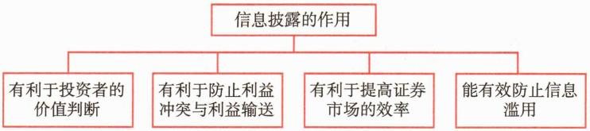
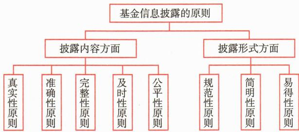
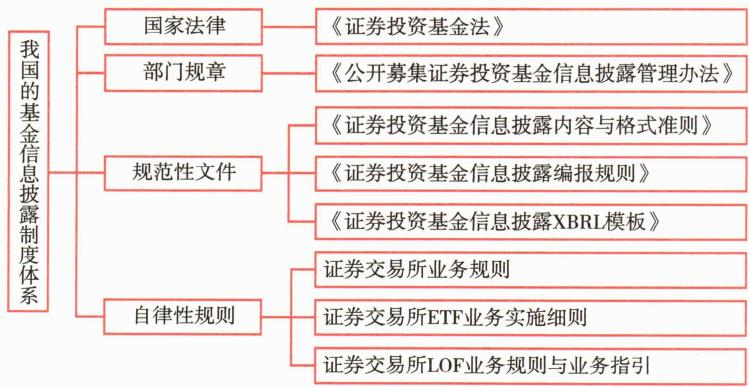

# 第一节 基金信息披露概述

<table><tr><td>学习内容</td><td>知识点</td></tr><tr><td>基金信息披露的含义与作用</td><td>基金信息披露的含义与作用</td></tr><tr><td>基金信息披露的原则和制度体系</td><td>基金信息披露内容与形式遵循的原则我国基金信息披露制度体系</td></tr><tr><td>基金信息披露内容和禁止行为</td><td>基金信息披露的具体内容和信息披露禁止行为</td></tr></table>

# 一、基金信息披露的含义与作用

基金信息披露是指基金市场的有关当事人在基金募集、上市交易、投资运作等一系列环节中，根据法律法规规定向社会公众进行的信息披露。

“阳光是最好的消毒剂。”依靠强制性信息披露，减少信息不对称，培育和完善市场运行机制，增强市场参与各方对市场的理解和信心，促进市场的健康发展，是世界各国（地区）证券市场监管的通行做法，基金市场作为证券市场的重要组成部分，强制性信息披露同样适用基金市场监管。如图17-1所示，基金信息披露的作用主要表现在四个方面。

 — 图17-1 基金信息披露的作用

第一，有利于投资者的价值判断。在基金份额的募集过程中，基金招募说明书等募集信息披露文件向公众投资者阐明了基金产品的风险收益特征及有关募集安排，投资者能据此选择适合自己风险偏好和收益预期的基金产品。在基金运作过程中，通过充分披露基金投资组合、历史业绩和风险状况等信息，投资者可以评价基金经理的管理水平，了解基金投资是否符合基金合同的约定，从而作出合理的投资决策。

第二，有利于防止利益冲突与利益输送。资本市场的基石是信息披露，基金监管的主要内容之一就是对信息披露的监管。相对于实质性审查制度，强制性信息披露的基本推论是投资者在公开信息的基础上“买者自慎”。强制性信息披露可以减少信息不对称，改变投资者的信息弱势地位，增加资本市场的透明度，防止利益冲突与利益输送，增加对基金运作的公众监督，限制和防范基金管理不当和欺诈行为的发生。

第三，有利于提高证券市场的效率。由于证券市场的信息不对称问题，投资者无法对基金进行有效甄别，也无法有效规避基金管理人的道德风险，基金无法吸引到长期稳健的价值投资资金，不利于证券市场形成合理的资产配置机制。强制性信息披露，能迫使隐藏的信息得以及时和充分地公开，从而减少逆向选择和道德风险等问题带来的低效无序状况，提高证券市场的效率。

第四，能有效防止信息滥用。如果法规不严格规范基金信息披露，任由不准确、不完整、不及时、虚假的信息在市场中自由传播，那么市场上便会充斥着各种猜测，投资者可能会受这种市场“噪声”的影响而作出错误的投资决策，甚至给基金运作带来致命性打击，这将不利于整个行业的长远发展。

# 二、基金信息披露的原则和制度体系

# （一）基金信息披露的原则

信息披露的原则体现在对披露内容和披露形式两个维度的要求上。在披露内容上，要求遵循真实性原则、准确性原则、完整性原则、及时性原则和公平性原则；在披露形式上，要求遵循规范性原则、简明性原则和易得性原则。这些原则概括如图17-2所示。

 — 图17-2 基金信息披露的原则

# 1. 基金信息披露内容应遵循的原则

不使人误解，不使用模棱两可的语言。

# 2. 基金信息披露形式应遵循的原则

# （二）我国的基金信息披露制度体系

我国基金信息披露制度体系可分为国家法律、部门规章、规范性文件与自律性规则四个层次，如图17-3所示。

 — 图17-3 我国的基金信息披露制度体系

# 三、基金信息披露的内容

为了保护投资者及相关当事人的合法权益，我国法律法规规定，公开募集基金信息披露的内容包括：

# 四、基金信息披露的禁止行为

为确保投资者不受误导信息的影响，保障投资者的合法权益，并维护证券市场的正常秩序，对于基金信息披露，法律法规明确禁止以下行为：
