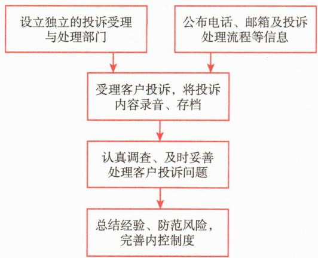

# 第二节 基金销售机构、策略和业务规范

<table><tr><td>学习内容</td><td>知识点</td></tr><tr><td>基金销售</td><td>基金管理人直销和基金销售机构销售基金的优缺点、基金销售机构的类型和特点</td></tr><tr><td>基金销售策略</td><td>基金销售中的产品策略、价格策略、渠道策略、营销策略影响价格策略的基金费用</td></tr><tr><td>基金销售业务规范</td><td>基金销售业务在基金销售人员、宣传推介行为、投资者信息管理、销售费用等方面的业务规范</td></tr></table>

# 一、基金销售

基金销售，是指为投资者开立基金交易账户，宣传推介基金，办理基金份额发售、申购、赎回及提供基金交易账户信息查询等活动。

# （一）基金管理人销售

基金管理人销售也称“基金公司直销”，是指基金公司通过直属的销售队伍直接向投资者销售其自行管理的基金产品，主要包括在线销售、电话销售和基金公司的直销柜台等。直接销售渠道具有成本较低、投资者关系紧密、信息透明度高等特点。

对基金公司来说，通过直销渠道进行销售服务可以大幅降低营销成本，可以帮助基金公司节省投资者维护费用，投资者黏性较强，更容易发现产品和服务方面的不足，易于建立双向持久的联系，提高忠诚度。但受限于政策和运营，目前只能销售本公司的产品，较难给予投资者全面的配置服务。

对投资者而言，通过直接销售渠道购买可能享受费率优惠，更加及时的产品信息和市场动态，更加专业、个性化的服务。但投资者如果通过直销渠道购买多家公司产品，需要开立多个账户，管理不便。

# （二）基金销售机构销售

基金销售机构是指经中国证监会或者其派出机构注册，取得基金销售业务资格的机构。未经注册，任何单位或者个人不得从事基金销售业务。常见的基金销售机构包括商业银行、证券公司、期货公司、保险公司、保险经纪公司、保险代理公司、证券投资咨询机构和独立基金销售机构等。

# 1. 商业银行销售

商业银行是最常见的基金销售渠道之一，具有投资者基础广泛、信誉度高、服务便捷等特点。银行拥有庞大的投资者基础和广泛的网点分布，可以帮助基金公司快速扩大销售范围，便于传统投资者实地交易和咨询。

# 2. 证券公司销售

证券公司渠道具有专业性强、市场覆盖广泛、交易便利的特点。证券公司通常具有丰富的投资经验和专业的理财团队，能够为投资者提供专业的投资建议和资产配置服务。证券公司的交易平台可以方便地进行基金申购、赎回和转换操作，通常是传统股票投资者转为基金投资者时的首选。在ETF投资方面，证券公司渠道具有独特优势，其交易平台支持ETF的实时买卖，操作便捷，交易成本低，且能够及时获取市场行情和数据分析服务。

# 3. 保险公司、保险经纪公司和保险代理公司销售

保险公司、保险经纪公司和保险代理公司渠道具有投资者群体广泛、销售丰富、专业服务能力强的特点。保险公司、保险经纪公司及保险代理公司渠道通常具有多元的投资者群体和丰富的销售渠道，通过销售基金产品，可以较为便捷地满足投资者保险之外的投资理财需求，提供更全面的财富管理解决方案。但由于保险和基金两类产品销售的配套支持体系存在一定差异，目前基金销售市场占有率仍比较低。

# 4. 独立基金销售机构

独立基金销售机构是指专业从事基金销售业务的机构。该渠道在中国的兴起较晚，与国外成熟的体系有一定差距，各类独立销售机构之间也存在较大的差距。由于独立基金销售机构专注于基金销售业务，其销售人员通常能够针对投资者的具体需求提供更加个性化的理财服务。同时，这类机构的业务相对独立，不涉及其他金融业务，理论上有助于提供较为中立的投资建议，但具体建议的客观性和专业性仍可能受其管理水平、收入来源及与基金管理人的合作模式等因素影响。

近年来，具有互联网平台背景的独立销售机构是发展最快的渠道之一。相对于线下销售渠道，互联网平台销售凭借其广泛的覆盖面、便捷的操作体验、高效的信息传递以及丰富的附加功能，显著降低了投资门槛，拓展了投资者群体，并重塑了服务交互模式。与传统线下渠道不同的是，互联网平台不会限制投资者的交易时间；投资者所面向的也不再是销售机构的理财经理或客服人员，可以与基金管理人及其他投资者交流；从服务体验上，可以参与平台直播活动、浏览投资者教育短视频及参与互动游戏等。互联网平台还具有丰富的营销场景、多样的产品货架、绩优产品榜单、基金管理人入驻的财富号等。在推广和获客方面除了平台的中心化公域资源外，基金管理人可以通过财富号、讨论区、直播间、粉丝群等私域场景进行产品营销、品牌宣传及口碑打造（见图18-2）。

总体来说，各类基金销售机构在销售方式上既各有特点又能形成功能上的互补，从而能为基金管理人提供更多符合自身实际情况和市场需求的销售模式，也为基金投资者提供多层次的优质服务。

展望未来，基金销售机构的发展呈现出多元化和创新化的趋势，这一过程将受到多重因素的推动与塑造。首先，信息技术的快速进步将推动销售机构的数字化转型。这包括优化在线交易平台、增强移动应用功能以及利用大数据分析投资者行为等。通过数字化手段，销售机构不仅可以提升运营效率和投资者体验，还能为精准营销提供重要支持。与此同时，监管环境的变化将对行业产生深远影响。预计监管机构将继续完善基金销售相关的法律法规，加强投资者保护、规范销售行为，并提升信息披露标准。这要求销售机构灵活调整经营策略，以适应不断演变的监管要求。随着中国资本市场的进一步开放，基金销售机构的国际化进程也将加快。这可能包括引入更多海外基金产品，或向海外投资者销售国内基金产品。国际化将为销售机构带来新机遇，但同时对其专业能力和风险管理水平提出更高要求。

# （三）基金销售服务

在基金销售过程中，基金销售服务机构为基金销售提供支付、份额登记、信息技术系统等服务。其中，基金销售支付机构受基金销售机构委托，为基金销售机构提供基金销售结算资金划转服务的机构。基金销售结算资金监督机构受基金销售机构、基金销售支付机构等委托，对其开立、使用基金销售结算专用账户的行为和基金销售结算资金划转流程进行监督。信息技术系统服务机构受基金销售机构委托，为基金销售机构提供网络空间经营场所租用或者信息技术系统开发等服务。

# 二、基金销售策略

有形实物商品营销中最经典的理论是由美国营销学家E. Jerome McCarthy于20世纪60年代提出的4Ps营销理论，该理论认为，企业需通过产品（Product）、价格（Price）、渠道（Place）和促销（Promotion）这四个关键要素的有效组合，来满足投资者需求、提升市场竞争力并实现盈利。基金作为一种典型的无形金融产品，具有高信任依赖性、信息不对称性、复杂的购买决策机制以及投资收益的不确定性等特点，且受到严格的金融监管约束。这决定了基金销售在运用传统4Ps营销理论时，必须进行针对性的调整与创新应用。具体而言，基金营销策略更应注重长期信任关系的建立、专业化的投资服务、系统性的投资者教育以及严格的合规管理，而非简单地追求短期促销效果。

基金公司和基金销售机构可以考虑从以下几个方面来制定相应的营销策略。

# （一）产品策略

基金的产品策略需要基于投资者的需求进行设计和优化，要求产品的风险收益特征满足投资者的多样化需求，面对不同的投资者需求，产品设计与营销策略也有所差异。

例如，公募基金产品设计以标准化为主，覆盖从货币市场基金到股票基金的不同风险等级，公募基金的产品策略应注重产品线的多样性，确保为不同风险偏好、投资期限和收益预期的投资者提供合适的选择。资产管理计划投资主要服务于机构投资者或高净值投资者，产品设计则相对定制化，根据投资者的投资目标、风险偏好和流动性需求量身定制资产配置方案。对于这类投资者，产品策略应强调灵活性和差异化，以满足其个性化的投资需求。

产品创新也是产品策略的重要组成部分。基金公司需要结合市场环境变迁、政策导向调整和投资者需求演进，持续推动产品创新。例如，港股通的推出，使得权益产品引入新的投资策略；科创债的设立，推动固收产品增加新型资产类别的配置；投资者需求变化和监管导向的调整，浮动管理费产品应运而生。

另外，产品策略还应重视产品的生命周期管理。从市场调研、产品设计报批、发行募集，到后续的持续营销与运作管理，乃至在必要时进行的产品转型或清盘，都需要有周全、系统的规划。品牌建设与产品系列化同样不容忽视，基金公司、基金销售机构勤勉尽责，打造专业的销售队伍，精心设计或筛选产品，推出具有鲜明投资理念或服务于特定投资目标的系列化产品，有助于投资者识别和选择，形成口碑效应。

# （二）价格策略

不同于实物商品，购买各类基金产品的投资者，本质上是将资金委托给相关产品的管理人，从而获得其提供的受托资产管理服务。因此，一般认为，投资者为购买管理人提供的受托资产管理服务所支付的费用，即为基金产品的“价格”。基金销售的价格策略通常体现在费率结构的设计上，通常可能影响价格策略的费用主要包括参与费用、退出费用、产品运营费用三类。

# 1. 参与费用

根据支付时点的不同，参与费用一般分为前端参与费用、后端参与费用、销售服务费用三大类。

以债券型基金产品为例，收取前端参与费用的份额大多为该基金产品的A类份额；收取后端参与费用的份额为该基金产品的B类份额，近年来新发行产品中B类份额较少；收取销售服务费的份额为该基金产品的C类份额。这也是同一名称的某只基金产品，在同一时间，不同类型份额的净值会存在差异的主要原因。A类份额在投资者购买时收取认/申购费，不收取销售服务费；C类份额正好相反，不收取认/申购费，只收取销售服务费；B类份额也不收取销售服务费，仅在投资者退出时根据持有时间收取认/申购费。此外，为满足特定销售渠道投资者需求，近年来部分产品针对不同销售渠道增设了D、E、F等份额。货币市场基金A和B类份额费率结构主要区别在于最低认购/申购金额，A类最低认购/申购金额低，适合普通投资者；B类更适合机构投资者。投资者可以按照投资需求选择不同的费率结构。

# 2. 退出费用

退出费用体现为基金产品的赎回费用，在投资者赎回基金产品时，依据持有时间的不同收取不同比例的费用。

# 3. 产品运营费用

产品运营费用通常包括固定管理费、浮动管理费、托管费三类。

# 4. 价格策略选择

在价格方面，基金产品管理人会针对不同基金产品的投资范围与投资策略，从投入资源、经营成本等角度，采用多种费率结构相结合的方式，参照申购资金量、持有期限、基金类型等的不同设定不同的费率结构，以提高产品的竞争力。基金公司及基金销售机构常用的策略包括以下一种或多种组合策略：

图[案例18-6]随着移动技术日益普及，投资者投资行为逐步线上化。B银行面对日趋激烈的基金产品销售竞争环境，特别是在以互联网销售为主、以“参与费用打折”为主要策略的独立第三方销售机构的挤压下，从提升基金产品投资体验与服务、创造投资者价值的角度切入，通过提升对市场和基金产品的投资研究能力，建立完善的基金产品分析与研究机制，从投资者利益出发选择合适的管理人和基金产品；加强销售人员专业能力的培养，打造资产配置服务机制，以投资者利益为中心，向投资者提供专业的投资顾问服务；提高数字化与线上服务能力、改善投资者投资交易体验等方式构建“差异化的价格策略”。不但帮助投资者获得了较好的盈利体验，增加了投资者黏性，同时也建立起良好的行业口碑，最终实现基金产品销售能力与规模的同步提升，逐步建立自身独特的行业竞争优势。

2023年7月，中国证监会发布《公募基金行业费率改革工作方案》，进一步优化基金费率模式，降低投资者基金投资成本。

# （三）渠道策略

基金公司的销售策略应注重渠道的多元化，扩大销售覆盖面，提高产品的触达率。基金公司的各类销售渠道中，传统的银行、证券公司渠道占有较高比重，而随着互联网金融的发展，有互联网平台背景的独立销售机构成为重要的销售渠道。基金公司也不断加大对线上直销平台和移动端应用的投入，通过互联网平台直接触达广大投资者，尤其是年轻一代投资者。

高净值投资者通常通过私人银行、财富管理公司等渠道获取服务。从销售策略上，应注重与这些渠道的合作，利用其投资者资源和专业服务团队，为高净值投资者提供定制化的投资解决方案。

机构投资者，如商业银行、保险公司、养老金、主权财富基金等，通常直接与基金管理人合作，获取量身定制的投资解决方案。对于这类投资者，基金公司及基金销售机构应侧重于建立深度的合作关系，并注重长期的业务维护，而不仅仅是实现短期的销售目标。为了满足机构投资者的复杂需求，基金公司及基金销售机构往往会为其配备专属的客户经理或投资顾问，提供个性化的投资建议和服务。此外，产品设计也必须根据机构投资者的风险偏好、投资目标及流动性需求进行灵活调整，以确保投资方案符合其长期战略目标。通过定期沟通、提供详尽的市场分析和业绩报告，基金公司及基金销售机构可以保持与机构投资者的紧密联系，增强彼此的信任，最终建立稳固、持续的合作关系。

# (四) 营销策略

在营销策略方面，基金销售机构往往采取多种营销手段与投资者进行交流沟通。公募基金面向的是大众投资者，可以采取报刊广告、网络宣传、自媒体平台、电台广告、平面广告、派发各种宣传资料、基金产品推介会、费率打折等方式扩大影响，促进投资者购买。此外，可通过定期分红、基金转换等方式增强投资者的持有体验，提升投资者黏性。

营销沟通应体现差异化，即根据不同目标投资者群体的具体特征（例如年龄结构、收入水平、投资经验、风险偏好程度等），挖掘其内在需求，分析其信息获取渠道和习惯，针对不同传播渠道，精心设计和调整营销内容、沟通方式。

对基金营销效果的评估，不应仅仅局限于短期的销量或规模增长，更应关注投资者盈利体验、投资者满意度与留存率、投资者教育活动的覆盖广度与实际成效、引导投资者长期理性投资行为习惯、公司声誉管理等一系列更为综合和长远的指标。

基金作为特殊的金融产品，在销售过程中，除了可以从产品、价格、渠道与营销四个方面制定相关差异化策略外，还需特别关注销售规范性、服务性、专业性、持续性和适当性。基金销售没有固定模式，其核心在于深刻把握金融产品的特殊属性、精准洞察投资者的多元化服务需求，并在此基础上构建严格合规的专业化销售体系。

# 三、基金销售业务规范

在我国，基金销售活动受到严格监管，以确保市场的公平性，保护投资者权益并维护市场稳定。基金销售的监管框架涵盖多部法律、行政法规、部门规章、规范性文件和自律规则，主要涉及的领域包括销售机构人员管理、基金销售机构管理、基金产品宣传推介、投资者适当性管理、反洗钱管理、销售费用规范和投资者信息保护等。相关法律法规对基金销售的各个方面均有详细规定。下文将对部分业务规范进行概要性介绍。

监管机构对基金销售人员的资格、管理和行为有明确要求。销售人员须具备专业知识和技能，通过相关考试取得基金从业资格，并进行执业登记。基金销售机构应当建立完善的人力资源制度，组织持续培训，建立从业人员管理档案，并公示取得销售从业资格的人员信息。

在行为规范方面，基金销售人员应当明示身份、公平对待投资者、真实宣传、揭示风险并提供售后服务。同时，禁止虚假陈述、承诺收益、私下交易、泄露信息和利用职务之便谋取不正当利益等行为。

基金宣传推介行为的规范性直接影响投资者的决策。监管机构要求宣传推介材料在发布前必须经过内部审核，确保信息真实准确，明确提示风险，客观公正地展示信息。禁止使用未经证实的最高级词语、误导性词语、夸大紧迫感或诋毁竞争者的表述。在业绩展示方面，应客观完整地展示历史业绩，注明并声明过往业绩不代表未来表现。

投资者信息管理是基金销售机构的法律责任和道德义务。机构应建立健全的内部控制制度，确保投资者信息的合法使用和保密。禁止出售投资者信息、未经授权向第三方提供信息或在投资者反对的情况下将信息用于其他营销活动。根据相关法律规定，投资者身份资料和交易信息应至少保存20年。

基金销售费用应当合理、透明、合规。费用类型包括认、申购费用、销售服务费、赎回费用和日常管理费用等。费用水平应当合理，反映服务成本，并在基金合同和招募说明书中明确列示。对所有投资者应适用一致的费用标准，未经公告不得差别收费。禁止商业贿赂、恶意压低收费或未经公告擅自变更收费标准等行为。

2025年3月，国家金融监督管理总局发布《商业银行代理销售业务管理办法》，对商业银行代理销售业务的销售渠道、销售人员管理、产品展示、适当性管理、风险提示等方面作出具体规定，进一步规范了商业银行代理销售行为。

[案例18-7]2022年2月，A银行的销售人员在销售B基金管理公司某债券基金过程中，承诺投资者该产品预期收益率 $7\%$ ，而且销售人员为了打消投资者的疑虑还与投资者口头约定，若收益率低于 $7\%$ 将对投资者进行补偿，而产品收益率高于 $7\%$ 时销售人员可以获得一定的利益分成。证监局接到举报之后对上述事件进行调查，之后对违规的基金销售机构及相关责任人分别采取了责令改正、出具警示函等行政监管措施。

评析：该销售人员在销售过程中违反了《公开募集证券投资基金销售机构监督管理办法》的规定，违规向投资者作出盈亏承诺，并与投资者私下约定利益分成或亏损分担。这种行为不仅误导了投资者，还显著增加了投资者的风险，损害了基金行业的声誉。

遵守基金销售业务的监管规范，对于基金销售机构和从业人员至关重要。通过坚持保护投资者权益，维护市场秩序，提升专业水准，确保合规透明、公平竞争的原则，基金行业才能实现健康发展，赢得投资者的信任。

**第三节 投资者服务**

<table><tr><td>学习内容</td><td>知识点</td></tr><tr><td>基金投资者服务概述</td><td>基金投资者服务的范围、特点、原则和步骤</td></tr><tr><td>基金投资者服务流程</td><td>基金投资者服务宣传与推介基金投资查询、咨询与互动交流</td></tr><tr><td>基金投资者服务流程</td><td>基金投资者投诉处理基金投资跟踪与评价基金投资者档案管理与保密基金投资者服务提供方式基金投资者个性化服务</td></tr><tr><td>投资者保护和教育</td><td>投资者保护工作的基本原则和内容投资者教育基地</td></tr></table>

# 一、基金投资者服务概述

投资者服务是基金营销的重要组成部分，销售机构为投资者提供优质、满意的投资者服务，可以树立起良好的品牌形象，提升销售机构的市场竞争力。

# （一）基金投资者服务的范围

基金投资者服务是指基金销售机构或人员为解决投资者有关问题而提供的系列活动。狭义的投资者服务内容包括基金账户信息查询、基金信息查询、基金管理公司信息查询、人工咨询、投资者投诉处理、资料邮寄、基金转换、修改账户资料、非交易过户、挂失和解挂等服务内容。广义的投资者服务还包括投资顾问、根据投资者需求推动基金公司产品研发、内部流程优化等工作。

# （二）基金投资者服务的特点

基金投资者服务具有以下四个特点。

第一，专业性。基金投资者服务是一项专业性很强的服务，要求服务人员除了具有金融知识基础外，还需要深入掌握各类基金产品的相关专业知识。

第二，规范性。在基金销售过程中，基金的认购、申购、赎回等交易都具有详细的业务规则，销售机构在提供服务时必须遵守法律法规和业务规则。

第三，持续性。投资者到销售机构购买基金份额不是一次简单的买卖行为，销售机构要保持长时间的、持续的服务来满足投资者需求。

第四，时效性。基金产品时效性的特点决定了其投资者服务的时效性。开放式基金每个工作日的份额净值都有可能发生改变，而净值的高低直接关系到投资者的利益，任何失误都会造成重大问题，因此基金销售服务对时效性的要求很高。

# （三）基金投资者服务的原则

基金投资者服务应遵循投资者利益优先原则、有效沟通原则、安全第一原则、专业规范原则和适当性管理原则。其中：投资者利益优先，是指基金公司的各项服务首先应遵循投资者利益最大化原则，以提升投资者的获得感为目标，为投资者提供真正有价值的服务。投资者利益优先原则是投资者服务的根本原则。有效沟通原则，是指服务要基于投资者需求，不能臆测投资者需求。安全第一原则，是指对投资者信息应严格保密，防范投资者资料被不当运用。专业规范原则，指在提供服务时必须遵守法律法规和业务规则。适当性管理原则，是指在销售基金产品或者服务的过程中，应根据投资者的风险承受能力销售不同风险等级的基金产品或者服务，把合适的基金产品或者服务销售给合适的投资者。

# （四）基金投资者服务的步骤

基金投资者服务步骤可以分为售前服务、售中服务和售后服务三个环节，三者互为补充，缺一不可。

第一，售前服务。售前服务是指在开始基金投资操作前为投资者提供的各项服务。主要包括：介绍证券市场基础知识、基金基础知识，普及基金相关法律知识；介绍基金管理人投资运作情况，让投资者充分了解基金投资的特点；深入调查分析投资者信息，开展投资者风险教育。

第二，售中服务。售中服务是指投资者在基金投资操作过程中享受的服务。主要包括：协助投资者完成风险承受能力测试并细致解释测试结果；推介符合适当性原则的基金；介绍基金产品；协助投资者办理开立账户、申购、赎回、资料变更等基金业务。

第三，售后服务。售后服务是指在完成基金投资操作后为投资者提供的服务。主要包括：提醒投资者及时核对交易确认单；向投资者介绍投资者服务、信息查询等办法和路径；进行相关信息披露；基金公司、基金产品发生变动时及时通知投资者；定期进行投资者回访。

# 二、基金投资者服务流程

为满足投资者需求，提供满意的投资者服务，基金销售机构具体投资者服务流程包括：服务宣传与推介、投资咨询与基金咨询、互动交流、受理投诉、投资跟踪与评价、投资者档案管理与保密等。

# （一）基金投资者服务宣传与推介

基金投资者服务宣传与推介是围绕投资者需求而展开的产品宣传和推介活动，具体工作内容主要涉及如下六个方面：

第一，对以往销售的历史数据进行收集、评价、总结，针对拟销售的产品或服务，识别潜在投资者，找到有吸引力的市场机会。

第二，在宣传与推介过程中综合运用公众普遍可获得的书面、电子或其他介质的信息，主要包括公开出版资料、宣传单、手册、电视、广播以及互联网等宣传手段。

第三，遵循销售适当性原则，关注投资者的风险承受能力和基金产品风险收益特征的匹配性。建立评价基金投资者风险承受能力和基金产品风险等级的方法体系。

第四，在投资者开立基金交易账户时，向投资者提供投资者权益须知，保证投资者了解相关权益。及时准确地为投资者办理各类基金销售业务手续，识别投资者有效身份，严格管理投资者账户。

第五，为投资者提供良好的持续服务，保障基金份额持有人有效了解所投基金的相关信息。基金销售机构同时销售多只基金时，不得有歧视性的宣传推介活动和销售政策。

第六，规范基金销售人员行为，产品推介时遵循宣传推介的合规要求。

# （二）基金投资查询、咨询与互动交流

基金销售机构为投资者提供全方位的查询服务，主要包括公共信息和个人信息两类。其中公共信息的查询服务包括法律法规、基金产品信息、市场行情信息等。通过查询服务帮助投资者高效及时的获取基金运作信息，增强信任感。

基金销售机构在投资咨询服务中，提供投资、产品、财务规划等专业咨询。咨询内容包括证券投资研究分析成果，投资信息与具体操作策略、建议，基金信息披露文件解释等。投资者服务人员对咨询过程中知悉的关于投资者的个人信息以及财产状况保密，并要重点关注适当性要求。

互动交流是基金销售机构与投资者深入探讨的重要方式，其交流内容如下：

1. 深入了解投资者的投资需求，确定和记录投资者服务标准。

2. 及时向投资者传递重要的市场资讯、持仓品种信息及最新的投资报告。

3. 做好投资者服务日志及投资者资料的更新、完备工作。

# （三）基金投资者投诉处理

基金销售机构应结合自身业务特点，建立完备的投资者投诉处理体系，具体包括：设立独立的投资者投诉受理和处理协调部门或者岗位；向社会公布受理投资者投诉的电话、信箱地址及投诉处理规则；耐心倾听投资者的意见、建议和要求，准确记录投资者投诉的内容，所有投资者投诉应当保留完整记录并存档，投诉电话应当录音；评估投资者投诉风险，采取适当措施，及时妥善处理投资者投诉；根据投资者投诉总结相关问题，及时发现业务风险，并根据投资者的合理意见改进工作，完善内控制度，如有需要应立即向所在机构报告。某基金公司投资者投诉处理流程如图18-3所示。

 — 图18-3 某基金公司投资者投诉处理流程

# （四）基金投资跟踪与评价

基金投资跟踪与评价是指在完成基金操作后向投资者提供的服务，主要包括：向投资者介绍投资者服务的内容体系、产品信息查询的办法和路径；进行相关信息披露，包括定期和不定期的产品运作报告；基金公司、基金产品发生变动时及时通知投资者；线上/线下投资者服务讲座；定期进行投资者回访，了解投资者投资需求变化；市场重要事件或者政策发生变化时，做好事件解读和沟通。

保持投资者的跟踪和服务，可以在投资者情绪出现波动时，协助投资者分析市场波动的原因及了解持仓基金产品的情况，安抚投资者，为投资者提供客观理性的建议，帮助投资者树立长期正确的投资理念，在高点时不盲目追高、在低点时不过度悲观，获取基金投资的长期回报。

随着年龄、收入、家庭结构等因素的变化，投资者需求往往是在不断动态变化的。为了更好地实现投资者投资目标，基金销售人员需要定期同投资者沟通，了解投资者的最新情况和投资诉求，包括最新的家庭情况、财务情况、收益目标、风险偏好等，帮助投资者调整资产配置方案等。

# （五）基金投资者档案管理与保密

基金投资者档案管理是基金销售管理的重要内容与基础，不能仅仅把它理解为投资者资料的收集、整理和存档。建立完善的投资者档案管理系统和规程以及保密制度，对于提高营销效率、扩大市场占有率以及与投资者建立长期稳定的业务联系具有重要的意义。基金销售机构关于投资者档案管理与保密的实务操作主要包括以下六个方面：

# （六）基金投资者服务提供方式

基金管理人或者基金销售机构通常设立独立的投资者服务部门，通过一套完整的投资者服务流程，一系列完备的软、硬件设施，以系统化的方式，应用以下八种方式提供并优化投资者服务。

# 1. 电话服务中心

电话服务中心通常以计算机软、硬件设备为基础，并开辟人工座席与语音系统。一些标准化的基金投资操作均可通过自动语音系统完成。同时，在系统中也为投资者提供人工服务选项。

# 2. 邮寄服务

向基金持有人邮寄交易对账联、季度对账单、投资策略报告、基金通讯、理财月刊等定期或不定期材料，使投资者尽快了解并理性对待投资行情。

# 3. 自动传真、电子信箱与手机短信

自动传真、电子信箱特别适合用于传递行文较长的信息资料、定期或临时公告。而短信通知则主要用于发送简洁、明了的文字信息。

# 4. “一对一” 专人服务

专人服务是指对投资额较大的个人投资者与机构投资者提供的个性化服务。基金销售者一般为其安排较为固定的投资顾问，从基金销售开始就“一对一”服务，并贯

穿售前、售中以及售后全过程。

# 5. 互联网的应用

通过互联网，投资者可以随时随地获得包括投资常识、行情、开放式基金净值、投资者账户信息等信息服务，以及基金交易、基金资讯等服务。

# 6. 微信和移动投资者端的应用

随着自媒体平台的发展和应用，微信、移动投资者端（APP）可以让投资者随时获取投资理财资讯，查询基金信息、基金净值、账户信息，进行基金交易，获得人工咨询等服务，从而使得基金投资更加便利、快捷、高效。

# 7. 媒体和宣传手册的应用

基金销售机构可通过电视、电台、报刊等媒体定期或不定期向投资者传达专业信息、传输正确的投资理念。

# 8. 讲座、推介会和座谈会

讲座、推介会和座谈会等能为投资者提供一个面对面交流的机会。基金销售机构也可以从这些活动中获得有价值的信息，有效地推介基金产品，并跟进投资者的反馈，进一步改善投资者服务。

# （七）基金投资者个性化服务

投资者的投资方式以及自身素质、个性、能力的差异性，使得其需求各不相同。因此，基金销售机构要通过为投资者提供个性化服务，强化投资者的忠诚度。

# 三、投资者保护和教育

为了更好地保护投资者的权益，维护基金行业长期、持续、稳定发展，同时防范基金销售机构和基金投资者之间潜在的纠纷和诉讼风险，基金行业的每个参与主体都需要积极开展投资者保护工作。广泛开展投资者保护工作，是基金市场基础建设的重要内容，也是推进基金行业健康发展的一项长期性、系统性工作。

# （一）投资者保护和教育工作的概念和意义

投资者保护和教育，是指针对个人投资者所进行的有目的、有计划、有组织地传播有关投资知识，传授有关投资经验，培养有关投资技能，倡导理性的投资观念，提示相关的投资风险，告知投资者的权利和保护途径，提高投资者素质（并最终起到保护投资者利益的作用）的一项系统的社会活动。其手段就是用简单的语言向投资者解释他们在投资过程中所面临的各种问题以及应对措施。

加强我国证券基金市场投资者保护教育工作是保护我国资本市场投资者利益、维护我国资本市场长期稳定健康发展的需要。因此，构建我国证券基金市场投资者教育体系的目标，就是要培育我国投资者的理性投资理念，克服原有过度的非理性投资行为，真正实现投资者利益最大化，提升投资者的获得感。

# （二）投资者保护和教育的基本原则与内容

# 1. 投资者保护和教育的基本原则

投资者保护和教育的基本原则：（1）投资者教育应有助于监管者保护投资者。（2）投资者教育不应被视为是对市场参与者监管工作的替代。（3）证券经营机构应当承担各项产品和服务的投资者教育义务，将投资者教育纳入各业务环节。（4）投资者教育没有一个固定的模式。相反地，它可以有多种形式，这取决于监管者的特定目标、投资者的成熟度和可供使用的资源。（5）鉴于投资者的市场经验和投资行为成熟度的层次不一，并不存在广泛适用的投资者教育计划。（6）投资者教育不能也不应等同于投资咨询。

# 2. 投资者教育的内容

综合当前投资者教育的理论和实践，投资者教育主要包含三个方面的内容。

（1）投资决策教育。投资决策就是对投资产品和服务做出选择的行为或过程，是整个投资者教育体系的基础。投资者的投资决策受到多种因素的影响，大致可分为两类，一是个人背景，二是社会环境。个人背景包括投资者本人的受教育程度、投资知识、年龄、社会阶层、个人资产、心理承受能力、性格、法律意识、价值取向及生活目标等。社会环境因素包括政治、经济、社会制度、伦理道德、科技发展等。投资决策教育就是要在指导投资者分析投资问题、获得必要信息、进行理性选择的同时，致力于改善投资者决策条件中的某些变量。目前，各国投资者教育机构在制定投资者教育策略时，都首先致力于普及证券市场知识和宣传证券市场法规。

（2）资产配置教育。资产配置教育即指导投资者对个人资产进行科学的计划和控制。随着人们生活水平的大幅度提高，个人财富的逐步积累，投资理财无论在国外还是在国内都越来越为人们所接受。人们对个人资产的处置有很多种方式，进行证券投资只是投资者个人资产配置中的一个方法或环节，投资者的个人财务计划会对其投资决策和策略产生重大影响。因此，许多投资者教育专家都认为投资者教育的范围应超越投资者具体的投资行为，深入整个个人资产配置中，只有这样才能从根本上解决投资者的困惑。

（3）权益保护教育。权益保护教育即号召投资者为改变其投资决策的社会和市场环境，主动参与保护自身权益。这不仅是市场化的要求，也是公平原则在投资者教育领域中的体现。投资者权益保护是营造一个公正的政治、经济、法律环境，在此环境下，每个投资者在受到欺诈或不公平待遇时都能得到充分的法律救助。此外，投资者的声音能够上达立法者和相关的管理部门，影响立法、执法和司法过程，创造一个真正对投资者友善、公平的资本市场制度体系。为此，针对投资者进行的风险教育、风险提示以及为投资者维权提供的有关服务，已经成为各国开展投资者保护的重要内容。

上述三个方面相辅相成，缺一不可，各国投资者保护的策略安排及方式选择基本上都是围绕上述三个方面的内容进行的。

# （三）投资者教育工作的形式

过去二十几年，中国基金业的投资者教育工作在内容和形式上伴随着行业的成长也越来越多样化。中国证监会、中国证券投资基金业协会、证券交易所、基金公司、基金销售机构等多层次、多角度地组织开展了形式多样、内容丰富的投资者教育活动。

例如各机构通过报刊、电视、网络等新闻媒体，以开设投资者教育专栏、制作专题节目、举办各类咨询活动等方式向社会公众宣讲证券市场基础知识，提示投资风险。很多基金销售机构在营业网点设立了投资者教育园地，制作免费发放的投资者教育手册。部分机构还注重在开户、交易、清算、产品营销等经营环节向投资者提示风险，介绍相关知识，保存相对完善的投资者资料。

# （四）投资者教育基地

投资者教育基地是开展投资者教育的重要平台，是指面向社会公众开放，具有证券期货知识普及、风险提示、信息服务等投资者教育服务功能的场所、网络平台等载体。投资者教育基地可以由下列三类主体建设运行：一是证券期货交易场所、行业协会，以及受中国证监会管理、为证券期货市场提供公共基础设施或者服务的专门机构；二是证券期货经营机构，上市公司、非上市公众公司，以及证券期货中介服务机构；三是其他机构，包括教育科研机构、新闻媒体等。按照载体形式不同，分为实体投资者教育基地和互联网投资者教育基地。

投资者教育基地通过开展多样化投资者教育活动，帮助投资者认识投资风险，掌握风险防范措施，知悉权利义务，树立理性投资理念。

# 本章参考文献

# 后记

《证券投资基金》的修订出版，凝聚了众多行业专家的智慧与心血。各章的修订工作由以下专家承担：第一章由金翠连修订；第二章由金翠连、李宏纲修订；第三章由朱熠、何青修订；第四章由张延闽修订；第五至七章由郑良海修订；第八章由周宇、郑旭修订；第九章由李萌、张延闽、莫海波、郑旭、何青修订；第十章由王欢修订；第十一由朱弘修订；第十二章由朱弘、李艳修订；第十三章由孙红辉、秦子甲、邹树波修订；第十四章由黄伟忠修订；第十五章由王娟修订；第十六章由肖燕修订；第十七章由孙红辉、秦子甲修订；第十八章由李萌、周宇修订。陈景德与郑健鹏作为统稿专家，对本教材的全部修订工作进行了统筹指导和细致审定，为确保教材的整体水准付出了巨大努力。林培富、邢颖、胡波、陈翠及所有教材修订专家参与了教材的审校工作。

教材的编写还得到了中国证监会的大力支持和悉心指导。吴萌、卢景琦、谷雨、朱建新、许春茂、贾秋彤、李朝晖、谢进慧、谢星、徐亚钊、张栋、张建平、刘磊、杜沅晨、张浩舵、李偲、陈建伟、胡韬、秦菁、周皓、潘明阳、徐蕾等同志从不同层面为教材内容的完善提出了宝贵的修改意见和建议。中国证券投资基金业协会的施真强、付惟龙、彭晶、高天红、买小青、卜敏、刘磊、王强、陈三霞、师潭、杨哲、王紫祺、强琪菁、刘恋、汤玥玥、陈硕夫、陈浩、胡仁芳、刘畅、肖楚荷、李蓓蓓、李娜、肖明岳、陈鹏、罗文婷、张婧芳、黄晨昊等同志积极参与教材修订工作并提供了细致的审校意见。南方基金管理股份有限公司、招商基金管理有限公司亦为教材的审校工作贡献了专业力量。

参与教材修订工作的专家学者们，得到了其所在单位的积极支持。我们谨此向下列单位表示衷心的感谢：华泰柏瑞基金管理有限公司、中国工商银行、富安达基金管理有限公司、兴合基金管理有限公司、南方基金管理股份有限公司、上海东方证券资产管理有限公司、兴业基金管理有限公司、华夏基金管理有限公司、招商基金管理有限公司、长信基金管理有限责任公司、易方达基金管理有限公司、万家基金管理有限公司、国海富兰克林基金管理有限公司、上海景林资产管理有限公司、合煦智远基金管理有限公司、摩根基金管理（中国）有限公司、上海国泰君安证券资产管理有限公司、南开大学。

在教材编写过程中，中国证券投资基金业协会张彦斌、任慧凝、马雯、田智鑫等同志承担了大量的组织协调与服务保障工作，并积极参与了意见征集与反馈整理等环节，为整个修订工作的有序开展付出了辛勤努力。

教材得以顺利付梓，离不开中国财政经济出版社的大力协助，在此一并表示感谢！

中国证券投资基金业协会

2025年6月

<table><tr><td rowspan="2"></td><td colspan="2">2017</td><td colspan="2">2016</td></tr><tr><td>金额</td><td>占总资产比例(%)</td><td>金额</td><td>占总资产比例(%)</td></tr><tr><td>一、营业收入</td><td>3,458.9</td><td>10.0</td><td>3,458.9</td><td>10.0</td></tr><tr><td>二、营业成本</td><td>2,638.8</td><td>8.0</td><td>2,638.8</td><td>8.0</td></tr><tr><td>三、营业利润</td><td>-1,465.2</td><td>2.5</td><td>-1,465.2</td><td>2.5</td></tr><tr><td>四、净利润</td><td>-1,465.2</td><td>2.5</td><td>-1,465.2</td><td>2.5</td></tr></table>

# 基金从业资格考试统编教材（2025）

# 基金基础知识与法律法规

# 证券投资基金

# 股权投资基金

 — 中国证券投资基金业协会微信

 — 中国证券投资基金业协会官网

 — 中国基金业法规库

 — 中国财政经济出版社京东旗舰店

 — 中国财政经济出版社
天猫旗舰店

 — 中国财政经济出版社微店

 — 定价：70.00元
