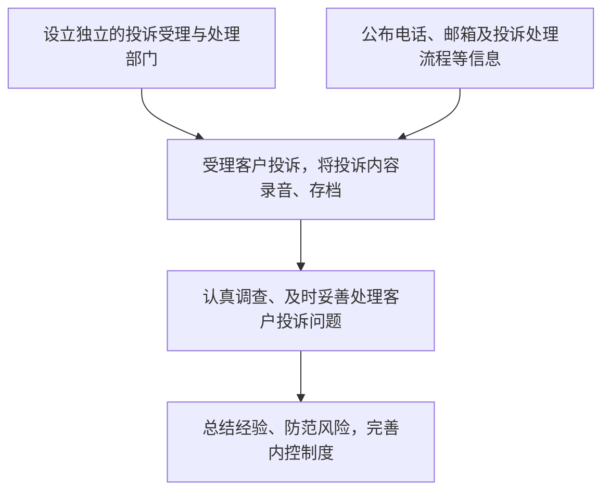

# 第三节 投资者服务

第三节 投资者服务

<table><tr><td>学习内容</td><td>知识点</td></tr><tr><td>基金投资者服务概述</td><td>基金投资者服务的范围、特点、原则和步骤</td></tr><tr><td>基金投资者服务流程</td><td>基金投资者服务宣传与推介基金投资查询、咨询与互动交流</td></tr><tr><td>基金投资者服务流程</td><td>基金投资者投诉处理基金投资跟踪与评价基金投资者档案管理与保密基金投资者服务提供方式基金投资者个性化服务</td></tr><tr><td>投资者保护和教育</td><td>投资者保护工作的基本原则和内容投资者教育基地</td></tr></table>

# 一、基金投资者服务概述

投资者服务是基金营销的重要组成部分，销售机构为投资者提供优质、满意的投资者服务，可以树立起良好的品牌形象，提升销售机构的市场竞争力。

# （一）基金投资者服务的范围

基金投资者服务是指基金销售机构或人员为解决投资者有关问题而提供的系列活动。狭义的投资者服务内容包括基金账户信息查询、基金信息查询、基金管理公司信息查询、人工咨询、投资者投诉处理、资料邮寄、基金转换、修改账户资料、非交易过户、挂失和解挂等服务内容。广义的投资者服务还包括投资顾问、根据投资者需求推动基金公司产品研发、内部流程优化等工作。

# （二）基金投资者服务的特点

基金投资者服务具有以下四个特点。

第一，专业性。基金投资者服务是一项专业性很强的服务，要求服务人员除了具有金融知识基础外，还需要深入掌握各类基金产品的相关专业知识。

第二，规范性。在基金销售过程中，基金的认购、申购、赎回等交易都具有详细的业务规则，销售机构在提供服务时必须遵守法律法规和业务规则。

第三，持续性。投资者到销售机构购买基金份额不是一次简单的买卖行为，销售机构要保持长时间的、持续的服务来满足投资者需求。

第四，时效性。基金产品时效性的特点决定了其投资者服务的时效性。开放式基金每个工作日的份额净值都有可能发生改变，而净值的高低直接关系到投资者的利益，任何失误都会造成重大问题，因此基金销售服务对时效性的要求很高。

# （三）基金投资者服务的原则

基金投资者服务应遵循投资者利益优先原则、有效沟通原则、安全第一原则、专业规范原则和适当性管理原则。其中：投资者利益优先，是指基金公司的各项服务首先应遵循投资者利益最大化原则，以提升投资者的获得感为目标，为投资者提供真正有价值的服务。投资者利益优先原则是投资者服务的根本原则。有效沟通原则，是指服务要基于投资者需求，不能臆测投资者需求。安全第一原则，是指对投资者信息应严格保密，防范投资者资料被不当运用。专业规范原则，指在提供服务时必须遵守法律法规和业务规则。适当性管理原则，是指在销售基金产品或者服务的过程中，应根据投资者的风险承受能力销售不同风险等级的基金产品或者服务，把合适的基金产品或者服务销售给合适的投资者。

# （四）基金投资者服务的步骤

基金投资者服务步骤可以分为售前服务、售中服务和售后服务三个环节，三者互为补充，缺一不可。

第一，售前服务。售前服务是指在开始基金投资操作前为投资者提供的各项服务。主要包括：介绍证券市场基础知识、基金基础知识，普及基金相关法律知识；介绍基金管理人投资运作情况，让投资者充分了解基金投资的特点；深入调查分析投资者信息，开展投资者风险教育。

第二，售中服务。售中服务是指投资者在基金投资操作过程中享受的服务。主要包括：协助投资者完成风险承受能力测试并细致解释测试结果；推介符合适当性原则的基金；介绍基金产品；协助投资者办理开立账户、申购、赎回、资料变更等基金业务。

第三，售后服务。售后服务是指在完成基金投资操作后为投资者提供的服务。主要包括：提醒投资者及时核对交易确认单；向投资者介绍投资者服务、信息查询等办法和路径；进行相关信息披露；基金公司、基金产品发生变动时及时通知投资者；定期进行投资者回访。

# 二、基金投资者服务流程

为满足投资者需求，提供满意的投资者服务，基金销售机构具体投资者服务流程包括：服务宣传与推介、投资咨询与基金咨询、互动交流、受理投诉、投资跟踪与评价、投资者档案管理与保密等。

# （一）基金投资者服务宣传与推介

基金投资者服务宣传与推介是围绕投资者需求而展开的产品宣传和推介活动，具体工作内容主要涉及如下六个方面：

第一，对以往销售的历史数据进行收集、评价、总结，针对拟销售的产品或服务，识别潜在投资者，找到有吸引力的市场机会。

第二，在宣传与推介过程中综合运用公众普遍可获得的书面、电子或其他介质的信息，主要包括公开出版资料、宣传单、手册、电视、广播以及互联网等宣传手段。

第三，遵循销售适当性原则，关注投资者的风险承受能力和基金产品风险收益特征的匹配性。建立评价基金投资者风险承受能力和基金产品风险等级的方法体系。

第四，在投资者开立基金交易账户时，向投资者提供投资者权益须知，保证投资者了解相关权益。及时准确地为投资者办理各类基金销售业务手续，识别投资者有效身份，严格管理投资者账户。

第五，为投资者提供良好的持续服务，保障基金份额持有人有效了解所投基金的相关信息。基金销售机构同时销售多只基金时，不得有歧视性的宣传推介活动和销售政策。

第六，规范基金销售人员行为，产品推介时遵循宣传推介的合规要求。

# （二）基金投资查询、咨询与互动交流

基金销售机构为投资者提供全方位的查询服务，主要包括公共信息和个人信息两类。其中公共信息的查询服务包括法律法规、基金产品信息、市场行情信息等。通过查询服务帮助投资者高效及时的获取基金运作信息，增强信任感。

基金销售机构在投资咨询服务中，提供投资、产品、财务规划等专业咨询。咨询内容包括证券投资研究分析成果，投资信息与具体操作策略、建议，基金信息披露文件解释等。投资者服务人员对咨询过程中知悉的关于投资者的个人信息以及财产状况保密，并要重点关注适当性要求。

互动交流是基金销售机构与投资者深入探讨的重要方式，其交流内容如下：

1. 深入了解投资者的投资需求，确定和记录投资者服务标准。

2. 及时向投资者传递重要的市场资讯、持仓品种信息及最新的投资报告。

3. 做好投资者服务日志及投资者资料的更新、完备工作。

4. 拟订、组织、实施及评估年度、季度、月度投资者关怀计划。  
5. 进行公司所有新投资者的首次和定期电话回访工作，其中，对持有 R5 等级产品的普通投资者应增加回访比例和回访频次。  
6. 做好投资者回访日志，记录并处理潜在风险隐患、投资者建议及意见。  
7. 及时接听外部投资者的呼入电话、公司投资者中心转接及投资顾问转入的电话，并做好电话咨询日志。

# （三）基金投资者投诉处理

基金销售机构应结合自身业务特点，建立完备的投资者投诉处理体系，具体包括：设立独立的投资者投诉受理和处理协调部门或者岗位；向社会公布受理投资者投诉的电话、信箱地址及投诉处理规则；耐心倾听投资者的意见、建议和要求，准确记录投资者投诉的内容，所有投资者投诉应当保留完整记录并存档，投诉电话应当录音；评估投资者投诉风险，采取适当措施，及时妥善处理投资者投诉；根据投资者投诉总结相关问题，及时发现业务风险，并根据投资者的合理意见改进工作，完善内控制度，如有需要应立即向所在机构报告。某基金公司投资者投诉处理流程如图18-3所示。

flowchart

图18-3 某基金公司投资者投诉处理流程

# （四）基金投资跟踪与评价

基金投资跟踪与评价是指在完成基金操作后向投资者提供的服务，主要包括：向投资者介绍投资者服务的内容体系、产品信息查询的办法和路径；进行相关信息披露，包括定期和不定期的产品运作报告；基金公司、基金产品发生变动时及时通知投资者；线上/线下投资者服务讲座；定期进行投资者回访，了解投资者投资需求变化；市场重要事件或者政策发生变化时，做好事件解读和沟通。

保持投资者的跟踪和服务，可以在投资者情绪出现波动时，协助投资者分析市场波动的原因及了解持仓基金产品的情况，安抚投资者，为投资者提供客观理性的建议，帮助投资者树立长期正确的投资理念，在高点时不盲目追高、在低点时不过度悲观，获取基金投资的长期回报。

随着年龄、收入、家庭结构等因素的变化，投资者需求往往是在不断动态变化的。为了更好地实现投资者投资目标，基金销售人员需要定期同投资者沟通，了解投资者的最新情况和投资诉求，包括最新的家庭情况、财务情况、收益目标、风险偏好等，帮助投资者调整资产配置方案等。

# （五）基金投资者档案管理与保密

基金投资者档案管理是基金销售管理的重要内容与基础，不能仅仅把它理解为投资者资料的收集、整理和存档。建立完善的投资者档案管理系统和规程以及保密制度，对于提高营销效率、扩大市场占有率以及与投资者建立长期稳定的业务联系具有重要的意义。基金销售机构关于投资者档案管理与保密的实务操作主要包括以下六个方面：

1. 建立严格的基金份额持有人信息管理制度和保密制度；  
2. 明确信息维护和使用权限；  
3. 建立完善的档案管理制度，妥善保管相关业务资料；  
4. 数据的保存；  
5.人员的限制，在内部建立完善的信息管理体系；  
6. 实行岗位分离制度。

# （六）基金投资者服务提供方式

基金管理人或者基金销售机构通常设立独立的投资者服务部门，通过一套完整的投资者服务流程，一系列完备的软、硬件设施，以系统化的方式，应用以下八种方式提供并优化投资者服务。

# 1. 电话服务中心

电话服务中心通常以计算机软、硬件设备为基础，并开辟人工座席与语音系统。一些标准化的基金投资操作均可通过自动语音系统完成。同时，在系统中也为投资者提供人工服务选项。

# 2. 邮寄服务

向基金持有人邮寄交易对账联、季度对账单、投资策略报告、基金通讯、理财月刊等定期或不定期材料，使投资者尽快了解并理性对待投资行情。

# 3. 自动传真、电子信箱与手机短信

自动传真、电子信箱特别适合用于传递行文较长的信息资料、定期或临时公告。而短信通知则主要用于发送简洁、明了的文字信息。

# 4. “一对一” 专人服务

专人服务是指对投资额较大的个人投资者与机构投资者提供的个性化服务。基金销售者一般为其安排较为固定的投资顾问，从基金销售开始就“一对一”服务，并贯

穿售前、售中以及售后全过程。

# 5. 互联网的应用

通过互联网，投资者可以随时随地获得包括投资常识、行情、开放式基金净值、投资者账户信息等信息服务，以及基金交易、基金资讯等服务。

# 6. 微信和移动投资者端的应用

随着自媒体平台的发展和应用，微信、移动投资者端（APP）可以让投资者随时获取投资理财资讯，查询基金信息、基金净值、账户信息，进行基金交易，获得人工咨询等服务，从而使得基金投资更加便利、快捷、高效。

# 7. 媒体和宣传手册的应用

基金销售机构可通过电视、电台、报刊等媒体定期或不定期向投资者传达专业信息、传输正确的投资理念。

# 8. 讲座、推介会和座谈会

讲座、推介会和座谈会等能为投资者提供一个面对面交流的机会。基金销售机构也可以从这些活动中获得有价值的信息，有效地推介基金产品，并跟进投资者的反馈，进一步改善投资者服务。

# （七）基金投资者个性化服务

投资者的投资方式以及自身素质、个性、能力的差异性，使得其需求各不相同。因此，基金销售机构要通过为投资者提供个性化服务，强化投资者的忠诚度。

一是作好投资者的动态分析。利用平时市场走访收集的投资者营销资料等方面的信息对投资者的投资活动进行分析，特别针对异常情况，及时了解原因，通过对投资者的了解、咨询和分析，增强投资者服务的针对性、有效性和及时性，提高市场走访的效率和服务效果。  
二是通过加强与投资者沟通了解投资者深度需求。深度挖掘投资者需求是基金销售机构提供个性化服务的基础。充满竞争的市场上投资者需求不断升级，基金销售机构以及基金公司应通过开展实地拜访、现场咨询等特定服务挖掘基金投资者的深度需求，通过有针对性的投资者服务满足其个性化需求。  
三是为投资者提供决策参考。跟踪市场行情，揭示市场风险是投资者服务的重要内容。基金公司及销售机构的信息咨询服务是投资者了解市场行情的主要途径，基金销售机构应该通过增大研发投入提升市场分析能力，并将市场信息及潜在风险准确客观地提供给基金投资者。但基金公司在市场行情分析中仅有提供信息咨询以及风险揭示的义务，不能承担投资者决策的责任。

# 三、投资者保护和教育

为了更好地保护投资者的权益，维护基金行业长期、持续、稳定发展，同时防范基金销售机构和基金投资者之间潜在的纠纷和诉讼风险，基金行业的每个参与主体都需要积极开展投资者保护工作。广泛开展投资者保护工作，是基金市场基础建设的重要内容，也是推进基金行业健康发展的一项长期性、系统性工作。

# （一）投资者保护和教育工作的概念和意义

投资者保护和教育，是指针对个人投资者所进行的有目的、有计划、有组织地传播有关投资知识，传授有关投资经验，培养有关投资技能，倡导理性的投资观念，提示相关的投资风险，告知投资者的权利和保护途径，提高投资者素质（并最终起到保护投资者利益的作用）的一项系统的社会活动。其手段就是用简单的语言向投资者解释他们在投资过程中所面临的各种问题以及应对措施。

加强我国证券基金市场投资者保护教育工作是保护我国资本市场投资者利益、维护我国资本市场长期稳定健康发展的需要。因此，构建我国证券基金市场投资者教育体系的目标，就是要培育我国投资者的理性投资理念，克服原有过度的非理性投资行为，真正实现投资者利益最大化，提升投资者的获得感。

# （二）投资者保护和教育的基本原则与内容

# 1. 投资者保护和教育的基本原则

投资者保护和教育的基本原则：（1）投资者教育应有助于监管者保护投资者。（2）投资者教育不应被视为是对市场参与者监管工作的替代。（3）证券经营机构应当承担各项产品和服务的投资者教育义务，将投资者教育纳入各业务环节。（4）投资者教育没有一个固定的模式。相反地，它可以有多种形式，这取决于监管者的特定目标、投资者的成熟度和可供使用的资源。（5）鉴于投资者的市场经验和投资行为成熟度的层次不一，并不存在广泛适用的投资者教育计划。（6）投资者教育不能也不应等同于投资咨询。

# 2. 投资者教育的内容

综合当前投资者教育的理论和实践，投资者教育主要包含三个方面的内容。

（1）投资决策教育。投资决策就是对投资产品和服务做出选择的行为或过程，是整个投资者教育体系的基础。投资者的投资决策受到多种因素的影响，大致可分为两类，一是个人背景，二是社会环境。个人背景包括投资者本人的受教育程度、投资知识、年龄、社会阶层、个人资产、心理承受能力、性格、法律意识、价值取向及生活目标等。社会环境因素包括政治、经济、社会制度、伦理道德、科技发展等。投资决策教育就是要在指导投资者分析投资问题、获得必要信息、进行理性选择的同时，致力于改善投资者决策条件中的某些变量。目前，各国投资者教育机构在制定投资者教育策略时，都首先致力于普及证券市场知识和宣传证券市场法规。

（2）资产配置教育。资产配置教育即指导投资者对个人资产进行科学的计划和控制。随着人们生活水平的大幅度提高，个人财富的逐步积累，投资理财无论在国外还是在国内都越来越为人们所接受。人们对个人资产的处置有很多种方式，进行证券投资只是投资者个人资产配置中的一个方法或环节，投资者的个人财务计划会对其投资决策和策略产生重大影响。因此，许多投资者教育专家都认为投资者教育的范围应超越投资者具体的投资行为，深入整个个人资产配置中，只有这样才能从根本上解决投资者的困惑。

（3）权益保护教育。权益保护教育即号召投资者为改变其投资决策的社会和市场环境，主动参与保护自身权益。这不仅是市场化的要求，也是公平原则在投资者教育领域中的体现。投资者权益保护是营造一个公正的政治、经济、法律环境，在此环境下，每个投资者在受到欺诈或不公平待遇时都能得到充分的法律救助。此外，投资者的声音能够上达立法者和相关的管理部门，影响立法、执法和司法过程，创造一个真正对投资者友善、公平的资本市场制度体系。为此，针对投资者进行的风险教育、风险提示以及为投资者维权提供的有关服务，已经成为各国开展投资者保护的重要内容。

上述三个方面相辅相成，缺一不可，各国投资者保护的策略安排及方式选择基本上都是围绕上述三个方面的内容进行的。

# （三）投资者教育工作的形式

过去二十几年，中国基金业的投资者教育工作在内容和形式上伴随着行业的成长也越来越多样化。中国证监会、中国证券投资基金业协会、证券交易所、基金公司、基金销售机构等多层次、多角度地组织开展了形式多样、内容丰富的投资者教育活动。

例如各机构通过报刊、电视、网络等新闻媒体，以开设投资者教育专栏、制作专题节目、举办各类咨询活动等方式向社会公众宣讲证券市场基础知识，提示投资风险。很多基金销售机构在营业网点设立了投资者教育园地，制作免费发放的投资者教育手册。部分机构还注重在开户、交易、清算、产品营销等经营环节向投资者提示风险，介绍相关知识，保存相对完善的投资者资料。

# （四）投资者教育基地

投资者教育基地是开展投资者教育的重要平台，是指面向社会公众开放，具有证券期货知识普及、风险提示、信息服务等投资者教育服务功能的场所、网络平台等载体。投资者教育基地可以由下列三类主体建设运行：一是证券期货交易场所、行业协会，以及受中国证监会管理、为证券期货市场提供公共基础设施或者服务的专门机构；二是证券期货经营机构，上市公司、非上市公众公司，以及证券期货中介服务机构；三是其他机构，包括教育科研机构、新闻媒体等。按照载体形式不同，分为实体投资者教育基地和互联网投资者教育基地。

投资者教育基地通过开展多样化投资者教育活动，帮助投资者认识投资风险，掌握风险防范措施，知悉权利义务，树立理性投资理念。
